# The Purpose‑Driven Guide to Deep Agents

> A single, top‑down, *why‑first* walkthrough of **Deep Agents** — the batteries‑included "agent harness" for long‑running, autonomous tasks — and how it sits on top of LangChain and LangGraph and interlocks with LangSmith, sandboxes, MCP, the frontend SDK, and the ACP/A2A protocols.
>
> The third guide in a trilogy. `LANGCHAIN_PURPOSE_GUIDE.md` taught the agent framework (`Agent = Model + Harness`); `LANGGRAPH_PURPOSE_GUIDE.md` taught the runtime underneath. **This guide is the penthouse**: Deep Agents is *the harness itself, pre‑built and opinionated*. For every layer we ask: **What is its purpose? What would you suffer without it? Which APIs, patterns, and primitives achieve it?** — then we read the code. Wherever two frameworks (or the harness and one of its pluggable layers) meet, the seam is explained **twice — once from each side**.

---

## How to read this guide

Recall the first guide's Part 5: *"Deep Agent = `create_agent` + a curated middleware stack."* That one sentence is the spine of this entire document. Deep Agents is described by its own docs as an **"agent harness"** — *the same core tool‑calling loop as any agent framework, but with built‑in capabilities that make agents reliable for real tasks.* This guide unpacks every one of those built‑in capabilities, shows the middleware that implements it, and connects it back to the LangGraph runtime two floors down.

Each major section follows the same skeleton:

1. **Purpose** — the job this thing exists to do, and the pain without it.
2. **Building blocks** — the concrete classes, functions, parameters, patterns.
3. **Annotated code** — real code, explained block by block.
4. **Advanced concepts** — deeper ideas, in call‑out boxes.
5. **Two perspectives** — wherever this layer meets a *different* framework or layer, the seam from both sides.
6. **The overall picture** — a Mermaid diagram.

> **A note on the code samples.** The docs use forward‑dated, illustrative model names (`gpt-5.5`, `claude-sonnet-4-6`, `gemini-3.5-flash`, `claude-haiku-4-5`). Treat them as placeholders for "the current best model." The *shape* of the code is what's stable.

---

## Part 0 — The Big Why

### 0.1 The problem Deep Agents solves

The overview states the purpose directly:

> *"The easiest way to start building agents and applications powered by LLMs — with built‑in capabilities for task planning, file systems for context management, subagent‑spawning, and long‑term memory. You can use deep agents for any task, including complex, multi‑step tasks."*

The key phrase is **agent harness**. A bare tool‑calling loop (LangChain's `create_agent`) is wonderful for short tasks, but a *long‑running, autonomous* task — research a topic across dozens of sources, refactor a codebase, build a report — hits walls a plain loop can't climb: it forgets its plan, overflows its context window with tool output, can't isolate a noisy subtask, can't run code safely, and can't pause for a human at the dangerous moment. Deep Agents is the accumulated answer to *those* walls. Its own framing of the six things it adds:

- **Take actions in an environment** — tools, read/write files, execute code.
- **Connect to your data** — load memories, skills, and domain knowledge at the right moment.
- **Manage growing context** — summarize history and offload large results across long runs.
- **Parallelize tasks** — delegate to subagents running in isolated context windows.
- **Stay in the loop** — pause for human approval at critical decision points.
- **Improve over time** — update memory, skills, and prompts based on real usage.

Without Deep Agents you'd re‑assemble that same stack — planning middleware, a virtual filesystem, summarization, subagents, prompt caching, HITL — by hand for every autonomous agent. Deep Agents pre‑assembles it.

### 0.2 The thesis: a harness on a framework on a runtime

The single most important fact, stated in the overview: *"`deepagents` is a standalone library built on top of LangChain's core building blocks for agents. It uses the LangGraph runtime for durable execution, streaming, human‑in‑the‑loop, and other features."* So the stack is three clean layers:

- **LangGraph** — the *orchestration runtime*: durable execution, streaming, persistence, interrupts. (Bottom; the bedrock from guide #2.)
- **LangChain** — the *agent framework*: models, tools, messages, `create_agent`, and **middleware**. (Middle; guide #1.)
- **Deep Agents** — the *agent harness*: a curated middleware stack + opinionated defaults for autonomous, long‑running work. (Top; this guide.)
- **LangSmith** — the *platform* spanning all three: tracing, evals, deployment.

The load‑bearing consequence, which we'll prove with code (Part 2): **`create_deep_agent(...)` is a thin wrapper over `create_agent(...)` that pre‑assembles a specific, ordered middleware stack** and returns a LangGraph `CompiledStateGraph`. There is no new engine. A deep agent *is* a `create_agent` agent *is* a LangGraph graph — so every capability from the two guides below it (the model loop, durable execution, checkpointers, streaming, interrupts) applies unchanged. Deep Agents adds *defaults and middleware*, not magic.

### 0.3 The shape of a deep agent — hello world

The first agent looks almost exactly like a LangChain agent — that's the point:

```python
from deepagents import create_deep_agent

def get_weather(city: str) -> str:
    """Get weather for a given city."""
    return f"It's always sunny in {city}!"

agent = create_deep_agent(
    model="anthropic:claude-sonnet-4-6",
    tools=[get_weather],
    system_prompt="You are a helpful assistant",
)

agent.invoke({"messages": [{"role": "user", "content": "what is the weather in sf"}]})
```

The same three arguments as `create_agent` (`model`, `tools`, `system_prompt`) — but this agent *already* has a planning tool (`write_todos`), a virtual filesystem (`ls`/`read_file`/`write_file`/`edit_file`/`glob`/`grep`), a `task` tool to spawn subagents, automatic summarization, and (on Anthropic) prompt caching — all from the default middleware stack. You opt *out* of capabilities, not in.

### 0.4 The four harness capabilities

Everything Deep Agents adds groups into **four categories** (plus harness profiles), which organize this whole guide:

| Category | What it provides | Part |
|---|---|---|
| **Execution environment** | tools, virtual filesystem (pluggable backends), sandbox shell, JS interpreter, permissions | 3–4 |
| **Context management** | skills, memory, summarization, context offloading, prompt caching | 5 |
| **Delegation** | subagents (sync/async/programmatic) + task planning (`write_todos`) | 6 |
| **Steering** | human‑in‑the‑loop approval and interrupts | 7 |
| **Harness profiles** | per‑model configuration bundles applied automatically | 2 |

### 0.5 The master map

Here is the whole picture. Every later part is a zoom‑in on one box or one arrow.

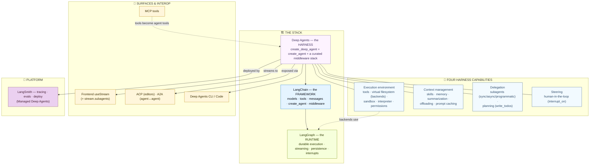

**Read the map as a sentence:** Deep Agents is a harness built on the LangChain framework on the LangGraph runtime. It bundles four capabilities (execution environment, context management, delegation, steering), whose pluggable pieces (backends, sandboxes, the store) reach down into the runtime. You connect tools via MCP, surface it through a frontend or an editor (ACP) or other agents (A2A), and deploy/observe it via LangSmith.

Let's start by zooming into the harness itself — the four capabilities — and then prove the thesis that it's all just middleware.


---

## Part 1 — The Harness at a Glance

Before the implementation, the mental model. A Deep Agents harness wraps the model loop with **four categories** of built‑in capability. Knowing the categories — and that each is just middleware — is what makes the rest of the guide click.

### 1.1 Purpose

A harness's job is to make the model *reliable on real, long tasks*. The four categories map to the four things a long task needs: a place to **act**, a way to **manage what it knows**, a way to **break work up**, and a way for a **human to steer**. Plus a fifth, cross‑cutting lever — **profiles** — to tune all of it per model.

### 1.2 The four capabilities

#### ① Execution environment — *where the agent acts*

Four layers (Parts 3–4):

- **Tools** — any Python callable, LangChain tool, MCP tool, or built‑in harness tool, passed via `tools=`.
- **Virtual filesystem** — `ls`, `read_file`, `write_file`, `edit_file`, `glob`, `grep` (and `execute` with a sandbox), backed by a **pluggable backend** (the defining Deep Agents abstraction). The filesystem is *used by* skills, memory, code execution, and context offloading — it's the substrate the whole harness writes to.
- **Filesystem permissions** — declarative `allow`/`deny`/`interrupt` rules over paths.
- **Code execution** — a **sandbox** backend (isolated shell `execute`) and/or an **interpreter** (in‑process JS `eval`).

#### ② Context management — *what the agent knows, within token limits*

Four layers (Part 5):

- **Skills** — on‑demand domain knowledge (Agent Skills standard, `SKILL.md`, progressive disclosure — loaded only when relevant).
- **Memory** — persistent instructions/preferences from `AGENTS.md` files, **always loaded** at startup.
- **Summarization & context offloading** — automatic compression of history and offloading of large tool results to the virtual filesystem.
- **Prompt caching** — for Anthropic, static prompt sections are cached automatically (no config) to cut latency and cost on long runs.

#### ③ Delegation — *breaking big problems into parallel units*

Two layers (Part 6):

- **Task planning** — a built‑in `write_todos` tool maintaining a `pending`/`in_progress`/`completed` task list in agent state.
- **Subagents** — ephemeral child agents spawned via the `task` tool for **context isolation** (their multi‑step work returns a single result, keeping the main context clean), in sync, async (background), or programmatic (interpreter‑dispatched) flavors.

#### ④ Steering — *human control at runtime*

One layer (Part 7):

- **Human‑in‑the‑loop** — `interrupt_on={tool: ...}` pauses before sensitive tool calls for approve/edit/reject/respond, built on LangGraph's interrupt machinery.

### 1.3 The fifth lever: harness profiles

A **`HarnessProfile`** packages per‑model configuration — system‑prompt tweaks, tool‑description overrides, excluded tools/middleware, extra middleware, general‑purpose‑subagent edits — applied automatically whenever a given provider or model is selected, **without changing your `create_deep_agent` call site**. Register with `register_harness_profile("openai:gpt-5.5", HarnessProfile(...))`. Built‑in profiles ship for OpenAI and Anthropic (both add only a `system_prompt_suffix`). Profiles resolve *after* the model is built, merging provider‑level and model‑level fields. (Full detail in Part 2.)

```python
from deepagents import HarnessProfile, register_harness_profile

register_harness_profile(
    "anthropic:claude-sonnet-4-6",
    HarnessProfile(
        system_prompt_suffix="Respond in under 200 words.",
        excluded_tools=frozenset({"execute"}),     # hide a tool, model-independent of the call site
    ),
)
```

> **Advanced — "smart defaults" are the point.** Deep Agents ships opinionated system prompts that teach the model to *plan before acting, verify work, and manage context*, plus a default `general-purpose` subagent and (on Anthropic) automatic prompt caching. You get a capable autonomous agent from `create_deep_agent(model=...)` with *zero* extra wiring, then peel back or extend defaults as needed. This is the inverse of `create_agent`, which is minimal and opt‑in — Deep Agents is maximal and opt‑out.

### 1.4 The overall picture — the open harness

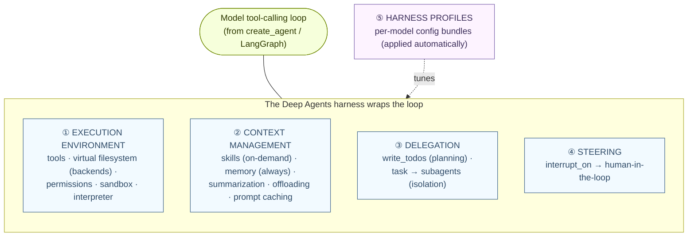

Each of these is implemented as middleware — which is exactly what Part 2 proves.


---

## Part 2 — Deep Agent = `create_agent` + a Middleware Stack

This is the load‑bearing chapter. Everything in Part 1 is implemented one way: **`create_deep_agent` pre‑assembles an ordered list of LangChain `AgentMiddleware` on top of `create_agent`.** Understand the stack and you understand the harness.

### 2.1 Purpose

`create_deep_agent` gives a production‑ready foundation — a model, a built‑in system prompt, and a default middleware stack (planning, filesystem, subagents, summarization, prompt‑cache repair, Anthropic caching, plus optional memory/skills/HITL). You customize the harness by choosing the model, adding `tools`, shaping the `system_prompt`, adding `memory`/`skills`/`backend`/`permissions`/`subagents`, **appending custom `middleware`**, gating tools with `interrupt_on`, and packaging per‑model defaults as harness profiles. The docs say it outright: *"`create_deep_agent` pre‑assembles a middleware stack on top of `create_agent`. To build a fully custom agent — choosing exactly which capabilities to include — see Configure the harness."*

### 2.2 The `create_deep_agent` surface

The full signature (note the return type — a LangGraph `CompiledStateGraph`):

```python
create_deep_agent(
    model=None, tools=None, *,
    system_prompt=None,
    middleware=(),                 # appended to the default stack
    subagents=None,                # SubAgent | CompiledSubAgent | AsyncSubAgent
    skills=None,                   # on-demand knowledge (Part 5)
    memory=None,                   # AGENTS.md, always loaded (Part 5)
    permissions=None,              # filesystem allow/deny/interrupt (Part 4)
    backend=None,                  # virtual filesystem backend (Part 3); default StateBackend
    interrupt_on=None,             # human-in-the-loop (Part 7)
    response_format=None,          # structured output → result["structured_response"]
    state_schema=None, context_schema=None,
    checkpointer=None, store=None, debug=False, name=None, cache=None,
) -> CompiledStateGraph
```

### 2.3 The default middleware stack (main agent) — *in order*

This list is the harness. It runs first‑to‑last; conditional members appear only when you pass the matching argument:

| # | Middleware | When | Provides |
|---|---|---|---|
| 1 | `TodoListMiddleware` | always | `write_todos` planning tool |
| 2 | `SkillsMiddleware` | if `skills=` | skill discovery (before filesystem, so metadata is ready) |
| 3 | `FilesystemMiddleware` ⚑ | always | `ls`/`read_file`/`write_file`/`edit_file`/`glob`/`grep` (+ permissions) |
| 4 | `SubAgentMiddleware` ⚑ | when ≥1 sync subagent (incl. default GP) | the `task` tool |
| 5 | `SummarizationMiddleware` | always | history compression near token limits |
| 6 | `PatchToolCallsMiddleware` | always | repairs dangling/malformed tool calls on resume |
| 7 | `AsyncSubAgentMiddleware` | if async subagents | the async‑task tools |
| 8 | **your `middleware=`** | if provided | appended *here* |
| 9 | harness‑profile `extra_middleware` | if profile sets it | provider‑specific middleware |
| 10 | excluded‑tool filtering | if profile sets it | drops tools by name |
| 11 | `AnthropicPromptCachingMiddleware` | always (no‑ops off‑Anthropic) | prompt caching |
| 12 | `MemoryMiddleware` | if `memory=` | always‑loaded `AGENTS.md` |
| 13 | `HumanInTheLoopMiddleware` | if `interrupt_on=` | approval gating |

⚑ = **required scaffolding**: listing `FilesystemMiddleware`, `SubAgentMiddleware`, or the permission middleware in `excluded_middleware` raises `ValueError` — they're structural. To hide their *tools* from the model, use `excluded_tools` instead.

The ordering is deliberate: skills before filesystem (metadata ready before file tools); `PatchToolCalls` before Anthropic caching (repair the history before computing the cached prefix); `MemoryMiddleware` after caching (so memory edits don't invalidate the cache). **Synchronous subagents get their own rebuilt stack** — same shape, but skills run *after* Patch and there's *no* `SubAgentMiddleware` (no recursive `task`).

### 2.4 Annotated code

Append custom middleware (it lands at position 8); this also shows the `AgentMiddleware` `wrap_tool_call` hook the whole stack is built on:

```python
from langchain.agents.middleware import wrap_tool_call
from deepagents import create_deep_agent

@wrap_tool_call
def log_tool_calls(request, handler):
    print(f"[tool] {request.name} {request.args}")
    return handler(request)        # run the tool

agent = create_deep_agent(model="anthropic:claude-sonnet-4-6", tools=[...],
                          middleware=[log_tool_calls])
```

The **proof of the thesis** — build a deep agent "from scratch" by adding the deepagents middleware to a plain `create_agent`:

```python
from langchain.agents import create_agent
from deepagents.middleware.filesystem import FilesystemMiddleware
from deepagents.middleware.subagents import SubAgentMiddleware

agent = create_agent(                       # NOT create_deep_agent
    model="claude-sonnet-4-6",
    middleware=[
        FilesystemMiddleware(backend=None), # the virtual filesystem (defaults to StateBackend)
        SubAgentMiddleware(default_model="claude-sonnet-4-6", default_tools=[], subagents=[...]),
        # + TodoListMiddleware, SummarizationMiddleware, ... = the full default stack
    ],
)
# This IS what create_deep_agent assembles for you.
```

Tune per‑model behavior with a harness profile — without touching the call site:

```python
from deepagents import GeneralPurposeSubagentProfile, HarnessProfile, register_harness_profile

register_harness_profile(
    "openai:gpt-5.5",
    HarnessProfile(
        system_prompt_suffix="Respond in under 100 words.",
        excluded_tools={"execute"},                          # hide a tool
        excluded_middleware={"SummarizationMiddleware"},     # strip a (non-scaffolding) middleware
        general_purpose_subagent=GeneralPurposeSubagentProfile(enabled=False),  # remove the default subagent
    ),
)
```

> **Advanced — the system prompt is assembled, not replaced.** The final prompt is `USER → (BASE or profile CUSTOM) → profile SUFFIX`, joined by blank lines: your `system_prompt=` (USER) always leads; the built‑in `BASE_AGENT_PROMPT` (which teaches the scaffolding) sits in the middle unless a profile's `base_system_prompt` replaces it; a profile `system_prompt_suffix` always trails (closest to the conversation, where model‑tuning guidance lands reliably). Middleware *also* append tool guidance (filesystem, planning, subagent prompts) so the model knows how to use each capability. You write the persona; the harness writes the scaffolding instructions.

> **Advanced — track state in graph state, not `self`.** Custom middleware must use graph state (`return {"x": state.get("x", 0)+1}` in `before_agent`), never instance attributes (`self.x += 1`) — instance mutation causes race conditions under subagents, parallel tools, and parallel invocations. The harness compiles to a LangGraph graph, so concurrency safety means *channels*, not Python objects.

### 2.5 Two perspectives: Deep Agents ↔ LangChain (`create_agent`)

#### 👁️ From Deep Agents' perspective ("I'm a batteries‑included harness")

You call `create_deep_agent(model, tools, system_prompt)` and get an agent that already plans, has a filesystem, spawns subagents, summarizes, and caches prompts. You think in *capabilities* (`memory=`, `skills=`, `subagents=`, `interrupt_on=`), not hooks. Customization is "add to the list" (`middleware=`) or "tune per model" (profiles). You feel like a higher‑level product than a raw agent — because you are.

#### 👁️ From LangChain's perspective ("I'm `create_agent`; Deep Agents is me + middleware")

There's no new engine. `create_deep_agent` calls *you* (`create_agent`) with a pre‑built `middleware=[...]` list, and forwards `model`/`tools`/`response_format`/`checkpointer`/etc. straight through. Every member of that list is an ordinary `AgentMiddleware` using the hooks you already define (`before/after_agent`, `before/after_model`, `wrap_model_call`, `wrap_tool_call`). The `task` tool is just a tool `SubAgentMiddleware` registers; the filesystem tools are just tools `FilesystemMiddleware` registers; planning is `TodoListMiddleware`'s `write_todos`. You return a `CompiledStateGraph`, so Deep Agents inherits durable execution, streaming, and interrupts from the runtime *because it is you*. To build a deep agent by hand, a developer just calls *you* with the same middleware. From here, "Deep Agents" is a *name for a well‑chosen middleware list* — exactly as guide #1 foreshadowed.

### 2.6 The overall picture — the stack

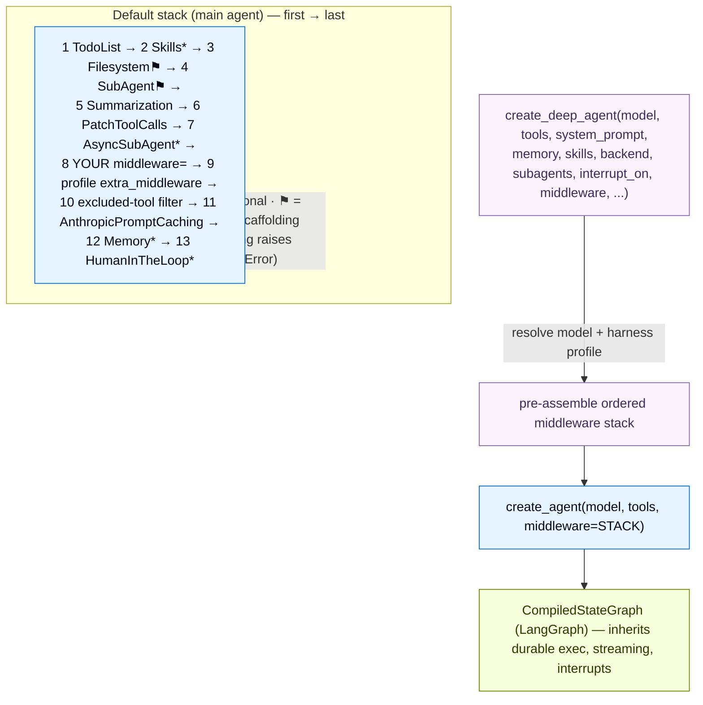

With the thesis proven, the rest of the guide tours each capability — starting with where the agent acts.


---

## Part 3 — The Execution Environment: Models, Tools & the Virtual Filesystem

The execution environment is *where the agent acts*. Models and tools you already know from guide #1; the distinctively Deep‑Agents piece is the **virtual filesystem and its pluggable backends** — the substrate the whole harness reads and writes.

### 3.1 Models & tools (briefly)

**Models** are the same standard interface as everywhere: `model=` takes a `"provider:model"` string (resolved via `init_chat_model`) or a `BaseChatModel` instance, across all providers. A `ProviderProfile` (companion to harness profiles) can inject `init_chat_model` kwargs per provider/model. Deep Agents need a **tool‑calling‑capable** model.

**Tools** mix freely: plain Python callables, LangChain `@tool` objects, tool dicts, and MCP tools (Part 8) all go in `tools=`. On top of your tools, the harness adds **built‑in tools** from the middleware stack: `write_todos` (planning), the filesystem tools, `task` (subagents), and `execute` (with a sandbox). The same `tools=` list works across every provider.

### 3.2 The virtual filesystem — purpose

Deep Agents expose a filesystem surface to the model — `ls`, `read_file`, `write_file`, `edit_file`, `glob`, `grep` (and `execute` with a sandbox) — but these tools operate through a **pluggable backend**. This indirection is the key design: the *same* file tools work whether files live in graph state, on local disk, in a cross‑thread store, in a LangSmith Hub repo, or in an isolated sandbox. The filesystem isn't a convenience — it's the substrate **skills, memory, code execution, and context offloading all write to** (large tool results auto‑offload to `/large_tool_results/`, conversation history to `/conversation_history/`).

### 3.3 The backends

| Backend | Scope / behavior | Use for |
|---|---|---|
| **`StateBackend`** (default) | files in LangGraph state; thread‑scoped (persist across turns via checkpointer, not across threads) | scratch pad; auto‑offload of large tool outputs |
| **`FilesystemBackend`** | real local disk under `root_dir` (`virtual_mode=True` to sandbox paths) | local dev CLIs, CI |
| **`LocalShellBackend`** | `FilesystemBackend` + `execute` shell on the host (no isolation) | local coding assistants you trust |
| **`StoreBackend`** | LangGraph **Store**; cross‑thread durable, scoped by a `namespace` factory | long‑term memory, shared knowledge |
| **`ContextHubBackend`** | a LangSmith Hub repo (commit history) | LangSmith‑native durable files without a separate store |
| **`CompositeBackend`** | routes paths to different backends (longest‑prefix‑wins) | thread scratch **+** cross‑thread `/memories/` |
| **Sandbox backends** | isolated env + `execute` (Modal, Daytona, E2B, Runloop, Vercel, AgentCore, LangSmith) | running code/installs/tests safely (Part 4) |

The backend is the *one* method you swap; the file tools never change. A backend implements **`BackendProtocol`** — `ls`/`read`/`write`/`edit`/`grep`/`glob`, returning structured result types (`LsResult`, `ReadResult`, `WriteResult`, …) with an `error` field rather than raising — so you can project S3, Postgres, or any store into the filesystem.

### 3.4 Annotated code

The default is `StateBackend`; the most important production pattern is the `CompositeBackend` that keeps internal artifacts ephemeral while routing project files to disk and memories to a store:

```python
from deepagents import create_deep_agent
from deepagents.backends import CompositeBackend, StateBackend, FilesystemBackend, StoreBackend
from langgraph.store.memory import InMemoryStore

agent = create_deep_agent(
    model="claude-sonnet-4-6",
    backend=CompositeBackend(
        default=StateBackend(),                                       # internals stay ephemeral (thread-scoped)
        routes={
            "/workspace/": FilesystemBackend(root_dir="/path/to/project", virtual_mode=True),  # real files
            "/memories/":  StoreBackend(namespace=lambda rt: (rt.server_info.user.identity,)), # cross-thread, per-user
        },
    ),
    store=InMemoryStore(),   # backs the StoreBackend route (auto-provisioned on LangSmith Deployment)
)
```

The `namespace` factory is the multi‑tenant lever: keying by `(rt.server_info.user.identity,)` isolates each user's memories; `(rt.server_info.assistant_id,)` shares across users of one assistant; `(rt.context.org_id,)` scopes org‑wide. A custom backend implements the protocol (returning errors, not raising):

```python
from deepagents.backends.protocol import BackendProtocol, ReadResult, WriteResult  # + Ls/Edit/Grep/Glob

class S3Backend(BackendProtocol):
    def read(self, file_path, offset=0, limit=2000) -> ReadResult:
        ...  # fetch object → ReadResult(file_data=...) or ReadResult(error="...File not found")
    def write(self, file_path, content) -> WriteResult:
        ...  # create-only; external backends return files_update=None
    # ls / edit / grep / glob likewise
```

### 3.5 Two perspectives: the harness ↔ the backend

#### 👁️ From the harness's perspective ("I expose six file tools")

You present `ls`/`read_file`/`write_file`/`edit_file`/`glob`/`grep` (and conditionally `execute`) to the model, with a fixed schema and prompt guidance. You don't know or care *where* the bytes live — you call the backend's protocol methods. You enforce **permissions** *before* the backend runs (Part 4). Skills, memory, summarization‑offload, and the model all write through this same surface, so swapping the backend transparently changes durability and isolation without touching a single tool or prompt.

#### 👁️ From the backend's perspective ("I'm a storage adapter")

You implement `BackendProtocol` and decide the physical reality: graph state (`StateBackend`), disk (`FilesystemBackend`), a LangGraph Store (`StoreBackend`), a Hub repo (`ContextHubBackend`), or a remote system (custom). You return structured results with `error` fields (never raise). You don't know about agents, tools, or prompts — you answer `read`/`write`/`ls`. A `CompositeBackend` is itself a backend that *delegates* to others by path prefix. A sandbox backend additionally implements `execute`, which is what makes the harness expose the `execute` tool. From here, the "virtual filesystem" is just an adapter the harness talks to — which is why one agent can scribble in ephemeral state while persisting `/memories/` to Postgres.

### 3.6 Two perspectives: Deep Agents ↔ LangGraph (state & store)

#### 👁️ From Deep Agents' perspective ("I have a filesystem and memory")

You think in *files and paths*: `StateBackend` is your scratch pad, `/memories/` is your long‑term store, large results "offload to disk." You don't manage checkpoints or channels — you just `write_file` and trust it persists across turns (within a thread) or across threads (for `/memories/`).

#### 👁️ From LangGraph's perspective ("I'm the runtime persisting it")

`StateBackend` writes into the **graph state** I checkpoint after every super‑step (guide #2, Part 5) — so "files persist across turns within a thread" *is* my checkpointer doing its job, keyed by `thread_id`. `StoreBackend` writes to my cross‑thread **Store** (a `BaseStore`), namespaced by your factory — the same store that backs long‑term memory everywhere. The `namespace` factory receives my **`Runtime`** (`rt.context`, `rt.server_info`, `rt.execution_info`). On LangSmith Deployment I auto‑provision both the checkpointer and the store, so the deep agent's filesystem and memory "just work" in production. From here, the Deep Agents filesystem is *a view onto my state and store* — which is why everything from guide #2 (durability, time‑travel, multi‑thread memory) applies to a deep agent's files unchanged.

### 3.7 The overall picture — backends

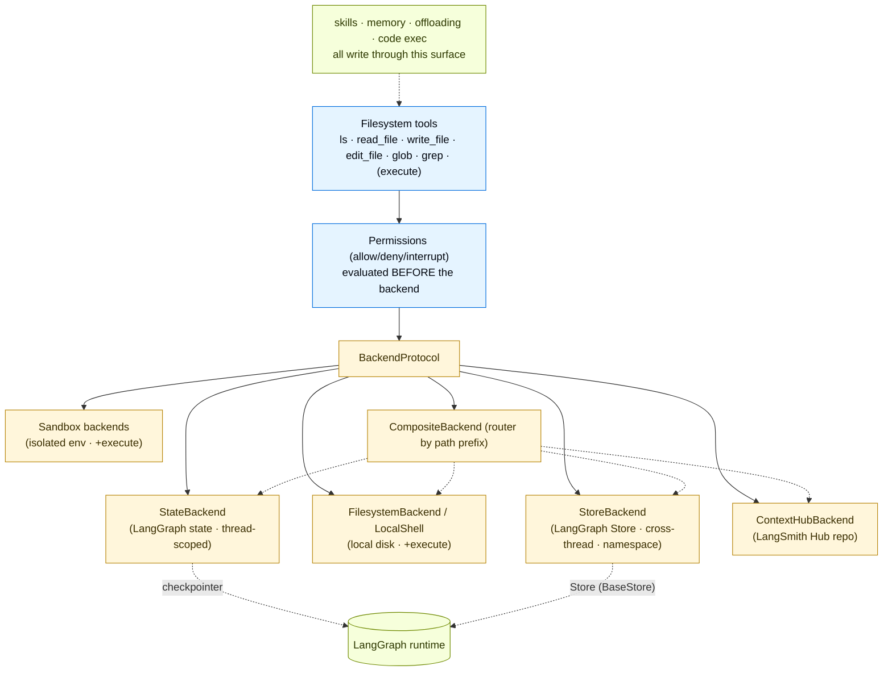


---

## Part 4 — Code Execution & Permissions

Two ways for a deep agent to run code, and one way to fence its filesystem access. The mental model: **sandboxes act *on* an environment** (shell, packages, OS files); **interpreters act *inside* the agent loop** (compose tools, hold state, decide what returns to the model); **permissions gate the built‑in filesystem tools**.

### 4.1 Sandboxes — isolated shell execution

#### Purpose & building blocks

A sandbox is an **isolated environment** so the agent can run arbitrary code, install packages, and touch a filesystem **without compromising your host**. In Deep Agents, **a sandbox is a backend** — it provides the standard file tools *plus* an `execute` tool for shell commands. Providers each ship a `*Sandbox` backend class: `LangSmithSandbox`, `DaytonaSandbox`, `E2BSandbox`, `ModalSandbox`, `RunloopSandbox`, `VercelSandbox`, `AgentCoreSandbox`.

The architecture is elegant: a provider must implement only **`execute()`**; `BaseSandbox` builds every other file op (`read`/`write`/`edit`/`ls`/`glob`/`grep`) on top of it by running scripts via `execute()`. The harness checks `SandboxBackendProtocol` on every model call and only exposes the `execute` tool when present. There are **two planes of file access**: the *agent's* file tools (go through `execute()` inside the sandbox) and your *application's* `upload_files()`/`download_files()` (use the provider's native transfer APIs to seed inputs and retrieve artifacts).

#### Annotated code

```python
from daytona import Daytona
from deepagents import create_deep_agent
from langchain_daytona import DaytonaSandbox

sandbox = Daytona().create()                       # 1. provider SDK creates the sandbox
backend = DaytonaSandbox(sandbox=sandbox)          # 2. wrap as a Deep Agents backend
agent = create_deep_agent(
    model="anthropic:claude-sonnet-4-6",
    system_prompt="You are a Python coding assistant with sandbox access.",
    backend=backend,                               # 3. pass as the backend → adds the execute tool
)
try:
    agent.invoke({"messages": [{"role": "user", "content": "Create a package and run pytest"}]})
finally:
    sandbox.stop()                                 # sandboxes cost money until torn down
```

Swapping providers changes only the import and create/teardown lines — the `create_deep_agent` call is identical. Seed and retrieve files out‑of‑band with `backend.upload_files([("/src/index.py", b"...")])` and `backend.download_files(["/output.txt"])`.

> **Advanced — never put secrets in a sandbox.** Sandboxes protect *your host* from the agent, but a context‑injected agent has full control *inside* the sandbox and can exfiltrate any secret you put there (env vars, mounted files). Keep credentials in tools that run on your host, or use a **sandbox auth proxy** that injects `Authorization` headers into outbound requests so the agent never sees the key (Part 10). And `try/finally` the teardown — sandboxes consume resources until stopped.

### 4.2 Interpreters — in‑process code, no shell

#### Purpose & building blocks

Where sandboxes act on an environment, **interpreters act inside the loop**. `CodeInterpreterMiddleware` (from `langchain_quickjs`) adds an **`eval` tool** that runs JavaScript in a **QuickJS** runtime — with **no** filesystem, network, shell, or clock by default. Its value: a model can fire a fixed batch of tool calls per turn, but nothing can loop, branch on a result, retry, or feed one call into the next without another model turn — and every result floods the context. The interpreter gives the agent a *programmable workspace*: a loop runs every iteration, intermediate values stay in JS variables, and only a compact result returns to the model.

Two bridges cross the QuickJS boundary: **programmatic tool calling (PTC)** — expose an allowlist of tools as `tools.camelCase(...)` async functions (`ptc=["web_search"]`); and **programmatic subagents** — dispatch subagents from code via a `task()` global (Part 6). PTC is off until you enable it; subagent dispatch is on by default when subagents exist.

#### Annotated code

```python
from deepagents import create_deep_agent
from langchain_quickjs import CodeInterpreterMiddleware

agent = create_deep_agent(
    model="openai:gpt-5.5",
    middleware=[CodeInterpreterMiddleware(ptc=["web_search"])],  # interpreter is MIDDLEWARE, not a backend
)
```

What the agent writes inside `eval` — a parallel batch, aggregated before returning (token‑efficient):

```javascript
const topics = ["retrieval", "memory", "evaluation"];
const results = await Promise.all(
  topics.map((t) => tools.webSearch({ query: `${t} best practices 2025` })),  // web_search → tools.webSearch
);
results.join("\n\n");   // only the joined string returns to the model, not 3 full search payloads
```

> **Advanced — sandbox vs interpreter, and a shared HITL gap.** Use a **sandbox** for shell/installs/tests/git/OS files; use an **interpreter** for loops/branches/aggregation/PTC over existing tools; use **normal tool calling** for one or two simple calls. Both PTC and programmatic subagents **bypass `interrupt_on`** — they dispatch from inside a running `eval`, not the normal tool path, so per‑call approval isn't enforced. If you need approval before code‑orchestrated tool use, **gate the `eval` tool itself**. The PTC allowlist is itself a permission boundary — expose only what the agent needs.

### 4.3 Permissions — fencing the filesystem

#### Purpose & building blocks

`FilesystemPermission(operations=["read"|"write"], paths=[glob], mode="allow"|"deny"|"interrupt")` declaratively controls which paths the built‑in filesystem tools may touch. Rules are **first‑match‑wins in declaration order**; if no rule matches, the operation is **allowed** (permissive default). Permissions gate **only the six built‑in file tools** — *not* custom/MCP tools, and *not* sandbox `execute` (shell bypasses path rules). `mode="interrupt"` raises a HITL interrupt for approval (needs a checkpointer).

#### Annotated code — the canonical "jail to /workspace, protect secrets" pattern

```python
from deepagents import FilesystemPermission, create_deep_agent

agent = create_deep_agent(
    model=model, backend=backend,
    permissions=[
        FilesystemPermission(operations=["read","write"], paths=["/workspace/.env"], mode="deny"),     # 1. protect the secret
        FilesystemPermission(operations=["read","write"], paths=["/workspace/**"],  mode="allow"),     # 2. allow the workspace
        FilesystemPermission(operations=["read","write"], paths=["/**"],            mode="deny"),       # 3. deny everything else
    ],
)
```

The order is the whole game: because the *first* matching rule wins, the `.env` deny **must precede** the `/workspace/**` allow — flip them and `/workspace/**` matches `.env` first and silently leaks it (the canonical footgun). Subagents inherit the parent's permissions by default; a subagent's own `permissions` **replace** (not merge) them.

### 4.4 The overall picture — three capability layers

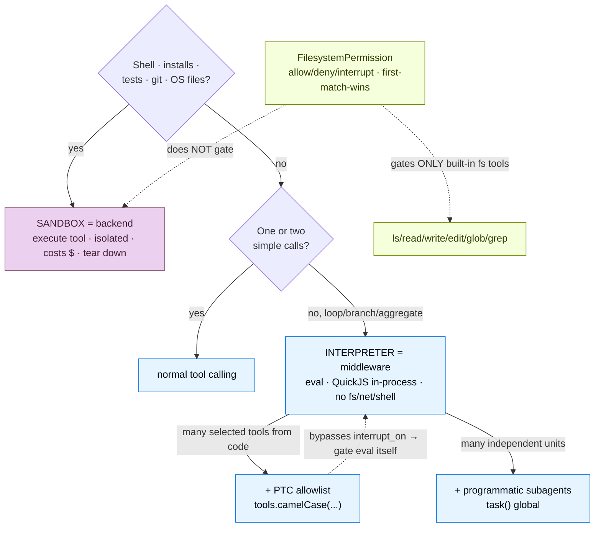


---

## Part 5 — Context Management: Skills, Memory, Summarization & Offloading

A long task overflows the context window. **Context management** is the harness's answer: control *what the agent knows*, keep it *within token limits*, and *retain across sessions*. Four layers, all writing through the virtual filesystem from Part 3.

### 5.1 Purpose

> *"Context engineering is providing the right information and tools in the right format so the agent can accomplish tasks reliably."*

The four layers, by *when* they load:
- **Skills** — on‑demand domain knowledge (loaded only when relevant).
- **Memory** — always‑loaded instructions/preferences.
- **Summarization + offloading** — automatic compression of history and large results.
- **Prompt caching** — cache static prompt sections (Anthropic, automatic).

### 5.2 Skills — on‑demand knowledge via progressive disclosure

A **skill** is a directory with a `SKILL.md` (YAML frontmatter `name` + `description`, then instructions) plus optional `scripts/`, `references/`, `assets/`. It follows the [Agent Skills standard](https://agentskills.io). The magic is **three‑level progressive disclosure** (handled by `SkillsMiddleware`):

| Level | What loads | When |
|---|---|---|
| 1. Metadata | `name` + `description` from frontmatter | at startup, for *every* configured skill |
| 2. Instructions | the full `SKILL.md` body | when the agent decides the skill is relevant |
| 3. Resources | `scripts/`/`references/`/`assets/` | as the instructions reference them |

So the agent pays only the `description` tokens up front and reads the full skill only when a task matches — specialized expertise without cluttering the prompt.

```python
agent = create_deep_agent(model="anthropic:claude-sonnet-4-6",
                          skills=["/skills/research/", "/skills/web-search/"])
```

```markdown
---
name: langgraph-docs
description: Use this skill for LangGraph requests — fetch relevant docs for accurate guidance.
---
# langgraph-docs
## Instructions
1. Use fetch_url to read https://docs.langchain.com/llms.txt (the doc index).
2. Select 2-4 relevant pages; fetch and synthesize. Link sources rather than quoting.
```

The `description` carries the activation keywords (what + when); the body is read only on activation. Skills live in the backend (state/store/disk), so they can be namespaced per tenant via a `StoreBackend` route. Scripts can be *read* from any backend but only *executed* in a sandbox backend.

### 5.3 Memory — always‑loaded `AGENTS.md`

Where skills are on‑demand, **memory** is always loaded: pass `memory=["/memories/AGENTS.md"]` and those [`AGENTS.md`](https://agents.md) files are injected into the system prompt every run (no progressive disclosure). Use it for project conventions, user preferences, and guidelines that apply to *every* conversation — keep it minimal. The agent can **update** memory via `edit_file`. Long‑term memory (across threads) is just memory files routed to a `StoreBackend` (Part 3), scoped by namespace:

```python
from deepagents.backends import CompositeBackend, StateBackend, StoreBackend
agent = create_deep_agent(
    model="google_genai:gemini-3.5-flash",
    memory=["/memories/AGENTS.md"],
    backend=CompositeBackend(
        default=StateBackend(),
        routes={"/memories/": StoreBackend(namespace=lambda rt: (rt.server_info.user.identity,))},  # per-user, cross-thread
    ),
    store=InMemoryStore(),
    system_prompt="Read /memories/AGENTS.md at the start; update it when you learn lasting preferences.",
)
```

> **Advanced — the memory taxonomy and *when* to write.** Long‑term memory comes in three kinds (CoALA): **semantic** (facts → `AGENTS.md`), **procedural** (how‑to → skills), **episodic** (past experiences → checkpointed threads, searchable via `client.threads.search`). And *when* to write: **hot path** (during the conversation — fresh but adds latency) vs **background consolidation** ("sleep‑time compute" — a separate agent on a cron reads recent threads and merges facts; the cron interval *must* match its lookback window). The namespace *is* the scope: `(user_id)` per‑user, `(assistant_id)` per‑agent, `(org_id)` org‑wide (usually read‑only to prevent prompt injection via shared state).

### 5.4 Summarization & offloading — staying within the window

Two automatic mechanisms (both in the default stack), in order of defense:

1. **Offloading** (first line) — when a tool *input* or *result* exceeds ~20,000 tokens, the harness offloads it to the virtual filesystem and substitutes a **file‑path reference + a preview of the first ~10 lines**; as context crosses ~85% of the window, older verbose tool calls are truncated to disk pointers. The model re‑reads or `grep`s the offloaded file when it needs detail. The data stays *available* but out of active context.
2. **Summarization** (fallback) — `SummarizationMiddleware` fires when context crosses the window limit (~85% of `max_input_tokens`) *and nothing more is eligible for offloading*: an LLM writes a structured summary (intent, artifacts, next steps) replacing full history, and a canonical text record is preserved to the filesystem. A `ContextOverflowError` from any model call triggers immediate summarization + retry. Add a `compact_conversation` tool (`create_summarization_tool_middleware`) to let the agent compact on demand between tasks.

**Prompt caching** (the fourth layer): for Anthropic models, `create_deep_agent` automatically marks static prompt sections (base instructions, memory, skill content) cache‑eligible — no config — cutting latency and cost on long runs.

### 5.5 The overall picture — four layers of context management

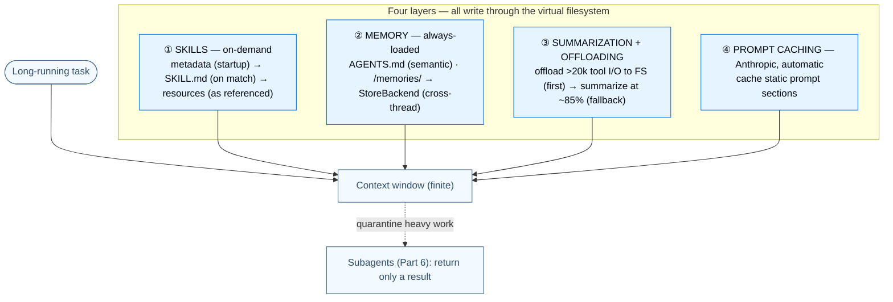

The fifth lever for context — *isolation* via subagents — is delegation, which is Part 6.


---

## Part 6 — Delegation: Subagents & Planning

The most powerful context‑management lever deserves its own chapter. **Delegation** lets a deep agent break a big problem into parallel, isolated units — and is the harness capability that most distinguishes "deep" agents from plain ones.

### 6.1 Purpose

Two layers:
- **Task planning** — a built‑in `write_todos` tool keeps a `pending`/`in_progress`/`completed` list in agent state, so the agent breaks complex work into trackable steps and adapts the plan as it learns.
- **Subagents** — the main agent spawns ephemeral child agents via the `task` tool. The central value is **context isolation** ("context quarantine"): a subagent runs its *own* multi‑step loop internally and returns only a **single final result** to the main agent. This solves context bloat — a research subtask that makes 10 web searches fills *its* context, not the main agent's, which sees only the summary.

### 6.2 Subagents — the three flavors

**Synchronous** (the default): the main agent blocks until the subagent returns. Configure via `subagents=[{...}]` (a `SubAgent` dict) or `CompiledSubAgent(name, description, runnable)`. A default **`general-purpose`** subagent is auto‑added (inherits the main agent's tools/model/skills) for pure context isolation; replace it by passing your own `general-purpose`, or disable via a harness profile. `SubAgentMiddleware` (which adds the `task` tool) is required scaffolding — to run with *no* delegation, disable the GP subagent on the profile and pass no sync subagents.

```python
research_subagent = {
    "name": "research-agent",
    "description": "Used to research more in-depth questions",   # main agent uses this to decide when to delegate
    "system_prompt": "You are a great researcher. Return a concise summary.",
    "tools": [internet_search],     # overrides inherited tools entirely
    "model": "openai:gpt-5.5",      # optional override; defaults to the main agent's model
}
agent = create_deep_agent(model="google_genai:gemini-3.5-flash", subagents=[research_subagent])
```

**Inheritance** (load‑bearing): a subagent inherits `tools`, `model`, `interrupt_on`, `permissions`, and runtime `context` by default (and the GP subagent inherits `skills`); it does **not** inherit `system_prompt`, `middleware`, or custom‑subagent `skills`. Setting `tools`/`permissions` *replaces* the inherited values. `response_format` (≥0.5.3) makes a subagent return validated JSON to the parent instead of free‑form text.

**Async** (`AsyncSubAgent`): background tasks that return immediately so the supervisor keeps talking to the user while subagents work. The supervisor gets five tools (`start`/`check`/`update`/`cancel`/`list_async_task`); each subagent is a background LangGraph run on an Agent Protocol server (co‑deployed via ASGI when `url` is omitted, or remote via HTTP). Task metadata lives in a dedicated `async_tasks` state channel so it survives context compaction. Stateful (vs sync = stateless).

**Programmatic** (interpreter `task()`): with subagents *and* `CodeInterpreterMiddleware`, the interpreter exposes a `task({description, subagentType, responseSchema})` global, so the agent fans out subagents from *code* — `Promise.all` over a list, deterministic batches, two‑pass verification — instead of one model‑chosen call per turn.

```javascript
// One reviewer per file, dispatched in parallel, merged in code:
const files = (await tools.glob({ pattern: "src/**/*.ts" })).split("\n").filter(Boolean);
const reviews = await Promise.all(files.map((f) =>
  task({ description: `Review ${f} for auth issues`, subagentType: "reviewer", responseSchema: issuesSchema })));
const issues = reviews.flatMap((r) => r.issues);
```

### 6.3 Two perspectives: the main agent ↔ a subagent

#### 👁️ From the main agent's perspective ("I delegate and stay clean")

You call the **`task` tool** with a `subagent_type` and a description — like any tool. You wait (sync) or get a job id (async). What returns is a **single `ToolMessage`** (free‑form text, or JSON if the subagent has `response_format`). You never see the subagent's dozens of intermediate tool calls — that's the point: a large subtask is *compressed into one result* in your context. You pick *which* subagent by its `description`, so action‑oriented descriptions matter. Your runtime `context` flows to the subagent automatically; you can give it narrower tools/permissions.

#### 👁️ From the subagent's perspective ("I'm a fresh, isolated agent")

I'm a full agent (often a `create_agent`/`create_deep_agent` graph) spun up with my *own* clean context window, my own `system_prompt`, and (unless overridden) the parent's tools/model/permissions/`context`. I run my entire multi‑step loop internally — searches, file writes, reasoning — none of which leaks back to the parent. I return exactly **one** result (my final message, or structured JSON). I'm **stateless** by default (sync): each `task()` call is a fresh run with no memory of prior ones (async subagents keep state on their own thread). My filesystem is shared with the parent (`StateBackend`), so I can write large data to a file and hand the parent just a path — reinforcing the isolation. From here, "a subagent" is *another agent invoked as a tool whose context never touches yours* — the precise mechanism behind Deep Agents' token economics.

> **Advanced — the common failure mode.** A subagent that does its work but whose *final message* omits the results leaves the supervisor blind (it only sees the final output). Always prompt subagents to put everything in their final message (or use `response_format`). And the economics: even a same‑capability subagent is worth spawning *purely* for context isolation — running a long, noisy multi‑step task in an isolated window and returning a concise summary keeps the main conversation lean.

### 6.4 The overall picture — delegation

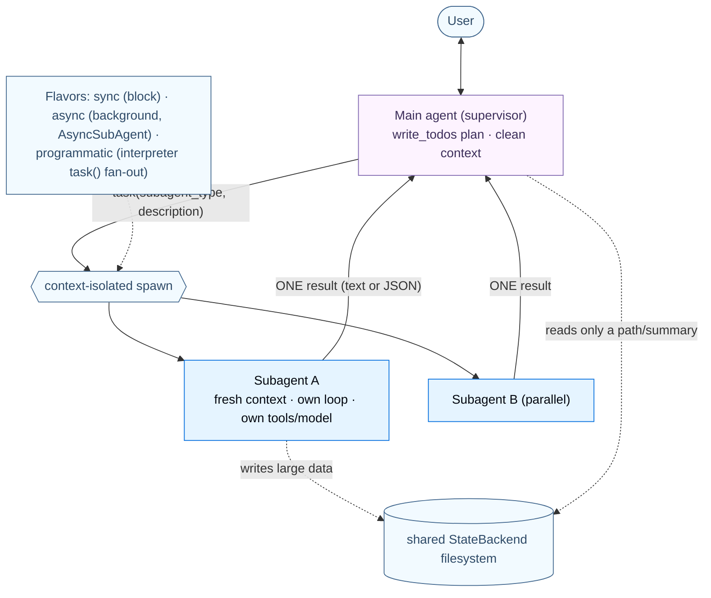

Subagents return results; sometimes you want a *human* in that loop instead — which is steering, Part 7.


---

## Part 7 — Steering: Human‑in‑the‑Loop

The fourth harness capability: human control at runtime. When an autonomous agent proposes a sensitive action — delete a file, run a destructive SQL, send an email, write to `/secrets/` — you want a human to approve, edit, or reject it *before* the side effect.

### 7.1 Purpose

Deep Agents HITL is a **thin layer over LangGraph's interrupt machinery** (guide #2, Part 8): the harness pauses at gated tool calls, persists state via the checkpointer, and waits indefinitely for a decision. Configure it declaratively with `interrupt_on`; `HumanInTheLoopMiddleware` is added to the stack when you do.

### 7.2 Building blocks

- **`interrupt_on={tool_name: ...}`** — `True` (all four decisions), `False` (never), or an `InterruptOnConfig` (e.g. `{"allowed_decisions": ["approve", "reject"]}`, plus an optional `when` predicate gating on the call's args, `langchain>=1.3.3`).
- **Four decisions:** **approve** (run as‑is), **edit** (run with modified args), **reject** (don't run; feedback to the model), **respond** (the human's message *becomes* the tool result — for "ask the user" tools). Use `reject` to deny; `respond` only when the human *is* the tool.
- **Checkpointer required** — to pause and resume.
- **Resume** with `Command(resume={"decisions": [...]})` on the **same `thread_id`**, one decision per pending action in order. Surfaces via `result.interrupts` (with `version="v2"`).
- **Filesystem permission interrupts** (`deepagents>=0.6.8`): a `FilesystemPermission(..., mode="interrupt")` raises the same HITL interrupt on writes to matching paths — merges with `interrupt_on`.

### 7.3 Annotated code — configure, then resume

```python
from deepagents import create_deep_agent
from langgraph.checkpoint.memory import MemorySaver

agent = create_deep_agent(
    model="anthropic:claude-sonnet-4-6",
    tools=[remove_file, fetch_file, notify_email],
    interrupt_on={
        "remove_file": True,                                       # all decisions
        "fetch_file": False,                                       # never interrupt (safe read)
        "notify_email": {"allowed_decisions": ["approve", "reject"]},  # no editing
    },
    checkpointer=MemorySaver(),                                    # REQUIRED for HITL
)
```

The round‑trip — run to the interrupt, present it, resume with a decision:

```python
from langgraph.types import Command
cfg = {"configurable": {"thread_id": "t1"}}

result = agent.invoke({"messages": [{"role": "user", "content": "Delete temp.txt"}]},
                      config=cfg, version="v2")
if result.interrupts:
    req = result.interrupts[0].value          # {"action_requests": [{name, args}], "review_configs": [...]}
    # ... show req to the human, collect a decision (one per action_request, in order) ...
    agent.invoke(Command(resume={"decisions": [{"type": "reject",
                                                "message": "Don't delete temp.txt."}]}),
                 config=cfg, version="v2")     # SAME thread_id
# edit form:    {"type": "edit", "edited_action": {"name": "...", "args": {...}}}
# approve form: {"type": "approve"}
```

HITL composes with subagents (a subagent's `interrupt_on` *overrides* the parent's for that subagent's runs), and a subagent tool can also call the raw LangGraph `interrupt(...)` primitive directly — the interrupt bubbles up to the parent's `result.interrupts`, resumed with `Command(resume=...)`.

> **Advanced — HITL is durable execution applied.** Because the pause is a LangGraph interrupt backed by the checkpointer, the agent can wait *minutes to days* and resume from the exact point — the same machinery as guide #2's time‑travel. `PatchToolCallsMiddleware` (always in the stack) repairs the message history if a run is cancelled mid‑tool. On LangSmith Deployment the checkpointer is auto‑provisioned, so HITL works in production without wiring a saver. The one gap (Part 4): programmatic tool calls and `task()` dispatch from inside `eval` bypass `interrupt_on` — gate the `eval` tool itself if you need approval there.

### 7.4 The overall picture — the approval loop

```mermaid
sequenceDiagram
    participant U as Human reviewer
    participant A as Deep agent (+ HumanInTheLoopMiddleware)
    participant CK as Checkpointer
    U->>A: invoke({messages}, config={thread_id}, version="v2")
    A->>A: model proposes a gated tool call (interrupt_on / mode="interrupt")
    A->>CK: persist state (durable pause)
    A-->>U: result.interrupts = action_requests + review_configs
    Note over U: decide: approve / edit / reject / respond
    U->>A: invoke(Command(resume={decisions:[...]}), SAME thread_id, version="v2")
    A->>CK: load state, resume at the exact point
    A->>A: run approved/edited calls; feed reject/respond back to the model
    A-->>U: final result
    classDef n fill:#F2FAFF,stroke:#40668D,color:#2F4B68
```

That covers the four harness capabilities. The remaining parts connect the harness to the outside world.


---

## Part 8 — Connecting the World: MCP

A deep agent is only as capable as the tools it can reach. Beyond the functions you write and the built‑in harness tools, **MCP (Model Context Protocol)** lets a deep agent use tools that already exist — written by anyone, running anywhere.

### 8.1 Purpose

MCP is the universal connector (guide #1, Part 8 — "the USB‑C of tools"): a standard protocol so a tool written once as an MCP *server* works with any MCP‑aware client. Deep Agents fully support it — connect to databases, APIs, file systems, and SaaS through one interface, and the MCP tools become **first‑class deep‑agent tools, indistinguishable from native ones.**

### 8.2 Building blocks

Deep Agents consume MCP through LangChain's **`langchain-mcp-adapters`** (the same machinery as `create_agent`):

- **`MultiServerMCPClient`** — maps logical server names → connection configs; transports `stdio` (subprocess) and `streamable-http` (remote). Stateless per call by default; `client.session()` for stateful servers.
- **`await client.get_tools()`** → a list of LangChain tools you pass straight to `create_deep_agent(tools=...)`.
- A failed MCP tool returns a `ToolMessage` with `status="error"` by default (the agent can retry); `handle_tool_errors=False` raises.

### 8.3 Annotated code

```python
import asyncio
from langchain_mcp_adapters.client import MultiServerMCPClient
from deepagents import create_deep_agent

async def main():
    client = MultiServerMCPClient({
        "math":    {"transport": "stdio", "command": "python", "args": ["/path/to/math_server.py"]},
        "weather": {"transport": "streamable_http", "url": "http://localhost:8000/mcp"},
    })
    tools = await client.get_tools()                       # MCP tools → LangChain tools
    agent = create_deep_agent("anthropic:claude-sonnet-4-6", tools)   # used like any native tool
    print(await agent.ainvoke({"messages": [{"role": "user", "content": "what's (3+5)x12 and the weather in NYC?"}]}))

asyncio.run(main())
```

MCP tools sit *alongside* the built‑in harness tools (`write_todos`, the filesystem tools, `task`, `execute`) and your custom tools in the one `tools=` list. They also work in the CLI/Code agent via a `.mcp.json` config (Part 11) and in Managed Deep Agents via workspace‑level MCP servers.

### 8.4 Two perspectives: Deep Agents ↔ MCP

#### 👁️ From MCP's perspective ("I'm a vendor‑neutral protocol")

I publish tools (and resources/prompts) over a transport. Any client that speaks the protocol can discover and call them — Claude Desktop, an IDE, a LangChain agent, or a deep agent — without bespoke glue. I don't know what a "harness," a "subagent," or a "skill" is; I answer `list_tools` and `call_tool`. My value is that the *same* server works for every client, so a tool written once is usable everywhere.

#### 👁️ From Deep Agents' perspective ("I acquire tools I didn't write")

`langchain-mcp-adapters` makes MCP disappear into the abstractions I already use: `client.get_tools()` returns objects that are **just LangChain tools**, so they drop into `tools=` next to my `@tool` functions and the built‑in harness tools — the model can't tell the difference, and they participate in my normal loop, error handling, HITL gating (`interrupt_on` works on MCP tools by name), permissions (no — permissions gate only built‑in *filesystem* tools), and LangSmith tracing. Because I'm built on `create_agent`, MCP support is *inherited*, not reimplemented. From here, MCP is simply "a way to give the harness hands the whole world wrote" — capability without code.

### 8.5 The overall picture — MCP into a deep agent

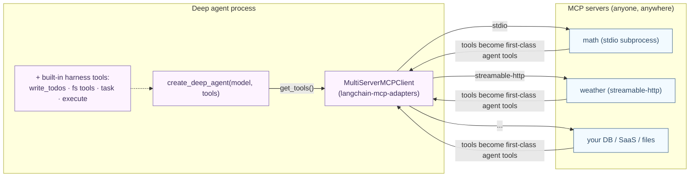


---

## Part 9 — Streaming & the Frontend

A deep agent running for minutes — planning, spawning subagents, editing files in a sandbox — needs a UI that makes that work *visible*. Deep Agents streams its harness structure, and the frontend SDK turns it into a window onto the agent.

### 9.1 Purpose

Deep Agents inherits LangChain/LangGraph event streaming and **adds one thing: `stream.subagents`** — each delegated `task` gets its own stream handle with independent `.messages`/`.tool_calls`/`.values`/`.output` and *nested* `.subagents`. The frontend uses this (plus `stream.values.todos` and sandbox state) to render the harness concepts — a todo list, subagent cards, a live file tree — instead of one opaque chat bubble.

### 9.2 Event streaming — `stream_events(version="v3")`

The typed‑projection API (recommended, Deep Agents v0.6+): top‑level `stream.messages`, `stream.values`, `stream.output`, `stream.tool_calls`, and **`stream.subagents`**. Each subagent handle exposes `.name` (= the `subagent_type` the coordinator chose), `.status`, `.path`, and its own `.messages`/`.tool_calls`/`.subagents`/`.output`. Discovery is lightweight — per‑subagent streams open only when accessed.

```python
stream = agent.stream_events({"messages": [{"role": "user", "content": "Research the sea, write a haiku"}]},
                             version="v3")

for message in stream.messages:          # coordinator tokens
    print(message.text, end="")

for subagent in stream.subagents:        # one handle per delegated task
    print(f"\n[{subagent.name}] {subagent.status}")
    for message in subagent.messages:    # the subagent's OWN stream (lazy)
        print(f"  {message.text}")
    for nested in subagent.subagents:    # arbitrarily deep delegation tree
        print(f"  ↳ {nested.name}")
```

`stream.interleave("messages", "subagents")` (sync) or `astream_events` + `asyncio.gather` (async) consume coordinator and subagent streams concurrently. The legacy `agent.stream(stream_mode=..., subgraphs=True, version="v2")` API still works (subagents surface as `tools:<id>` namespaces), but requires manual lifecycle bookkeeping that `stream.subagents` eliminates.

### 9.3 The frontend SDK

`useStream` (React/Vue/Svelte; `injectStream` Angular) consumes a *deployed* deep agent exactly as it would any LangGraph agent — and exposes the harness:

```tsx
import { useStream } from "@langchain/react";

function App() {
  const stream = useStream<typeof agent>({ apiUrl: "http://localhost:2024", assistantId: "agent" });
  const todos = stream.values?.todos;              // the built-in write_todos plan, live
  const subagents = [...stream.subagents.values()]; // discovery snapshots (a Map)
  // ... render coordinator messages from stream.messages; a card per subagent; a todo list
}
```

Three turnkey frontend patterns ship: **subagent streaming** (render coordinator messages separately from per‑subagent cards via `useMessages(stream, subagent)`/`useToolCalls(stream, subagent)`, indexed by the spawning `task` tool‑call id), a **todo list** (read `stream.values.todos`, statuses transition `pending → in_progress → completed` live), and a **sandbox IDE** (a 3‑panel file browser + diff viewer, where a custom FastAPI route mounted via `langgraph.json`'s `http.app` serves the sandbox filesystem, and the UI refreshes files when it sees `write_file`/`edit_file`/`execute` `ToolMessage`s).

### 9.4 Two perspectives: the Deep Agent server ↔ the frontend

#### 👁️ From the server's perspective ("I stream my delegation tree")

I'm a deployed deep agent (a LangGraph graph) exposing the Agent Server's `/threads` + `/runs` streaming API. As I run, I emit typed events: coordinator messages, tool‑call lifecycle, state `values` (including `todos`), and — uniquely — a **`subagents`** projection where every `task` delegation is its own labeled sub‑stream (`subagent.name == subagent_type`), nested to any depth. I persist a checkpoint each step, so I pause durably on interrupts and a client can disconnect and reattach. I don't know whether the client is React or a Python script — I speak the protocol; my statefulness is why the UI can feel live and resumable.

#### 👁️ From the frontend's perspective ("I render the harness, not a transcript")

`useStream({apiUrl, assistantId})` connects me to the deployed server and assembles its events into reactive state: `stream.messages` (coordinator), `stream.subagents` (a `Map` of discovery snapshots), `stream.values` (custom state like `todos`, sandbox metadata). I render the *structure*: a todo board from `stream.values.todos`, a collapsible card per subagent (subscribing to each subagent's scoped stream lazily, only when its card is mounted), a file tree from a side `/sandbox/{thread_id}/tree` route. I attach subagent cards under the AI message whose `task` tool‑call id spawned them. I don't run the agent — I *visualize and steer* it; the server's `stream.subagents` is what lets me show the delegation tree instead of a flat chat. From here, the UI is "a live window into the harness."

### 9.5 The overall picture — streaming the delegation tree

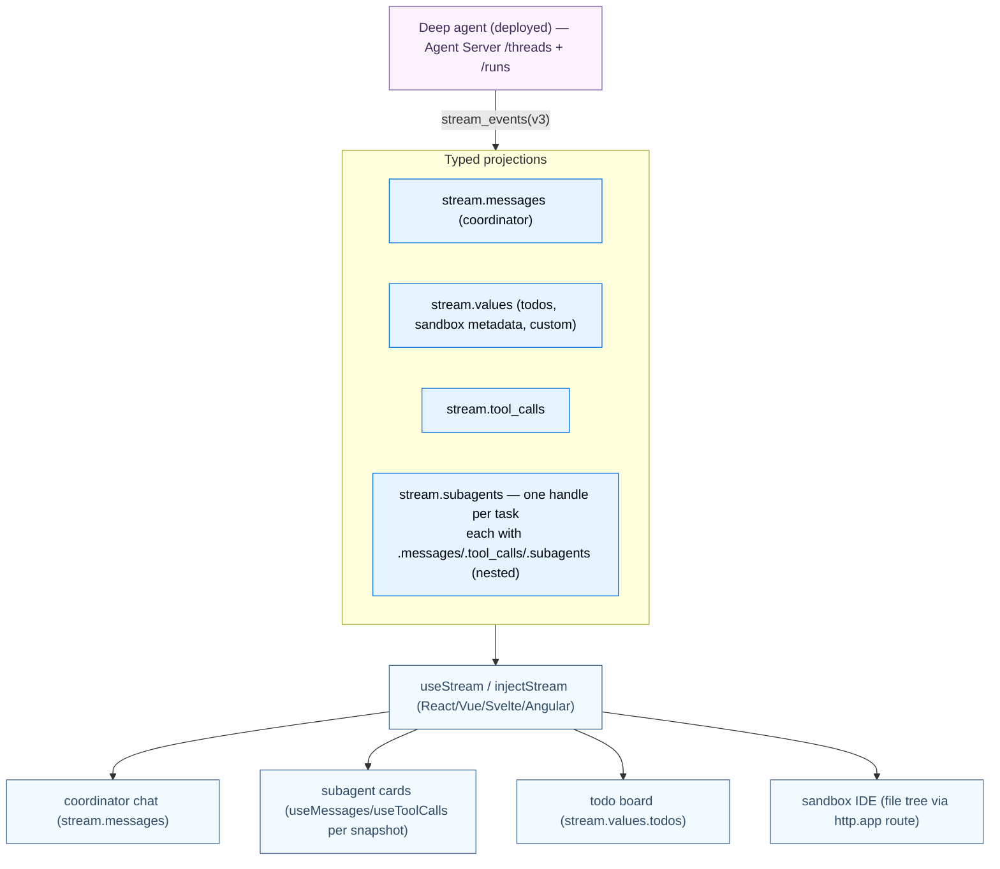


---

## Part 10 — Operate & Deliver: Production, Deploy & Evaluation

A deep agent on your laptop isn't a product. Part 10 is the path to a hardened deployment — the "open‑harness" production posture, the managed runtime, observability, and runtime evaluation.

### 10.1 Going to production — the open‑harness checklist

Production wires the harness's pluggable pieces for durability, isolation, and multi‑tenancy. Three sharing primitives govern scope: **Thread** (one conversation), **User** (an end user), **Assistant** (a configured agent instance). The checklist:

- **Invocation** — pass `thread_id` (via `config={"configurable": {"thread_id": ...}}`, the checkpointer's key for resuming a conversation) and `context` (per‑run data — `user_id`, keys, flags — read via `runtime.context`). They're independent; pass either or both. In a deployment the SDK manages threads (`client.threads.create()`).
- **Memory scoping** — route `/memories/` to a `StoreBackend` with a **namespace factory**: `(user_id)` (recommended default), `(assistant_id)`, or `(org_id)` (usually read‑only). *Shared memory is a prompt‑injection vector* — enforce read‑only on shared/org paths via permissions or policy hooks.
- **Execution environment** — `StateBackend`/`StoreBackend`/`CompositeBackend` for files; a **sandbox** for code (thread‑scoped or assistant‑scoped, via an async graph factory keyed on `thread_id`/`assistant_id`, with a TTL). **Never deploy `FilesystemBackend`/`LocalShellBackend`** — they touch the host.
- **Secrets** — use a **sandbox auth proxy** that injects credentials into outbound requests so the agent never sees raw keys; or workspace secrets. Don't pass secrets via env vars/uploads into a sandbox.
- **Guardrails** — permissions (path access) + middleware: `ModelCallLimitMiddleware`/`ToolCallLimitMiddleware` (rate limits), `ModelRetryMiddleware`/`ModelFallbackMiddleware`/`ToolRetryMiddleware` (resilience), `PIIMiddleware` (data privacy).
- **Multi‑tenancy** — custom auth + authorization handlers (tag resources by owner, filter visibility, deny with HTTP 403), team RBAC, and per‑user OAuth via Agent Auth (the agent interrupts to present a consent URL).

```python
from dataclasses import dataclass
from deepagents import create_deep_agent
from deepagents.backends import CompositeBackend, StateBackend, StoreBackend
from langchain_core.utils.uuid import uuid7

@dataclass
class Context:
    user_id: str

agent = create_deep_agent(
    model="anthropic:claude-sonnet-4-6",
    context_schema=Context,
    backend=CompositeBackend(
        default=StateBackend(),
        routes={"/memories/": StoreBackend(
            namespace=lambda rt: (rt.server_info.assistant_id, rt.server_info.user.identity))},  # per-user-per-assistant
    ),
)
cfg = {"configurable": {"thread_id": str(uuid7())}}
agent.invoke({"messages": [{"role": "user", "content": "Plan a 3-day Tokyo trip"}]},
             config=cfg, context=Context(user_id="user-123"))   # the canonical production invocation
```

### 10.2 Deploy — LangSmith / Managed Deep Agents

Deep Agents run on LangGraph, so the deployment target is the **LangGraph Platform / LangSmith Deployment**: push a repo with a `langgraph.json` (`dependencies`, `graphs`, `env`), and threads, runs, a **store**, and a **checkpointer** are provisioned automatically — durable, long‑running agents without standing up infra. A newer **Managed Deep Agents** runtime (private preview) is API‑first: it creates a managed agent resource, a per‑agent tracing project, and a **Context Hub repo** (versioned instructions/skills/subagents/tools), consumed via the Python/TS/React SDKs — *not* a full Deployment (the escape hatch to a standard Deployment is for custom code/routes/auth/scale).

### 10.3 Observability — LangSmith

Tracing is the same two env vars as everywhere (`LANGSMITH_TRACING=true`, `LANGSMITH_API_KEY`): every run becomes a trace tree with no extra code — and for deep agents that tree shows the *whole delegation structure* (coordinator → each subagent run, linked by thread id; every file write appears as a tool call you can audit). Cloud deployments auto‑trace to a per‑deployment project; **LangSmith Engine** monitors traces, detects issues, and proposes fixes.

### 10.4 Evaluation — the Rubric middleware

Distinct to Deep Agents: **`RubricMiddleware`** runs **LLM‑as‑a‑judge grading at *runtime*** — the agent iterates against a rubric until done. You declare *what done looks like* as a newline‑delimited checklist (on the *invocation state*, not the constructor); after the agent produces output a grader subagent reviews it and either passes (`satisfied`) or injects per‑criterion feedback and re‑runs (`needs_revision`), up to `max_iterations`.

```python
from deepagents import RubricMiddleware, create_deep_agent
from langgraph.checkpoint.memory import InMemorySaver

agent = create_deep_agent(
    model="anthropic:claude-sonnet-4-6",
    middleware=[RubricMiddleware(model="anthropic:claude-haiku-4-5", max_iterations=3)],  # cheaper grader model
    checkpointer=InMemorySaver(),
)
result = agent.invoke({
    "messages": [{"role": "user", "content": "Write a haiku about spring."}],
    "rubric": "- Three lines\n- 5-7-5 syllables\n- Theme is spring",   # rubric lives on input state
}, config={"configurable": {"thread_id": "r1"}})
```

The grader can be given **tools** (`tools=[run_test_suite]`) to verify behavior objectively before judging — turning subjective grading into tool‑grounded verification. It's the **runtime analogue of offline LangSmith LLM‑as‑a‑judge evals** (guide #1, Part 9): the same pattern, run in‑loop until the deliverable meets spec instead of scored after the fact. An `on_evaluation` callback (or `stream.custom` events) surfaces each grading pass.

> **Advanced — durable, multi‑user, evaluable.** The three production realities compound: checkpoint‑per‑step durability means a 30‑step many‑subagent run survives crashes and supports indefinite HITL pauses; namespace factories + authorization handlers give per‑user isolation (with shared scopes flagged as injection vectors); and `RubricMiddleware` closes a generate→judge→revise loop at runtime. All three are *configuration on the harness*, because the harness is middleware on a durable runtime.

### 10.5 The overall picture — production topology

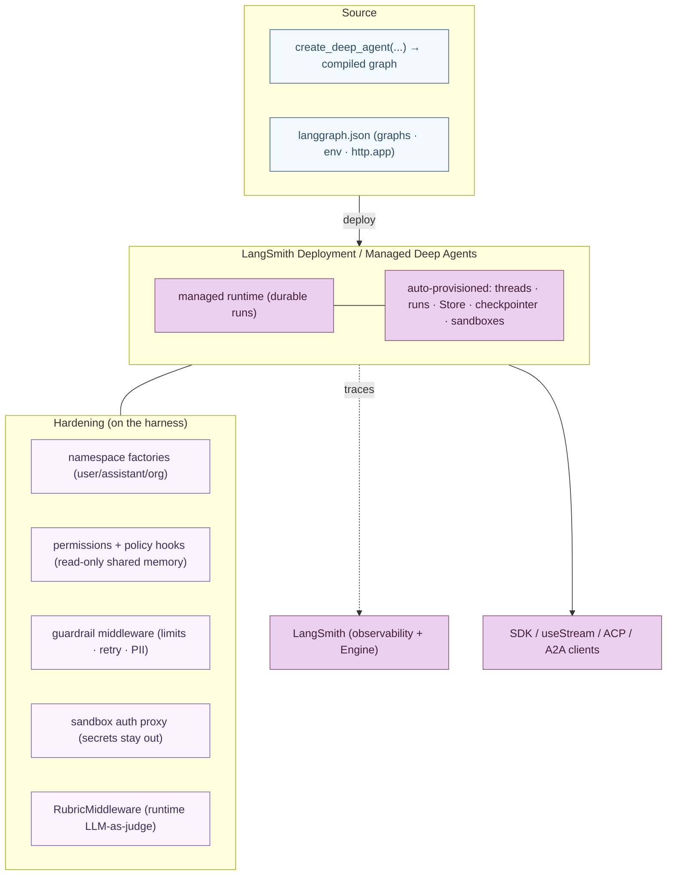


---

## Part 11 — Interop & Surfaces: ACP, A2A, the CLI & Deep Agents Code

A harness is more useful the more places it can run and the more things it can talk to. The *same* `create_deep_agent` graph can be driven from a code editor (ACP), by other agents (A2A), from a terminal (the CLI / Deep Agents Code), or from a template (the example agents).

### 11.1 The protocols — ACP and A2A

Two protocols, two directions:

- **ACP (Agent Client Protocol)** — standardizes **agent ↔ code editor/IDE**. Wrap a deep agent in `AgentServerACP(agent)` and serve it over stdio with `acp.run_agent`; any ACP client (Zed, JetBrains, VS Code, Neovim) can then drive your custom deep agent, supplying project context and rendering rich updates. (Contrast: MCP is agent→tool servers; ACP is agent→editor.)
- **A2A (Agent‑to‑Agent)** — Google's protocol for **agent ↔ agent**. A deployed message‑based deep agent auto‑exposes `/a2a/{assistant_id}` (methods `message/send`, `message/stream`, `tasks/get`) and an Agent Card at `/.well-known/agent-card.json`, so it can converse with other A2A agents (LangGraph, Google ADK, …) — with distributed tracing that groups the whole multi‑agent conversation into one LangSmith thread (the endpoint maps A2A `contextId` → `thread_id`).

```python
# Expose a deep agent over ACP (the entire integration):
import asyncio
from acp import run_agent
from deepagents import create_deep_agent
from deepagents_acp.server import AgentServerACP
from langgraph.checkpoint.memory import MemorySaver

async def main():
    agent = create_deep_agent(model="anthropic:claude-sonnet-4-6",
                              system_prompt="You are a helpful coding assistant",
                              checkpointer=MemorySaver())
    await run_agent(AgentServerACP(agent))   # stdio server the editor launches

asyncio.run(main())
```

### 11.2 Two perspectives: Deep Agents ↔ ACP / A2A

#### 👁️ From the protocol's perspective ("I'm a neutral wire contract")

**ACP**: I define how an editor (client) talks to a coding agent (server) over stdio — the editor sends project context and gets streamed updates. I don't know it's "Deep Agents" behind the socket; any conforming server works, so the *same editor* can drive agents from different vendors. **A2A**: I define how agents exchange messages (`message/send`/`stream`, Agent Cards for discovery, `contextId`/`taskId` for continuity). I'm vendor‑neutral — a LangGraph deep agent and a Google ADK agent converse through me identically.

#### 👁️ From Deep Agents' perspective ("I'm exposed through a protocol, harness intact")

For **ACP**, `AgentServerACP` wraps my `create_deep_agent` graph and serves it via `run_agent` — and my *full harness* (custom prompt, tools, middleware, subagents, filesystem/shell) runs behind the protocol; the editor just becomes my client. For **A2A**, because I'm message‑based (a `messages` key in state — which every deep agent has), deploying me auto‑exposes the `/a2a/{assistant_id}` endpoint and an Agent Card; I can now be a participant in a multi‑agent system, and my `contextId` collapses onto a LangSmith `thread_id` so a distributed conversation traces as one thread. From here, ACP/A2A are *adapters that publish the harness to editors and other agents* — no change to how I'm built.

### 11.3 The CLI & Deep Agents Code

**Deep Agents Code** (`dcode`) is a terminal‑based coding agent that *is* `create_deep_agent` + a TUI/headless front‑end. (The CLI and Code share docs — they're the same product.) Install via a one‑line script; configure through files rather than Python: `config.toml` (providers, model, profiles, themes, sandboxes), `.env` (keys), `.mcp.json` (MCP servers), `AGENTS.md` (memory), `SKILL.md` dirs (skills), and subagent specs. Run interactively, headless (`-n`), or as an ACP editor server (`--acp`). It's a reference implementation of the harness: every file‑based knob maps onto a `create_deep_agent` capability (backends, MCP, skills, memory, sandboxes, subagents).

### 11.4 The example agents

Three template agents showcase the harness end‑to‑end: **deep‑research** (subagent fan‑out + planning + a search tool — the canonical multi‑subagent researcher), **data‑analysis** (a sandbox backend + checkpointer for running analysis code, with secrets kept *outside* the sandbox), and **content‑builder** (memory + skills + subagents + a filesystem backend). They're the fastest way to see which capabilities to combine for a given task.

### 11.5 The overall picture — one harness, many surfaces

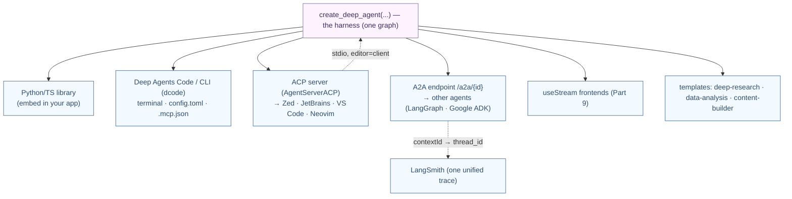

Every surface drives the *same* harness — which is the final point of the whole guide, made explicit in Part 12.


---

## Part 12 — The Whole Picture

We descended from "why a harness?" through every built‑in capability down to the protocols that publish it. Now zoom out, connect it all, see *why* it evolved this way, and leave with decision guides.

### 12.1 The full picture — harness over framework over runtime

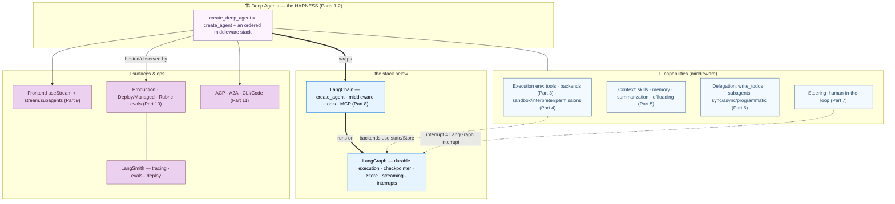

### 12.2 Purpose recap — every layer in one table

| Layer | Purpose (the *why*) | Achieved by | Part |
|---|---|---|---|
| **Positioning** | A batteries‑included harness for long, autonomous tasks | `create_deep_agent` on LangChain on LangGraph | 0 |
| **The four capabilities** | Reliability on real tasks | execution env · context mgmt · delegation · steering | 1 |
| **Middleware stack** | The harness *is* an ordered middleware list | `create_deep_agent` = `create_agent` + the stack | 2 |
| **Execution env** | Where the agent acts | tools · models · the pluggable filesystem backends | 3 |
| **Code execution** | Run code safely / compose tools | sandboxes (`execute`) · interpreters (`eval`) · permissions | 4 |
| **Context management** | Stay within token limits; retain | skills (on‑demand) · memory (always) · summarization/offloading · prompt caching | 5 |
| **Delegation** | Break work into isolated/parallel units | `write_todos` · subagents (sync/async/programmatic) | 6 |
| **Steering** | Human control on sensitive actions | `interrupt_on` → HITL (LangGraph interrupts) | 7 |
| **MCP** | Use tools the world already wrote | `langchain-mcp-adapters` → first‑class tools | 8 |
| **Streaming & frontend** | Make the harness visible | `stream.subagents` · `useStream` (todos/cards/IDE) | 9 |
| **Operate & deliver** | Production, hosting, evaluation | namespaces · permissions · deploy · `RubricMiddleware` | 10 |
| **Interop & surfaces** | Run anywhere, talk to anything | ACP (editors) · A2A (agents) · CLI/Code · templates | 11 |

### 12.3 Why it's built this way — the evolution

The version arc shows a runtime maturing upward into the harness:

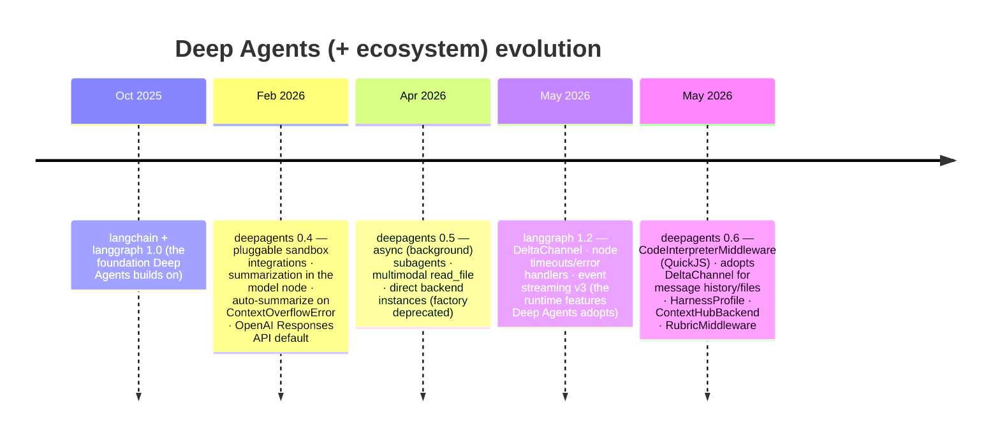

The story: Deep Agents started as a curated middleware stack on `create_agent`, then **grew along the axes a *long‑running, autonomous* agent stresses** — sandboxes and interpreters (act safely), async subagents (parallel background work), `DeltaChannel`‑backed files (checkpoints that don't balloon over a long thread), harness profiles (per‑model tuning), Context Hub (versioned durable files), and Rubric (judge‑until‑done). Tellingly, the runtime feature `DeltaChannel` (langgraph 1.2) was *immediately adopted* by deepagents 0.6 for message history — proof that improvements flow **up** the stack: runtime → framework → harness. That upward flow is the thesis of this trilogy.

### 12.4 Decision guide — Deep Agents vs the layers below

| If you need… | Reach for | Guide |
|---|---|---|
| A long, autonomous task (research, coding, analysis) with planning/files/subagents out of the box | **`create_deep_agent`** | this one |
| A simple tool‑calling assistant, fully under your control | `create_agent` (Deep Agents *is* this + middleware) | LangChain |
| Explicit graph control / a non‑"loop" topology | raw LangGraph `StateGraph` | LangGraph |
| Files that persist across turns / across threads | a `StateBackend` / `StoreBackend` (or `CompositeBackend`) | Part 3 |
| Safe code execution / package installs | a **sandbox** backend (`execute`) | Part 4 |
| In‑loop loops/aggregation over tools | an **interpreter** (`CodeInterpreterMiddleware`, PTC) | Part 4 |
| On‑demand domain knowledge vs always‑on instructions | **skills** vs **memory** | Part 5 |
| Context isolation / parallel subtasks | **subagents** (sync/async/programmatic) | Part 6 |
| Human approval on sensitive actions | `interrupt_on` (HITL) | Part 7 |
| Third‑party tools | **MCP** | Part 8 |
| A rich UI of the agent's work | `useStream` + `stream.subagents` | Part 9 |
| Production hosting + runtime evals | LangSmith Deployment / Managed + `RubricMiddleware` | Part 10 |
| Use in an editor / talk to other agents / a terminal | **ACP** / **A2A** / the **CLI** | Part 11 |

### 12.5 Reference — packages

- **`deepagents`** — the harness: `create_deep_agent`, `HarnessProfile`/`register_harness_profile`, `SubAgent`/`CompiledSubAgent`/`AsyncSubAgent`, `FilesystemPermission`, `RubricMiddleware`; `deepagents.backends` (`StateBackend`, `FilesystemBackend`, `LocalShellBackend`, `StoreBackend`, `ContextHubBackend`, `CompositeBackend`, `BackendProtocol`); `deepagents.middleware.*` (filesystem, subagents, skills, memory, summarization, …).
- **`langchain-<provider>-*` sandbox packages** — `langchain-daytona`, `langchain-e2b`, `langchain-modal`, `langchain-runloop`, `langchain-vercel-sandbox`, `langchain-agentcore-codeinterpreter`, `langsmith[sandbox]`.
- **`langchain-quickjs`** — `CodeInterpreterMiddleware` (the interpreter / PTC / programmatic subagents).
- **`langchain` / `langgraph` / `langsmith`** — the framework, runtime, and platform Deep Agents stands on. **`langchain-mcp-adapters`** — MCP tools. **`deepagents-acp`** — the ACP server. **`deepagents-cli`** — the terminal agent.

```bash
pip install -U deepagents                       # the harness
pip install -U langchain-daytona langchain-quickjs   # a sandbox + the interpreter
pip install -U langgraph langsmith              # runtime + platform (inherited)
pip install -U langchain-mcp-adapters deepagents-acp  # MCP tools + ACP server
```

---

### Closing thought

This trilogy descended and then re‑ascended one stack. Guide #1 said **Agent = Model + Harness**. Guide #2 went to the bedrock — **LangGraph is where you build control you can trust.** This guide is the top: **Deep Agents is the harness, pre‑built.** The single sentence that ties all three together is the one we proved in Part 2: *a deep agent is `create_agent` plus a curated middleware stack, running on the LangGraph runtime.* The model supplies intelligence; LangGraph supplies durable, resumable execution; LangChain supplies the loop and the middleware mechanism; and Deep Agents supplies the *opinionated assembly* — planning, a filesystem, subagents, context management, and human steering — that turns a capable loop into a reliable, autonomous agent. Reach for it when the task is long and the goal is "just make it work well, out of the box."

*— End of guide.*


