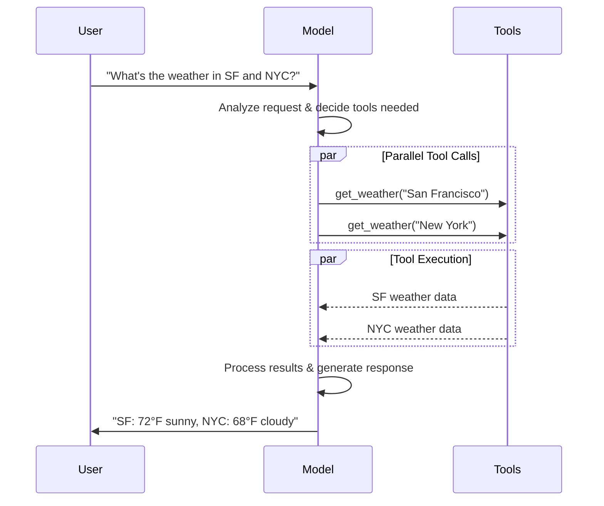
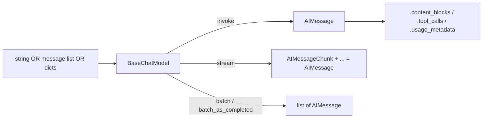
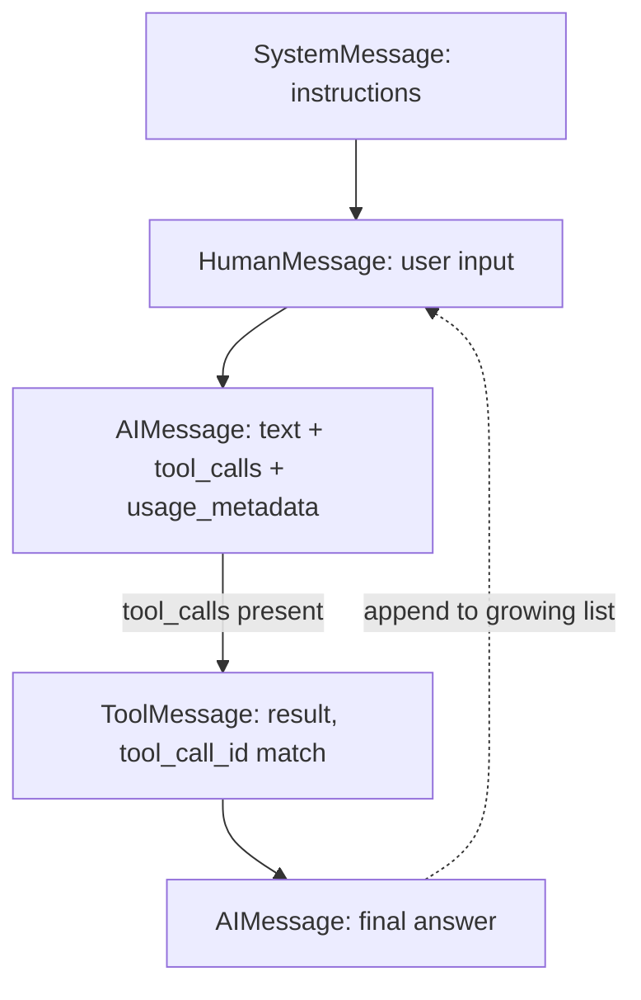

# Buffer 1 — Models & Messages (raw extraction)

Source files:
- `/home/rajendra/projects/langlearn/langchain-learning/langchain-docs/python/langchain/06-models.md`
- `/home/rajendra/projects/langlearn/langchain-learning/langchain-docs/python/langchain/07-messages.md`

---

# TOPIC 1 — MODELS

## 1. Purpose

LLMs (chat models) are the **reasoning engine** of LangChain agents. They interpret and generate text, and many also support **tool calling**, **structured output**, **multimodality** (images/audio/video), and **reasoning** (multi-step thinking). In agents, the model drives the decision-making loop: which tools to call, how to interpret results, when to give a final answer. Model quality/capabilities directly determine an agent's baseline reliability and performance.

**Why it exists / what would be painful without it:** Every model provider (OpenAI, Anthropic, Google, AWS Bedrock, HuggingFace, OpenRouter, Azure, Ollama, etc.) has a different SDK, request/response shape, auth scheme, streaming protocol, tool-calling format, and token-usage schema. LangChain's **standard model interface** gives a single, uniform API across all providers via dedicated integration packages. This means:
- You can experiment with and **swap providers without rewriting application logic**.
- New model *names* work immediately with no LangChain update — provider packages pass model names straight to the provider API.
- The **same interface works both standalone and inside agents**, so you can start simple and scale up.

Without it you'd hand-write provider-specific clients, re-implement retries/streaming/tool-parsing per provider, and lock your app to one vendor.

## 2. Building blocks (exhaustive named API)

**Initialization**
- `init_chat_model(...)` — from `langchain.chat_models`. Easiest entry point; returns a standard chat model. Accepts `**kwargs` passed straight to the underlying model.
- Direct model classes (per provider package): `ChatOpenAI` (`langchain_openai`), `ChatAnthropic` (`langchain_anthropic`), `AzureChatOpenAI` (`langchain_openai`), `ChatGoogleGenerativeAI` (`langchain_google_genai`), `ChatBedrock` (`langchain_aws`), `ChatHuggingFace` + `HuggingFaceEndpoint` (`langchain_huggingface`), `ChatOpenRouter` (`langchain_openrouter`), Ollama (local).
- `BaseChatModel` — the base class implementing the standard interface (`langchain_core.language_models.chat_models`).

**Model string / provider format**
- Model id format: `"{model_provider}:{model}"`, e.g. `"openai:o1"`, `"azure_openai:gpt-5.4"`, `"google_genai:gemini-2.5-flash-lite"`, `"anthropic:..."`.
- Alternatively pass `model_provider=` separately, e.g. `init_chat_model("anthropic.claude-3-5-sonnet-20240620-v1:0", model_provider="bedrock_converse")`, or `model_provider="huggingface"`, `"openrouter"`, `"openai"`.
- Provider package install extras: `langchain[openai]`, `langchain[anthropic]`, `langchain[openai]` (Azure), `langchain[google-genai]`, `langchain[aws]`, `langchain[huggingface]`, `langchain-openrouter`.

**Standard parameters** (vary by provider; passed as inline `**kwargs` to `init_chat_model`)
- `model` (string, required) — model name or `provider:model`.
- `api_key` (string) — provider auth key; usually via env var (`OPENAI_API_KEY`, `ANTHROPIC_API_KEY`, `GOOGLE_API_KEY`, `AZURE_OPENAI_API_KEY`, `AZURE_OPENAI_ENDPOINT`, `OPENAI_API_VERSION`, `HUGGINGFACEHUB_API_TOKEN`, `OPENROUTER_API_KEY`, `AZURE_OPENAI_DEPLOYMENT_NAME`).
- `temperature` (number) — randomness/creativity.
- `max_tokens` (number) — caps response length.
- `timeout` (number, seconds) — max wait before canceling.
- `max_retries` (number, default **6**) — retry attempts with exponential backoff + jitter.
- Provider-specific params, e.g. `ChatOpenAI` has `use_responses_api` (Responses vs Completions API), `azure_deployment` (Azure), `base_url`, `openai_proxy`, `repo_id` (HF), `max_length` (HF).

**Key invocation methods** (on `BaseChatModel`)
- `.invoke(input)` — returns a single complete `AIMessage`.
- `.stream(input)` — returns an iterator yielding `AIMessageChunk` objects.
- `.batch([...])` — client-side parallelized calls; returns final outputs.
- `.batch_as_completed([...])` — yields results as each finishes (out of order; each carries its input index).
- `.astream_events(input)` — async semantic event stream (event types: `on_chat_model_start`, `on_chat_model_stream`, `on_chat_model_end`).
- Async counterparts implied (`ainvoke`/`astream`/`abatch`).

**Declarative / binding methods**
- `.bind_tools([tools], tool_choice=..., parallel_tool_calls=...)` — makes tools available; `tool_choice="any"` forces any tool, `tool_choice="tool_1"` forces a specific tool; `parallel_tool_calls=False` disables parallel calls (OpenAI/Anthropic).
- `.with_structured_output(schema, method=..., include_raw=...)` — constrain output to a schema.
- `.bind(logprobs=True)` — bind arbitrary kwargs (e.g. enable logprobs).
- `.with_configurable(...)`, `configurable_fields`, `config_prefix` — runtime-configurable models.
- `.model_copy(update={...})` — copy a model (e.g. to avoid mutating shared `profile`).

**Message-related (returned/consumed)**
- `AIMessage`, `AIMessageChunk` (`langchain_core.messages.ai`).
- Chunk summation: `full = chunk if full is None else full + chunk`.
- `.text`, `.content`, `.content_blocks`, `.tool_calls`, `.tool_call_chunks`, `.usage_metadata`, `.response_metadata` on messages.

**Tools / structured output types**
- `@tool` decorator (`langchain.tools`).
- `ToolMessage` (`langchain_core.messages.tool`) with `tool_call_id`.
- `ToolCallChunk` — progressive tool-call fragments during streaming.
- `with_structured_output` schema types: Pydantic `BaseModel`/`Field`, `TypedDict` + `Annotated`, raw JSON Schema.
- Structured-output `method` values: `'json_schema'`, `'function_calling'`, `'json_mode'`.
- `include_raw=True` → returns `{"raw": AIMessage, "parsed": ..., "parsing_error": None}`.

**Profiles / capabilities**
- `model.profile` (dict) — supported features (`max_input_tokens`, `image_inputs`, `reasoning_output`, `tool_calling`, `structured_output`, ...). Requires `langchain>=1.1` (beta). Backed by `models.dev` + per-package `profile_augmentations.toml`. Tooling: `langchain-model-profiles` / `langchain-profiles refresh` CLI. `ModelProfile` API type.

**Resilience / rate limiting / config**
- `InMemoryRateLimiter` (`langchain_core.rate_limiters`) — params `requests_per_second`, `check_every_n_seconds`, `max_bucket_size`; passed via `rate_limiter=` at init.
- `RunnableConfig` (dict) — `max_concurrency`, `run_name`, `tags`, `metadata`, `callbacks`, `recursion_limit`.
- `base_url`, `api_key`, `openai_proxy` for custom endpoints/proxies.

**Token usage tracking**
- `UsageMetadataCallbackHandler` (`langchain_core.callbacks`) — aggregate usage across models via `config={"callbacks": [callback]}`, then `callback.usage_metadata`.
- `get_usage_metadata_callback()` (`langchain_core.callbacks`) — context manager; `cb.usage_metadata`.

**Configurable / dynamic models**
- `init_chat_model(temperature=0)` with no model → `model` and `model_provider` configurable by default via `config={"configurable": {"model": "..."}}`.
- `configurable_fields=("model","model_provider","temperature","max_tokens")`, `config_prefix="first"`.
- Dynamic selection middleware: `@wrap_model_call` decorator, `ModelRequest`, `ModelResponse` (`langchain.agents.middleware`), `request.override(model=...)`, `request.state["messages"]`, used via `create_agent(model=..., tools=..., middleware=[...])`.

**Server-side / built-in tools**
- Built-in provider tools enabled via params, e.g. `tool = {"type": "web_search"}`; `model.bind_tools([tool])`.
- Response content blocks: `server_tool_call`, `server_tool_result`, with `annotations` (citations).

## 3. Annotated code (verbatim from docs)

### (a) Initialize a model + invoke
```python
import os
from langchain.chat_models import init_chat_model

os.environ["ANTHROPIC_API_KEY"] = "sk-..."

model = init_chat_model("claude-sonnet-4-6")
```
```python
response = model.invoke("Why do parrots talk?")
```
- `init_chat_model("claude-sonnet-4-6")` resolves the provider from the model name and returns a standard `BaseChatModel`. The API key is read from the environment.
- `.invoke(...)` with a plain string is shorthand for one `HumanMessage`; it returns a single `AIMessage` after the model finishes. The exact same object/interface is used standalone or inside an agent — that uniformity is the whole point.

### (b) Streaming and reconstructing a full message
```python
full = None  # None | AIMessageChunk
for chunk in model.stream("What color is the sky?"):
    full = chunk if full is None else full + chunk
    print(full.text)

# The
# The sky
# The sky is
# ...

print(full.content_blocks)
# [{"type": "text", "text": "The sky is typically blue..."}]
```
- `.stream(...)` returns an iterator of `AIMessageChunk` objects (NOT a single `AIMessage` like `invoke`).
- Chunks are **additive**: `full + chunk` accumulates them into a single message. This is the canonical pattern.
- After accumulation, the result behaves exactly like an `invoke()` message — can be appended to history and passed back as context. `full.content_blocks` gives the standardized typed view.
- Why it matters: progressive display dramatically improves UX for long responses; the additive design means streaming and non-streaming code paths converge on the same message type.

### (c) Tool calling — bind and inspect requests
```python
from langchain.tools import tool

@tool
def get_weather(location: str) -> str:
    """Get the weather at a location."""
    return f"It's sunny in {location}."


model_with_tools = model.bind_tools([get_weather])

response = model_with_tools.invoke("What's the weather like in Boston?")
for tool_call in response.tool_calls:
    # View tool calls made by the model
    print(f"Tool: {tool_call['name']}")
    print(f"Args: {tool_call['args']}")
```
- `@tool` turns a typed Python function into a tool (schema = name + docstring description + arg types).
- `.bind_tools([...])` returns a new model that advertises those tools to the provider. It does NOT execute anything.
- The model's `AIMessage` carries `tool_calls` — a **request** (each has `name`, `args`, `id`). Standalone, *you* must execute and feed results back; inside an agent the loop does it for you. This is the key conceptual split between "model emits tool-call request" and "harness runs the tool."

### (d) The manual tool execution loop (what agents automate)
```python
# Bind (potentially multiple) tools to the model
model_with_tools = model.bind_tools([get_weather])

# Step 1: Model generates tool calls
messages = [{"role": "user", "content": "What's the weather in Boston?"}]
ai_msg = model_with_tools.invoke(messages)
messages.append(ai_msg)

# Step 2: Execute tools and collect results
for tool_call in ai_msg.tool_calls:
    # Execute the tool with the generated arguments
    tool_result = get_weather.invoke(tool_call)
    messages.append(tool_result)

# Step 3: Pass results back to model for final response
final_response = model_with_tools.invoke(messages)
print(final_response.text)
# "The current weather in Boston is 72°F and sunny."
```
- Step 1: model returns an `AIMessage` containing `tool_calls`; append it to history.
- Step 2: `get_weather.invoke(tool_call)` — passing the *whole* tool_call dict makes the tool return a `ToolMessage` whose `tool_call_id` matches the request id (lets the model correlate result↔request).
- Step 3: re-invoke with the full message list (Human → AI/tool-call → ToolMessage); the model now produces a natural-language final answer.
- This three-step loop is exactly what `create_agent` orchestrates internally — understanding it demystifies the agent harness.

### (e) Structured output (Pydantic)
```python
from pydantic import BaseModel, Field

class Movie(BaseModel):
    """A movie with details."""
    title: str = Field(description="The title of the movie")
    year: int = Field(description="The year the movie was released")
    director: str = Field(description="The director of the movie")
    rating: float = Field(description="The movie's rating out of 10")

model_with_structure = model.with_structured_output(Movie)
response = model_with_structure.invoke("Provide details about the movie Inception")
print(response)  # Movie(title="Inception", year=2010, director="Christopher Nolan", rating=8.8)
```
- The Pydantic class doubles as the schema *and* the runtime validator; `Field(description=...)` text is sent to the model to guide generation.
- `.with_structured_output(Movie)` returns a model whose `.invoke` yields a validated `Movie` instance instead of an `AIMessage`. Pydantic gives automatic validation; `TypedDict`/JSON Schema require manual validation.

## 4. Advanced concepts

- **Auto-streaming:** When you call `model.invoke()` inside a LangGraph agent node while the overall app runs in a streaming mode, LangChain auto-switches the model to internal streaming and fires `on_llm_new_token` callbacks, so `stream()`/`astream_events()` surface tokens in real time without changing the node code.
- **`astream_events()`:** semantic event stream with `on_chat_model_start`/`_stream`/`_end`; aggregates the full message in the background; good for filtering by event type/metadata.
- **Batching nuances:** `batch()` parallelizes **client-side** and is DISTINCT from provider batch APIs (OpenAI/Anthropic message-batches). `batch_as_completed()` returns out of order (carries input index). Control parallelism with `config={"max_concurrency": 5}`.
- **Connection resilience:** default 6 retries with exponential backoff + jitter; retries network errors, 429, 5xx; does NOT retry 401/404. For long-running agents on flaky networks use `max_retries` 10–15 + a checkpointer so progress survives failures.
- **Model profiles** (`langchain>=1.1`, beta): `model.profile` dict drives dynamic behavior — summarization middleware uses context-window size; `create_agent` infers structured-output strategy from native-support flags; inputs gated by supported modalities/`max_input_tokens`; Deep Agents Code switcher filters to `tool_calling`+text models. Override via `init_chat_model(..., profile=custom_profile)` or in-place dict update (use `model_copy` if shared). Upstream data from `models.dev`.
- **Multimodal input/output:** pass non-text via content blocks; models accept (1) cross-provider standard format, (2) OpenAI chat-completions format, (3) provider-native format. Multimodal *output* appears as content blocks like `{"type":"image","base64":"...","mime_type":"image/jpeg"}`.
- **Reasoning:** if supported, reasoning surfaces as `content_blocks` with `type == "reasoning"` (each has `reasoning`). Effort can be tuned via categorical tiers (`'low'`/`'high'`) or integer token budgets; can often be turned off.
- **Prompt caching:** **implicit** (OpenAI, Gemini auto-pass savings) vs **explicit** (`ChatOpenAI` `prompt_cache_key`; Anthropic `AnthropicPromptCachingMiddleware`; Gemini; AWS Bedrock). Often gated by a min input-token threshold. Cache usage shows in `usage_metadata` (`cache_read`, `cache_creation`).
- **Server-side tool use:** single conversational turn; response content blocks include `server_tool_call` + `server_tool_result` (+ `text` with `annotations`/`citation`). No `ToolMessage` round-trip needed (unlike client-side tools).
- **Rate limiting:** `InMemoryRateLimiter` (thread-safe, shareable) with `requests_per_second`/`check_every_n_seconds`/`max_bucket_size`; limits request *count* only, not request *size*.
- **Base URL / proxy:** custom `base_url` for OpenAI-compatible APIs (Together AI, vLLM); `openai_proxy` for HTTP proxies. Warning: `model_provider="openai"` targets the official OpenAI spec and may drop router/proxy-specific fields — prefer dedicated `ChatOpenRouter`/`ChatLiteLLM` for those.
- **Log probabilities:** `.bind(logprobs=True)`; read via `response.response_metadata["logprobs"]`.
- **Token usage aggregation:** `UsageMetadataCallbackHandler` or `get_usage_metadata_callback()` context manager; per-model dicts keyed by model name. OpenAI/Azure require opt-in for streaming usage metadata.
- **Invocation config (`RunnableConfig`):** `run_name`, `tags` (inherited by sub-calls), `metadata` (inherited), `callbacks`, `max_concurrency`, `recursion_limit` — central for LangSmith tracing & production control.
- **Configurable models:** runtime-swap model/params via `config={"configurable": {...}}`; declarative ops (`bind_tools`, `with_structured_output`) still work on a configurable model.
- **Dynamic model selection:** `@wrap_model_call` middleware picks model per request based on `request.state` (e.g. message count), returning `handler(request.override(model=model))`.

## 5. Cross-framework interaction points

- **Models ↔ Agents/`create_agent`:** models are the reasoning engine; passed as `model=` to `create_agent`/`create_deep_agent`; the agent loop automates the tool-execution loop you'd otherwise write by hand.
- **Models ↔ Tools:** `bind_tools()` advertises `@tool`-defined tools; model emits `tool_calls`, tools return `ToolMessage`s correlated by `tool_call_id`.
- **Models ↔ Structured output:** `with_structured_output()` (Pydantic/TypedDict/JSON Schema; methods `json_schema`/`function_calling`/`json_mode`); profile flags let `create_agent` auto-pick the strategy.
- **Models ↔ Messages:** models consume lists of message objects/dicts and return `AIMessage`/`AIMessageChunk`; `usage_metadata`/`content_blocks` live on those messages.
- **Models ↔ LangGraph (state/persistence):** `invoke()` in graph nodes auto-streams; checkpointer preserves progress across retries; dynamic model middleware reads `request.state["messages"]`.
- **Models ↔ LangSmith (tracing):** every model call is traced; `RunnableConfig` `run_name`/`tags`/`metadata` flow into traces; LangSmith Engine monitors and proposes fixes.
- **Models ↔ Middleware:** `@wrap_model_call`, `AnthropicPromptCachingMiddleware`, summarization middleware (uses `profile` context-window size).
- **Models ↔ Embeddings/Vector stores:** chat models are one of several integration families alongside embedding models and vector stores.

## 6. Gotchas / version notes

- **Chat model vs legacy LLM:** if `invoke()` returns a *string*, you're on a legacy text-completion LLM. LangChain chat models are prefixed `Chat*` (e.g. `ChatOpenAI`) and return `AIMessage`.
- **Model profiles require `langchain>=1.1` and are a beta feature** — profile format may change.
- **Pre-bound models + structured output:** models already `bind_tools()`-ed are NOT supported with structured output in dynamic model selection — pass un-bound models to middleware.
- **Provider differences:** `parallel_tool_calls` only disablable on some providers (OpenAI/Anthropic); structured-output `method` support varies; prompt caching implicit vs explicit per provider; OpenAI/Azure need opt-in for streaming usage metadata; `name` field on messages honored by some providers, ignored by others.
- **`base_url` warning:** `model_provider="openai"` may not preserve router/proxy fields — use dedicated integrations for OpenRouter/LiteLLM.
- **New model names** work without upgrading LangChain (names passed straight to provider).
- Model names in docs are forward-looking/illustrative (e.g. `gpt-5.4`, `claude-sonnet-4-6`, `gemini-3.5-flash`) — treat as placeholders for "current model."

---

# TOPIC 2 — MESSAGES

## 1. Purpose

Messages are the **fundamental unit of context** for models in LangChain. They represent both the **input and output** of models, carrying **content + metadata** that captures the full state of a conversation. A message has three parts: **Role** (who/what sent it), **Content** (text/images/audio/docs/etc.), and **Metadata** (response info, IDs, token usage).

**Why it exists / what would be painful without it:** Each provider has its own message/role schema, content shape, tool-call representation, reasoning/"thinking" format, and usage-metadata layout. LangChain provides **one standard message type that works across all providers**, ensuring consistent behavior regardless of model. This standardization (especially the v1 **content blocks**) lets you write provider-agnostic code for multimodal data, reasoning, citations, and tool calls. Messages are also the **state that conversations/agents accumulate** — a multi-turn loop is just "invoke the model with a growing list of messages." Without it you'd juggle provider-specific dicts, lose portability, and have to special-case every content type per vendor.

## 2. Building blocks (exhaustive named API)

**Message classes** (import from `langchain.messages`; canonical defs in `langchain_core.messages`)
- `SystemMessage` — instructions priming model behavior (role/tone/guidelines).
- `HumanMessage` — user input; supports text + multimodal content. Fields: `content`, `name` (optional user id), `id` (optional, for tracing). A bare string to `.invoke()` is shorthand for a single `HumanMessage`.
- `AIMessage` — model output. Attributes: `text`, `content` (string | dict[]), `content_blocks` (`ContentBlock[]`), `tool_calls` (dict[] | None), `id`, `usage_metadata` (dict | None), `response_metadata` (`ResponseMetadata` | None).
- `AIMessageChunk` — streaming fragment of an `AIMessage`; additive (`full + chunk`).
- `ToolMessage` — result of a single tool execution. Fields: `content` (string, required — stringified tool output), `tool_call_id` (required — must match the `AIMessage` tool call id), `name` (required — tool name), `artifact` (dict — extra data NOT sent to model, accessible programmatically).
- `BaseMessage` — base type with the `content` property.

**Message input formats accepted by models**
1. A plain string (→ single `HumanMessage`).
2. A list of message objects (`SystemMessage`/`HumanMessage`/`AIMessage`/`ToolMessage`).
3. A list of dicts in **OpenAI chat-completions format**: `{"role": "system"|"user"|"assistant", "content": "..."}`.

**Content representation**
- `content` attribute — loosely typed: a string, OR a list of provider-native content blocks, OR a list of LangChain **standard content blocks**.
- `content_blocks` — typed property that **lazily parses** `content` into the standard representation (type-safe). Setting `content_blocks=` at construction also populates `content`.
- `output_version="v1"` (or env `LC_OUTPUT_VERSION=v1`) — store standard content blocks directly in `content` for external consumers.

**Token usage**
- `usage_metadata` field (`UsageMetadata`): `input_tokens`, `output_tokens`, `total_tokens`, `input_token_details` (e.g. `audio`, `cache_read`, `cache_creation`), `output_token_details` (e.g. `audio`, `reasoning`).

**Metadata fields**
- `response_metadata` (`ResponseMetadata`) — provider response info (e.g. `logprobs`, `model_provider`).
- `name`, `id` on messages.

**Standard content block types** (typed dicts; `type` discriminator)
- *Core:*
  - `TextContentBlock` — `type:"text"`, `text` (required), `annotations` (object[]), `extras` (object).
  - `ReasoningContentBlock` — `type:"reasoning"`, `reasoning` (string), `extras` (object).
- *Multimodal:*
  - `ImageContentBlock` — `type:"image"`, `url` | `base64` | `file_id`, `id`, `mime_type` (required for base64; e.g. `image/jpeg`, `image/png`).
  - `AudioContentBlock` — `type:"audio"`, `url`/`base64`/`file_id`, `id`, `mime_type` (e.g. `audio/wav`, `audio/mpeg`).
  - `VideoContentBlock` — `type:"video"`, `url`/`base64`/`file_id`, `id`, `mime_type` (e.g. `video/mp4`, `video/webm`).
  - `FileContentBlock` — `type:"file"`, `url`/`base64`/`file_id`, `id`, `mime_type` (e.g. `application/pdf`). (OpenAI requires a filename for PDFs.)
  - `PlainTextContentBlock` — `type:"text-plain"`, `text`, `mime_type` (e.g. `text/plain`, `text/markdown`) — for document text.
- *Tool calling:*
  - `ToolCall` — `type:"tool_call"`, `name` (req), `args` (object, req), `id` (req).
  - `ToolCallChunk` — `type:"tool_call_chunk"`, `name`, `args` (partial/incomplete JSON string), `id`, `index` (number|string).
  - `InvalidToolCall` — `type:"invalid_tool_call"`, `name`, `args`, `error` (catches JSON parse errors).
- *Server-side tool execution:*
  - `ServerToolCall` — `type:"server_tool_call"`, `id` (req), `name` (req), `args` (req).
  - `ServerToolCallChunk` — `type:"server_tool_call_chunk"`, `id`, `name`, `args`, `index`.
  - `ServerToolResult` — `type:"server_tool_result"`, `tool_call_id` (req), `id`, `status` (req: `"success"`|`"error"`), `output`.
- *Provider escape hatch:*
  - `NonStandardContentBlock` — `type:"non_standard"`, `value` (object, req) — for experimental/provider-unique features.

**Provider-native content example (OpenAI):** `{"type":"image_url","image_url":{"url":"..."}}` — accepted directly in `content`.

**Related methods/objects**
- `model.invoke(messages)` → `AIMessage`; `model.stream(...)` → `AIMessageChunk`; `model.bind_tools([...])`.
- Tools generate `ToolMessage` directly (or via `tool.invoke(tool_call)`).

## 3. Annotated code (verbatim from docs)

### (a) Basic message construction + invoke
```python
from langchain.chat_models import init_chat_model
from langchain.messages import HumanMessage, AIMessage, SystemMessage

model = init_chat_model("gpt-5-nano")

system_msg = SystemMessage("You are a helpful assistant.")
human_msg = HumanMessage("Hello, how are you?")

# Use with chat models
messages = [system_msg, human_msg]
response = model.invoke(messages)  # Returns AIMessage
```
- `SystemMessage` primes behavior; `HumanMessage` is the user turn.
- A list of message objects is the standard, provider-agnostic conversation representation.
- `model.invoke(messages)` returns an `AIMessage` — the output is itself a message, so it can be appended back into `messages` for the next turn (the core stateless conversational loop).

### (b) Manually inserting an AIMessage into history
```python
from langchain.messages import AIMessage, SystemMessage, HumanMessage

# Create an AI message manually (e.g., for conversation history)
ai_msg = AIMessage("I'd be happy to help you with that question!")

# Add to conversation history
messages = [
    SystemMessage("You are a helpful assistant"),
    HumanMessage("Can you help me?"),
    ai_msg,  # Insert as if it came from the model
    HumanMessage("Great! What's 2+2?")
]

response = model.invoke(messages)
```
- You can fabricate an `AIMessage` and splice it into history "as if it came from the model." Useful because providers weigh/contextualize message roles differently — seeding a desired assistant turn steers behavior. Demonstrates messages are plain data you fully control.

### (c) Tool call → ToolMessage round-trip
```python
from langchain.messages import AIMessage
from langchain.messages import ToolMessage

# After a model makes a tool call
# (Here, we demonstrate manually creating the messages for brevity)
ai_message = AIMessage(
    content=[],
    tool_calls=[{
        "name": "get_weather",
        "args": {"location": "San Francisco"},
        "id": "call_123"
    }]
)

# Execute tool and create result message
weather_result = "Sunny, 72°F"
tool_message = ToolMessage(
    content=weather_result,
    tool_call_id="call_123"  # Must match the call ID
)

# Continue conversation
messages = [
    HumanMessage("What's the weather in San Francisco?"),
    ai_message,  # Model's tool call
    tool_message,  # Tool execution result
]
response = model.invoke(messages)  # Model processes the result
```
- An `AIMessage` can carry `tool_calls` even with empty `content` (`content=[]`).
- Each tool call has `name`/`args`/`id`. The `ToolMessage.tool_call_id` **must match** the call's `id` so the model correlates result↔request.
- The canonical tool sequence in history: `HumanMessage` → `AIMessage(tool_calls=...)` → `ToolMessage(...)` → re-invoke for the final answer. This is the message-level view of the tool-execution loop.

### (d) Standard vs provider-native content + content_blocks parsing
```python
from langchain.messages import HumanMessage

# String content
human_message = HumanMessage("Hello, how are you?")

# Provider-native format (e.g., OpenAI)
human_message = HumanMessage(content=[
    {"type": "text", "text": "Hello, how are you?"},
    {"type": "image_url", "image_url": {"url": "https://example.com/image.jpg"}}
])

# List of standard content blocks
human_message = HumanMessage(content_blocks=[
    {"type": "text", "text": "Hello, how are you?"},
    {"type": "image", "url": "https://example.com/image.jpg"},
])
```
And the lazy-parse normalization (Anthropic `thinking` → standard `reasoning`):
```python
from langchain.messages import AIMessage

message = AIMessage(
    content=[
        {"type": "thinking", "thinking": "...", "signature": "WaUjzkyp..."},
        {"type": "text", "text": "..."},
    ],
    response_metadata={"model_provider": "anthropic"}
)
message.content_blocks
# [{'type': 'reasoning', 'reasoning': '...', 'extras': {'signature': 'WaUjzkyp...'}},
#  {'type': 'text', 'text': '...'}]
```
- Three ways to set content: a string; a provider-native list (e.g. OpenAI `image_url`); or `content_blocks=` with LangChain standard blocks (type-safe, also populates `content`).
- `.content_blocks` **lazily parses** whatever provider-native `content` exists into one consistent standard form. Anthropic `thinking`/OpenAI `reasoning` both normalize to `{"type":"reasoning",...}`; provider-specific extras (e.g. Anthropic `signature`) move into `extras`. `response_metadata["model_provider"]` tells the parser which native format to expect. This is what makes cross-provider code possible.

## 4. Advanced concepts

- **Content blocks (v1):** introduced in LangChain v1 to standardize content across providers while keeping backward compatibility. They are a NEW property alongside `content` (not a replacement). `content_blocks` lazily parses `content`; setting `content_blocks` at construction also populates `content`.
- **Serializing standard content:** for external (non-LangChain) consumers, opt into storing blocks in `content` via env `LC_OUTPUT_VERSION=v1` or `init_chat_model(..., output_version="v1")`.
- **Reasoning normalization differs by provider:** Anthropic emits `{"type":"thinking","thinking":...,"signature":...}`; OpenAI emits `{"type":"reasoning","id":...,"summary":[{"type":"summary_text",...}]}` — both parse to standard `ReasoningContentBlock`(s) (OpenAI's multiple summary_texts become multiple reasoning blocks sharing the same `id`).
- **Multimodal input variants:** each of image/audio/video/file supports three sources — `url`, `base64` (+ required `mime_type`), or provider-managed `file_id`. Extra keys can go top-level or nested under `extras`. OpenAI requires a filename for PDFs. Not all models support all file types / sizes.
- **Multimodal output:** appears as content blocks on the returned `AIMessage` (e.g. an `image` block with `base64`+`mime_type`).
- **`artifact` on ToolMessage:** stores supplementary data NOT sent to the model (raw results, debugging info, downstream data) — keeps the model's context clean. Example: a retrieval tool puts the passage in `content` (model sees it) and `{"document_id":..., "page":...}` in `artifact` (app uses it to render). Also has `name` (tool name).
- **Token usage details:** `usage_metadata` breaks out `input_token_details`/`output_token_details` including `cache_read`, `cache_creation` (Anthropic), `reasoning`, `audio` — enables precise cost/caching analysis.
- **InvalidToolCall:** explicitly captures malformed/JSON-parse-failed tool calls with an `error` field, so you can detect and handle bad generations.
- **Server-side tool blocks:** `ServerToolCall`/`ServerToolResult` represent provider-executed tools (web search, code interpreter) inline — no separate `ToolMessage` needed.
- **NonStandardContentBlock:** escape hatch (`type:"non_standard"`, `value`) for provider-unique/experimental features not yet standardized.
- **Streaming chunks:** `AIMessageChunk` objects accumulate via `+` into a full message; tool calls stream as `ToolCallChunk` (partial JSON in `args`).

## 5. Cross-framework interaction points

- **Messages ↔ Models:** messages are the I/O of chat models — `invoke([...])` consumes them, returns `AIMessage`; `stream` returns `AIMessageChunk`. (See `/oss/python/langchain/models`.)
- **Messages ↔ Tools:** `AIMessage.tool_calls` carry tool requests; `ToolMessage` (+ matching `tool_call_id`) returns results; tools can emit `ToolMessage` directly; `artifact` passes non-model data downstream.
- **Messages ↔ Agents:** multi-turn agents accumulate long message histories; the tool-call/ToolMessage sequence is the agent loop's state.
- **Messages ↔ LangGraph / short-term memory (state & persistence):** messages ARE the conversational state that gets persisted, trimmed, and summarized; see short-term-memory guides for trimming/summarizing context windows.
- **Messages ↔ LangSmith (tracing):** each turn, tool result, and model response is recorded; `id`/`name` aid tracing.
- **Messages ↔ Structured output / reasoning / citations:** reasoning blocks, `annotations`/citations, and structured data all live inside message content blocks.
- **Messages ↔ Retrieval/RAG:** retrieval tools return `ToolMessage` with passage in `content` and metadata in `artifact` (RAG tutorial reference).
- **Messages ↔ Multimodal models:** content blocks (image/audio/video/file) are the transport for multimodal I/O across providers.

## 6. Gotchas / version notes

- **Content blocks are v1** — a new property, NOT a replacement for `content`; backward compatible. Treat `content` as the raw payload, `content_blocks` as the normalized view.
- **`name` field is provider-dependent:** some use it for user identification, others ignore it.
- **`tool_call_id` must match** the originating `AIMessage` tool-call id, or the model can't correlate the result.
- **`ToolMessage.content` is the stringified tool output** (required); rich/non-model data belongs in `artifact`.
- **Provider reasoning formats differ** (Anthropic `thinking`+`signature` vs OpenAI `reasoning`+`summary`) — rely on `content_blocks` for a uniform view; pass `response_metadata={"model_provider": ...}` when hand-constructing messages so parsing works.
- **Not all models support all modalities/file types/sizes** — check the provider reference.
- **`mime_type` is required for base64** multimodal data.
- **OpenAI requires a filename for PDF** file inputs.
- Illustrative model names (`gpt-5-nano`, `gpt-5.4-mini`, `claude-haiku-4-5-20251001`) are placeholders.

---

## Reusable diagrams

### Verbatim from source (models doc) — tool-calling sequence


### Suggested flow — invocation methods (synthesis aid)


### Suggested flow — message types as conversation state (synthesis aid)

