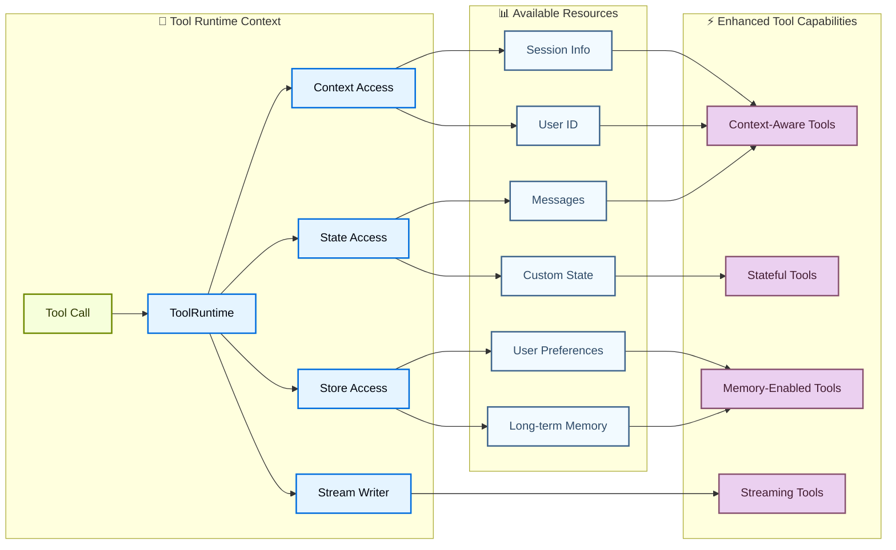

# Buffer 2 — Tools & Structured Output (raw extraction)

Source files:
- `langchain-docs/python/langchain/08-tools.md`
- `langchain-docs/python/langchain/12-structured-output.md`

---

# TOPIC 1: TOOLS

## 1. Purpose

Tools extend what **agents** can do — letting them fetch real-time data, execute code, query external databases, and take actions in the world. Under the hood, tools are **callable functions with well-defined inputs and outputs that get passed to a chat model**. The model decides *when* to invoke a tool based on conversation context and *what input arguments* to provide.

Without tools, an LLM is sealed off from the world: it can only produce text from its training data, cannot read live data, cannot call APIs, cannot persist anything, and cannot take side-effecting actions. Tools are the mechanism that turns a pure text model into an agent that acts. The pain they remove: hand-writing prompt-parsing glue to detect "the model wants to do X," manually validating arguments, hand-rolling a loop that feeds results back to the model, and re-implementing access to conversation state / memory / per-run config inside each function.

## 2. Building blocks (exhaustive named inventory)

**Creation / definition**
- `@tool` decorator — from `langchain.tools` (`from langchain.tools import tool`). Simplest way to create a tool. The function's **docstring becomes the tool description**. **Type hints are REQUIRED** — they define the tool's input schema.
- `@tool("web_search")` — positional string arg overrides the tool **name** (default name = function name). `search.name` reflects it.
- `@tool("calculator", description="...")` — `description=` kwarg overrides the auto-generated description.
- `@tool(args_schema=WeatherInput)` — `args_schema` accepts a **Pydantic `BaseModel`** *or* a **JSON Schema dict** to define complex inputs.
- `@tool(return_direct=True)` — short-circuits the agent loop (see Advanced).
- `tool(name=..., description=..., args_schema=...)` called WITHOUT an implementation body → returns a **`HeadlessTool`** (schema-only; no in-process body). Python has **no `.implement()` API** (that's JS-side only).
- Pydantic constructs used in schemas: `BaseModel`, `Field(description=..., default=..., ge=, le=)`, `Literal[...]`, `typing.Optional`/`int | None`.

**Naming guidance**
- Prefer `snake_case` tool names (e.g. `web_search` not `Web Search`). Some providers reject names with spaces/special chars. Stick to alphanumeric + underscore + hyphen for cross-provider compatibility.

**Reserved argument names** (using them as tool args causes runtime errors):
| Param | Purpose |
| `config` | Reserved for passing `RunnableConfig` to tools internally |
| `runtime` | Reserved for `ToolRuntime` (state, context, store) |

**Runtime access — `ToolRuntime`** (from `langchain.tools import ToolRuntime`)
- Add `runtime: ToolRuntime` to a tool signature → **auto-injected and HIDDEN from the LLM** (does not appear in tool schema). This is the modern unified replacement for the older injection patterns.
- Generic form: `ToolRuntime[ContextT]` or `ToolRuntime[ContextT, StateT]` (e.g. `ToolRuntime[UserContext]`, `ToolRuntime[None, CustomState]`).
- `runtime.state` — short-term memory (mutable, current conversation). `runtime.state["messages"]`, `runtime.state.get("custom_field", default)`.
- `runtime.context` — immutable per-run config passed at invocation time (e.g. `runtime.context.user_id`). Defined via a `@dataclass` and wired through `context_schema=` on `create_agent`.
- `runtime.store` — long-term memory (`BaseStore`); persists across conversations. Namespace/key pattern: `store.get(("users",), user_id)` → returns item with `.value`; `store.put(("users",), user_id, user_info)`.
- `runtime.stream_writer` — emit real-time custom updates during execution: `writer = runtime.stream_writer; writer("...")`. Must run inside a LangGraph execution context.
- `runtime.execution_info` — `.thread_id`, `.run_id`, `.node_attempt` (retry attempt). Requires `deepagents>=0.5.0` or `langgraph>=1.1.5`.
- `runtime.server_info` — when on LangGraph Server: `.assistant_id`, `.graph_id`, `.user.identity`. `None` outside LangGraph Server (local dev/testing). Requires `deepagents>=0.5.0` / `langgraph>=1.1.5`.
- `runtime.tool_call_id` — unique id for current tool invocation; used as `tool_call_id` when building a `ToolMessage` inside the tool.
- `runtime.config` — the `RunnableConfig` (callbacks, tags, metadata).

**Older / legacy injection patterns (now superseded by `ToolRuntime`)**
- `InjectedState`, `InjectedStore`, `get_runtime()`, `InjectedToolCallId` (from `langchain.tools`). E.g. `def summarize(state: InjectedState)`. Docs explicitly recommend migrating these to `ToolRuntime`. See "Migrate from older injection patterns" + LangChain v1 migration guide.

**Return values**
- Return `str` → human-readable; converted to a `ToolMessage`.
- Return `object` (e.g. `dict`) → structured data; serialized and sent back as tool output for the model to inspect.
- Return `Command` (from `langgraph.types import Command`) → writes to graph **state** via `update={...}`; optionally include a `ToolMessage` in the update.

**State update primitives**
- `Command(update={...})` — keys are state fields; include `"messages": [ToolMessage(content=..., tool_call_id=runtime.tool_call_id)]` so the model sees the result.
- `ToolMessage` — from `langchain.messages import ToolMessage`. `content=`, `tool_call_id=`.
- `AgentState` (from `langchain.agents`) — base class for custom typed state (`class CustomState(AgentState): user_name: str`).
- **reducers** — recommended for any state field that parallel tool calls may update concurrently, to resolve write conflicts.

**Execution machinery**
- `create_agent` (from `langchain.agents`) — the harness that runs tools for agents. `tools=[...]`, `context_schema=`, `store=`, `system_prompt=`, `middleware=[...]`, `response_format=`.
- `ToolNode` (`langgraph.prebuilt.tool_node.ToolNode`) — executes tools in **LangGraph workflows** (non-agent graphs).
- `ToolCallRequest` (from `langchain.tools.tool_node`) — request object passed to tool-call middleware. `request.tool_call["id"]`, `request.tool_call["name"]`, `request.override(tool=...)`.

**Error handling**
- Configured through **middleware**, NOT a per-tool param.
- `@wrap_tool_call` decorator (from `langchain.agents.middleware`) wraps a `(request: ToolCallRequest, handler) -> ToolMessage` function. (The function is conventionally named `handle_tool_errors` in the docs.)
- Registered via `middleware=[handle_tool_errors]` on `create_agent`.

**Dynamic tool selection middleware**
- `@wrap_model_call` (from `langchain.agents.middleware`) — filter/add tools per model call. Signature `(request: ModelRequest, handler: Callable[[ModelRequest], ModelResponse]) -> ModelResponse`.
- `ModelRequest`, `ModelResponse` (from `langchain.agents.middleware`). `request.tools`, `request.state`, `request.runtime.context`, `request.runtime.store`, `request.override(tools=...)`.
- `AgentMiddleware` (from `langchain.agents.middleware`) — base class with both `wrap_model_call` and `wrap_tool_call` methods for runtime-registered tools.

**Headless tools**: `HeadlessTool`, interrupt payload shape `{"type": "tool", "tool_call": {"id", "name", "args"}}`, resume handshake, JS-side `.implement(...)`, optional `onTool` callback (`start`/`success`/`error`). Frontend uses `useStream`.

**Prebuilt / server-side**: prebuilt tools & toolkits (web search, code interpreters, DB access); **server-side tool use** = provider-executed built-in tools (web search, code interpreter) — no local hosting.

## 3. Annotated code (verbatim, most important blocks)

### 3.1 Basic `@tool` definition

```python
from langchain.tools import tool

@tool
def search_database(query: str, limit: int = 10) -> str:
    """Search the customer database for records matching the query.

    Args:
        query: Search terms to look for
        limit: Maximum number of results to return
    """
    return f"Found {limit} results for '{query}'"
```
**What/why:** The canonical tool. `@tool` converts the function into a LangChain tool object. The **docstring becomes the model-facing description**, and the **type hints (`query: str`, `limit: int = 10`) become the input schema** the model must satisfy. Defaults make `limit` optional. This is the lowest-friction way to give a model a new capability — no schema class needed for simple cases.

### 3.2 Pydantic `args_schema` for complex input

```python
from pydantic import BaseModel, Field
from typing import Literal

class WeatherInput(BaseModel):
    """Input for weather queries."""
    location: str = Field(description="City name or coordinates")
    units: Literal["celsius", "fahrenheit"] = Field(
        default="celsius",
        description="Temperature unit preference"
    )
    include_forecast: bool = Field(
        default=False,
        description="Include 5-day forecast"
    )

@tool(args_schema=WeatherInput)
def get_weather(location: str, units: str = "celsius", include_forecast: bool = False) -> str:
    """Get current weather and optional forecast."""
    temp = 22 if units == "celsius" else 72
    result = f"Current weather in {location}: {temp} degrees {units[0].upper()}"
    if include_forecast:
        result += "\nNext 5 days: Sunny"
    return result
```
**What/why:** When inputs need rich validation/enums/descriptions per field, define a Pydantic model and pass it as `args_schema`. `Field(description=...)` gives the model per-argument guidance; `Literal[...]` constrains `units` to valid enum values; defaults make fields optional. The model sees a precise JSON schema, reducing malformed tool calls. (An equivalent JSON-Schema-dict form is also supported by `args_schema`.)

### 3.3 Read conversation state via `ToolRuntime`

```python
from langchain.tools import tool, ToolRuntime
from langchain.messages import HumanMessage

@tool
def get_last_user_message(runtime: ToolRuntime) -> str:
    """Get the most recent message from the user."""
    messages = runtime.state["messages"]

    # Find the last human message
    for message in reversed(messages):
        if isinstance(message, HumanMessage):
            return message.content

    return "No user messages found"
```
**What/why:** Adding `runtime: ToolRuntime` injects the live execution context. `runtime.state["messages"]` exposes the full conversation history so the tool can reason over prior turns. Critically, **`runtime` is hidden from the model** — it never appears in the tool's schema, so the LLM only sees the "real" args. This is the modern, unified replacement for the legacy `InjectedState` pattern.

### 3.4 Update state by returning a `Command`

```python
from langchain.agents import AgentState
from langchain.messages import ToolMessage
from langchain.tools import ToolRuntime, tool
from langgraph.types import Command


class CustomState(AgentState):
    user_name: str


@tool
def set_user_name(new_name: str, runtime: ToolRuntime[None, CustomState]) -> Command:
    """Set the user's name in the conversation state."""
    return Command(
        update={
            "user_name": new_name,
            "messages": [
                ToolMessage(
                    content=f"User name set to {new_name}.",
                    tool_call_id=runtime.tool_call_id,
                )
            ],
        }
    )
```
**What/why:** Tools aren't limited to returning text — they can **mutate agent state**. Returning `Command(update={...})` writes `user_name` into a custom `AgentState` subclass and simultaneously appends a `ToolMessage` (built with `runtime.tool_call_id`) so the model can see the action succeeded. `ToolRuntime[None, CustomState]` types the runtime to that state schema. Because LLMs can call tools in parallel, the docs recommend **reducers** on fields that concurrent calls might update.

### 3.5 Tool error handling via middleware (`@wrap_tool_call`)

```python
from collections.abc import Callable

from langchain.agents import create_agent
from langchain.agents.middleware import wrap_tool_call
from langchain.messages import ToolMessage
from langchain.tools.tool_node import ToolCallRequest


@wrap_tool_call
def handle_tool_errors(
    request: ToolCallRequest,
    handler: Callable[[ToolCallRequest], ToolMessage],
) -> ToolMessage:
    """Convert tool exceptions into ToolMessages the model can handle."""
    try:
        return handler(request)
    except Exception as e:
        return ToolMessage(
            content=f"Tool error: Please check your input and try again. ({e})",
            tool_call_id=request.tool_call["id"],
        )


agent = create_agent(
    model="anthropic:claude-sonnet-4-6",
    tools=[],
    middleware=[handle_tool_errors],
)
```
**What/why:** Tool errors are handled at the **harness/middleware layer**, not per-tool. `@wrap_tool_call` intercepts each tool invocation; calling `handler(request)` runs the tool, and any exception is converted into a `ToolMessage` (correlated via `request.tool_call["id"]`) that is fed back to the model so it can recover/retry instead of crashing the run. Registered through `middleware=[...]` on `create_agent`. (Model id shown is the Anthropic variant from the source CodeGroup.)

### 3.6 Return directly (short-circuit the loop)

```python
from langchain.agents import create_agent
from langchain.tools import tool
from langchain_openai import ChatOpenAI


@tool(return_direct=True)
def fetch_order_status(order_id: str) -> str:
    """Fetch the current status of a customer order."""
    # In production, query your order management system here
    return f"Order {order_id} is shipped and will arrive in 2 days."


agent = create_agent(
    ChatOpenAI(model="anthropic:claude-sonnet-4-6"),
    tools=[fetch_order_status],
)
```
**What/why:** `return_direct=True` makes the agent return the tool's output **immediately** as the final answer, skipping the extra model call that would normally summarize/act on it. Use for deterministic, user-ready outputs. Caveat: if multiple tools are called in one turn, `return_direct` only triggers when **all** called tools have `return_direct=True`.

## 4. Advanced concepts

**Return-value strategies (string vs object vs Command):**
- *string* → wrapped in `ToolMessage`; model reads it and decides next step; no state change.
- *object/dict* → serialized; model can reason over explicit fields; no direct state change.
- *`Command`* → updates graph state via `update`; updated state available to subsequent steps in the same run; use reducers for parallel-call conflicts.

**`return_direct=True` semantics:** tool runs normally, output wrapped in `ToolMessage`, agent stops looping and returns it verbatim — model cannot rephrase/summarize/chain. Not suitable when results need further reasoning. With multiple tool calls, all must be `return_direct` for it to apply.

**Injecting runtime/state/store/context into tools:** all via the single `ToolRuntime` param. State = short-term mutable; Context = immutable per-run (wired via `context_schema=` + passed as `context=` on `invoke`); Store = long-term persistent (`BaseStore`, namespace/key; use `PostgresStore` in prod, `InMemoryStore` for dev). Stream writer for progress; execution_info for thread/run/retry; server_info on LangGraph Server. The param is invisible to the model.

**`context` vs `thread_id`:** `thread_id` (via `config={"configurable": {"thread_id": ...}}`) scopes the *conversation* (message history + checkpoints). `context` carries *per-run* data tools/middleware read at invocation time. Production typically passes BOTH: a stable `thread_id` per conversation + a fresh `context` object per invoke.

**Error handling strategies:** middleware-based (`@wrap_tool_call`) — catch exceptions, convert to `ToolMessage` so the model can self-correct; can implement retries/custom messages. Distinct from structured-output `handle_errors` (see Topic 2).

**Dynamic tool selection — two approaches:**
1. *Filtering pre-registered tools* (all tools known at startup): use `@wrap_model_call` to filter `request.tools` based on State (e.g. only enable sensitive tools after `authenticated`), Store (per-user feature flags), or Runtime Context (user role: admin/editor/viewer). Apply with `request.override(tools=filtered)`.
2. *Runtime tool registration* (tools discovered at runtime — e.g. from an MCP server, generated from user data, fetched from a registry): requires BOTH hooks on an `AgentMiddleware` subclass — `wrap_model_call` to ADD the tool to the request (`request.override(tools=[*request.tools, calculate_tip])`), and `wrap_tool_call` to EXECUTE it (`if request.tool_call["name"] == "calculate_tip": return handler(request.override(tool=calculate_tip))`). Without `wrap_tool_call` the agent doesn't know how to run the dynamically added tool.

Tradeoff/motivation: too many tools overload context and increase errors; too few limit capability. Dynamic selection adapts the toolset to auth state, permissions, feature flags, or conversation stage.

**Headless tools:** schema-only tools registered on the *server* but executed on the *client* (typically browser) after an interrupt/resume handshake. Use when work depends on the client environment/device/UI (Geolocation, IndexedDB, Clipboard, Canvas 2D, file pickers, Battery API), for privacy/locality, lower latency, or many small typed effects instead of `eval`. Flow: define schema-only tool → register with `create_agent`/graph → run interrupts with payload `{"type": "tool", "tool_call": {"id","name","args"}}` → app/human/another service performs the action → resume graph with the result. JS SDK hooks can auto-detect, run the client impl, and submit the resume. Distinct from server-side tool use (provider executes built-ins remotely).

**Server-side tool use:** built-in tools (web search, code interpreter) executed by the model provider — no local definition/hosting.

## 5. Cross-framework interaction points

- **Tools ↔ `create_agent` harness:** tools are registered via `tools=[...]`; the agent loop decides when to call them, wraps results as `ToolMessage`, and re-invokes the model. `return_direct=True` short-circuits this loop.
- **Tools ↔ LangGraph state (`Command` / state injection):** returning `Command(update=...)` writes to graph state; `ToolRuntime.state` reads it; custom state via `AgentState` subclass; reducers resolve parallel-call write conflicts.
- **Tools ↔ LangGraph execution (`ToolNode`):** in non-agent LangGraph workflows, `ToolNode` (langgraph.prebuilt) executes tools instead of `create_agent`.
- **Tools ↔ middleware:** error handling (`@wrap_tool_call`), dynamic selection/registration (`@wrap_model_call`, `AgentMiddleware`) all live in `langchain.agents.middleware`.
- **Tools ↔ MCP:** MCP servers are an explicit source of runtime-discovered tools handled by the runtime-registration pattern (`wrap_model_call` + `wrap_tool_call`).
- **Tools ↔ long-term memory / Store:** `ToolRuntime.store` (`BaseStore`; `InMemoryStore`/`PostgresStore`) persists across conversations; wired via `store=` on `create_agent`.
- **Tools ↔ models / providers:** tool names should be `snake_case` for provider compatibility; type hints/`args_schema` produce the schema the provider's tool-calling API consumes; some providers offer server-side built-in tools.
- **Tools ↔ human-in-the-loop:** headless tools interrupt and resume — a human (or another service) can perform the action during the pause before the graph resumes.
- **Tools ↔ streaming:** `runtime.stream_writer` emits custom progress events into LangGraph's streaming output (requires a LangGraph execution context).
- **Tools ↔ LangSmith:** tool calls are traced/debuggable in LangSmith; LangSmith Engine monitors traces and proposes fixes.

## 6. Gotchas / version notes

- **Type hints are mandatory** for `@tool` — they ARE the input schema.
- `config` and `runtime` are **reserved arg names** — using them as your own tool args raises runtime errors. Use `ToolRuntime` to access runtime info.
- `runtime`/`ToolRuntime` params are **hidden from the model** — they never appear in the schema.
- `runtime.stream_writer` requires a **LangGraph execution context** to work.
- `runtime.execution_info` and `runtime.server_info` require **`deepagents>=0.5.0` (or `langgraph>=1.1.5`)**.
- `runtime.server_info` is **`None`** outside LangGraph Server (local dev/testing).
- Prefer `snake_case` tool names — spaces/special chars are rejected by some providers.
- `return_direct=True` only short-circuits if **all** tools called in a turn have it set.
- When tools update the same state field in parallel, you **must define a reducer** or risk lost/conflicting writes.
- Tool error handling moved to **middleware** (`@wrap_tool_call`) — there is no per-tool error param in this API.
- Legacy `InjectedState`/`InjectedStore`/`get_runtime()`/`InjectedToolCallId` still exist but are **superseded by `ToolRuntime`**; migrate per the v1 migration guide.
- Python `tool(name=, description=, args_schema=)` with no body returns a `HeadlessTool`; **`.implement()` does not exist in Python** (JS-only).

---

# TOPIC 2: STRUCTURED OUTPUT

## 1. Purpose

Structured output lets agents return data in a **specific, predictable format** — JSON objects, Pydantic models, or dataclasses — instead of free-form natural language. Your application can consume the result directly without writing brittle text parsers.

Without it: you'd prompt the model "return JSON like {...}", then regex/parse the reply, handle the model wrapping JSON in prose, handle missing/extra fields, handle wrong types (e.g. a rating of 10 when the max is 5), and hand-roll retry loops when parsing fails. Structured output makes the schema first-class: `create_agent` captures the generated data, **validates** it, retries on failure, and returns it in the **`structured_response`** key of agent state.

## 2. Building blocks (exhaustive named inventory)

**Entry point**
- `create_agent(..., response_format=...)` — declares the desired output schema. Result lands in `result["structured_response"]`.
- `response_format` type signature:
  ```python
  response_format: Union[
      ToolStrategy[StructuredResponseT],
      ProviderStrategy[StructuredResponseT],
      type[StructuredResponseT],
      None,
  ]
  ```
  - `ToolStrategy[...]` → uses **tool calling** for structured output.
  - `ProviderStrategy[...]` → uses **provider-native** structured output.
  - `type[...]` (bare schema) → auto-selects the best strategy by model capability.
  - `None` → not requested.

**Auto-selection rule** (when a bare schema type is passed):
- `ProviderStrategy` if the model+provider supports native structured output (e.g. OpenAI, Anthropic/Claude, xAI/Grok, Gemini).
- `ToolStrategy` otherwise.
- Native-support detection reads the model's **profile data** (`structured_output: True`) if `langchain>=1.1`. Can override via `init_chat_model("...", profile=custom_profile)`.
- If tools are specified, the model must support **simultaneous tools + structured output**.

**`ProviderStrategy`** (from `langchain.agents.structured_output` — imported in ToolStrategy examples; ProviderStrategy used directly too)
```python
class ProviderStrategy(Generic[SchemaT]):
    schema: type[SchemaT]
    strict: bool | None = None
```
- `schema` (required) — supports **Pydantic `BaseModel`** (returns validated instance), **dataclass** (returns dict), **TypedDict** (returns dict), **JSON Schema dict** (returns dict).
- `strict` — optional bool for strict schema adherence (OpenAI, xAI). Default `None` (disabled). **Requires `langchain>=1.2`.**

**`ToolStrategy`** (`from langchain.agents.structured_output import ToolStrategy`)
```python
class ToolStrategy(Generic[SchemaT]):
    schema: type[SchemaT]
    tool_message_content: str | None
    handle_errors: Union[
        bool,
        str,
        type[Exception],
        tuple[type[Exception], ...],
        Callable[[Exception], str],
    ]
```
- `schema` (required) — same four schema kinds as ProviderStrategy, **plus Union types** (`Union[A, B]`): model picks the most appropriate schema by context.
- `tool_message_content` — custom text for the `ToolMessage` written when structured output is produced. Default ≈ `"Returning structured response: {...}"`.
- `handle_errors` — error/retry policy (default `True`). Values:
  - `True` → catch all errors, default error template, retry.
  - `str` → catch all errors, always retry with this fixed message.
  - `type[Exception]` → retry (default msg) only for that exception type; raise others.
  - `tuple[type[Exception], ...]` → retry only for those types; raise others.
  - `Callable[[Exception], str]` → custom function returning the retry message.
  - `False` → no retry; all exceptions propagate.

**Result key & types**
- `result["structured_response"]` — holds the parsed output. Pydantic schema → validated `BaseModel` instance; dataclass/TypedDict/JSON-schema → `dict`.

**Schema-building primitives**
- Pydantic: `BaseModel`, `Field(description=..., ge=, le=)`, `Literal[...]`, `int | None`.
- `dataclass` (from `dataclasses`), `TypedDict` (from `typing_extensions`), raw JSON Schema dicts.

**Error / exception types** (from `langchain.agents.structured_output`)
- `StructuredOutputValidationError` — schema validation failed.
- `MultipleStructuredOutputsError` — model returned more than one structured-output tool call.

**Model profiles**
- `init_chat_model("...", profile=custom_profile)` with `{"structured_output": True, ...}` to declare/override native capability.

## 3. Annotated code (verbatim, most important blocks)

### 3.1 Provider strategy via bare Pydantic schema (auto-select)

```python
from pydantic import BaseModel, Field
from langchain.agents import create_agent


class ContactInfo(BaseModel):
    """Contact information for a person."""
    name: str = Field(description="The name of the person")
    email: str = Field(description="The email address of the person")
    phone: str = Field(description="The phone number of the person")

agent = create_agent(
    model="gpt-5.4",
    response_format=ContactInfo  # Auto-selects ProviderStrategy
)

result = agent.invoke({
    "messages": [{"role": "user", "content": "Extract contact info from: John Doe, john@example.com, (555) 123-4567"}]
})

print(result["structured_response"])
# ContactInfo(name='John Doe', email='john@example.com', phone='(555) 123-4567')
```
**What/why:** Passing a **bare Pydantic class** as `response_format` is the simplest path. Because the model supports native structured output, LangChain auto-selects `ProviderStrategy`. The provider enforces the schema, the result is **validated**, and it comes back as a real `ContactInfo` instance in `result["structured_response"]`. `Field(description=...)` guides the model per field. Functionally equivalent to `response_format=ProviderStrategy(ContactInfo)`.

### 3.2 Explicit `ProviderStrategy` with a JSON Schema dict

```python
from langchain.agents import create_agent


contact_info_schema = {
    "type": "object",
    "description": "Contact information for a person.",
    "properties": {
        "name": {"type": "string", "description": "The name of the person"},
        "email": {"type": "string", "description": "The email address of the person"},
        "phone": {"type": "string", "description": "The phone number of the person"}
    },
    "required": ["name", "email", "phone"]
}

agent = create_agent(
    model="gpt-5.4",
    tools=tools,
    response_format=ProviderStrategy(contact_info_schema)
)

result = agent.invoke({
    "messages": [{"role": "user", "content": "Extract contact info from: John Doe, john@example.com, (555) 123-4567"}]
})

result["structured_response"]
# {'name': 'John Doe', 'email': 'john@example.com', 'phone': '(555) 123-4567'}
```
**What/why:** When you don't have/want a Python class, pass a raw **JSON Schema dict** wrapped in `ProviderStrategy`. The provider validates natively; because the schema is a dict (not Pydantic), the result comes back as a **dict** rather than a typed instance. Shows that ProviderStrategy coexists with `tools=`.

### 3.3 `ToolStrategy` with a Pydantic schema (fallback for non-native models)

```python
from pydantic import BaseModel, Field
from typing import Literal
from langchain.agents import create_agent
from langchain.agents.structured_output import ToolStrategy


class ProductReview(BaseModel):
    """Analysis of a product review."""
    rating: int | None = Field(description="The rating of the product", ge=1, le=5)
    sentiment: Literal["positive", "negative"] = Field(description="The sentiment of the review")
    key_points: list[str] = Field(description="The key points of the review. Lowercase, 1-3 words each.")

agent = create_agent(
    model="gpt-5.4",
    tools=tools,
    response_format=ToolStrategy(ProductReview)
)

result = agent.invoke({
    "messages": [{"role": "user", "content": "Analyze this review: 'Great product: 5 out of 5 stars. Fast shipping, but expensive'"}]
})
result["structured_response"]
# ProductReview(rating=5, sentiment='positive', key_points=['fast shipping', 'expensive'])
```
**What/why:** `ToolStrategy` forces the **tool-calling** mechanism — works with any model that supports tool calling (most modern models), even without provider-native structured output. The model "calls" a synthetic tool whose args match the schema; LangChain validates against `ProductReview` (`ge=1, le=5` bounds, `Literal` enum) and returns a validated instance. Pydantic schema → typed instance in `structured_response`.

### 3.4 `ToolStrategy` over a Union (model chooses the schema)

```python
from pydantic import BaseModel, Field
from typing import Literal, Union
from langchain.agents import create_agent
from langchain.agents.structured_output import ToolStrategy


class ProductReview(BaseModel):
    """Analysis of a product review."""
    rating: int | None = Field(description="The rating of the product", ge=1, le=5)
    sentiment: Literal["positive", "negative"] = Field(description="The sentiment of the review")
    key_points: list[str] = Field(description="The key points of the review. Lowercase, 1-3 words each.")

class CustomerComplaint(BaseModel):
    """A customer complaint about a product or service."""
    issue_type: Literal["product", "service", "shipping", "billing"] = Field(description="The type of issue")
    severity: Literal["low", "medium", "high"] = Field(description="The severity of the complaint")
    description: str = Field(description="Brief description of the complaint")

agent = create_agent(
    model="gpt-5.4",
    tools=tools,
    response_format=ToolStrategy(Union[ProductReview, CustomerComplaint])
)

result = agent.invoke({
    "messages": [{"role": "user", "content": "Analyze this review: 'Great product: 5 out of 5 stars. Fast shipping, but expensive'"}]
})
result["structured_response"]
# ProductReview(rating=5, sentiment='positive', key_points=['fast shipping', 'expensive'])
```
**What/why:** `Union[...]` is **only supported by `ToolStrategy`** (not ProviderStrategy's `schema`). The model is offered multiple candidate schemas and **picks the most appropriate** for the input — here it correctly chooses `ProductReview` over `CustomerComplaint`. Useful for routing/classification where the output shape itself depends on content.

### 3.5 Custom error handler function for `handle_errors`

```python
from langchain.agents.structured_output import StructuredOutputValidationError
from langchain.agents.structured_output import MultipleStructuredOutputsError

def custom_error_handler(error: Exception) -> str:
    if isinstance(error, StructuredOutputValidationError):
        return "There was an issue with the format. Try again."
    elif isinstance(error, MultipleStructuredOutputsError):
        return "Multiple structured outputs were returned. Pick the most relevant one."
    else:
        return f"Error: {str(error)}"


agent = create_agent(
    model="gpt-5.4",
    tools=[],
    response_format=ToolStrategy(
                        schema=Union[ContactInfo, EventDetails],
                        handle_errors=custom_error_handler
                    )  # Default: handle_errors=True
)
```
**What/why:** `handle_errors` accepts a callable `(Exception) -> str`. LangChain catches the two structured-output exception types — `StructuredOutputValidationError` (schema/type mismatch, e.g. a rating of 10 vs `le=5`) and `MultipleStructuredOutputsError` (model called more than one output tool) — plus any other exception, and feeds the returned string back to the model as a `ToolMessage` so it retries. This is the most granular retry-message control short of `handle_errors=False` (propagate everything).

## 4. Advanced concepts

**Tool-calling vs provider-native — when each is used and tradeoffs:**
- `ProviderStrategy` (provider-native): the model provider enforces the schema directly via its API. **Most reliable**, strict validation. Use when the model supports it (OpenAI, Anthropic, xAI/Grok, Gemini). `strict=True` (langchain≥1.2; OpenAI/xAI) tightens adherence.
- `ToolStrategy` (tool-calling): emulates structured output by exposing the schema as a tool the model must "call." Works with **any tool-calling model** — the universal fallback. Slightly less reliable (model can return wrong types / multiple outputs), which is exactly why it ships with retry handling and Union support. Auto-selection prefers Provider when available, else Tool. If a bare schema is given but native isn't supported, the agent **falls back to ToolStrategy automatically**.

**Validation & the `structured_response` key:** generated data is captured, validated, and placed in `result["structured_response"]`. Pydantic → validated instance; dataclass/TypedDict/JSON-schema → dict (across BOTH strategies).

**Retry / error handling (ToolStrategy only):**
- *Multiple-outputs error:* model calls two output tools → each gets a `ToolMessage` "Error: Model incorrectly returned multiple structured responses (...) when only one is expected. Please fix your mistakes." → model retries with a single call.
- *Schema-validation error:* e.g. `rating=10` with `le=5` → `ToolMessage` "Error: Failed to parse structured output ... Input should be less than or equal to 5 ... Please fix your mistakes." → model retries with valid value.
- Policies via `handle_errors`: `True` (default template), `str` (fixed custom message, always retry), exception type / tuple (retry only those, raise others), callable (custom per-error message), `False` (no retry, raise all).
- `tool_message_content` customizes the SUCCESS `ToolMessage` text (vs the default `"Returning structured response: {...}"`).

**Model profiles & capability detection:** with `langchain>=1.1`, native support is read from the model profile (`structured_output: True`). Override with `init_chat_model(..., profile={"structured_output": True, ...})` when profile data is missing/wrong.

**Tools + structured output together:** allowed, but the model must support **simultaneous** tool use and structured output. (Examples pass both `tools=...` and `response_format=...`.)

**Schema-kind → return-type matrix (both strategies):** Pydantic `BaseModel` → validated instance; dataclass → dict; TypedDict → dict; JSON Schema dict → dict. (Union → ToolStrategy only, returns the matched member's type.)

**Streaming structured output:** *Not covered in these two source files.* No `.parsed` API or streaming-of-structured-output example appears here (the agent-level API surfaces the result via `result["structured_response"]`, and `.parsed`/streaming would be in the Models docs, which are referenced but out of scope for this buffer). Flagging the absence so synthesis doesn't fabricate it.

## 5. Cross-framework interaction points

- **Structured output ↔ `create_agent` harness:** declared via `response_format=`; the harness captures, validates, retries, and returns the result in `result["structured_response"]`.
- **Structured output ↔ models / providers:** strategy auto-selection depends on provider native support (OpenAI/Anthropic/xAI/Gemini → ProviderStrategy; others → ToolStrategy). `ProviderStrategy.strict` is provider-gated (OpenAI/xAI).
- **Structured output ↔ model profiles:** native-capability detection reads the model **profile** (`structured_output`) in `langchain>=1.1`; overridable via `init_chat_model(profile=...)`.
- **Structured output ↔ tools / tool-calling:** `ToolStrategy` reuses the **tool-calling** machinery (a synthetic schema-tool); coexists with real `tools=...`; surfaces a `ToolMessage` on success/error — the same `ToolMessage` type tools use.
- **Structured output ↔ Models page (direct on model):** doing structured output directly on a model (outside agents) is a separate API (`/models#structured-output`) — referenced, out of scope here.
- **Structured output ↔ LangGraph state:** the validated result is written into agent **state** under `structured_response`.

## 6. Gotchas / version notes

- `ProviderStrategy.strict` requires **`langchain>=1.2`**; defaults to `None` (disabled). Only some providers honor it (OpenAI, xAI).
- Native-support auto-detection via model profile requires **`langchain>=1.1`**; otherwise specify the strategy manually or set a custom profile.
- **Return type depends on schema kind, NOT strategy:** Pydantic → validated instance; dataclass/TypedDict/JSON Schema → plain dict. Don't assume you always get a typed object.
- **`Union[...]` schemas are ToolStrategy-only** — `ProviderStrategy.schema` does not list Union among supported kinds.
- If a bare schema is passed but the provider lacks native support, the agent **silently falls back to ToolStrategy**.
- `response_format=Schema` is functionally equivalent to `response_format=ProviderStrategy(Schema)` *only when* the provider natively supports structured output for that model; otherwise both fall back to tool calling.
- With `tools` + structured output, the model must support **both simultaneously** — not all do.
- `handle_errors` only applies to **ToolStrategy** (it's where validation/multiple-output errors arise). `handle_errors=False` lets `StructuredOutputValidationError` / `MultipleStructuredOutputsError` propagate.
- The model can genuinely violate the schema (e.g. rating=10 vs `le=5`); rely on the retry loop or `strict` rather than assuming first-try validity.
- Streaming of structured output and `.parsed` are **not documented in these files** — do not invent them in synthesis.

---

## Reusable diagrams

### Verbatim from source (08-tools.md) — Tool Runtime Context



### Suggested — the tool-calling loop (synthesized; not in source)

```mermaid
flowchart TD
    U[User message] --> M[Chat model in create_agent]
    M -->|no tool call| F[Final response]
    M -->|tool call(s)| TR[ToolRuntime injected]
    TR --> EX[Execute tool]
    EX -->|str / object| TM[ToolMessage appended to state]
    EX -->|Command update=...| ST[Graph state updated + ToolMessage]
    EX -.exception.-> ERR[wrap_tool_call middleware -> error ToolMessage]
    TM --> RD{all tools return_direct?}
    ST --> RD
    ERR --> M
    RD -->|yes| F
    RD -->|no| M
```

### Suggested — structured-output strategy selection (synthesized; not in source)

```mermaid
flowchart TD
    RF[response_format set] --> K{kind?}
    K -->|ToolStrategy(...)| TS[Tool-calling: schema as synthetic tool]
    K -->|ProviderStrategy(...)| PS[Provider-native schema enforcement]
    K -->|bare schema type| AUTO{provider supports native?}
    AUTO -->|yes| PS
    AUTO -->|no| TS
    TS --> V[Validate against schema]
    PS --> V
    V -->|ok| OUT[result['structured_response']]
    V -->|ToolStrategy error| HE{handle_errors}
    HE -->|retry| TS
    HE -->|False| RAISE[raise exception]
```
