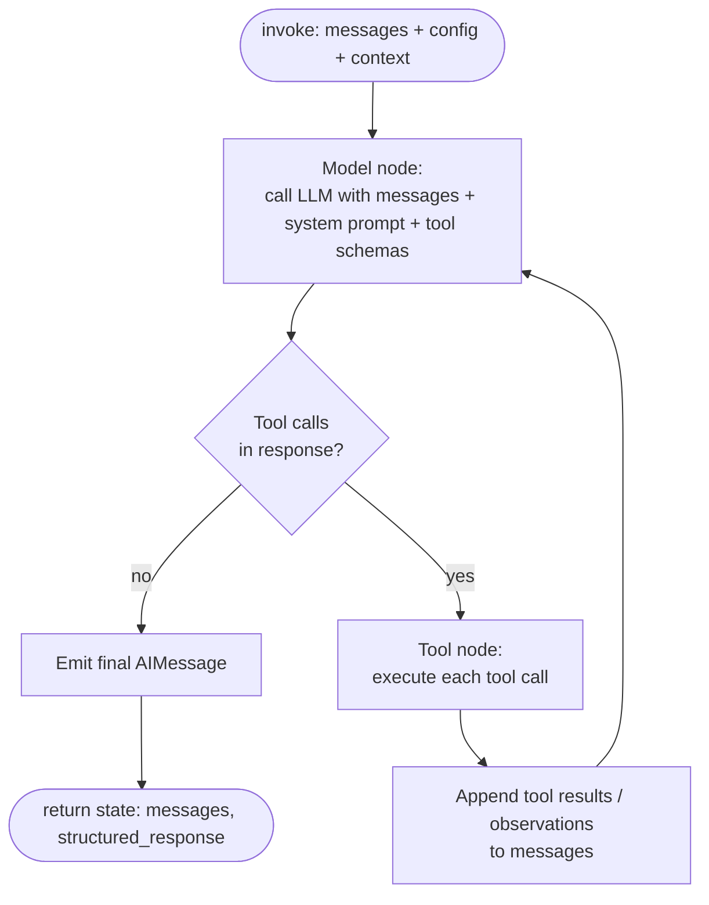
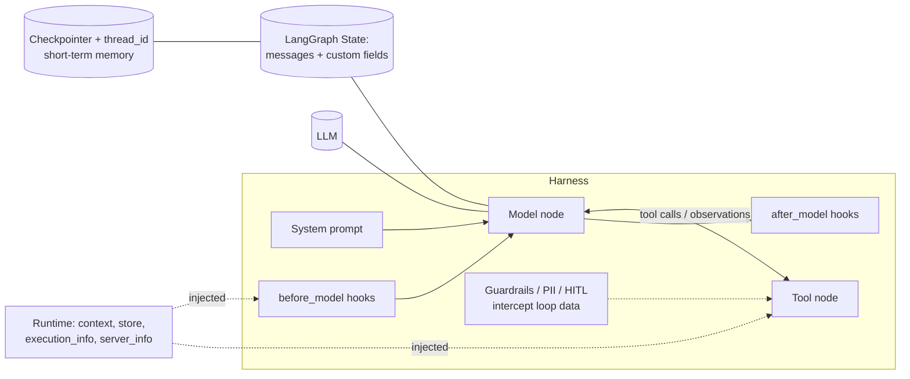
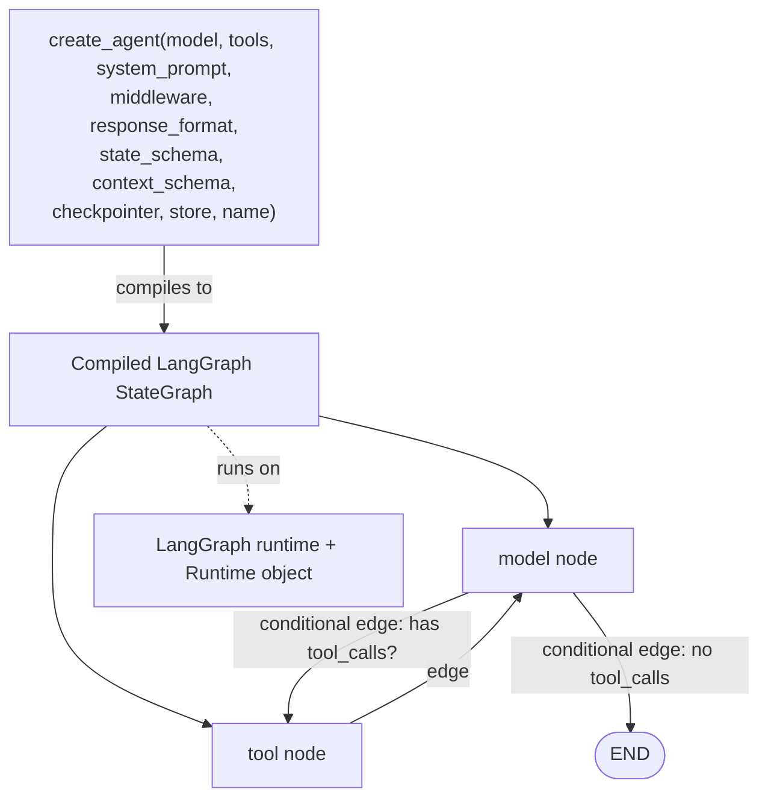

# Buffer 3 — Conceptual Core: Quickstart, Agents/create_agent, The Harness, Runtime, Deep Agents from scratch

> RAW extraction material for synthesis. Dense, faithful, complete. Real API names and code preserved verbatim where load-bearing.
> Source files:
> - `03-quickstart.md`
> - `05-agents.md` (titled "Agents" — this is the create_agent/harness page; same content appears in `24-harness.md`)
> - `24-harness.md` (IDENTICAL content to `05-agents.md` — both are the "Agents" page. Noted as duplicate.)
> - `13-runtime.md` (titled "Runtime")
> - `30-deep-agent-from-scratch.md` (titled "Build a data analysis agent from scratch")

**IMPORTANT FINDING:** `05-agents.md` and `24-harness.md` are byte-for-byte the SAME document (the "Agents" page, edit URL `src/oss/langchain/agents.mdx`). They both define `create_agent`, the harness thesis, core components, invocation, streaming, and the middleware-organized "Configure the harness" section. Treated as one topic below ("Agents / The Harness").

---

## TOPIC A — QUICKSTART (`03-quickstart.md`)

### 1. Purpose
Get a fully functional AI agent running "in minutes." Establishes the canonical first-agent shape and then escalates to a "real-world" research agent to introduce: detailed system prompts, custom tools, model configuration, conversational memory (checkpointer), Deep Agents, and testing. Crucially it CONTRASTS a plain `create_agent` agent against a `create_deep_agent` agent on the same task to motivate why Deep Agents exist (built-in planning, virtual filesystem, subagents, context management).

### 2. Building blocks (APIs named)
- `from langchain.agents import create_agent` — the LangChain agent factory.
- `from deepagents import create_deep_agent` — the Deep Agents factory.
- `from langchain.chat_models import init_chat_model` — model initialization with params (`temperature`, `timeout`, `max_tokens`, `streaming`, `model_provider`, `azure_deployment`).
- `from langchain.tools import tool` — the `@tool` decorator. Adds metadata; "their name, description, and argument names become part of the model's prompt"; enables runtime injection via the `ToolRuntime` parameter.
- `from langgraph.checkpoint.memory import InMemorySaver` — in-memory checkpointer for short-term memory (conversational state).
- Install: `uv add langchain deepagents` or `pip install -U langchain deepagents`.
- Model identifier strings: `"openai:gpt-5.4"`, `"google_genai:gemini-2.5-flash-lite"`, `"claude-sonnet-4-6"`, `"anthropic:claude-sonnet-4-6"`, `"openrouter:anthropic/claude-sonnet-4-6"`, etc. Also `model_provider=` form (e.g. `"bedrock_converse"`, `"huggingface"`, `"google-genai"`).
- Agent invocation: `agent.invoke({"messages": [{"role": "user", "content": ...}]}, config={"configurable": {"thread_id": ...}})`.
- Output access: `result["messages"][-1].content_blocks`.
- Deep agent's built-in tools referenced: `write_todos` (task planning), `grep`, `read_file` (virtual filesystem). Plus subagent spawning.

### 3. Annotated code (VERBATIM)

**A1 — The canonical minimal agent (the "hello world" of LangChain agents).** WHY: shows the three-argument core (`model`, `tools`, `system_prompt`) and the messages-in/messages-out contract.
```python
from langchain.agents import create_agent

def get_weather(city: str) -> str:
    """Get weather for a given city."""
    return f"It's always sunny in {city}!"

agent = create_agent(
    model="openai:gpt-5.4",
    tools=[get_weather],
    system_prompt="You are a helpful assistant",
)

result = agent.invoke(
    {"messages": [{"role": "user", "content": "What's the weather in San Francisco?"}]}
)
print(result["messages"][-1].content_blocks)
```
- A plain Python callable with a docstring is accepted directly as a tool. The docstring + signature become the tool schema the model sees.
- Input is a dict with a `messages` list; each message is a role/content dict. Output is the full state dict; `["messages"][-1]` is the final message, `.content_blocks` its structured content.
- The doc narrates the loop: "The agent understands that you are asking about the weather ... therefore calls the weather tool with the provided city name."

**A2 — A real tool with `@tool` decorator.** WHY: shows the decorator form, docstring-as-prompt, and error handling inside a tool.
```python
import urllib.error
import urllib.request

from langchain.tools import tool


@tool
def fetch_text_from_url(url: str) -> str:
    """Fetch the document from a URL.
    """
    req = urllib.request.Request(
        url,
        headers={"User-Agent": "Mozilla/5.0 (compatible; quickstart-research/1.0)"},
    )
    try:
        with urllib.request.urlopen(req, timeout=120) as resp:
            raw = resp.read()
    except urllib.error.URLError as e:
        return f"Fetch failed: {e}"
    text = raw.decode("utf-8", errors="replace")
    return text
```

**A3 — Model configuration with `init_chat_model`.** WHY: separating model construction from the agent lets you tune `temperature`, `timeout`, `max_tokens`, `streaming` once and pass the instance.
```python
from langchain.chat_models import init_chat_model

model = init_chat_model(
    "claude-sonnet-4-6",
    temperature=0.5,
    timeout=600,
    max_tokens=25000,
    streaming=True,
)
```

**A4 — Add memory via checkpointer.** WHY: enables conversational state across turns; doc warns to use a persistent (DB-backed) checkpointer in production.
```python
from langgraph.checkpoint.memory import InMemorySaver

checkpointer = InMemorySaver()
```

**A5 — THE CONTRAST: create_agent vs create_deep_agent on one task.** WHY: this is the pedagogical crux of the whole quickstart — same model, same tool, same prompt, same checkpointer; only the factory differs.
```python
from langchain.agents import create_agent
from deepagents import create_deep_agent

agent = create_agent(
    model=model,
    tools=[fetch_text_from_url],
    system_prompt=SYSTEM_PROMPT,
    checkpointer=checkpointer,
)

deep_agent = create_deep_agent(
    model=model,
    tools=[fetch_text_from_url],
    system_prompt=SYSTEM_PROMPT,
    checkpointer=checkpointer,
)

content = f"""Project Gutenberg hosts a full plain-text copy of F. Scott Fitzgerald's The Great Gatsby.
URL: https://www.gutenberg.org/files/64317/64317-0.txt
... (count lines containing `Gatsby`, first line with `Daisy`, two-sentence synopsis) ..."""

agent_result = agent.invoke(
    {"messages": [{"role": "user", "content": content}]},
    config={"configurable": {"thread_id": "great-gatsby-lc"}},
)
deep_agent_result = deep_agent.invoke(
    {"messages": [{"role": "user", "content": content}]},
    config={"configurable": {"thread_id": "great-gatsby-da"}},
)
print(agent_result["messages"][-1].content_blocks)
print("\n")
print(deep_agent_result["messages"][-1].content_blocks)
```
- Note: identical `create_agent`/`create_deep_agent` signatures — both take `model`, `tools`, `system_prompt`, `checkpointer`. Deep agent is a drop-in upgrade.
- Distinct `thread_id`s isolate the two conversations in the shared checkpointer.

### 4. Advanced concepts (from the quickstart's own framing)
- **Two frameworks for agents:** "LangChain agents and deep agents. Both ... provide you with fine-grained control over tools, memory, and more. The main difference ... is that deep agents come with a range of commonly useful capabilities already built in, such as planning, file system tools, and subagents." Decision rule: "Use deep agents when you want maximum capability with minimal setup; choose LangChain agents when you need fine-grained control."
- **Why the deep agent succeeds where the plain agent can't:** The plain LangChain agent returned `null` for exact line counts because "I do not have access to a code execution environment ... or text-processing tools (like `grep`)" — an LLM cannot reliably count/index a massive text in-context. The deep agent: (1) **plans** using `write_todos`, (2) **loads** the file via the tool, (3) **manages context** — the large tool result "was automatically saved to the local filesystem by the system (`/large_tool_results/x246ax2x`)", then used `grep` and `read_file` on the saved file, (4) **spawns subagents** to delegate. This shows the harness offloading work the bare model can't do.
- **Tracing:** Set `LANGSMITH_TRACING="true"` and `LANGSMITH_API_KEY` to log traces; inspect multi-LLM-call apps in LangSmith. Also recommends "LangSmith Engine" which monitors traces, detects issues, proposes fixes.

### 5. Cross-framework interaction points (Quickstart)
- create_agent ↔ create_deep_agent: identical constructor surface; deep_agent pre-bundles planning + virtual FS + subagents + context management.
- agent ↔ checkpointer (LangGraph): `InMemorySaver` from `langgraph.checkpoint.memory` provides short-term memory; `thread_id` in `config.configurable` scopes the conversation.
- agent ↔ tools: `@tool` decorator or bare callable; docstring/signature feed the model prompt; `ToolRuntime` enables runtime injection.
- agent ↔ LangSmith: env-var-driven tracing of every LLM call.
- Deep agent ↔ system: automatic large-tool-result offload to a virtual filesystem path (`/large_tool_results/...`) + `grep`/`read_file` tools.

### 6. Gotchas / version notes (Quickstart)
- Invoking the model with an entire long document (The Great Gatsby) uses a LARGE number of tokens; you may get "prompt is too long" errors with a plain agent.
- Plain agents will FABRICATE-or-`null` on tasks needing exact computation unless you give them code-exec/text tools.
- Production: replace `InMemorySaver` with a persistent DB-backed checkpointer.

---

## TOPIC B — AGENTS / THE HARNESS (`05-agents.md` ≡ `24-harness.md`)

### 1. Purpose — the "Agent = Model + Harness" thesis
> "An agent is a model calling tools in a loop until a given task is complete."

> **Agent = Model + Harness** — "The job of a harness: get the model the right context at the right time for the given task."

> "A harness is everything around that loop: the model, its prompt, its tools, and any middleware that shapes its behavior."

**The agent LOOP (precise):** model is invoked → model emits either a final answer OR tool calls → if tool calls, the tools execute and produce observations (tool results) → observations are appended to messages → model is invoked again with the enriched context → ... repeat ... → model emits a final answer (no tool calls) → loop terminates. (This is the ReAct-style reason/act loop; rendered in the doc as `core_agent_loop.png`.)

`create_agent` is described as "a highly configurable harness." Simplest form:
```python
from langchain.agents import create_agent
agent = create_agent("openai:gpt-5.4", tools=tools)
```
Configure basics directly (`model=`, `tools=`, `system_prompt=`); extend advanced behavior via **middleware** (the customization primitive).

### 2. Building blocks (every API named)

**`create_agent(...)` core parameters:**
- `model` — model identifier string `"provider:model"` OR an initialized model instance. (See Models page for dynamic model selection.)
- `tools` — list of any Python callable, LangChain tool, or tool dict.
- `system_prompt` — a string or `SystemMessage`. For DYNAMIC prompts at runtime, use middleware (NOT this param).
- `response_format` — a schema (e.g. a Pydantic `BaseModel`) for validated structured output; result available at `result["structured_response"]`.
- `name` — optional identifier; used as the NODE NAME when embedding this agent as a subgraph in multi-agent systems.
- `state_schema` — extend the agent's state schema with custom fields (alternatively define via middleware). Tied to Memory/long-term-memory.
- `context_schema` — defines the shape of per-run `context` (read via `runtime.context`).
- `checkpointer` — e.g. `InMemorySaver()`; required for `thread_id`-based conversation persistence. Auto-provisioned when deployed on LangSmith.
- `middleware` — list of middleware objects; the extensibility mechanism.
- Provider-specific extras passed through, e.g. `azure_deployment=`, `model_provider=`, `temperature=`, `max_tokens=` (seen in quickstart).

**Invocation surface:**
- `agent.invoke({"messages": [...]}, config=..., context=...)` — single call, returns final state.
- `agent.stream({"messages": [...]}, stream_mode="values")` — stream intermediate progress; each chunk is the FULL state at that point.
- `config={"configurable": {"thread_id": ...}}` — scopes the conversation (history, checkpoints).
- `context=Context(...)` — per-run data for tools/middleware; shape defined by `context_schema`.

**State:**
- The agent's state is a LangGraph `State`; "All agents include a sequence of messages in their state" — i.e. `MessagesState`-style `messages`. You invoke by passing an UPDATE to the state.

**Structured output:**
```python
from pydantic import BaseModel
class Answer(BaseModel):
    summary: str
    confidence: float
agent = create_agent("openai:gpt-5.4", tools=tools, response_format=Answer)
result["structured_response"]  # Answer(summary=..., confidence=...)
```

**Streaming chunk handling:** distinguish `HumanMessage`/`AIMessage` by content, and detect tool calls via `latest_message.tool_calls` (`tc['name']`).

**Middleware ecosystem (six concern areas + named middleware classes):**
- **Execution environment** — `FilesystemMiddleware(backend=StateBackend())` (from `deepagents.middleware` / `deepagents.backends`). Adds tools, filesystem across turns, code execution. Also Sandboxes, Interpreters.
- **Context management** — `SummarizationMiddleware(model=..., backend=...)`, `MemoryMiddleware(backend=..., sources=["./AGENTS.md"])`, `SkillsMiddleware(backend=..., sources=["./skills/"])`. Compresses history, loads persistent instructions at startup, surfaces domain knowledge on demand; plus prompt caching.
- **Planning and delegation** — `TodoListMiddleware()` (from `langchain.agents.middleware`), `SubAgentMiddleware(backend=..., subagents=[...])` (from `deepagents.middleware.subagents`). Subagents run in isolated context; can run in parallel; keep main context clean.
- **Fault tolerance** — `ModelRetryMiddleware(max_retries=3)`, `ToolRetryMiddleware(max_retries=2)` (from `langchain.agents.middleware`). Handles rate limits, timeouts, transient API errors at infra level. (Also fallbacks, call limits.)
- **Guardrails** — `PIIMiddleware("email")` (from `langchain.agents.middleware`). Deterministic enforcement; intercepts data flowing through the loop before tool results reach model context.
- **Steering** — `HumanInTheLoopMiddleware(interrupt_on={"write_file": True})` (from `langchain.agents.middleware`). Pauses agent before high-impact actions; human approves/edits/rejects; execution continues.

**Subagent dict schema** (in `SubAgentMiddleware`):
```python
{
    "name": "researcher",
    "description": "Searches and returns a structured summary.",
    "system_prompt": "Use the search tool to research the question and summarize key points.",
    "tools": [search],
    "model": "anthropic:claude-sonnet-4-6",
    "middleware": [],
}
```

**How create_agent compiles to a LangGraph graph (nodes/loop):** The doc states agents run on LangGraph (see Runtime topic). The State is a LangGraph state with `messages`. `name` becomes a subgraph node name. The loop is realized as a graph with a model node and a tool node, cycling until no tool calls remain. (Doc references `/oss/python/langgraph/graph-api#state`, `messagesstate`.)

### 3. Annotated code (VERBATIM, the most important)

**B1 — Simplest harness.** WHY: minimal valid agent; everything else is additive.
```python
from langchain.agents import create_agent
agent = create_agent("openai:gpt-5.4", tools=tools)
```

**B2 — Tool via decorator + agent.** WHY: canonical tool wiring.
```python
from langchain.tools import tool

@tool
def search(query: str) -> str:
    """Search for information."""
    return f"Results for: {query}"

agent = create_agent("openai:gpt-5.4", tools=[search])
```

**B3 — Structured output.** WHY: shows `response_format` and `structured_response`.
```python
from pydantic import BaseModel
from langchain.agents import create_agent

class Answer(BaseModel):
    summary: str
    confidence: float

agent = create_agent("openai:gpt-5.4", tools=tools, response_format=Answer)
result = agent.invoke({"messages": [{"role": "user", "content": "Summarize AI trends"}]})
result["structured_response"]  # Answer(summary=..., confidence=...)
```

**B4 — Invocation with checkpointer + thread_id (multi-turn).** WHY: shows how conversation persistence works; reuse the SAME `thread_id` across turns to keep history.
```python
from langchain.agents import create_agent
from langchain_core.utils.uuid import uuid7
from langgraph.checkpoint.memory import InMemorySaver

agent = create_agent(
    model="anthropic:claude-sonnet-4-6",
    tools=[],
    checkpointer=InMemorySaver(),
)

config = {"configurable": {"thread_id": str(uuid7())}}

result = agent.invoke(
    {"messages": [{"role": "user", "content": "What's the weather in San Francisco?"}]},
    config=config,
)

# A follow-up turn on the same conversation: reuse the same thread_id to keep history
result = agent.invoke(
    {"messages": [{"role": "user", "content": "What about tomorrow?"}]},
    config=config,
)
```

**B5 — `context_schema` + `context` (per-run dependency injection).** WHY: distinguishes per-run context from conversation state. "`thread_id` scopes the conversation ...; `context` carries per-run data your tools and middleware read at invocation time."
```python
from dataclasses import dataclass
from langchain.agents import create_agent
from langchain_core.utils.uuid import uuid7
from langgraph.checkpoint.memory import InMemorySaver

@dataclass
class Context:
    user_id: str

agent = create_agent(
    model="anthropic:claude-sonnet-4-6",
    tools=[],
    context_schema=Context,
    checkpointer=InMemorySaver(),
)

result = agent.invoke(
    {"messages": [{"role": "user", "content": "What's the weather in San Francisco?"}]},
    config={"configurable": {"thread_id": str(uuid7())}},
    context=Context(user_id="user-123"),
)
```

**B6 — Streaming intermediate progress.** WHY: shows `stream_mode="values"` and how each chunk is full state.
```python
from langchain.messages import AIMessage, HumanMessage

for chunk in agent.stream({
    "messages": [{"role": "user", "content": "Search for AI news and summarize the findings"}]
}, stream_mode="values"):
    # Each chunk contains the full state at that point
    latest_message = chunk["messages"][-1]
    if latest_message.content:
        if isinstance(latest_message, HumanMessage):
            print(f"User: {latest_message.content}")
        elif isinstance(latest_message, AIMessage):
            print(f"Agent: {latest_message.content}")
    elif latest_message.tool_calls:
        print(f"Calling tools: {[tc['name'] for tc in latest_message.tool_calls]}")
```

**B7 — Planning + delegation harness (full middleware stack).** WHY: shows the canonical "deep agent built from middleware" composition: filesystem + todos + subagents.
```python
from deepagents.backends import StateBackend
from deepagents.middleware import FilesystemMiddleware
from deepagents.middleware.subagents import SubAgentMiddleware
from langchain.agents import create_agent
from langchain.agents.middleware import TodoListMiddleware
from langchain.tools import tool

@tool
def search(query: str) -> str:
    """Search for a query and return a short summary."""
    return f"Search results for: {query}"

backend = StateBackend()

agent = create_agent(
    model="anthropic:claude-sonnet-4-6",
    tools=[search],
    middleware=[
        FilesystemMiddleware(backend=backend),
        TodoListMiddleware(),
        SubAgentMiddleware(
            backend=backend,
            subagents=[
                {
                    "name": "researcher",
                    "description": "Searches and returns a structured summary.",
                    "system_prompt": "Use the search tool to research the question and summarize key points.",
                    "tools": [search],
                    "model": "anthropic:claude-sonnet-4-6",
                    "middleware": [],
                }
            ],
        ),
    ],
)
```

### 4. Advanced concepts (Agents/Harness)
- **Middleware is the customization primitive:** "each piece handles one concern, hooks into the agent loop at the right moment, and composes freely with any other." "Common patterns are pre-built as first-class middleware. Anything custom is one middleware away." Take what you need, skip the rest.
- **Static vs dynamic prompts:** `system_prompt=` is STATIC. For prompts that depend on runtime context, use middleware (`@dynamic_prompt`, see Runtime topic).
- **Runtime context vs state:** `context` = per-run (user id, API keys, feature flags), read by tools/middleware at invocation time, defined by `context_schema`. State (`messages`, custom `state_schema` fields) = the evolving conversation/working memory, persisted via checkpointer + `thread_id`.
- **When create_agent vs Deep Agents:** `create_deep_agent` "pre-assembles this stack for long-running coding and research tasks (filesystem, summarization, subagents, and prompt caching included by default)." Use raw `create_agent` + chosen middleware for fine-grained control; use `create_deep_agent` for maximum capability with minimal setup.
- **Multi-agent embedding:** `name=` lets an agent be embedded as a subgraph node in a larger multi-agent system.
- **Tracing the loop:** LangSmith traces each step of the loop, debugs tool calls, evaluates outputs.

### 5. Cross-framework interaction points (Agents/Harness) — CRITICAL
- **create_agent ↔ LangGraph:** The agent's `State` IS a LangGraph state (`/oss/python/langgraph/graph-api#state`); "All agents include a sequence of messages in their state" = LangGraph `MessagesState`. You invoke by passing a state update. `name` becomes a subgraph node name when embedded in multi-agent graphs. The loop is a compiled graph (model node + tool node cycling). (More explicit in Runtime topic: "`create_agent` runs on LangGraph's runtime under the hood.")
- **agent ↔ middleware:** middleware hooks into the loop at defined moments (before_model/after_model, wrap-style, etc.); the mechanism for all advanced behavior.
- **agent ↔ tools:** tools = callables/`@tool`/dicts; tool results become observations appended to `messages`; tools can read `runtime.context` via `ToolRuntime`.
- **agent ↔ checkpointer/store (memory):** `checkpointer` (e.g. `InMemorySaver`) + `thread_id` = short-term/conversation persistence; `store` (BaseStore) = long-term memory (via Runtime). Auto-provisioned checkpointer when deployed on LangSmith.
- **agent ↔ LangSmith (tracing):** env-var tracing; traces every loop step; LangSmith Engine monitors/detects/proposes fixes.
- **agent ↔ deepagents:** `FilesystemMiddleware`, `SubAgentMiddleware`, `StateBackend` come from the `deepagents` package but plug into a plain `create_agent` via `middleware=`. `create_deep_agent` bundles them.

### 6. Gotchas / version notes (Agents/Harness)
- `05-agents.md` and `24-harness.md` are the SAME page (duplicate in this doc set).
- `thread_id` persistence REQUIRES a checkpointer; locally you must pass one explicitly (`InMemorySaver()`), it's auto-provisioned only on LangSmith deployment.
- Guardrails/policies that "can't live in a prompt" must be middleware (deterministic), not prompt instructions.
- Model strings use newer/hypothetical versions in examples (`gpt-5.4`, `claude-sonnet-4-6`, `gemini-3.5-flash`) — illustrative.

---

## TOPIC C — RUNTIME (`13-runtime.md`)

### 1. Purpose
Expose, to tools and middleware, the runtime-scoped information of an agent invocation — primarily for **dependency injection**. "Instead of hardcoding values or using global state, you can inject runtime dependencies (like database connections, user IDs, or configuration) when invoking your agent. This makes your tools more testable, reusable, and flexible." Foundational fact: "LangChain's `create_agent` runs on LangGraph's runtime under the hood." LangGraph exposes a `Runtime` object.

### 2. Building blocks
**The `Runtime` object carries 5 things:**
1. **Context** — static info for the invocation: user id, db connections, other dependencies.
2. **Store** — a `BaseStore` instance for long-term memory.
3. **Stream writer** — object for streaming via the `"custom"` stream mode.
4. **Execution info** — identity + retry info for the current execution: `thread_id`, `run_id`, attempt number. Accessed via `runtime.execution_info`.
5. **Server info** — server-specific metadata when running on LangGraph Server: assistant id, graph id, authenticated user. Accessed via `runtime.server_info` (is `None` off-server).

**APIs:**
- `context_schema=` on `create_agent` defines the shape of `context`.
- `context=` on `agent.invoke(...)` supplies it per run.
- `from langchain.tools import tool, ToolRuntime` — `ToolRuntime[Context]` parameter injects the Runtime into a tool.
- Inside tools: `runtime.context.<field>`, `runtime.store` (`.get((namespace,), key)` → memory with `.value`), `runtime.execution_info.thread_id` / `.run_id`, `runtime.server_info.assistant_id` / `.user.identity`.
- `from langgraph.runtime import Runtime` — `Runtime[Context]` parameter for middleware node-style hooks (`@before_model`, `@after_model`).
- For wrap-style hooks, Runtime is available inside the `ModelRequest` parameter (`request.runtime.context...`).
- `from langchain.agents.middleware import dynamic_prompt, ModelRequest, before_model, after_model`; `from langchain.agents import create_agent, AgentState`.

### 3. Annotated code (VERBATIM)

**C1 — Define + pass context.** WHY: the basic DI wiring.
```python
from dataclasses import dataclass
from langchain.agents import create_agent


@dataclass
class Context:
    user_name: str

agent = create_agent(
    model="gpt-5-nano",
    tools=[...],
    context_schema=Context
)

agent.invoke(
    {"messages": [{"role": "user", "content": "What's my name?"}]},
    context=Context(user_name="John Smith")
)
```

**C2 — `ToolRuntime` inside a tool (context + store access).** WHY: shows DI of user id AND long-term-memory store lookup, with graceful fallback.
```python
from dataclasses import dataclass
from langchain.tools import tool, ToolRuntime

@dataclass
class Context:
    user_id: str

@tool
def fetch_user_email_preferences(runtime: ToolRuntime[Context]) -> str:
    """Fetch the user's email preferences from the store."""
    user_id = runtime.context.user_id

    preferences: str = "The user prefers you to write a brief and polite email."
    if runtime.store:
        if memory := runtime.store.get(("users",), user_id):
            preferences = memory.value["preferences"]

    return preferences
```
- `runtime.context.user_id` — injected per-run context.
- `runtime.store` — the long-term `BaseStore`; `.get(("users",), user_id)` retrieves namespaced memory; `.value["preferences"]` reads stored data. The tool signature has NO `runtime` argument exposed to the model — it's injected, not a model-visible parameter.

**C3 — Execution info + server info inside a tool.** WHY: identity/retry/server metadata access; note `server_info` is `None` locally.
```python
from langchain.tools import tool, ToolRuntime

@tool
def context_aware_tool(runtime: ToolRuntime) -> str:
    """A tool that uses execution and server info."""
    # Access thread and run IDs
    info = runtime.execution_info
    print(f"Thread: {info.thread_id}, Run: {info.run_id}")

    # Access server info (only available on LangGraph Server)
    server = runtime.server_info
    if server is not None:
        print(f"Assistant: {server.assistant_id}")
        if server.user is not None:
            print(f"User: {server.user.identity}")

    return "done"
```

**C4 — Runtime inside middleware: dynamic prompt + before/after hooks.** WHY: this is HOW dynamic (runtime-dependent) system prompts are built — the answer to "system_prompt is static, how do I make it dynamic?"
```python
from dataclasses import dataclass
from langchain.messages import AnyMessage
from langchain.agents import create_agent, AgentState
from langchain.agents.middleware import dynamic_prompt, ModelRequest, before_model, after_model
from langgraph.runtime import Runtime


@dataclass
class Context:
    user_name: str

# Dynamic prompts
@dynamic_prompt
def dynamic_system_prompt(request: ModelRequest) -> str:
    user_name = request.runtime.context.user_name
    system_prompt = f"You are a helpful assistant. Address the user as {user_name}."
    return system_prompt

# Before model hook
@before_model
def log_before_model(state: AgentState, runtime: Runtime[Context]) -> dict | None:
    print(f"Processing request for user: {runtime.context.user_name}")
    return None

# After model hook
@after_model
def log_after_model(state: AgentState, runtime: Runtime[Context]) -> dict | None:
    print(f"Completed request for user: {runtime.context.user_name}")
    return None

agent = create_agent(
    model="gpt-5-nano",
    tools=[...],
    middleware=[dynamic_system_prompt, log_before_model, log_after_model],
    context_schema=Context
)

agent.invoke(
    {"messages": [{"role": "user", "content": "What's my name?"}]},
    context=Context(user_name="John Smith")
)
```
- `@dynamic_prompt` receives a `ModelRequest` and reads `request.runtime.context` to compute the prompt per call (wrap-style: Runtime lives in `ModelRequest`).
- `@before_model`/`@after_model` are node-style hooks: signature `(state: AgentState, runtime: Runtime[Context])`, return `dict | None` (None = no state change). They fire around the model node in the loop.

**C5 — Auth gate middleware using server_info + execution_info.** WHY: a real deterministic guardrail at the loop boundary.
```python
from langchain.agents import AgentState
from langchain.agents.middleware import before_model
from langgraph.runtime import Runtime


@before_model
def auth_gate(state: AgentState, runtime: Runtime) -> dict | None:
    """Block unauthenticated users when running on LangGraph Server."""
    server = runtime.server_info
    if server is not None and server.user is None:
        raise ValueError("Authentication required")
    print(f"Thread: {runtime.execution_info.thread_id}")
    return None
```

### 4. Advanced concepts (Runtime)
- **Runtime context = dependency injection**, replacing globals/hardcoding for testability.
- **Two hook styles:** node-style hooks take `Runtime` directly as a parameter; wrap-style hooks get Runtime via `ModelRequest.runtime`.
- **Context vs Store vs Execution/Server info:** context = static per-invocation deps; store = persistent cross-session memory; execution_info = identity/retry of THIS run; server_info = deployment metadata (None locally).
- **Dynamic prompts are a middleware concern**, not a `create_agent` parameter — `@dynamic_prompt` reads `runtime.context`.

### 5. Cross-framework interaction points (Runtime)
- **create_agent ↔ LangGraph (EXPLICIT):** "LangChain's `create_agent` runs on LangGraph's runtime under the hood." The `Runtime` object is LangGraph's (`langgraph.runtime.Runtime`); `from langgraph.runtime import Runtime`.
- **Runtime ↔ tools:** `ToolRuntime[Context]` parameter injects context/store/stream-writer/execution_info/server_info into tools.
- **Runtime ↔ middleware:** node-style hooks take `Runtime[Context]`; wrap-style hooks read `ModelRequest.runtime`.
- **Runtime ↔ store (long-term memory):** `runtime.store` is a `BaseStore` for cross-session memory.
- **Runtime ↔ streaming:** the stream writer feeds the `"custom"` stream mode (e.g. tool progress updates).
- **Runtime ↔ LangGraph Server:** `runtime.server_info` exposes assistant id / authenticated user only when deployed.

### 6. Gotchas / version notes (Runtime)
- `runtime.execution_info` and `runtime.server_info` REQUIRE `deepagents>=0.5.0` (or `langgraph>=1.1.5`).
- `runtime.server_info` is `None` when NOT on LangGraph Server (e.g., local dev) — always null-check.
- The injected `runtime` parameter on a tool is NOT exposed to the model as an argument.

---

## TOPIC D — DEEP AGENTS FROM SCRATCH (`30-deep-agent-from-scratch.md`)

### 1. Purpose
Build a data analysis agent "from first principles using `create_agent` and deepagents middleware. Rather than starting with `create_deep_agent`, we assemble the harness one piece at a time: so you can see exactly what each component adds and swap in only what your use case needs." KEY thesis: "This is the same foundation as `create_deep_agent`: assembled manually so you control exactly what's included." I.e. a Deep Agent = `create_agent` + a specific stack of deepagents middleware. The target agent: (1) accepts a CSV, (2) writes/executes Python in an isolated sandbox, (3) delegates visualization to a subagent, (4) loads patterns from a skills file.

### 2. Building blocks (the incremental stack)
- **Step 1 — minimal:** `create_agent("anthropic:claude-sonnet-4-6", tools=[])` — "A model, a loop. Nothing else yet." No filesystem, no code execution.
- **Step 2 — sandbox backend:** `from langsmith.sandbox import SandboxClient`; `from deepagents.backends.langsmith import LangSmithSandbox`; `from deepagents.middleware import FilesystemMiddleware`. `LangSmithSandbox` = isolated env with filesystem + `execute` tool for shell commands ("install packages, write scripts, run them: without touching the host"). `FilesystemMiddleware` adds tools: `read_file`, `write_file`, `edit_file`, `glob`, `grep`; because the sandbox implements the sandbox protocol it ALSO adds `execute`. Upload via `backend.upload("sales.csv", bytes)`.
- **Step 3 — context management:** `SummarizationMiddleware(model=model, backend=backend)` — compresses history automatically so the agent keeps working past token limits.
- **Step 4 — skills:** `SkillsMiddleware(backend=backend, sources=["./skills/"])` — "on-demand domain knowledge via progressive disclosure: loaded only when the current task calls for it." Skill files live at `skills/<name>/SKILL.md` with YAML frontmatter (`name`, `description`) + markdown body.
- **Step 5 — subagent + planning:** `from deepagents import SubAgent`; `TodoListMiddleware()` (from `langchain.agents.middleware`); `SubAgentMiddleware(backend=backend, subagents=[visualizer])` (from `deepagents.middleware`). A `SubAgent` is a typed dict: `{"name", "description", "system_prompt", "tools"}`. "The main agent handles analysis and planning; it delegates chart generation to the `visualizer` subagent via the `task` tool."

**Backends:** `StateBackend` (in-state filesystem, from `deepagents.backends`) vs `LangSmithSandbox` (isolated sandbox, from `deepagents.backends.langsmith`). The backend is passed to `FilesystemMiddleware`, `SummarizationMiddleware`, `SkillsMiddleware`, `SubAgentMiddleware`.

### 3. Annotated code (VERBATIM)

**D1 — Step 1: the loop, nothing else.** WHY: baseline to contrast every addition.
```python
from langchain.agents import create_agent

agent = create_agent("anthropic:claude-sonnet-4-6", tools=[])
```

**D2 — Step 2: sandbox backend + FilesystemMiddleware (adds FS + execute).** WHY: gives the agent a real workspace it can compute in.
```python
from langchain.agents import create_agent
from langsmith.sandbox import SandboxClient
from deepagents.backends.langsmith import LangSmithSandbox
from deepagents.middleware import FilesystemMiddleware

client = SandboxClient()
sandbox = client.create_sandbox(template_name="deepagents-deploy")
backend = LangSmithSandbox(sandbox=sandbox)

agent = create_agent(
    "anthropic:claude-sonnet-4-6",
    tools=[],
    middleware=[FilesystemMiddleware(backend=backend)],
)
```

**D3 — Upload data + invoke.** WHY: shows backend.upload feeding the sandbox FS.
```python
import csv, io

rows = [
    ["Date", "Product", "Units", "Revenue"],
    ["2025-08-01", "Widget A", 10, 250],
    ...
]
buf = io.StringIO()
csv.writer(buf).writerows(rows)
backend.upload("sales.csv", buf.getvalue().encode())

result = agent.invoke({
    "messages": [{"role": "user", "content": "Analyze sales.csv. Summarize trends."}]
})
```

**D4 — Step 4: a SKILL.md file (progressive disclosure).** WHY: shows the skill file format the SkillsMiddleware loads on demand.
```markdown
---
name: pandas-patterns
description: Common pandas and matplotlib patterns for data analysis and visualization
---

## Data loading
Use `pd.read_csv()` for CSV files. Always check `df.info()` and `df.describe()` first.

## Visualization
Use `matplotlib` for bar charts, `seaborn` for statistical plots.
Save figures with `plt.savefig("output.png", dpi=150, bbox_inches="tight")`.

## Reporting
Write a markdown summary to `report.md` alongside any generated charts.
```

**D5 — Step 5: full stack with subagent (the assembled "deep agent").** WHY: this IS the manual equivalent of `create_deep_agent` — FS + summarization + skills + todos + subagents.
```python
from langchain.agents.middleware import TodoListMiddleware
from deepagents import SubAgent
from deepagents.middleware import (
    FilesystemMiddleware,
    SkillsMiddleware,
    SubAgentMiddleware,
    SummarizationMiddleware,
)

visualizer: SubAgent = {
    "name": "visualizer",
    "description": "Generates charts and visualizations from data files in the sandbox.",
    "system_prompt": "You are a data visualization specialist. Write Python scripts using matplotlib and seaborn. Save all figures as PNG files.",
    "tools": [],
}

agent = create_agent(
    model=model,
    tools=[],
    middleware=[
        FilesystemMiddleware(backend=backend),
        SummarizationMiddleware(model=model, backend=backend),
        SkillsMiddleware(backend=backend, sources=["./skills/"]),
        TodoListMiddleware(),
        SubAgentMiddleware(backend=backend, subagents=[visualizer]),
    ],
)
```

### 4. Advanced concepts (Deep Agents from scratch)
- **Deep Agent = create_agent + middleware stack.** The four capability pillars map to middleware:
  - Virtual filesystem + code execution → `FilesystemMiddleware` (+ sandbox backend, adds `execute`).
  - Context management → `SummarizationMiddleware` (automatic compression).
  - On-demand knowledge → `SkillsMiddleware` (progressive disclosure from `SKILL.md`).
  - Planning + delegation → `TodoListMiddleware` (todos) + `SubAgentMiddleware` (isolated/parallel subagents via the `task` tool).
- **Planning tool / todos:** `TodoListMiddleware()` gives the `write_todos` capability (cf. quickstart) to break work into steps.
- **Virtual filesystem:** `read_file`, `write_file`, `edit_file`, `glob`, `grep`; backend can be in-state (`StateBackend`) or sandboxed (`LangSmithSandbox`). Large tool results auto-offload to the FS (cf. quickstart `/large_tool_results/...`).
- **Subagents:** isolated context windows, parallel execution, keep main context clean; invoked via the `task` tool.
- **Context management:** progressive disclosure (skills) + summarization both serve to keep the finite context window from overflowing.
- **Build-vs-prebuilt:** assemble manually for control; use `create_deep_agent` for the pre-assembled version (filesystem, summarization, subagents, prompt caching by default).

### 5. Cross-framework interaction points (Deep Agents from scratch)
- **Deep Agents ↔ LangGraph:** built ON `create_agent`, which runs on the LangGraph runtime; the assembled agent is the same compiled-graph loop with extra middleware nodes/hooks.
- **Deep Agents ↔ create_agent:** Deep Agent capabilities are NOT a separate engine — they are `deepagents` middleware plugged into `create_agent` via `middleware=`. `create_deep_agent` just pre-bundles them.
- **Deep Agents ↔ deepagents backends:** `StateBackend` / `LangSmithSandbox` provide the filesystem/sandbox the middleware operate on; one backend instance is shared across FS/summarization/skills/subagent middleware.
- **Deep Agents ↔ LangSmith:** `LangSmithSandbox` via `langsmith.sandbox.SandboxClient`; LangSmith tracing inspects every step (`LANGSMITH_TRACING=true`).
- **Deep Agents ↔ tools/subagents:** subagents declared as `SubAgent` dicts with their own `tools`/`system_prompt`/`model`; main agent delegates via the `task` tool.

### 6. Gotchas / version notes (Deep Agents from scratch)
- Step 1 agent "runs, but the agent has no filesystem and no way to execute code" — bare loop is nearly useless for computation-heavy tasks.
- `execute` tool appears ONLY because `LangSmithSandbox` implements the sandbox protocol (a `StateBackend` would give FS tools but not necessarily `execute`).
- Sandbox requires `pip install deepagents langsmith` and a sandbox template (`template_name="deepagents-deploy"`).

---

## CROSS-CUTTING SYNTHESIS (all five docs)

### The unifying mental model
1. **Bare model** = predicts text / emits tool calls. Cannot persist, plan, count, or use files.
2. **Agent = Model + Harness**, where harness = "everything around the loop": prompt + tools + middleware. Harness's job = "get the model the right context at the right time."
3. **`create_agent`** = the configurable harness factory. Compiles to a **LangGraph graph** (model node + tool node, cycling = the agent loop). Runs on the **LangGraph runtime**.
4. **Middleware** = the extensibility primitive that hooks the loop (before/after model, wrap model request, intercept tool results). All advanced behavior (FS, summarization, skills, subagents, retries, guardrails, HITL, dynamic prompts) is middleware.
5. **Deep Agents** = `create_agent` + a curated middleware stack (filesystem/sandbox, summarization, skills, todos, subagents, prompt caching). `create_deep_agent` pre-bundles it; you can hand-assemble the identical thing.
6. **Runtime** = LangGraph's per-invocation object (context, store, stream writer, execution info, server info) injected into tools (`ToolRuntime`) and middleware (`Runtime`, `ModelRequest.runtime`).
7. **Memory split:** `checkpointer` + `thread_id` = short-term/conversation; `store` (`BaseStore` via Runtime) = long-term/cross-session.

### Master list of "X ↔ Y" interaction points
- create_agent ↔ LangGraph: the agent IS a compiled LangGraph StateGraph; state = `MessagesState`-style `messages`; runs on LangGraph runtime; `name` = subgraph node name. (Most load-bearing relationship.)
- create_agent ↔ create_deep_agent: identical surface; deep bundles middleware.
- create_agent ↔ middleware: middleware hooks the loop; sole extension mechanism.
- create_agent ↔ tools: callables/`@tool`/dicts; results = observations appended to messages.
- create_agent ↔ checkpointer: `thread_id` persistence; required for multi-turn memory.
- create_agent ↔ store: long-term memory via `runtime.store` (BaseStore).
- create_agent ↔ Runtime (LangGraph): `context_schema`/`context` → `runtime.context`; DI for tools/middleware.
- create_agent ↔ LangSmith: tracing every loop step; auto checkpointer on deploy; LangSmith Engine.
- Runtime ↔ tools: `ToolRuntime[Context]` injection.
- Runtime ↔ middleware: `Runtime[Context]` (node hooks) / `ModelRequest.runtime` (wrap hooks); `@dynamic_prompt` for dynamic system prompts.
- Runtime ↔ LangGraph Server: `runtime.server_info` (assistant id, auth user).
- Deep Agents ↔ deepagents backends: `StateBackend`/`LangSmithSandbox` shared across middleware.
- Deep Agents ↔ LangSmith: `LangSmithSandbox`, `SandboxClient`.
- middleware ↔ deepagents vs langchain: FS/subagent/memory/skills middleware live in `deepagents.middleware`; todos/retry/PII/HITL/summarization in `langchain.agents.middleware`.

### Aggregate version / package notes
- `runtime.execution_info` / `runtime.server_info` need `deepagents>=0.5.0` or `langgraph>=1.1.5`.
- `05-agents.md` ≡ `24-harness.md` (duplicate page).
- `deepagents` middleware imports split across `deepagents.middleware`, `deepagents.middleware.subagents`, `deepagents.backends`, `deepagents.backends.langsmith`; agent factory `from langchain.agents import create_agent`; deep factory `from deepagents import create_deep_agent`.
- Production memory: replace `InMemorySaver` with a persistent checkpointer.

---

## Reusable diagrams

### Diagrams present in source docs
The Agents/Harness page references two IMAGES (no inline mermaid):
- `core_agent_loop.png` — alt text "Core agent loop diagram" (`oss/images/core_agent_loop.png`). Depicts the model→tool→observation→model loop.
- `middleware_final.png` — alt text "Middleware lifecycle diagram" (`oss/images/middleware_final.png`). Depicts where middleware hooks fire in the loop.

No mermaid diagrams exist in any of the five source files. Proposed clean mermaids below.

### Proposed: the create_agent loop (ReAct loop)


### Proposed: Agent = Model + Harness (with middleware hooks)


### Proposed: create_agent compiles to a LangGraph graph


### Proposed: Deep Agent = create_agent + middleware stack
```mermaid
flowchart TD
    Base["create_agent(model, tools=[])"] --> FS[FilesystemMiddleware<br/>+ backend = StateBackend / LangSmithSandbox<br/>-> read_file, write_file, edit_file, glob, grep, execute]
    FS --> Sum[SummarizationMiddleware<br/>-> auto context compression]
    Sum --> Sk[SkillsMiddleware sources=./skills/<br/>-> on-demand SKILL.md knowledge]
    Sk --> Todo[TodoListMiddleware<br/>-> write_todos planning]
    Todo --> Sub[SubAgentMiddleware subagents=[...]<br/>-> isolated/parallel subagents via 'task' tool]
    Sub --> DA([≈ create_deep_agent])
```
