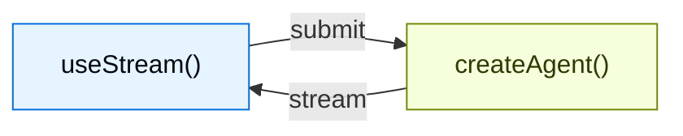
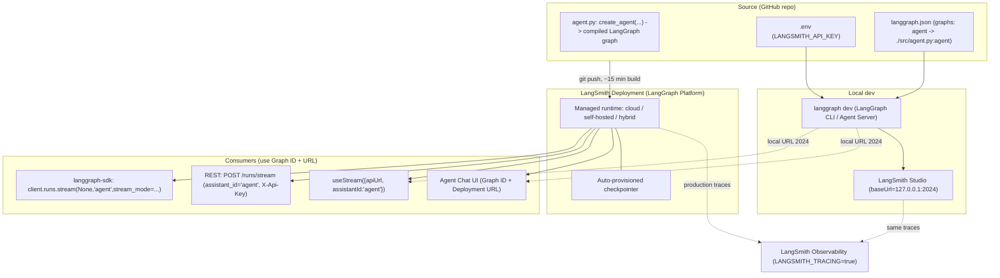

# Buffer 5 — RUN / OPERATE / DELIVER layer (Streaming, HITL, Studio, Deploy, Observability, UI)

> RAW extraction material for synthesis. Dense, faithful, complete. Preserves real API names + code.
> Cluster theme: how a built agent is **run live, supervised by humans, debugged visually, deployed, observed, and surfaced in a UI.** This layer is where LangChain (`create_agent`), LangGraph (runtime/checkpointer/Pregel stream modes), LangSmith (tracing/Studio/Platform), and the Frontend SDK (`useStream`) all interlock.

---

## TOPIC 1 — Event Streaming (`stream_events(..., version="v3")`)

### 1. Purpose
LangChain agents are built on LangGraph, so they inherit the same streaming stack but with **agent-focused typed projections** for messages, tool calls, state, and custom updates. **Event Streaming is the RECOMMENDED API for most application/frontend use cases** (introduced in LangChain v1.3). WHY: instead of parsing `stream_mode` tuples and branching on chunk types, you get a **run object with typed projections**, each consumable independently (separate iterators per concern). This decouples "render tokens", "render tool lifecycle", "render state" into clean separate loops.

### 2. Building blocks (exhaustive)
- **Entry points:** `agent.stream_events(input, version="v3")` (sync), `await agent.astream_events(input, version="v3")` (async). `version="v3"` is the Event Streaming protocol version.
- **Returns:** a `stream` run object with typed projections.
- **Projections on the run object:**
  - `for event in stream` — raw protocol events, full envelope, access to every channel.
  - `stream.messages` — yields `ChatModelStream` objects, one per LLM call.
  - `stream.values` — agent state snapshots.
  - `stream.output` — final agent state (drained).
  - `stream.subgraphs` — nested graph runs (sub-agents AND plain subgraphs).
  - `stream.subagents` — focused view of **named** `create_agent` sub-agents only.
  - `stream.extensions` — custom transformer projections (keyed dict, e.g. `stream.extensions["tool_activity"]`).
  - `stream.tool_calls` — tool **execution** lifecycle (inputs, output deltas, final output, errors).
- **Per-message (`ChatModelStream`) sub-projections:** `.text`, `.reasoning`, `.tool_calls`, `.output`, plus `.node` (which graph node emitted it).
  - `message.text` — text deltas (iterable for live) and final text (`str(message.text)` drains to final).
  - `message.reasoning` — reasoning deltas (only when model emits reasoning blocks).
  - `message.tool_calls` — tool-call **argument chunks** while the model produces the call; `.get()` returns finalized tool calls.
  - `message.output` — finalized AI message (incl. provider-specific content blocks). Python reads usage via `message.output.usage_metadata`; TS uses `message.usage`.
- **Sub-agent handle (`stream.subagents` element):** `.name` (the `name=` passed to `create_agent`), `.cause` (the tool call that dispatched it), plus its own `.messages`, `.values`, `.tool_calls`, `.output`.
- **Subgraph handle (`stream.subgraphs`):** `subagent.graph_name` (set via `.compile(name=...)`).
- **`stream.tool_calls` element (execution lifecycle):** `.tool_name`, `.input`, `.output_deltas` (iterable), `.output`, `.error`.
- **Concurrency helpers:**
  - Async: `astream_events` + `asyncio.gather(...)` on multiple consumer coroutines.
  - Sync: `stream.interleave("messages", "tool_calls", "values")` → yields `(name, item)` tuples.
- **Raw envelope shape:** `event["method"]`, `event["params"]["namespace"]`, `event["params"]["data"]`.
- **Custom transformers:** `transformers=[ToolActivityTransformer]` arg to `stream_events`; results surface on `stream.extensions["<key>"]`.
- **Middleware-registered transformers** (requires `langchain>=1.3.2`): set `transformers = (Factory,)` class attr on an `AgentMiddleware` subclass. Factory shape `Callable[[tuple[str, ...]], StreamTransformer]`, invoked `factory(scope)` where `scope` is the mini-mux scope tuple (`()` root, non-empty for subgraphs). Fresh transformer per call keeps subgraphs isolated.
- **Built-in transformer:** `ToolCallTransformer` (always first). `PIIMiddleware(..., apply_to_output=True)` registers a transformer that scrubs PII from streamed deltas/args/outputs/state BEFORE they leave the run.

### 3. Annotated code (VERBATIM)

**3a. Basic event-streaming token render + final state (the canonical example):**
```py
from langchain.agents import create_agent


def get_weather(city: str) -> str:
    """Get weather for a city."""
    return f"It's always sunny in {city}!"


agent = create_agent(
    model="gpt-5-nano",
    tools=[get_weather],
)

stream = agent.stream_events({
    "messages": [{"role": "user", "content": "What is the weather in SF?"}],
}, version="v3")

for message in stream.messages:
    for delta in message.text:
        print(delta, end="", flush=True)

final_state = stream.output
```
WHY: outer loop = per LLM call; inner loop = live text deltas. `stream.output` drained AFTER iterating gives the final agent state. This is the cleanest "stream tokens then get final state" pattern.

**3b. Tool-call projections (two distinct views):**
```py
stream = agent.stream_events(input, version="v3")

for message in stream.messages:
    for chunk in message.tool_calls:
        print(f"tool call chunk: {chunk}")

    finalized = message.tool_calls.get()
    if finalized:
        print(f"finalized tool calls: {finalized}")

for call in stream.tool_calls:
    print(f"{call.tool_name}({call.input})")
    for delta in call.output_deltas:
        print(delta, end="", flush=True)
    print(call.output, call.error)
```
WHY: `message.tool_calls` = argument chunks DURING generation (model deciding what to call). `stream.tool_calls` = lifecycle AFTER the call starts executing (actual tool run, streamed output, errors). Two different timelines, two different UI surfaces.

**3c. Named sub-agent streaming:**
```py
weather_agent = create_agent(
    model=init_chat_model("openai:gpt-5.4"),
    tools=[get_weather],
    name="weather_agent",
)

def call_weather(query: str) -> str:
    """Query the weather agent."""
    result = weather_agent.invoke({"messages": [{"role": "user", "content": query}]})
    return result["messages"][-1].text

supervisor = create_agent(
    model=init_chat_model("openai:gpt-5.4"),
    tools=[call_weather],
    name="supervisor",
)

stream = supervisor.stream_events(
    {"messages": [{"role": "user", "content": "What's the weather in Boston?"}]},
    version="v3",
)

for subagent in stream.subagents:
    print(f"{subagent.name}: ", end="")
    for message in subagent.messages:
        for token in message.text:
            print(token, end="", flush=True)
    print()
```
WHY: `name=` on `create_agent` is the identity key in the stream. `stream.subagents` only surfaces NAMED `create_agent` runs — no need to filter plain subgraphs. Each sub-agent has its own full projection set.

**3d. Concurrent multi-projection (async):**
```py
import asyncio

stream = await agent.astream_events(input, version="v3")

async def consume_messages():
    async for message in stream.messages:
        print(await message.text)

async def consume_tool_calls():
    async for call in stream.tool_calls:
        print(call.tool_name, call.input)

await asyncio.gather(consume_messages(), consume_tool_calls())
```
WHY: projections are independently iterable → fan out to concurrent consumers. Sync equivalent is `stream.interleave(...)`.

**3e. PII redaction via middleware-registered transformer:**
```py
from langchain.agents import create_agent
from langchain.agents.middleware import PIIMiddleware

agent = create_agent(
    model="gpt-5-nano",
    tools=[],
    middleware=[
        PIIMiddleware("email", strategy="redact", apply_to_output=True),
    ],
)
```
WHY: `apply_to_output=True` closes the window where `after_model` state-level redaction would still let raw PII reach live readers of `stream_events(version="v3")`. The transformer scrubs deltas/args/outputs/state before they leave the run.

### 4. Advanced concepts
- **Typed projections vs stream-mode tuples:** v3 Event Streaming replaces "branch on `chunk["type"]`" with "iterate the projection you care about". Same underlying graph execution, different consumer ergonomics.
- **Transformer merge order at compile time:** `create_agent` merges factories: (1) built-in `ToolCallTransformer`, (2) middleware-registered (in middleware order), (3) caller-supplied `transformers=`. Built-in projection stays in front; caller gets the final word.
- **Mini-mux scope:** transformer factories receive a scope tuple distinguishing root mux (`()`) from subgraph scopes — enables per-subgraph isolation.
- **Drainable vs iterable duality:** sync projections are iterable for live deltas AND drainable for finals (`str(message.text)`, `message.tool_calls.get()`, `stream.output`).

### 5. Cross-framework interaction points
- **Event Streaming ↔ LangGraph:** projections are agent-focused views over LangGraph's underlying Pregel stream; `stream_events(version="v3")` is the LangChain layer atop LangGraph's lower-level stream modes. "Build your own projection" lives in LangGraph docs (transformer contract).
- **Event Streaming ↔ Frontend:** `stream.messages`, `stream.tool_calls`, `stream.values` map directly to the reactive state the JS SDK `useStream` exposes (messages, toolCalls, values). Same runtime semantics.
- **Event Streaming ↔ Middleware:** transformers and `PIIMiddleware` plug into the stream pipeline; middleware can declare stream transformer factories alongside hooks/tools.
- **Event Streaming ↔ sub-agents/subgraphs:** nested `create_agent` and `StateGraph` subgraphs surface as nested namespaces; `name=`/`.compile(name=...)` provide labels.

### 6. Gotchas / version notes
- Middleware-registered transformers require **`langchain>=1.3.2`**.
- Python reads usage from `message.output.usage_metadata` (NOT `message.usage` — that's TS).
- `stream.subagents` only shows NAMED `create_agent` runs; plain subgraphs only on `stream.subgraphs`.
- Reasoning deltas only appear if the model actually emits reasoning blocks.

---

## TOPIC 2 — Streaming overview (low-level Pregel `stream_mode`)

### 1. Purpose
The **lower-level streaming API** (`.stream` / `.astream` with `stream_mode=...`). Surfaces real-time updates from agent runs. WHY streaming matters: progressively displaying output before the full response is ready dramatically improves UX given LLM latency. NOTE: for NEW apps the docs recommend Event Streaming (Topic 1); this API is the underlying mechanism and still fully supported.

### 2. Building blocks (exhaustive)
- **Methods:** `agent.stream(...)` / `agent.astream(...)` (these are `CompiledStateGraph.stream`/`astream` from LangGraph).
- **Stream modes (pass one or a list):**
  - `"updates"` — state updates after each agent step; multiple nodes in one step stream separately.
  - `"messages"` — tuples of `(token, metadata)` from any node where an LLM is invoked (token-by-token).
  - `"custom"` — arbitrary user data emitted from inside nodes via the stream writer.
  - `"values"` — full state snapshots (mentioned in Related → LangGraph streaming).
  - `"debug"` — debug-level events (mentioned in Related → LangGraph streaming).
- **Multiple modes:** `stream_mode=["updates", "custom"]` (and `["messages", "updates"]`, `["messages", "updates", "custom"]`).
- **Format version:** `version="v2"` — unified output; every chunk is a `StreamPart` dict with keys `type`, `ns`, `data`. Requires **LangGraph >= 1.1**. v1 (current default) uses `(mode, data)` tuple unpacking.
- **Custom writer:** `from langgraph.config import get_stream_writer` → `writer = get_stream_writer()` → `writer(data)`.
- **Step/node identity:** `metadata['langgraph_node']`, `metadata['lc_agent_name']` (agent name in `"messages"` metadata).
- **Sub-agent streaming:** `subgraphs=True` arg + `name=` on each `create_agent`.
- **Checkpointing for threads:** `thread_id` via `config={"configurable": {"thread_id": ...}}` (independent of `stream_mode`); requires a checkpointer. Also pass `context` for per-run data read via `runtime.context`.
- **Disable streaming:** `ChatOpenAI(model=..., streaming=False)`; or universal `disable_streaming=True` (base-class param on all chat models).
- **Message chunk helpers:** `AIMessageChunk`, `token.text`, `token.tool_call_chunks`, `token.content_blocks`, `token.chunk_position == "last"`, chunk addition (`full_message + token`).
- **`invoke()` in v2:** returns `GraphOutput` with `.value` (state) and `.interrupts` (tuple of `Interrupt`, empty if none).

### 3. Annotated code (VERBATIM)

**3a. Agent progress (`stream_mode="updates"`) + checkpointer + thread_id:**
```python
from langchain.agents import create_agent
from langchain_core.utils.uuid import uuid7
from langgraph.checkpoint.memory import InMemorySaver

def get_weather(city: str) -> str:
    """Get weather for a given city."""
    return f"It's always sunny in {city}!"

agent = create_agent(
    model="anthropic:claude-sonnet-4-6",
    tools=[get_weather],
    checkpointer=InMemorySaver()
)
config = {"configurable": {"thread_id": str(uuid7())}}
for chunk in agent.stream(
    {"messages": [{"role": "user", "content": "What is the weather in SF?"}]},
    config=config,
    stream_mode="updates",
    version="v2",
):
    if chunk["type"] == "updates":
        for step, data in chunk["data"].items():
            print(f"step: {step}")
            print(f"content: {data['messages'][-1].content_blocks}")
```
WHY: `"updates"` emits one event per agent step (model node → tools node → model node). `chunk["data"]` keys are node names (`model`, `tools`). Checkpointer + thread_id make follow-up turns resume the same history.

**3b. LLM token streaming (`stream_mode="messages"`):**
```python
for chunk in agent.stream(
    {"messages": [{"role": "user", "content": "What is the weather in SF?"}]},
    stream_mode="messages",
    version="v2",
):
    if chunk["type"] == "messages":
        token, metadata = chunk["data"]
        print(f"node: {metadata['langgraph_node']}")
        print(f"content: {token.content_blocks}")
```
WHY: `"messages"` streams `(token, metadata)`; you get `tool_call_chunk` partial JSON during tool-call generation, then text deltas. `metadata['langgraph_node']` tells which node produced it.

**3c. Custom updates via stream writer:**
```python
from langgraph.config import get_stream_writer

def get_weather(city: str) -> str:
    """Get weather for a given city."""
    writer = get_stream_writer()
    writer(f"Looking up data for city: {city}")
    writer(f"Acquired data for city: {city}")
    return f"It's always sunny in {city}!"

for chunk in agent.stream(
    {"messages": [{"role": "user", "content": "What is the weather in SF?"}]},
    stream_mode="custom",
    version="v2",
):
    if chunk["type"] == "custom":
        print(chunk["data"])
```
WHY: emit domain progress ("Fetched 10/100 records") from inside a tool. GOTCHA: a tool using `get_stream_writer()` can't be invoked outside a LangGraph execution context.

**3d. Streaming thinking/reasoning tokens (provider-normalized):**
```python
model = ChatAnthropic(
    model_name="claude-sonnet-4-6",
    timeout=None,
    stop=None,
    thinking={"type": "enabled", "budget_tokens": 5000},
)
agent: Runnable = create_agent(model=model, tools=[get_weather])

for token, metadata in agent.stream(
    {"messages": [{"role": "user", "content": "What is the weather in SF?"}]},
    stream_mode="messages",
):
    if not isinstance(token, AIMessageChunk):
        continue
    reasoning = [b for b in token.content_blocks if b["type"] == "reasoning"]
    text = [b for b in token.content_blocks if b["type"] == "text"]
    if reasoning:
        print(f"[thinking] {reasoning[0]['reasoning']}", end="")
    if text:
        print(text[0]["text"], end="")
```
WHY: reasoning must be enabled on the model (`thinking=...` for Anthropic). LangChain normalizes Anthropic `thinking` / OpenAI `reasoning` summaries into a standard `"reasoning"` content block via `content_blocks` — provider-agnostic filtering.

**3e. v2 vs v1 format (the migration contrast):**
```python
# v2 (new) — unified, no tuple unpacking
for chunk in agent.stream(..., stream_mode=["updates", "custom"], version="v2"):
    print(chunk["type"])  # "updates" or "custom"
    print(chunk["data"])  # payload

# v1 (current default) — must unpack (mode, data)
for mode, chunk in agent.stream(..., stream_mode=["updates", "custom"]):
    print(mode); print(chunk)

# v2 also improves invoke():
result = agent.invoke({"messages": [...]}, version="v2")
print(result.value)       # state
print(result.interrupts)  # tuple of Interrupt (empty if none)
```
WHY: v2 makes every chunk a `StreamPart` dict (`type`/`ns`/`data`) regardless of mode count; `invoke()` returns `GraphOutput` cleanly separating state from interrupt metadata.

### 4. Advanced concepts
- **Token-by-token (`messages`) vs step-update (`updates`):** `messages` = LLM tokens as generated (fine-grained, for live typing); `updates` = state deltas after each completed node (coarse, for "agent is now running tool X").
- **Combining modes for completed tool calls:** `stream_mode=["messages", "updates"]` — stream partial JSON via `messages`, then read the parsed/completed tool calls from `updates` state. If messages aren't tracked in state, either use custom updates OR aggregate chunks (`full_message = token if None else full_message + token`, check `token.chunk_position == "last"`).
- **Sub-agent disambiguation:** with multiple LLMs, pass `name=` to each `create_agent` and `subgraphs=True`; read `metadata.get("lc_agent_name")` to label which agent emits each token. `name` is also attached to that agent's `AIMessage`s.
- **Selective streaming disable:** `streaming=False` (or `disable_streaming=True`) per model — useful in multi-agent systems, mixed-capability models, or to prevent specific outputs reaching the client on LangSmith deployments.

### 5. Cross-framework interaction points
- **stream_mode ↔ LangGraph:** ALL stream modes (`updates`/`messages`/`custom`/`values`/`debug`) come directly from LangGraph graph (Pregel) execution; `agent.stream` IS `CompiledStateGraph.stream`. The `values`/`debug` modes and subgraph streaming are documented under LangGraph streaming.
- **thread_id/checkpointer ↔ LangGraph persistence:** conversation history persistence needs a checkpointer (`InMemorySaver` locally; auto-provisioned on LangSmith deployments).
- **`get_stream_writer` ↔ LangGraph config:** the custom writer comes from `langgraph.config`; tools using it are bound to the LangGraph execution context.
- **streaming ↔ LangSmith deploy:** set `streaming=False` before deployment to stop specific model outputs from streaming to the client.
- **streaming ↔ Frontend:** these modes feed the JS SDK; frontend streaming patterns are built on streamed state.

### 6. Gotchas / version notes
- `version="v2"` requires **LangGraph >= 1.1**.
- Checkpointer REQUIRED for `thread_id` persistence; examples omit `thread_id` for brevity but production should pass it.
- Tools with `get_stream_writer()` only work inside LangGraph execution.
- Not all chat model integrations support `streaming=`; fall back to `disable_streaming=True` (base-class, universal).

---

## TOPIC 3 — Streaming to frontend (`useStream` / generative UI SDK)

### 1. Purpose
Build rich interactive frontends for `createAgent` agents. WHY: LangChain frontend SDKs are for **agent applications, not just token-streaming chatbots** — the SAME hook that renders messages also exposes durable thread state, tool-call lifecycle, interrupts, checkpoint history, and custom state, turning the UI into a **control plane** for long-running agent work (inspect, steer, pause, resume, fork).

### 2. Building blocks (exhaustive)
- **Hooks per framework:** `useStream` (React `@langchain/react`, Vue `@langchain/vue`, Svelte `@langchain/svelte`); `injectStream` (Angular `@langchain/angular`).
- **Hook config:** `{ apiUrl: "http://localhost:2024", assistantId: "agent" }`. `assistantId` = the graph name from `langgraph.json`.
- **Type parameter:** `useStream<AgentState>({...})` for typed access. `AgentState` interface matches the agent's state schema (`messages: BaseMessage[]`, plus custom keys like `todos: Todo[]`).
- **Reactive state exposed:** `stream.messages`, `stream.toolCalls`, `stream.interrupt`, `stream.values`, thread metadata, checkpoint history, custom state values.
- **Actions:** `submit` (send input to backend).
- **Backend requirement:** `createAgent(..., checkpointer=MemorySaver())` — a compiled LangGraph graph exposing a streaming API.
- **Pattern families:** Render messages/output (Markdown, structured output, reasoning tokens, generative UI/json-render); Display agent actions (tool calling cards, headless tools, human-in-the-loop); Manage conversations (branching chat, message queues); Advanced streaming (join & rejoin streams, time travel).
- **Integrations:** AI Elements (shadcn/ui: `Conversation`, `Message`, `Tool`, `Reasoning`), assistant-ui (headless React, branching, attachments), OpenUI (data-rich reports/dashboards via openui-lang DSL).
- **Capabilities table:** Durable threads (reload/switch device/rejoin), typed agent state (render any state key), tool-call lifecycle (pending/completed/failed cards), interrupts (pause for approval/edit, resume from exact point), checkpoints (edit/retry/branch/audit/time-travel), nested execution (deep agents/subagents/nodes), framework-native reactivity.

### 3. Annotated code (VERBATIM)

**3a. Backend + types + React component (the full triad):**
```python
# agent.py
from langchain import create_agent
from langgraph.checkpoint.memory import MemorySaver

agent = create_agent(
    model="openai:gpt-5.4",
    tools=[get_weather, search_web],
    checkpointer=MemorySaver(),
)
```
```ts
// types.ts
export interface GraphState {
  messages: BaseMessage[];
}
```
```tsx
// Chat.tsx
import { useStream } from "@langchain/react";
import type { GraphState } from "./types";

function Chat() {
  const stream = useStream<GraphState>({
    apiUrl: "http://localhost:2024",
    assistantId: "agent",
  });

  return (
    <div>
      {stream.messages.map((msg) => (
        <Message key={msg.id} message={msg} />
      ))}
    </div>
  );
}
```
WHY: the architecture is uniform — `createAgent` backend streams state, `useStream` frontend renders reactive state and submits back. `assistantId: "agent"` must match the `graphs` key in `langgraph.json`. `apiUrl` is the Agent Server endpoint (`2024` local).

**3b. Framework hook imports + typed custom state:**
```ts
import { useStream } from "@langchain/react";      // React
import { useStream } from "@langchain/vue";        // Vue
import { useStream } from "@langchain/svelte";     // Svelte
import { injectStream } from "@langchain/angular"; // Angular

interface AgentState {
  messages: BaseMessage[];
  todos: Todo[];   // extend with custom state keys
}
```
WHY: pass the interface as the type param for type-safe `stream.messages`/`toolCalls`/`interrupt`/`values`. Extending the interface lets the UI render arbitrary agent state, not just chat.

### 4. Advanced concepts
- **UI as control plane:** durable threads + checkpoints + interrupts let users inspect/steer/pause/resume/fork while the agent runs.
- **Nested execution rendering:** deep agents/subagents/nodes visualized without flattening into one stream.
- **Resumability:** join & rejoin running streams (leave/return to long-running work); time travel = navigate + resume from any checkpoint.
- **UI-agnostic protocol:** component libraries own presentation; the SDK owns runtime state, resumability, interrupts, checkpoint semantics.

### 5. Cross-framework interaction points
- **Frontend ↔ LangChain:** `useStream` connects to a `createAgent` compiled graph's streaming API; `GraphState` mirrors agent state schema.
- **Frontend ↔ LangGraph:** durable threads/checkpoints/interrupts/time-travel are LangGraph persistence features surfaced reactively; `assistantId` comes from `langgraph.json`.
- **Frontend ↔ HITL:** `stream.interrupt` + resume map to the interrupt/`Command(resume=...)` cycle; UI presents approve/edit/reject.
- **Frontend ↔ Deploy/Studio:** `apiUrl` points at local Agent Server (`2024`) OR a deployed LangSmith URL — same hook, either target.

### 6. Gotchas / version notes
- Patterns use the **v1 frontend SDK packages**; earlier versions need migration guides (React/Vue/Svelte/Angular).
- `assistantId` must equal the `langgraph.json` graph name.

---

## TOPIC 4 — Human-in-the-loop (HITL)

### 1. Purpose
Add human oversight to agent tool calls. WHY: when a model proposes a risky action (write a file, run SQL, send email), pause execution and wait for a human decision rather than blindly executing side effects. Mechanism: `HumanInTheLoopMiddleware` checks each tool call against a configurable policy; if review is needed it raises an `interrupt()` that halts execution, the graph state is saved via LangGraph persistence so it can pause safely and resume later.

### 2. Building blocks (exhaustive)
- **Middleware:** `from langchain.agents.middleware import HumanInTheLoopMiddleware`.
- **Config arg `interrupt_on`** (dict, required): maps tool name → approval config. Values: `True` (interrupt, all decisions allowed), `False` (auto-approve, no interrupt), or an `InterruptOnConfig`.
- **`InterruptOnConfig` keys:**
  - `allowed_decisions`: list of `'approve'`/`'edit'`/`'reject'`/`'respond'`.
  - `description`: static string OR callable for custom description.
  - `when`: predicate `(ToolCallRequest) -> bool` (`True`=interrupt, `False`=auto-approve). Requires **`langchain>=1.3.3`**.
- **`description_prefix`** (default `"Tool execution requires approval"`): prefix combined with tool name + args.
- **Checkpointer REQUIRED:** `from langgraph.checkpoint.memory import InMemorySaver` (testing) / `AsyncPostgresSaver` (production). WHY: persists graph state across interrupts.
- **Thread ID:** `config={"configurable": {"thread_id": "some_id"}}` — associates execution with a conversation thread so it can pause/resume.
- **Four decision types:** `approve` (execute as-is), `edit` (execute with modified args), `reject` (don't execute, add explanation to conversation), `respond` (skip execution, human's message becomes tool result — for "ask_user" tools).
- **Interrupt primitive:** `from langgraph.types import interrupt` (and `Interrupt`, `Command`).
- **Resume:** `Command(resume={"decisions": [...]})` — one decision per action, **same order as actions in interrupt request**.
- **Decision payloads:**
  - approve: `{"type": "approve"}`
  - edit: `{"type": "edit", "edited_action": {"name": "...", "args": {...}}}`
  - reject: `{"type": "reject", "message": "..."}` (optional; default rejection message if omitted)
  - respond: `{"type": "respond", "message": "Blue."}`
- **Result object (v2):** `GraphOutput` with `.value` and `.interrupts`. `result.interrupts` = tuple of `Interrupt(value={...})`.
- **Interrupt value shape:** `{"action_requests": [{"name", "arguments"/"args", "description"}], "review_configs"/"review_configs": [{"action_name", "allowed_decisions"}]}`. (Streaming surfaces `interrupt.value["action_requests"]` with `request["description"]`.)
- **Internals:** `HITLRequest` (built with `action_requests` + `review_configs`), `HITLResponse` (the decisions), `after_model` hook, synthesized `ToolMessage`s.
- **Custom HITL:** build directly with the `interrupt` primitive + middleware abstraction.

### 3. Annotated code (VERBATIM)

**3a. Configuring HITL middleware + checkpointer:**
```python
from langchain.agents import create_agent
from langchain.agents.middleware import HumanInTheLoopMiddleware
from langgraph.checkpoint.memory import InMemorySaver


agent = create_agent(
    model="gpt-5.4",
    tools=[write_file, execute_sql, read_data],
    middleware=[
        HumanInTheLoopMiddleware(
            interrupt_on={
                "write_file": True,  # All decisions (approve, edit, reject, respond) allowed
                "execute_sql": {"allowed_decisions": ["approve", "reject"]},  # No editing allowed
                "read_data": False, # Safe operation, no approval needed
            },
            description_prefix="Tool execution pending approval",
        ),
    ],
    # Human-in-the-loop requires checkpointing to handle interrupts.
    # In production, use a persistent checkpointer like AsyncPostgresSaver.
    checkpointer=InMemorySaver(),
)
```
WHY: `interrupt_on` is the policy. `True` = all 4 decisions; a dict narrows `allowed_decisions`; `False` = auto-approve safe ops. Checkpointer is MANDATORY — without it the interrupt can't persist state to resume.

**3b. Conditional interrupts via `when` predicate:**
```python
from langchain.agents.middleware import HumanInTheLoopMiddleware, ToolCallRequest

def writes_outside_workspace(request: ToolCallRequest) -> bool:
    """Pause writes to paths outside the workspace directory."""
    path = request.tool_call["args"].get("path", "")
    return not path.startswith("/workspace/")

def is_write_query(request: ToolCallRequest) -> bool:
    """Pause SQL that isn't a read-only SELECT."""
    query = request.tool_call["args"].get("query", "")
    return not query.lstrip().upper().startswith("SELECT")

agent = create_agent(
    model="gpt-5.4",
    tools=[write_file, execute_sql, read_data],
    middleware=[
        HumanInTheLoopMiddleware(
            interrupt_on={
                "write_file": {
                    "allowed_decisions": ["approve", "edit", "reject"],
                    "when": writes_outside_workspace,
                },
                "execute_sql": {
                    "allowed_decisions": ["approve", "reject"],
                    "when": is_write_query,
                },
            },
        ),
        checkpointer=InMemorySaver(),
    ],
)
```
WHY: `when` gates interrupts on the call's arguments — only risky calls (writes outside workspace, non-SELECT SQL) pause; safe ones run uninterrupted and are never added to the interrupt batch (reviewer only sees what needs a decision). Requires `langchain>=1.3.3`.

**3c. Responding to interrupts — run to interrupt, then resume:**
```python
from langgraph.types import Command

config = {"configurable": {"thread_id": "some_id"}}
# Run the graph until the interrupt is hit.
result = agent.invoke(
    {"messages": [{"role": "user", "content": "Delete old records from the database"}]},
    config=config,
    version="v2",
)

# result is a GraphOutput with .value and .interrupts
print(result.interrupts)
# > (Interrupt(value={'action_requests': [{'name': 'execute_sql',
# >   'arguments': {'query': 'DELETE FROM records ...'},
# >   'description': 'Tool execution pending approval\n\nTool: execute_sql\nArgs: {...}'}],
# >   'review_configs': [{'action_name': 'execute_sql', 'allowed_decisions': ['approve', 'reject']}]}),)

# Resume with approval decision
agent.invoke(
    Command(resume={"decisions": [{"type": "approve"}]}),  # or "reject"
    config=config,  # Same thread ID to resume the paused conversation
    version="v2",
)
```
WHY: first `invoke` halts at the interrupt → `GraphOutput.interrupts` carries the actions for review. Resume by re-invoking with `Command(resume=...)` and the SAME `thread_id`. v2 gives clean `.value`/`.interrupts` separation.

**3d. Multiple decisions (order matters):**
```python
{
    "decisions": [
        {"type": "approve"},
        {"type": "edit", "edited_action": {"name": "tool_name", "args": {"param": "new_value"}}},
        {"type": "reject", "message": "This action is not allowed"}
    ]
}
```
WHY: when multiple tool calls pause together, provide one decision per action in the SAME order they appear in the interrupt request.

**3e. Streaming WITH human-in-the-loop (the cross-cluster bridge):**
```python
from langgraph.types import Command

config = {"configurable": {"thread_id": "some_id"}}

# Stream agent progress and LLM tokens until interrupt
for chunk in agent.stream(
    {"messages": [{"role": "user", "content": "Delete old records from the database"}]},
    config=config,
    stream_mode=["updates", "messages"],
    version="v2",
):
    if chunk["type"] == "messages":
        token, metadata = chunk["data"]
        if token.content:
            print(token.content, end="", flush=True)
    elif chunk["type"] == "updates":
        if "__interrupt__" in chunk["data"]:
            print(f"\n\nInterrupt: {chunk['data']['__interrupt__']}")

# Resume with streaming after human decision
for chunk in agent.stream(
    Command(resume={"decisions": [{"type": "approve"}]}),
    config=config,
    stream_mode=["updates", "messages"],
    version="v2",
):
    if chunk["type"] == "messages":
        token, metadata = chunk["data"]
        if token.content:
            print(token.content, end="", flush=True)
```
WHY: interrupts surface in the `"updates"` stream under the `"__interrupt__"` key. Collect them, present to the human, then re-enter the SAME streaming loop with `Command(resume=...)`. (The longer Topic-2 example shows collecting `interrupts` list, building per-`interrupt.id` decisions, editing one tool call + approving another.)

### 4. Advanced concepts
- **HITL = interrupt + durable execution + checkpointer:** the trio. `interrupt()` halts; the checkpointer persists state durably; `Command(resume=...)` re-enters at the exact saved point. No checkpointer → no resume.
- **Execution lifecycle (`after_model` hook):** (1) model generates response, (2) middleware inspects for tool calls, (3) if review needed builds `HITLRequest` (`action_requests` + `review_configs`) and calls `interrupt`, (4) agent waits, (5) on `HITLResponse`: execute approved/edited calls, synthesize `ToolMessage`s for rejected, return human replies as `ToolMessage`s for `respond`, resume.
- **reject vs respond semantics:** `reject` = deny a side-effecting action (message is feedback to the model). `respond` = human IS the tool (message becomes a SUCCESSFUL `ToolMessage`). DO NOT use `respond` to deny side-effecting tools — model thinks it succeeded.
- **Conservative edits:** large arg edits may make the model re-evaluate and re-run the tool or take unexpected actions.
- **Time-travel relationship:** the same checkpoint persistence that powers HITL pause/resume also powers checkpoint navigation / time-travel / branching (frontend "edit, retry, branch, audit" flows).

### 5. Cross-framework interaction points
- **HITL ↔ LangGraph checkpointer/durable execution:** interrupt + resume are LangGraph persistence primitives; `interrupt`, `Command`, `Interrupt` all from `langgraph.types`; state saved by `InMemorySaver`/`AsyncPostgresSaver`.
- **HITL ↔ streaming:** interrupts appear in `stream_mode="updates"` under `"__interrupt__"`; resume via `Command(resume=...)` in the same stream loop.
- **HITL ↔ Frontend:** `stream.interrupt` exposes action requests; UI renders approve/edit/reject; resume from the exact stop point.
- **HITL ↔ Deploy:** on LangSmith deployments the checkpointer is auto-provisioned, so HITL works without manually wiring a saver; Agent Chat UI auto-fetches interrupted threads.
- **HITL ↔ middleware:** `HumanInTheLoopMiddleware` is built-in middleware using the `after_model` hook + `interrupt` primitive.

### 6. Gotchas / version notes
- Conditional interrupts (`when`) require **`langchain>=1.3.3`**.
- Decisions MUST match action order in the interrupt.
- Production checkpointer = `AsyncPostgresSaver` (not `InMemorySaver`).
- Same `thread_id` required to resume; otherwise the paused conversation isn't found.

---

## TOPIC 5 — LangSmith Studio

### 1. Purpose
Free **visual interface for developing/testing/debugging** LangChain agents locally. WHY: while building locally it's helpful to SEE inside the agent — prompts sent to the model, tool calls + results, final output — and interact in real-time. Studio connects to your locally running agent and shows each step; test inputs, inspect intermediate state, iterate WITHOUT extra code or deployment.

### 2. Building blocks (exhaustive)
- **LangGraph CLI:** `pip install --upgrade "langgraph-cli[inmem]"` (Python >= 3.11 required). Provides the local dev server (aka **Agent Server**).
- **Run command:** `langgraph dev` → agent at API `http://127.0.0.1:2024`, Studio UI at `https://smith.langchain.com/studio/?baseUrl=http://127.0.0.1:2024`.
- **`--tunnel` flag:** required for Safari (it blocks `localhost` connections to Studio) — access via secure tunnel.
- **Prereqs:** LangSmith account + LangSmith API key. `LANGSMITH_TRACING=false` in `.env` keeps all data local (no data leaves local server).
- **`.env`:** `LANGSMITH_API_KEY=lsv2...` (Studio needs it to connect; do NOT commit).
- **`langgraph.json` config file:** keys `dependencies` (`["."]`), `graphs` (`{"agent": "./src/agent.py:agent"}`), `env` (`.env`). `create_agent` returns a compiled graph — exactly what `graphs` expects.
- **Project structure:** `src/agent.py`, `.env`, `langgraph.json`.
- **Studio features:** full execution trace (prompts, tool args, return values, token/latency metrics), exception capture with surrounding state, **hot-reloading** (edit prompts/tool signatures → reflected immediately), re-run threads from any step.
- **Related LangSmith guides:** Run application, Manage assistants, Manage threads, Iterate on prompts, Debug LangSmith traces, Add node to dataset.

### 3. Annotated code (VERBATIM)

**3a. `langgraph.json` (the deploy/Studio contract file):**
```json
{
  "dependencies": ["."],
  "graphs": {
    "agent": "./src/agent.py:agent"
  },
  "env": ".env"
}
```
WHY: this single file is the locator the CLI uses for Studio AND deployment. `graphs` maps an assistant/graph id (`"agent"`) to `path:variable`. That id becomes `assistantId`/Graph ID in the frontend and UI.

**3b. Agent + start command:**
```python
# agent.py
from langchain.agents import create_agent

def send_email(to: str, subject: str, body: str):
    """Send an email"""
    return f"Email sent to {to}"

agent = create_agent(
    "gpt-5.4",
    tools=[send_email],
    system_prompt="You are an email assistant. Always use the send_email tool.",
)
```
```shell
langgraph dev
```
WHY: any existing `create_agent` works directly; `langgraph dev` serves it to Studio with hot-reload.

### 4. Advanced concepts
- **Local-first debugging loop:** hot-reload + re-run-from-any-step scales from single-tool agents to complex multi-node graphs without redeploying.
- **Privacy mode:** `LANGSMITH_TRACING=false` → Studio still works but nothing traces to LangSmith (data stays local).

### 5. Cross-framework interaction points
- **Studio ↔ LangGraph server (Agent Server):** Studio is a thin UI over the locally running Agent Server started by `langgraph dev` (LangGraph CLI). `baseUrl` points Studio at `127.0.0.1:2024`.
- **Studio ↔ LangChain:** `create_agent`'s compiled graph is referenced via `langgraph.json` `graphs`.
- **Studio ↔ Observability:** Studio shows the same execution traces LangSmith captures; debugging traces / adding nodes to datasets bridges into LangSmith observability.
- **Studio ↔ Deploy:** same `langgraph.json` + LangGraph-compatible setup is the prerequisite for deployment; deployed apps also open in Studio.
- **Studio ↔ Frontend/UI:** the graph id in `langgraph.json` is what `useStream` `assistantId` and Agent Chat UI Graph ID reference.

### 6. Gotchas / version notes
- Python **>= 3.11** required for the CLI.
- Safari needs `langgraph dev --tunnel`.
- Don't commit `.env`.

---

## TOPIC 6 — LangSmith Deployment (LangGraph Platform)

### 1. Purpose
Managed hosting platform for **production agent workloads**. WHY: traditional hosts are built for stateless, short-lived web apps; LangGraph is **purpose-built for stateful, long-running agents** needing persistent state + background execution. LangSmith handles infrastructure, scaling, operational concerns — deploy directly from a repo.

### 2. Building blocks (exhaustive)
- **Prereqs:** GitHub account + LangSmith account. App must reside in a GitHub repo (public or private). App must be LangGraph-compatible (follow local server setup / Studio guide first).
- **Deploy flow (UI):** LangSmith → **Deployments** sidebar → **+ New Deployment** → link/Add new account (GitHub) → select repo → **Submit** (~15 min) → check **Deployment details**.
- **Test in Studio:** select deployment → **Studio** button (top right) → graph opens.
- **API URL:** in **Deployment details**, click **API URL** to copy.
- **Client SDK:** `pip install langgraph-sdk`; `from langgraph_sdk import get_sync_client` (or `get_client` async).
- **Client:** `client = get_sync_client(url="your-deployment-url", api_key="your-langsmith-api-key")`.
- **Streaming runs:** `client.runs.stream(None, "agent", input={...}, stream_mode="updates")` → yields chunks with `chunk.event`, `chunk.data`. `None` = threadless run; `"agent"` = agent name from `langgraph.json`.
- **REST API:** `POST <DEPLOYMENT_URL>/runs/stream`, header `X-Api-Key: <LANGSMITH API KEY>`, body `{"assistant_id": "agent", "input": {...}, "stream_mode": "updates"}`.
- **Hosting options:** cloud (managed), **self-hosted**, and **hybrid** — see Platform setup overview.

### 3. Annotated code (VERBATIM)

**3a. Python SDK streaming against a deployment:**
```python
from langgraph_sdk import get_sync_client # or get_client for async

client = get_sync_client(url="your-deployment-url", api_key="your-langsmith-api-key")

for chunk in client.runs.stream(
    None,    # Threadless run
    "agent", # Name of agent. Defined in langgraph.json.
    input={
        "messages": [{
            "role": "human",
            "content": "What is LangGraph?",
        }],
    },
    stream_mode="updates",
):
    print(f"Receiving new event of type: {chunk.event}...")
    print(chunk.data)
```
WHY: the deployed agent is consumed via `langgraph-sdk`, NOT by importing the agent object. `"agent"` matches the `langgraph.json` graph key. `stream_mode` is the same vocabulary as local streaming — the platform speaks the same streaming protocol over HTTP.

**3b. REST equivalent:**
```bash
curl -s --request POST \
    --url <DEPLOYMENT_URL>/runs/stream \
    --header 'Content-Type: application/json' \
    --header "X-Api-Key: <LANGSMITH API KEY> \
    --data "{
        \"assistant_id\": \"agent\",
        \"input\": {\"messages\": [{\"role\": \"human\", \"content\": \"What is LangGraph?\"}]},
        \"stream_mode\": \"updates\"
    }"
```
WHY: language-agnostic access. `/runs/stream` endpoint, `assistant_id` = graph name, `X-Api-Key` = LangSmith key.

### 4. Advanced concepts
- **Deployment topologies:** cloud (fully managed), self-hosted, hybrid — chosen via Platform setup.
- **Stateful runtime:** persistent state + background execution are first-class (checkpointer auto-provisioned), enabling durable HITL and long-running threads in production.
- **Threadless vs threaded runs:** first SDK arg is the thread (`None` = threadless one-shot; a thread id = persistent conversation).
- **Git-driven deploys:** code lives in GitHub; LangSmith builds from the repo (~15 min).

### 5. Cross-framework interaction points
- **Deploy ↔ LangGraph Platform/Server:** LangSmith Deployment = the managed LangGraph Platform; the deployed unit is the LangGraph-compatible app defined by `langgraph.json`.
- **Deploy ↔ LangChain:** the `create_agent` compiled graph is what's deployed (referenced by `graphs` in `langgraph.json`).
- **Deploy ↔ Studio:** deployed graphs open in Studio via the **Studio** button; local Studio setup is the deployment prerequisite.
- **Deploy ↔ streaming:** `client.runs.stream(..., stream_mode=...)` reuses the same stream-mode vocabulary as local `.stream`.
- **Deploy ↔ checkpointer/HITL:** on deployments a checkpointer is auto-provisioned (no manual `InMemorySaver`), so threads/HITL "just work".
- **Deploy ↔ Frontend/UI:** the deployment **API URL** is the `apiUrl` / Deployment URL for `useStream` and Agent Chat UI.

### 6. Gotchas / version notes
- Deployment takes **~15 minutes**.
- The curl example has an unbalanced quote on the `X-Api-Key` header (doc typo — `"X-Api-Key: <...>` missing closing quote).
- `assistant_id`/agent name must match `langgraph.json`.

---

## TOPIC 7 — LangSmith Observability (tracing)

### 1. Purpose
Visibility into agent behavior: which tools it calls, what prompts it generates, how it decides. WHY: `create_agent` agents **automatically support tracing** via LangSmith — traces record EVERY step from initial input to final response (all tool calls, model interactions, decision points) to debug issues, evaluate across inputs, monitor production usage.

### 2. Building blocks (exhaustive)
- **Enable via env vars:** `LANGSMITH_TRACING=true`, `LANGSMITH_API_KEY=<your-api-key>`.
- **Auto-instrumentation:** NO extra code — run the agent normally and traces log automatically.
- **Default project:** trace logs to project named `default`.
- **Project naming (static):** `LANGSMITH_PROJECT=my-agent-project` env var.
- **Selective / dynamic tracing:** `import langsmith as ls`; context manager `ls.tracing_context(enabled=True, project_name=..., tags=[...], metadata={...})`.
- **Per-invoke metadata/tags:** `config={"tags": [...], "metadata": {...}}` on `agent.invoke(...)`.
- **Concepts referenced:** traces (every step recorded); the trace tree (full execution from input → final response).
- **(Implied decorator surface from prompt:** `@traceable` / tracing decorators — not shown in THIS doc; this doc uses env vars + `tracing_context` + config. Flagging for synthesis: `@traceable` is the standard LangSmith function-level decorator but does not appear in this source file.)

### 3. Annotated code (VERBATIM)

**3a. Enable + zero-code quickstart:**
```bash
export LANGSMITH_TRACING=true
export LANGSMITH_API_KEY=<your-api-key>
```
```python
from langchain.agents import create_agent

def send_email(to: str, subject: str, body: str):
    """Send an email to a recipient."""
    return f"Email sent to {to}"

def search_web(query: str):
    """Search the web for information."""
    return f"Search results for: {query}"

agent = create_agent(
    model="gpt-5.4",
    tools=[send_email, search_web],
    system_prompt="You are a helpful assistant that can send emails and search the web."
)

# Run the agent - all steps will be traced automatically
response = agent.invoke({
    "messages": [{"role": "user", "content": "Search for the latest AI news and email a summary to john@example.com"}]
})
```
WHY: the two env vars are the ENTIRE setup. `create_agent` is auto-instrumented; the whole multi-step run (search → email) becomes one trace tree.

**3b. Selective tracing with context manager:**
```python
import langsmith as ls

# This WILL be traced
with ls.tracing_context(enabled=True):
    agent.invoke({"messages": [{"role": "user", "content": "Send a test email to alice@example.com"}]})

# This will NOT be traced (if LANGSMITH_TRACING is not set)
agent.invoke({"messages": [{"role": "user", "content": "Send another email"}]})
```
WHY: `tracing_context(enabled=True)` traces just the wrapped invocation; outside it (with `LANGSMITH_TRACING` unset) nothing is traced. Fine-grained control over what gets recorded.

**3c. Metadata/tags (two ways):**
```python
# Per-invoke
response = agent.invoke(
    {"messages": [{"role": "user", "content": "Send a welcome email"}]},
    config={
        "tags": ["production", "email-assistant", "v1.0"],
        "metadata": {"user_id": "user_123", "session_id": "session_456", "environment": "production"}
    }
)

# Via context manager
with ls.tracing_context(
    project_name="email-agent-test",
    enabled=True,
    tags=["production", "email-assistant", "v1.0"],
    metadata={"user_id": "user_123", "session_id": "session_456", "environment": "production"}):
    response = agent.invoke({"messages": [{"role": "user", "content": "Send a welcome email"}]})
```
WHY: tags/metadata attach to the trace for filtering/grouping in LangSmith (by user, session, environment, version).

### 4. Advanced concepts
- **Trace tree structure:** a trace is a tree of steps — root run (the agent invocation) → child runs for each model call, tool call, decision point. Captures inputs/outputs/latency/tokens at each node.
- **Dynamic vs static project routing:** `LANGSMITH_PROJECT` env (whole app) vs `tracing_context(project_name=...)` (per operation).
- **Selective enablement:** combine unset `LANGSMITH_TRACING` + `tracing_context(enabled=True)` to trace only chosen invocations.

### 5. Cross-framework interaction points
- **Observability ↔ LangChain/LangGraph (auto-instrumentation):** all `create_agent` agents auto-support tracing; every LangGraph step (model/tool/decision) becomes a trace node with NO code changes.
- **Observability ↔ Studio:** Studio surfaces the same traces; "Debug LangSmith traces" / "Add node to dataset" bridge Studio ↔ LangSmith.
- **Observability ↔ Deploy:** LangSmith key is shared across tracing + Studio + deployment; production traces feed monitoring/eval.
- **Observability ↔ streaming:** `streaming=False` before deploy can stop specific outputs from streaming to client (Topic 2) — relevant when traced + deployed.

### 6. Gotchas / version notes
- Without `LANGSMITH_TRACING` set, calls outside a `tracing_context(enabled=True)` are NOT traced.
- Default project is literally named `default`.
- `@traceable` decorator is NOT in this source doc (it's general LangSmith) — synthesis should source it elsewhere if needed.

---

## TOPIC 8 — Agent Chat UI

### 1. Purpose
A **Next.js conversational interface** for ANY LangChain agent. WHY: get an interactive chat experience (real-time chat, tool visualization, time-travel debugging, state forking) for `create_agent` agents with minimal setup — local OR deployed. Open source, adaptable.

### 2. Building blocks (exhaustive)
- **Project:** Next.js app, repo `github.com/langchain-ai/agent-chat-ui`.
- **Features:** real-time chat, tool visualization, time-travel debugging, state forking, out-of-the-box rendering of tool calls + tool result messages, auto-fetch of interrupted threads.
- **Hosted version:** `https://agentchat.vercel.app` — visit, connect (deployment URL or local server address), chat.
- **Local dev:** `npx create-agent-chat-app --project-name my-chat-ui` then `pnpm install` / `pnpm dev`; OR `git clone .../agent-chat-ui` then `pnpm install` / `pnpm dev`.
- **Connection config (3 fields):**
  1. **Graph ID** — graph name from `langgraph.json` `graphs`.
  2. **Deployment URL** — Agent Server endpoint (`http://localhost:2024` local, or deployed URL).
  3. **LangSmith API key (optional)** — not required for a local Agent Server.
- **Generative UI:** supported in Agent Chat UI (see LangGraph generative-ui-react).
- **Customization:** "Hiding Messages in the Chat" (README) to control which messages show.

### 3. Annotated code (VERBATIM)

**3a. Scaffold/run locally:**
```bash
# Create a new Agent Chat UI project
npx create-agent-chat-app --project-name my-chat-ui
cd my-chat-ui

# Install dependencies and start
pnpm install
pnpm dev
```
WHY: fastest local path; alternatively clone the repo. Then configure the 3 connection fields.

### 4. Advanced concepts
- **Time-travel debugging + state forking in a turnkey UI:** the same checkpoint/persistence semantics (Topics 4/3) surfaced without writing frontend code.
- **Auto-detect interrupts:** once connected, Agent Chat UI automatically fetches + displays interrupted threads → instant HITL review surface.
- **Hosted vs self-run:** hosted Vercel app for zero-setup; local clone for customization.

### 5. Cross-framework interaction points
- **UI ↔ LangChain:** works seamlessly with `create_agent` agents.
- **UI ↔ Studio/local server:** Deployment URL = local Agent Server (`localhost:2024` from `langgraph dev`) OR deployed URL; Graph ID = `langgraph.json` graph name.
- **UI ↔ Deploy:** connects to deployed agents via their URL + LangSmith API key.
- **UI ↔ HITL:** auto-fetches interrupted threads → renders approve/reject/edit review.
- **UI ↔ Frontend SDK:** Agent Chat UI is a ready-made consumer of the same streaming/`useStream` runtime semantics (it's built on the SDK).

### 6. Gotchas / version notes
- LangSmith API key optional ONLY for local Agent Server; deployed agents need it.
- Graph ID must match `langgraph.json`.

---

## CROSS-CLUSTER SYNTHESIS — the shared spine

This whole cluster orbits a few shared primitives. Synthesis should hammer these:

- **`langgraph.json` is the universal contract.** Its `graphs` key (`"agent": "./src/agent.py:agent"`) defines the graph id that becomes: Studio's graph, the deploy `assistant_id`/agent name, `useStream`'s `assistantId`, and Agent Chat UI's Graph ID. ONE name, five consumers.
- **`create_agent` returns a compiled LangGraph graph.** That's why streaming (Pregel modes), checkpointing (HITL), Studio, deploy, tracing, and the frontend all work uniformly — they're all operating on the same compiled-graph runtime.
- **The checkpointer is the keystone of durable execution.** Local: `InMemorySaver`; production/deploy: `AsyncPostgresSaver` (auto-provisioned on LangSmith deploy). It powers: thread persistence (streaming `thread_id`), HITL interrupt/resume, and time-travel/branching (frontend + Agent Chat UI).
- **Stream-mode vocabulary is shared end-to-end.** `stream_mode="updates"/"messages"/"custom"/"values"/"debug"` appears identically in local `.stream`, HITL streaming, and the deployed `client.runs.stream(...)` / REST `/runs/stream`. The `"__interrupt__"` key in `"updates"` bridges streaming ↔ HITL.
- **LangSmith API key is the shared credential** across tracing, Studio connection, and deployment auth.
- **The interrupt/resume cycle** (`interrupt()` → `GraphOutput.interrupts` / `"__interrupt__"` → `Command(resume={"decisions":[...]})`) is the same whether driven from `invoke`, `stream`, the frontend `stream.interrupt`, or Agent Chat UI's auto-fetched interrupted threads.

Compact "X ↔ Y" list:
- streaming ↔ LangGraph: stream modes come from Pregel graph execution; `agent.stream` IS `CompiledStateGraph.stream`.
- Event Streaming ↔ LangGraph: v3 typed projections are agent-focused views over the same graph stream.
- HITL ↔ LangGraph checkpointer/durable execution: `interrupt`/`Command`/`Interrupt` from `langgraph.types`; state persisted to resume.
- streaming/HITL ↔ Frontend SDK: `stream.messages`/`toolCalls`/`interrupt`/`values` map to projections + interrupt cycle.
- observability ↔ LangChain/LangGraph: `create_agent` auto-instrumented; every step → trace-tree node, no code.
- Studio ↔ LangGraph (Agent) Server: Studio UI over `langgraph dev` server at `127.0.0.1:2024`.
- deploy ↔ LangGraph Platform: managed hosting of the `langgraph.json`-defined graph; cloud/self-hosted/hybrid.
- UI ↔ Deploy/Studio: Agent Chat UI / `useStream` point `apiUrl`/Deployment URL at local `2024` or deployed URL; Graph ID from `langgraph.json`.

---

## Reusable diagrams

### Diagram A — Frontend↔backend stream architecture (VERBATIM from streaming/01-overview.md)


### Diagram B — PROPOSED: HITL interrupt/resume sequence
```mermaid
sequenceDiagram
  participant U as Human / Reviewer
  participant A as create_agent (+ HumanInTheLoopMiddleware)
  participant M as Model
  participant CP as Checkpointer (InMemory/Postgres)

  U->>A: invoke({messages}, config={thread_id}, version="v2")
  A->>M: generate response (after_model hook inspects tool calls)
  M-->>A: AIMessage with tool_calls (e.g. execute_sql DELETE...)
  Note over A: tool call matches interrupt_on policy (when? -> True)
  A->>CP: persist graph state (durable execution)
  A-->>U: GraphOutput.interrupts = (Interrupt(action_requests, review_configs),)
  Note over U: review action(s): approve / edit / reject / respond
  U->>A: invoke(Command(resume={decisions:[...]}), config={SAME thread_id})
  A->>CP: load persisted state (resume at exact point)
  A->>A: execute approved/edited calls; synth ToolMessage for reject/respond
  A->>M: continue with tool results
  M-->>A: final response
  A-->>U: final state (streamed via stream_mode=["updates","messages"])
```

### Diagram C — PROPOSED: Deployment topology + shared-name spine

