# Buffer 7 — Multi-Agent (LangChain)

> RAW extraction material for synthesis. Dense, faithful, complete. Real API names + code preserved.
> Source files: `multi-agent/00-index.md`, `01-router.md`, `02-router-knowledge-base.md`, `03-handoffs.md`, `04-handoffs-customer-support.md`, `05-subagents.md`, `06-subagents-personal-assistant.md`, `07-skills.md`, `08-skills-sql-assistant.md`, `09-custom-workflow.md`, `28-supervisor.md` (== personal-assistant subagents tutorial, duplicate of 06), `29-voice-agent.md`.
> NOTE: file `28-supervisor.md` is byte-identical to `06-subagents-personal-assistant.md` (the "supervisor pattern == subagents pattern" tutorial). There is no separate `create_supervisor`/`langgraph-supervisor` prebuilt covered here — "supervisor" is the name for the subagents/agents-as-tools pattern.

---

## 0. Overarching framing (from `00-index.md`)

**Not every complex task needs multi-agent.** A single agent with the right (sometimes dynamic) tools + prompt can often achieve the same. `<Tip>` recommends **Deep Agents** (`/oss/python/deepagents/overview`) as a higher-level harness built on LangChain that ships with subagents, skills, planning, a virtual filesystem, and context management.

**Why developers reach for "multi-agent" — three real needs:**
- **Context management** — provide specialized knowledge without overwhelming the context window. (If context were infinite + latency zero, you'd dump everything into one prompt.)
- **Distributed development** — different teams develop/maintain capabilities independently, compose into a larger system with clear boundaries.
- **Parallelization** — spawn specialized workers for subtasks, execute concurrently for speed.

Particularly valuable when: a single agent has too many tools and chooses poorly; tasks need specialized knowledge with extensive context (long prompts + domain tools); or you must enforce **sequential constraints** that unlock capabilities only after conditions are met.

**Center of multi-agent design = context engineering** (`/oss/python/langchain/context-engineering`): deciding what info each agent sees. Quality depends on each agent having the right data for its task.

**The five patterns (index table):**
| Pattern | How it works |
|---|---|
| **Subagents** | Main agent coordinates subagents *as tools*. All routing passes through main agent, which decides when/how to invoke each subagent. |
| **Handoffs** | Behavior changes dynamically based on *state*. Tool calls update a state variable that triggers routing or config changes — switching agents or adjusting current agent's tools/prompt. |
| **Skills** | Specialized prompts + knowledge loaded on-demand. Single agent stays in control, loading context from skills as needed. |
| **Router** | A routing step classifies input and directs to one or more specialized agents. Results synthesized into a combined response. |
| **Custom workflow** | Bespoke flows with LangGraph, mixing deterministic + agentic. Embed other patterns as nodes. |

**Choosing-a-pattern capability matrix (stars):**
| Pattern | Distributed dev | Parallelization | Multi-hop | Direct user interaction |
|---|:--:|:--:|:--:|:--:|
| Subagents | ⭐⭐⭐⭐⭐ | ⭐⭐⭐⭐⭐ | ⭐⭐⭐⭐⭐ | ⭐ |
| Handoffs | - | - | ⭐⭐⭐⭐⭐ | ⭐⭐⭐⭐⭐ |
| Skills | ⭐⭐⭐⭐⭐ | ⭐⭐⭐ | ⭐⭐⭐⭐⭐ | ⭐⭐⭐⭐⭐ |
| Router | ⭐⭐⭐ | ⭐⭐⭐⭐⭐ | - | ⭐⭐⭐ |

Definitions: *Multi-hop* = can call multiple subagents in series; *Direct user interaction* = subagents can converse directly with the user.

**Patterns mix.** A subagents architecture can invoke tools that invoke custom workflows or router agents. Subagents can use the skills pattern to load context on-demand.

**Tracing:** Trace coordination across agents with LangSmith (tracing quickstart `/langsmith/trace-with-langchain`); also LangSmith Engine monitors traces, detects issues, proposes fixes.

### Performance comparison (model calls + tokens) — important quantitative findings

**One-shot "Buy coffee":** Subagents 4 calls; Handoffs 3 ✅; Skills 3 ✅; Router 3 ✅. *Key insight:* Handoffs/Skills/Router most efficient for single tasks (3 calls); Subagents adds one extra call because results flow back through the main agent — overhead buys centralized control.

**Repeat request ("Buy coffee" then "again"):** Turn-2 / total — Subagents 4/8; Handoffs 2/5 ✅; Skills 2/5 ✅; Router 3/6.
- Subagents **stateless by design** — each invocation repeats the full flow; main agent keeps conversation context but subagents start fresh. Strong isolation, repeated cost.
- Handoffs: coffee agent **still active** from turn 1 (state persists), no handoff needed → saves 1 call.
- Skills: skill context **already loaded** in history → saves 1 call.
- Router: **stateless** — each request needs an LLM routing call (can be optimized by wrapping as a tool in a stateful agent).
- *Insight:* stateful patterns (Handoffs, Skills) save 40–50% on repeats.

**Multi-domain ("Compare Python, JavaScript, Rust", ~2000 tokens docs each):** Subagents 5 calls/~9K ✅; Handoffs 7+ calls/~14K+; Skills 3 calls/~15K; Router 5 calls/~9K ✅.
- Subagents/Router parallelize → most efficient. Each subagent works in isolation with only its relevant context.
- Skills: fewer calls but high tokens — after loading, **every subsequent call processes all ~6K tokens** of skill docs (accumulation). Subagents processes ~67% fewer tokens overall due to context isolation.
- Handoffs **inefficient here** — must execute sequentially, can't parallel-tool-call across domains; growing history adds overhead.

**Summary "optimize for" table:**
| Optimize for | Subagents | Handoffs | Skills | Router |
|---|:--:|:--:|:--:|:--:|
| Single requests | | ✅ | ✅ | ✅ |
| Repeat requests | | ✅ | ✅ | |
| Parallel execution | ✅ | | | ✅ |
| Large-context domains | ✅ | | | ✅ |
| Simple, focused tasks | | | ✅ | |

---

## PATTERN 1 — ROUTER

### 1.1 Purpose & when to choose
A **routing step classifies input and directs it to specialized agents**; results synthesized into a combined response. Use when your org's knowledge lives across distinct **verticals** (separate knowledge domains, each with its own agent + specialized tools/prompts). **Choose router over others when:** you have clear input categories; want deterministic/lightweight classification; need to query multiple sources **in parallel**; and want **explicit control** over routing logic + synthesis. Three phases: **decompose → route → synthesize**.

**Router vs Subagents (critical distinction, repeated in multiple files):**
- **Router** = dedicated routing step (single LLM call or rule-based) that classifies + dispatches. It's a *preprocessing step* — typically does NOT maintain conversation history or multi-turn orchestration.
- **Subagents/Supervisor** = a *full agent* that maintains context and dynamically decides which subagents to call across turns, orchestrating multi-step workflows.
- Use router for clear categories + deterministic/lightweight classification; use supervisor for flexible, conversation-aware orchestration where the LLM decides next steps.

Key characteristics: router decomposes the query; zero-or-more specialized agents invoked **in parallel**; results synthesized.

### 1.2 Building blocks
- **`Command`** (`langgraph.types.Command`) — single-agent routing (`Command(goto=active_agent)`).
- **`Send`** (`langgraph.types.Send`) — parallel fan-out: `Send(node_name, state_for_that_node)`.
- **`StateGraph`**, `START`, `END` (`langgraph.graph`) — workflow orchestration.
- **`add_conditional_edges(source, routing_fn, [targets])`** — when routing_fn returns multiple `Send` objects, those nodes run in parallel.
- **`with_structured_output(PydanticModel)`** — reliable classification (vs free-form JSON).
- **Reducer** on a state field: `Annotated[list[...], operator.add]` — concatenates parallel results into one list.
- **Stateless vs stateful**: stateless routers handle each request independently; stateful via **tool wrapper** (wrap stateless `workflow` as a `@tool`, give it to a `create_agent` conversational agent with a `checkpointer`) OR **full persistence** (router itself stores message history — requires custom history management).

### 1.3 Basic routing snippets (from `01-router.md`)
Single agent (Command):
```python
from langgraph.types import Command

def classify_query(query: str) -> str:
    """Use LLM to classify query and determine the appropriate agent."""
    ...

def route_query(state: State) -> Command:
    active_agent = classify_query(state["query"])
    return Command(goto=active_agent)
```
Parallel (Send):
```python
from typing import TypedDict
from langgraph.types import Send

class ClassificationResult(TypedDict):
    query: str
    agent: str

def route_query(state: State):
    classifications = classify_query(state["query"])
    return [Send(c["agent"], {"query": c["query"]}) for c in classifications]
```
Stateful tool-wrapper:
```python
@tool
def search_docs(query: str) -> str:
    """Search across multiple documentation sources."""
    result = workflow.invoke({"query": query})
    return result["final_answer"]

conversational_agent = create_agent(model, tools=[search_docs], prompt="...Use search_docs...")
```
**Warning (`01`):** stateful routers require custom history management; if router switches agents across turns, conversations feel non-fluid (different tones/prompts). With parallel invocation, maintain history at router level (inputs + synthesized outputs). Consider handoffs/subagents for cleaner multi-turn semantics.

### 1.4 ANNOTATED CODE — full router workflow (from `02-router-knowledge-base.md`)
Scenario: GitHub + Notion + Slack knowledge-base router. "How do I authenticate API requests?" → decompose into source-specific sub-questions → query relevant agents in parallel → synthesize.

**(a) State definitions — why three schemas:** `AgentInput` (just a query passed to each subagent), `AgentOutput` (source + result returned), `RouterState` (the main workflow state). The `results` field uses a **reducer** so parallel branches concat into one list.
```python
from typing import Annotated, Literal, TypedDict
import operator

class AgentInput(TypedDict):
    """Simple input state for each subagent."""
    query: str

class AgentOutput(TypedDict):
    """Output from each subagent."""
    source: str
    result: str

class Classification(TypedDict):
    """A single routing decision: which agent to call with what query."""
    source: Literal["github", "notion", "slack"]
    query: str

class RouterState(TypedDict):
    query: str
    classifications: list[Classification]
    results: Annotated[list[AgentOutput], operator.add]  # Reducer collects parallel results
    final_answer: str
```

**(b) Specialized agents** — each vertical gets its own tools + system prompt (only tools/prompt differ). WHY: focused tools + prompts optimized per domain.
```python
from langchain.agents import create_agent
from langchain.chat_models import init_chat_model

model = init_chat_model("openai:gpt-5.4")

github_agent = create_agent(
    model,
    tools=[search_code, search_issues, search_prs],
    system_prompt=("You are a GitHub expert. Answer questions about code, "
                   "API references, and implementation details by searching "
                   "repositories, issues, and pull requests."),
)
notion_agent = create_agent(model, tools=[search_notion, get_page], system_prompt="You are a Notion expert...")
slack_agent = create_agent(model, tools=[search_slack, get_thread], system_prompt="You are a Slack expert...")
```

**(c) Classifier with structured output** — WHY: routing intelligence lives here; Pydantic ensures valid output, returns only relevant sources (irrelevant omitted).
```python
from pydantic import BaseModel, Field
from langgraph.graph import StateGraph, START, END
from langgraph.types import Send

router_llm = init_chat_model("openai:gpt-5.4-mini")

class ClassificationResult(BaseModel):
    """Result of classifying a user query into agent-specific sub-questions."""
    classifications: list[Classification] = Field(
        description="List of agents to invoke with their targeted sub-questions"
    )

def classify_query(state: RouterState) -> dict:
    structured_llm = router_llm.with_structured_output(ClassificationResult)
    result = structured_llm.invoke([
        {"role": "system", "content": """Analyze this query and determine which knowledge bases to consult.
For each relevant source, generate a targeted sub-question optimized for that source.

Available sources:
- github: Code, API references, implementation details, issues, pull requests
- notion: Internal documentation, processes, policies, team wikis
- slack: Team discussions, informal knowledge sharing, recent conversations

Return ONLY the sources that are relevant to the query. ..."""},
        {"role": "user", "content": state["query"]}
    ])
    return {"classifications": result.classifications}
```

**(d) Fan-out with `Send`** — WHY: each agent node receives only `AgentInput` (clean interface), and multiple `Send` returns run in parallel.
```python
def route_to_agents(state: RouterState) -> list[Send]:
    """Fan out to agents based on classifications."""
    return [Send(c["source"], {"query": c["query"]}) for c in state["classifications"]]
```

**(e) Agent node wrappers** — each returns `{"results": [{"source":..., "result":...}]}` (collected via reducer).
```python
def query_github(state: AgentInput) -> dict:
    result = github_agent.invoke({"messages": [{"role": "user", "content": state["query"]}]})
    return {"results": [{"source": "github", "result": result["messages"][-1].content}]}
# query_notion, query_slack analogous
```

**(f) Synthesis** — waits for all parallel branches (LangGraph handles automatically), references original query.
```python
def synthesize_results(state: RouterState) -> dict:
    if not state["results"]:
        return {"final_answer": "No results found from any knowledge source."}
    formatted = [f"**From {r['source'].title()}:**\n{r['result']}" for r in state["results"]]
    synthesis_response = router_llm.invoke([
        {"role": "system", "content": f"""Synthesize these search results to answer the original question: "{state['query']}"
- Combine information from multiple sources without redundancy
- Highlight the most relevant and actionable information
- Note any discrepancies between sources
- Keep the response concise and well-organized"""},
        {"role": "user", "content": "\n\n".join(formatted)}
    ])
    return {"final_answer": synthesis_response.content}
```

**(g) Compile — the graph wiring (load-bearing):** `add_conditional_edges("classify", route_to_agents, [...])` enables parallel execution; each agent edges into `synthesize`.
```python
workflow = (
    StateGraph(RouterState)
    .add_node("classify", classify_query)
    .add_node("github", query_github)
    .add_node("notion", query_notion)
    .add_node("slack", query_slack)
    .add_node("synthesize", synthesize_results)
    .add_edge(START, "classify")
    .add_conditional_edges("classify", route_to_agents, ["github", "notion", "slack"])
    .add_edge("github", "synthesize")
    .add_edge("notion", "synthesize")
    .add_edge("slack", "synthesize")
    .add_edge("synthesize", END)
    .compile()
)
```
Invoke: `workflow.invoke({"query": "How do I authenticate API requests?"})` → result has `query`, `classifications`, `final_answer`. (In the example, GitHub + Notion selected, Slack omitted for a technical question.)

**Stateful tool-wrapper (full, `02` §9):**
```python
from langgraph.checkpoint.memory import InMemorySaver

@tool
def search_knowledge_base(query: str) -> str:
    """Search across multiple knowledge sources (GitHub, Notion, Slack). ..."""
    result = workflow.invoke({"query": query})
    return result["final_answer"]

conversational_agent = create_agent(
    model, tools=[search_knowledge_base],
    system_prompt="You are a helpful assistant ... Use the search_knowledge_base tool ...",
    checkpointer=InMemorySaver(),
)
config = {"configurable": {"thread_id": "user-123"}}
conversational_agent.invoke({"messages":[{"role":"user","content":"How do I authenticate API requests?"}]}, config)
```
**Tip:** tool-wrapper approach is recommended for most cases — clean separation (router = multi-source querying; agent = context/memory). `<Note>` Partial results: in this tutorial all selected agents must complete before synthesis.

### 1.5 Router gotchas/notes
- Stateless by default; routers re-classify each turn (extra LLM call) unless wrapped as a tool.
- Switching agents with different tones across turns harms UX → prefer handoffs/subagents for multi-turn.
- `with_structured_output` (Pydantic / Zod in JS) > free-form JSON parsing.

---

## PATTERN 2 — HANDOFFS

### 2.1 Purpose & when to choose
**Behavior changes dynamically based on state.** Core mechanism: **tools update a state variable** (e.g. `current_step` or `active_agent`) that persists across turns; the system reads it to adjust behavior — either apply different config (system prompt, tools) within one agent, OR route to a different agent. Supports both handoffs between distinct agents AND dynamic config changes within a single agent. *Term "handoffs" coined by OpenAI* — tool calls like `transfer_to_sales_agent` to transfer control.

**Choose handoffs when:** you must **enforce sequential constraints** (unlock capabilities only after preconditions, e.g. collect warranty ID before processing refund); the agent must **converse directly with the user** across different states; building multi-stage conversational flows (esp. customer support collecting info in sequence). Stateful → cheap on repeats; but **sequential only**, bad at parallel multi-domain.

Key characteristics: state-driven behavior; tool-based transitions; **direct user interaction** at each state; **persistent state** across turns.

### 2.2 Building blocks
- **`Command`** (`langgraph.types.Command`) returned from a `@tool` to update state. `Command(update={...})`.
- **`ToolMessage`** (`langchain.messages`) with matching `tool_call_id` — required when a handoff tool updates `messages` (completes the LLM's tool request-response cycle; else malformed history).
- **`ToolRuntime`** / **`ToolRuntime[None, StateType]`** (`langchain.tools`) — gives the tool access to `runtime.tool_call_id` and `runtime.state`.
- **`Command.PARENT`** + `Command(goto="node", graph=Command.PARENT)` — multi-subgraph handoff: navigate between agent nodes in the parent graph.
- **Middleware**: `@wrap_model_call`, `ModelRequest`, `ModelResponse` (`langchain.agents.middleware`); `request.override(system_prompt=..., tools=...)` — dynamically reconfigure per step.
- **`AgentState`** (`langchain.agents`) subclass for custom state (`current_step`, `active_agent`, `warranty_status`, etc.); fields typed `NotRequired[...]`.
- **`create_agent(..., state_schema=..., middleware=[...], checkpointer=InMemorySaver())`** — checkpointer REQUIRED to persist `current_step` across turns.
- **`SummarizationMiddleware`** (`langchain.agents.middleware`) — compress growing history (`trigger=("tokens", 4000)`, `keep=("messages", 10)`).

**Two implementation approaches:**
1. **Single agent with middleware** (recommended for most) — one agent, middleware intercepts each model call and adjusts prompt + tools by `current_step`. Message history flows naturally.
2. **Multiple agent subgraphs** — distinct agents as separate graph nodes; handoff tools use `Command.PARENT` + `goto`. Use only when you need bespoke agent implementations (e.g. a node that's itself a complex graph). **Requires careful context engineering** — you explicitly decide what messages pass between agents.

### 2.3 ANNOTATED CODE

**(a) Basic handoff tool (from `03`):** WHY `ToolMessage` — LLM expects a response to its tool call; matching `tool_call_id` completes the cycle.
```python
from langchain.tools import tool
from langchain.messages import ToolMessage
from langgraph.types import Command

@tool
def transfer_to_specialist(runtime) -> Command:
    """Transfer to the specialist agent."""
    return Command(update={
        "messages": [ToolMessage(content="Transferred to specialist", tool_call_id=runtime.tool_call_id)],
        "current_step": "specialist"  # Triggers behavior change
    })
```

**(b) Single-agent middleware handoff — the canonical state-machine (from `03` + `04`).** WHY: tools drive the workflow by updating `current_step`; middleware responds by applying the right config on the next turn. This is the MOST IMPORTANT handoff example.

State:
```python
from langchain.agents import AgentState
from typing_extensions import NotRequired
from typing import Literal

SupportStep = Literal["warranty_collector", "issue_classifier", "resolution_specialist"]

class SupportState(AgentState):
    current_step: NotRequired[SupportStep]
    warranty_status: NotRequired[Literal["in_warranty", "out_of_warranty"]]
    issue_type: NotRequired[Literal["hardware", "software"]]
```
Tool that records + transitions (note `Command` updates BOTH data and `current_step`):
```python
from langchain.tools import tool, ToolRuntime
from langchain.messages import ToolMessage
from langgraph.types import Command

@tool
def record_warranty_status(
    status: Literal["in_warranty", "out_of_warranty"],
    runtime: ToolRuntime[None, SupportState],
) -> Command:
    """Record the customer's warranty status and transition to issue classification."""
    return Command(update={
        "messages": [ToolMessage(content=f"Warranty status recorded as: {status}", tool_call_id=runtime.tool_call_id)],
        "warranty_status": status,
        "current_step": "issue_classifier",
    })
```
Step config dict (prompt + tools + `requires` for dependency validation):
```python
STEP_CONFIG = {
    "warranty_collector": {"prompt": WARRANTY_COLLECTOR_PROMPT, "tools": [record_warranty_status], "requires": []},
    "issue_classifier":   {"prompt": ISSUE_CLASSIFIER_PROMPT, "tools": [record_issue_type], "requires": ["warranty_status"]},
    "resolution_specialist": {"prompt": RESOLUTION_SPECIALIST_PROMPT, "tools": [provide_solution, escalate_to_human], "requires": ["warranty_status", "issue_type"]},
}
```
Middleware applying config (the key `request.override(...)` call):
```python
from langchain.agents.middleware import wrap_model_call, ModelRequest, ModelResponse
from typing import Callable

@wrap_model_call
def apply_step_config(request: ModelRequest, handler: Callable[[ModelRequest], ModelResponse]) -> ModelResponse:
    current_step = request.state.get("current_step", "warranty_collector")
    step_config = STEP_CONFIG[current_step]
    for key in step_config["requires"]:
        if request.state.get(key) is None:
            raise ValueError(f"{key} must be set before reaching {current_step}")
    system_prompt = step_config["prompt"].format(**request.state)
    request = request.override(system_prompt=system_prompt, tools=step_config["tools"])
    return handler(request)
```
Agent (checkpointer REQUIRED):
```python
agent = create_agent(
    model, tools=all_tools, state_schema=SupportState,
    middleware=[apply_step_config], checkpointer=InMemorySaver(),
)
```
"Go back" tools for corrections (just update `current_step`):
```python
@tool
def go_back_to_warranty() -> Command:
    """Go back to warranty verification step."""
    return Command(update={"current_step": "warranty_collector"})
```
**Tip (`04`):** if your workflow needs arbitrary transitions between most steps, reconsider whether you need a structured workflow at all — this pattern fits clear sequential progression with occasional backward corrections.

**(c) Multi-subgraph handoff with `Command.PARENT` (from `03`).** WHY pass only `[last_ai_message, transfer_message]` — keep parent context focused; avoid bloat/confusion from raw subagent history.
```python
from langchain.messages import AIMessage, ToolMessage
from langchain.tools import tool, ToolRuntime
from langgraph.types import Command

@tool
def transfer_to_sales(runtime: ToolRuntime) -> Command:
    """Transfer to the sales agent."""
    last_ai_message = next(msg for msg in reversed(runtime.state["messages"]) if isinstance(msg, AIMessage))
    transfer_message = ToolMessage(content="Transferred to sales agent", tool_call_id=runtime.tool_call_id)
    return Command(
        goto="sales_agent",
        update={"active_agent": "sales_agent", "messages": [last_ai_message, transfer_message]},
        graph=Command.PARENT,
    )
```
Full sales/support graph (from `03` accordion) — agents have handoff tools, nodes invoke them, a router decides end-or-continue:
```python
from typing import Literal
from langchain.agents import AgentState, create_agent
from langgraph.graph import StateGraph, START, END
from typing_extensions import NotRequired

class MultiAgentState(AgentState):
    active_agent: NotRequired[str]

sales_agent = create_agent(model="google_genai:gemini-3.5-flash", tools=[transfer_to_support],
    system_prompt="You are a sales agent. ... If asked about technical issues or support, transfer to the support agent.")
support_agent = create_agent(model="google_genai:gemini-3.5-flash", tools=[transfer_to_sales],
    system_prompt="You are a support agent. ... If asked about pricing or purchasing, transfer to the sales agent.")

def call_sales_agent(state: MultiAgentState) -> Command:
    return sales_agent.invoke(state)
def call_support_agent(state: MultiAgentState) -> Command:
    return support_agent.invoke(state)

def route_after_agent(state) -> Literal["sales_agent", "support_agent", "__end__"]:
    messages = state.get("messages", [])
    if messages:
        last_msg = messages[-1]
        if isinstance(last_msg, AIMessage) and not last_msg.tool_calls:
            return "__end__"
    active = state.get("active_agent", "sales_agent")
    return active if active else "sales_agent"

def route_initial(state) -> Literal["sales_agent", "support_agent"]:
    return state.get("active_agent") or "sales_agent"

builder = StateGraph(MultiAgentState)
builder.add_node("sales_agent", call_sales_agent)
builder.add_node("support_agent", call_support_agent)
builder.add_conditional_edges(START, route_initial, ["sales_agent", "support_agent"])
builder.add_conditional_edges("sales_agent", route_after_agent, ["sales_agent", "support_agent", END])
builder.add_conditional_edges("support_agent", route_after_agent, ["sales_agent", "support_agent", END])
graph = builder.compile()
```

### 2.4 Context engineering for handoffs (from `03`)
When handing off via `Command.PARENT`, conversation history must stay valid. LLMs expect tool calls paired with responses → include BOTH:
1. The **`AIMessage`** containing the tool call (triggered the handoff).
2. A **`ToolMessage`** acknowledging the handoff (artificial response).
Without the pair, the receiving agent sees incomplete conversation → errors/unexpected behavior.
**Why not pass all subagent messages:** receiving agent gets confused by irrelevant internal reasoning; token cost up. Pass only the handoff pair; if more context needed, *summarize* the subagent's work in the `ToolMessage` content.
**Returning control to user:** ensure final message is an `AIMessage`.

Design considerations: context filtering strategy (full vs filtered vs summaries per agent); tool semantics (does `transfer_to_sales()` also create a ticket?); token efficiency (summarize/selective passing as conversations grow).

### 2.5 Handoffs gotchas/notes
- **Checkpointer mandatory** for state-machine — without it `current_step` is lost between turns.
- Prompt templates can reference state values via `.format(**request.state)` (e.g. `{warranty_status}`).
- Subgraph handoffs need explicit message management; single-agent middleware lets history flow naturally → prefer single-agent unless you need bespoke graph nodes.
- `record_*` tools must return `Command` (not str) to update state; `escalate_to_human`/`provide_solution` return plain `str` (no transition).

---

## PATTERN 3 — SUBAGENTS (a.k.a. SUPERVISOR / agents-as-tools)

### 3.1 Purpose & when to choose
A central **main agent (often called supervisor)** coordinates subagents **by calling them as tools**. The main agent decides which subagent to invoke, what input to provide, how to combine results. **Subagents are stateless** — they don't remember past interactions; all conversation memory is in the main agent. This gives **context isolation**: each subagent invocation runs in a clean context window, preventing bloat in the main conversation. (Built-in support: Deep Agents `/oss/python/deepagents/subagents`.)

**Choose subagents/supervisor when:** multiple distinct domains (calendar, email, CRM, database); each domain has multiple tools or complex logic; you want **centralized workflow control**; subagents **don't** need to converse directly with users; you need **parallelization** + **large-context isolation** + **multi-hop**. For just a few tools → single agent. For agents conversing with the user → handoffs. For peer-to-peer → other patterns.

**Supervisor vs Router:** supervisor = full agent maintaining context, dynamically deciding across turns. Router = single classification step, no ongoing state. **Supervisor vs swarm:** (implied across docs) supervisor = centralized hub (all routing through main agent); swarm/handoffs = decentralized peer transfer of control via `Command(goto=...)`.

Key characteristics: centralized control (all routing through main agent); **no direct user interaction** (subagents return to main agent, not user — though `interrupt` can pause a subagent for user input); subagents invoked via tools; main agent can invoke multiple subagents in a single turn (parallel).

### 3.2 Building blocks
- **`create_agent(model, tools=[...], system_prompt=...)`** for both subagents and the supervisor.
- **Subagent-as-tool wrapper**: a `@tool` that calls `subagent.invoke({"messages":[{"role":"user","content":query}]})` and returns `result["messages"][-1].content` (or `.text`).
- **Single dispatch tool**: one parameterized `task(agent_name, description)` tool + a `SUBAGENTS` registry dict → invoke any registered subagent by name. Convention over configuration.
- **Subagent discovery** (for dispatch tool): **system-prompt enumeration** (<10 agents), **enum constraint** on `agent_name` (`class AgentName(str, Enum)`), or **tool-based discovery** (`list_agents`/`search_agents` for large/dynamic registries — progressive disclosure).
- **`ToolRuntime[None, CustomState]`** + `runtime.state["messages"]` — pass extra context (full history, prior results, metadata) into a subagent.
- **`Command` + `InjectedToolCallId`** (`langchain.tools.InjectedToolCallId`, `typing.Annotated`) — return extra state keys back to supervisor alongside the final text via `ToolMessage`.
- **Sync vs async**: sync (default, blocking — main agent waits); async = main agent kicks off a **background job** (separate process/service), stays responsive. Async **three-tool pattern**: start job (returns job_id) / check status / get result. (NOT Python async/await.)
- **`HumanInTheLoopMiddleware`** (`langchain.agents.middleware`) — interrupt subagent tool calls for approve/edit/reject; needs `checkpointer` on the **top-level agent only**.
- **Checkpointing modes**: default **inherited checkpointer** (fresh state each invocation, supports interrupts, parallel-safe) vs `checkpointer=True` (**continuations** mode — subagent keeps its own persistent history). LangGraph can't statically discover subagents called inside tool functions → `get_state(subgraphs=True)` won't return subagent state; to read nested state, invoke the subagent from a **node function** in a custom graph instead.

**Design decisions table:** sync vs async; tool-per-agent vs single dispatch tool; subagent specs (prompt vs enum vs tool-discovery); subagent inputs (query-only vs full context); subagent outputs (result vs full history).

### 3.3 ANNOTATED CODE

**(a) Basic subagent-as-tool (from `05`):**
```python
from langchain.tools import tool
from langchain.agents import create_agent

subagent = create_agent(model="google_genai:gemini-3.5-flash", tools=[...])

@tool("research", description="Research a topic and return findings")
def call_research_agent(query: str):
    result = subagent.invoke({"messages": [{"role": "user", "content": query}]})
    return result["messages"][-1].content

main_agent = create_agent(model="google_genai:gemini-3.5-flash", tools=[call_research_agent])
```

**(b) Single dispatch tool + registry (from `05`):** WHY — distribute agent dev across teams; add agents without modifying coordinator; strong context isolation. *Interesting:* subagents may have the SAME capabilities as the main agent — then invoking one is **purely about context isolation** (run a complex multi-step task in an isolated window, return a concise summary).
```python
research_agent = create_agent(model="gpt-5.4", prompt="You are a research specialist...")
writer_agent = create_agent(model="gpt-5.4", prompt="You are a writing specialist...")
SUBAGENTS = {"research": research_agent, "writer": writer_agent}

@tool
def task(agent_name: str, description: str) -> str:
    """Launch an ephemeral subagent for a task.
    Available agents:
    - research: Research and fact-finding
    - writer: Content creation and editing
    """
    agent = SUBAGENTS[agent_name]
    result = agent.invoke({"messages": [{"role": "user", "content": description}]})
    return result["messages"][-1].content

main_agent = create_agent(model="gpt-5.4", tools=[task],
    system_prompt="You coordinate specialized sub-agents. Available: research..., writer.... Use the task tool to delegate work.")
```
Enum constraint variant:
```python
from enum import Enum
class AgentName(str, Enum):
    RESEARCH = "research"; WRITER = "writer"; REVIEWER = "reviewer"

@tool
def task(agent_name: AgentName, description: str) -> str:
    """Launch an ephemeral subagent for a task."""
    ...
```
Tool-based discovery variant: add `list_agents(query)` tool alongside `task`.

**(c) Supervisor personal-assistant — THE canonical supervisor example (from `06`/`28`).** Three layers: bottom = rigid API tools (exact formats); middle = subagents that take NL → structured calls → NL confirmations; top = supervisor routing at the domain level.

Low-level tools (stubs): `create_calendar_event(title, start_time, end_time, attendees, location="")`, `send_email(to, subject, body, cc=[])`, `get_available_time_slots(attendees, date, duration_minutes)`.

Specialized subagents:
```python
calendar_agent = create_agent(model, tools=[create_calendar_event, get_available_time_slots],
    system_prompt="You are a calendar scheduling assistant. Parse natural language scheduling requests ... into proper ISO datetime formats. Use get_available_time_slots ... Use create_calendar_event ... Always confirm what was scheduled in your final response.")
email_agent = create_agent(model, tools=[send_email],
    system_prompt="You are an email assistant. Compose professional emails ... Use send_email ... Always confirm what was sent in your final response.")
```
Wrap subagents as high-level tools (supervisor sees `schedule_event`, not `create_calendar_event`). WHY return only `result["messages"][-1].text` — supervisor doesn't need intermediate reasoning/tool calls.
```python
@tool
def schedule_event(request: str) -> str:
    """Schedule calendar events using natural language. ... Input: Natural language scheduling request ..."""
    result = calendar_agent.invoke({"messages": [{"role": "user", "content": request}]})
    return result["messages"][-1].text

@tool
def manage_email(request: str) -> str:
    """Send emails using natural language. ..."""
    result = email_agent.invoke({"messages": [{"role": "user", "content": request}]})
    return result["messages"][-1].text
```
Supervisor:
```python
supervisor_agent = create_agent(model, tools=[schedule_event, manage_email],
    system_prompt="You are a helpful personal assistant. You can schedule calendar events and send emails. Break down user requests into appropriate tool calls and coordinate the results. When a request involves multiple actions, use multiple tools in sequence.")
```
For a multi-domain request ("Schedule a meeting ... AND send an email reminder"), the supervisor issues **both** `schedule_event` and `manage_email` tool calls (parallel), then synthesizes a combined reply.

**(d) Human-in-the-loop with subagents (from `06`).** Interrupt subagent tool calls; checkpointer only on top-level agent.
```python
from langchain.agents.middleware import HumanInTheLoopMiddleware
from langgraph.checkpoint.memory import InMemorySaver

calendar_agent = create_agent(model, tools=[create_calendar_event, get_available_time_slots], system_prompt=CALENDAR_AGENT_PROMPT,
    middleware=[HumanInTheLoopMiddleware(interrupt_on={"create_calendar_event": True}, description_prefix="Calendar event pending approval")])
email_agent = create_agent(model, tools=[send_email], system_prompt=EMAIL_AGENT_PROMPT,
    middleware=[HumanInTheLoopMiddleware(interrupt_on={"send_email": True}, description_prefix="Outbound email pending approval")])
supervisor_agent = create_agent(model, tools=[schedule_event, manage_email], system_prompt=SUPERVISOR_PROMPT,
    checkpointer=InMemorySaver())  # required to pause/resume
```
Resume by `Command(resume=resume)` keyed by interrupt id, with decisions `{"type":"approve"}` or `{"type":"edit","edited_action":...}`.

**(e) Context-flow control (from `06` §7 / `05` context engineering).** Pass conversation context to subagent:
```python
from langchain.tools import tool, ToolRuntime

@tool
def schedule_event(request: str, runtime: ToolRuntime) -> str:
    """Schedule calendar events using natural language."""
    original_user_message = next(m for m in runtime.state["messages"] if m.type == "human")
    prompt = (f"You are assisting with the following user inquiry:\n\n{original_user_message.text}\n\n"
              f"You are tasked with the following sub-request:\n\n{request}")
    result = calendar_agent.invoke({"messages": [{"role": "user", "content": prompt}]})
    return result["messages"][-1].text
```
Return extra state to supervisor via `Command` (from `05`):
```python
from typing import Annotated
from langchain.tools import InjectedToolCallId
from langgraph.types import Command

@tool("subagent1_name", description="subagent1_description")
def call_subagent1(query: str, tool_call_id: Annotated[str, InjectedToolCallId]) -> Command:
    result = subagent1.invoke({"messages": [{"role": "user", "content": query}]})
    return Command(update={
        "example_state_key": result["example_state_key"],
        "messages": [ToolMessage(content=result["messages"][-1].content, tool_call_id=tool_call_id)],
    })
```

### 3.4 Context engineering categories (from `05`)
- **Subagent specs** (names + descriptions) → drive main agent routing. Name: clear, action-oriented (`research_agent`, `code_reviewer`). Description: specific about tasks + when to use.
- **Subagent inputs** → optimize subagent performance (pull from state: full history, prior results, metadata).
- **Subagent outputs** → so supervisor can act. Strategy 1: **prompt the subagent** to put all results in its FINAL message (common failure: subagent does tool calls but final message lacks results — supervisor only sees final output). Strategy 2: **format in code** (enrich/restructure, pass state via `Command`).

### 3.5 Subagents gotchas/notes
- Subagents **stateless by default** → consistent per-request cost, strong isolation, but repeats full flow on repeat requests (8 calls vs handoffs' 5).
- **Common failure mode:** subagent's final message omits results → supervisor blind. Always remind the subagent it's only judged by its final output.
- `.content` vs `.text` both appear in docs for `result["messages"][-1]`; `.text` used in supervisor tutorial.
- Async ≠ Python async — it means background jobs.
- For nested-state inspection during interrupts, call subagent from a node, not a tool.

---

## PATTERN 4 — SKILLS

### 4.1 Purpose & when to choose
Specialized capabilities packaged as invocable **"skills"** that augment an agent's behavior — **primarily prompt-driven specializations** loaded **on-demand** via **progressive disclosure**. A single agent stays in control, loading context from skills as needed. (Built-in: Deep Agents `/oss/python/deepagents/skills`.) Conceptually identical to **Agent Skills** (agentskills.io) and **llms.txt** (Jeremy Howard) — tool calling for progressive disclosure; popularized by Claude Code / Anthropic ("Equipping agents for the real world with Agent Skills"). Ready-made: **LangChain Skills** repo (`github.com/langchain-ai/langchain-skills`).

**Choose skills when:** you want a single agent with many possible specializations; you don't need to enforce constraints between skills; different teams develop capabilities independently. Examples: coding assistants (per-language skills), knowledge bases (per-domain), creative assistants (per-format). Stateful (skill stays in history) → cheap on repeats; but token-heavy on multi-domain (all loaded skills processed every subsequent call).

Key characteristics: prompt-driven specialization; **progressive disclosure** (skills available based on context/need); team distribution; **lightweight** (simpler than full subagents); **reference awareness** (a skill prompt can point to scripts/templates/other resources to load later).

Skills ≈ **RAG** where each skill is a retrieval unit (not necessarily embeddings/keyword — can be direct lookup, file ops). Three-level architecture: **metadata → core content → detailed resources**.

**Trade-offs:** latency (on-demand loading = extra tool call for the first request needing each skill); workflow control (basic impl relies on prompting — can't enforce hard "skill A before B" without custom logic).

### 4.2 Building blocks
- **`Skill` TypedDict**: `name`, `description` (1–2 sentences, shown in prompt), `content` (full, loaded on demand).
- **`load_skill(skill_name)` `@tool`** — returns full content as a string (becomes a `ToolMessage`).
- **Custom middleware** `SkillMiddleware(AgentMiddleware)` — injects skill *descriptions* into the system prompt (discoverable without loading content); registers `load_skill` as a class var `tools = [load_skill]`; uses `wrap_model_call` to append a skills addendum to `request.system_message.content_blocks`, then `request.override(system_message=...)`.
- **`create_agent(model, system_prompt=..., middleware=[SkillMiddleware()], checkpointer=InMemorySaver())`**.
- **Constraints variant**: custom state `CustomState(AgentState)` with `skills_loaded: NotRequired[list[str]]`; `load_skill` returns `Command` updating `skills_loaded`; a constrained tool (`write_sql_query`) checks `runtime.state.get("skills_loaded", [])` and errors if the required skill isn't loaded; middleware declares `state_schema = CustomState` and `tools = [load_skill, write_sql_query]`.

**Extending the pattern (from `07`):** dynamic tool registration (loading a skill also registers tools — same tool+state mechanism); hierarchical skills (skills define sub-skills in a tree, fine-grained progressive disclosure); reference awareness (one prompt references asset locations + when to use them).

### 4.3 ANNOTATED CODE (from `08` — SQL assistant)

**(a) Skill structure + sample skill** (lightweight description, detailed content):
```python
from typing import TypedDict
class Skill(TypedDict):
    """A skill that can be progressively disclosed to the agent."""
    name: str
    description: str
    content: str

SKILLS: list[Skill] = [
    {"name": "sales_analytics",
     "description": "Database schema and business logic for sales data analysis including customers, orders, and revenue.",
     "content": "# Sales Analytics Schema\n## Tables ... ## Business Logic ... ## Example Query ..."},
    {"name": "inventory_management",
     "description": "Database schema and business logic for inventory tracking including products, warehouses, and stock levels.",
     "content": "# Inventory Management Schema ..."},
]
```

**(b) `load_skill` tool** — WHY: returns full content on demand → becomes part of conversation as a `ToolMessage`.
```python
from langchain.tools import tool

@tool
def load_skill(skill_name: str) -> str:
    """Load the full content of a skill into the agent's context.
    Use this when you need detailed information about how to handle a specific type of request. ...
    Args:
        skill_name: The name of the skill to load (e.g., "sales_analytics", "inventory_management")
    """
    for skill in SKILLS:
        if skill["name"] == skill_name:
            return f"Loaded skill: {skill_name}\n\n{skill['content']}"
    available = ", ".join(s["name"] for s in SKILLS)
    return f"Skill '{skill_name}' not found. Available skills: {available}"
```

**(c) Skill middleware** — WHY: makes skills discoverable (descriptions in prompt) without loading content upfront.
```python
from langchain.agents.middleware import ModelRequest, ModelResponse, AgentMiddleware
from langchain.messages import SystemMessage
from typing import Callable

class SkillMiddleware(AgentMiddleware):
    """Middleware that injects skill descriptions into the system prompt."""
    tools = [load_skill]  # register the load_skill tool as a class variable

    def __init__(self):
        skills_list = [f"- **{skill['name']}**: {skill['description']}" for skill in SKILLS]
        self.skills_prompt = "\n".join(skills_list)

    def wrap_model_call(self, request: ModelRequest, handler: Callable[[ModelRequest], ModelResponse]) -> ModelResponse:
        skills_addendum = (f"\n\n## Available Skills\n\n{self.skills_prompt}\n\n"
                           "Use the load_skill tool when you need detailed information "
                           "about handling a specific type of request.")
        new_content = list(request.system_message.content_blocks) + [{"type": "text", "text": skills_addendum}]
        new_system_message = SystemMessage(content=new_content)
        modified_request = request.override(system_message=new_system_message)
        return handler(modified_request)
```
**Production note:** load skills in a `before_agent` hook (not `__init__`) so they can refresh.

**(d) Agent:**
```python
from langchain.agents import create_agent
from langgraph.checkpoint.memory import InMemorySaver
agent = create_agent(model,
    system_prompt="You are a SQL query assistant that helps users write queries against business databases.",
    middleware=[SkillMiddleware()], checkpointer=InMemorySaver())
```
Flow: agent sees lightweight descriptions → recognizes a sales question → calls `load_skill("sales_analytics")` → uses schema + business logic to write a correct query following conventions.

**(e) Constraints variant (enforce skill-before-tool):**
```python
from langchain.agents.middleware import AgentState
class CustomState(AgentState):
    skills_loaded: NotRequired[list[str]]

# load_skill returns Command(update={"messages":[ToolMessage(...)], "skills_loaded":[skill_name]})

@tool
def write_sql_query(query: str, vertical: str, runtime: ToolRuntime) -> str:
    """Write and validate a SQL query for a specific business vertical. You must load the appropriate skill first ..."""
    skills_loaded = runtime.state.get("skills_loaded", [])
    if vertical not in skills_loaded:
        return (f"Error: You must load the '{vertical}' skill first ... Use load_skill('{vertical}') ...")
    return f"SQL Query for {vertical}:\n\n```sql\n{query}\n```\n\n✓ Query validated ..."

class SkillMiddleware(AgentMiddleware[CustomState]):
    state_schema = CustomState
    tools = [load_skill, write_sql_query]
```

### 4.4 Skills implementation variations (from `08`)
- **Storage backends**: in-memory (this tutorial), file system (Claude Code: directories/files via `read_file`), remote (S3, DB, Notion, APIs).
- **Discovery**: system-prompt listing (this tutorial), file-based scan, registry/API, dynamic tool listing.
- **Disclosure strategies**: single load (this tutorial), paginated, search-based (grep/read on skill files), hierarchical (overview → subsections).
- **Size guidance (uncalibrated):** small (<1K tokens/~750 words) → inline in system prompt + prompt caching; medium (1–10K) → on-demand (this tutorial); large (>10K, or >5–10% of context) → progressive disclosure (pagination/search/hierarchical).
- Combine with **dynamic few-shot prompting** (load relevant example queries via semantic/tag lookup alongside schema) — powerful context engineering.

### 4.5 Skills gotchas/notes
- Basic skills can't enforce ordering constraints without custom state (see constraints variant).
- After loading, the skill's tokens stay in history and are reprocessed every subsequent call (token cost — see multi-domain perf).
- `SystemMessage` content built via `content_blocks` + `{"type":"text","text":...}` blocks.

---

## PATTERN 5 — SUPERVISOR

> See **Pattern 3 (Subagents)** — in these docs the **supervisor pattern IS the subagents pattern**. `28-supervisor.md` is identical to `06-subagents-personal-assistant.md`; `05-subagents.md` defines the main agent as "often referred to as a **supervisor**." Summary of supervisor-specific framing:

### 5.1 Purpose
A **central supervisor agent coordinates specialized worker agents**. Excels when tasks need different types of expertise. Rather than one agent managing tool selection across domains, build focused specialists coordinated by a supervisor that understands the overall workflow. **Why:** an agent with all calendar+email APIs must choose among many similar tools, know exact formats, juggle domains; separating related tools+prompts into logical groups aids performance and iterative improvement.

### 5.2 Building blocks (supervisor-specific)
- Subagents wrapped as tools (`schedule_event`, `manage_email`) → supervisor sees high-level capabilities, not low-level APIs (`create_calendar_event`).
- `create_agent` for both layers.
- HITL via `HumanInTheLoopMiddleware` on subagent tools + checkpointer on the supervisor.
- Three-layer abstraction: rigid API tools / NL-translating subagents / routing+synthesizing supervisor. Benefits: focused responsibility per layer; add domains without affecting others; test/iterate each layer independently.

### 5.3 Annotated code
Identical to **3.3(c)/(d)/(e)** above (calendar + email supervisor, HITL, context-flow control). Key takeaways: start with clear domain boundaries; give each subagent focused tools+prompts; write clear tool descriptions for the supervisor; emphasize in subagent prompts that the FINAL message carries all info; control information flow per needs.

---

## PATTERN 6 — CUSTOM WORKFLOW (raw LangGraph `StateGraph`)

### 6.1 Purpose & when to choose
Define your own bespoke execution flow with LangGraph — **complete control** over graph structure: sequential steps, conditional branches, loops, parallel execution. **Choose when:** standard patterns don't fit; you must mix deterministic logic with agentic behavior; complex routing/multi-stage processing. Each node can be a plain function, an LLM call, or an entire `create_agent` agent with tools. You can compose other architectures as nodes (embed a multi-agent system as a single node). The **router tutorial is itself a custom workflow.**

Key characteristics: complete control; mix deterministic + agentic; sequential/conditional/loops/parallel; embed other patterns as nodes.

### 6.2 Building blocks
- **`StateGraph(StateType)`**, `START`, `END` (`langgraph.graph`).
- **`.add_node(name, fn)`**, **`.add_edge(a, b)`**, **`.add_conditional_edges(src, routing_fn, [targets])`**, **`.compile()`**.
- State as `TypedDict` to pass info between steps (read/update structured fields).
- Call a `create_agent` agent directly inside a node — the core insight (combine custom flow + prebuilt agent).
- Node types demonstrated: **model node** (`with_structured_output`), **deterministic node** (vector search, no LLM), **agent node** (reasons + tools).

### 6.3 ANNOTATED CODE
**(a) Agent inside a node (from `09`):**
```python
from langchain.agents import create_agent
from langgraph.graph import StateGraph, START, END

agent = create_agent(model="openai:gpt-5.4", tools=[...])

def agent_node(state: State) -> dict:
    """A LangGraph node that invokes a LangChain agent."""
    result = agent.invoke({"messages": [{"role": "user", "content": state["query"]}]})
    return {"answer": result["messages"][-1].content}

workflow = (StateGraph(State).add_node("agent", agent_node)
            .add_edge(START, "agent").add_edge("agent", END).compile())
```
**(b) RAG pipeline (Rewrite → Retrieve → Agent) — three node types (from `09`).** WHY: model node rewrites query (`with_structured_output`); deterministic node does vector similarity search (no LLM); agent node reasons over context + can fetch live news via a tool.
```python
from typing import TypedDict
from pydantic import BaseModel
from langgraph.graph import StateGraph, START, END
from langchain.agents import create_agent
from langchain.tools import tool
from langchain_openai import ChatOpenAI, OpenAIEmbeddings
from langchain_core.vectorstores import InMemoryVectorStore

class State(TypedDict):
    question: str
    rewritten_query: str
    documents: list[str]
    answer: str

embeddings = OpenAIEmbeddings()
vector_store = InMemoryVectorStore(embeddings)
vector_store.add_texts([...])  # WNBA rosters, results, stats
retriever = vector_store.as_retriever(search_kwargs={"k": 5})

@tool
def get_latest_news(query: str) -> str:
    """Get the latest WNBA news and updates."""
    return "Latest: ..."

agent = create_agent(model="openai:gpt-5.4", tools=[get_latest_news])
model = ChatOpenAI(model="gpt-5.4")

class RewrittenQuery(BaseModel):
    query: str

def rewrite_query(state: State) -> dict:
    response = model.with_structured_output(RewrittenQuery).invoke([
        {"role": "system", "content": "Rewrite this query to retrieve relevant WNBA information. ..."},
        {"role": "user", "content": state["question"]}])
    return {"rewritten_query": response.query}

def retrieve(state: State) -> dict:
    docs = retriever.invoke(state["rewritten_query"])
    return {"documents": [doc.page_content for doc in docs]}

def call_agent(state: State) -> dict:
    context = "\n\n".join(state["documents"])
    prompt = f"Context:\n{context}\n\nQuestion: {state['question']}"
    response = agent.invoke({"messages": [{"role": "user", "content": prompt}]})
    return {"answer": response["messages"][-1].content_blocks}

workflow = (StateGraph(State)
    .add_node("rewrite", rewrite_query).add_node("retrieve", retrieve).add_node("agent", call_agent)
    .add_edge(START, "rewrite").add_edge("rewrite", "retrieve").add_edge("retrieve", "agent").add_edge("agent", END)
    .compile())
result = workflow.invoke({"question": "Who won the 2024 WNBA Championship?"})
```

### 6.4 Custom-workflow notes
- LangGraph state passes info between steps; each part reads/updates structured fields.
- Mermaid node glyphs in docs: `{{...}}` = conditional/model, `[(...)]` / `[...]` = deterministic/process, `((...))` = agentic.

---

## PATTERN 7 — VOICE AGENT (from `29-voice-agent.md`)

### 7.1 Purpose & when to choose
Agents that engage in **natural spoken conversations** — combine speech recognition, NLP, generative AI, TTS. Use cases: customer support, personal assistants, hands-free interfaces, coaching/training. Every voice agent does three tasks: **Listen** (capture + transcribe), **Think** (interpret/reason/plan), **Speak** (generate + stream audio back).

**Two architectures:**
1. **STT → Agent → TTS ("Sandwich")** — three distinct components: speech-to-text, a text-based LangChain agent, text-to-speech. **Pros:** full control (swap providers), latest text-model capabilities, transparent boundaries. **Cons:** orchestrate multiple services, pipeline complexity, speech→text loses tone/emotion. **Chosen** here — sub-700ms latency achievable.
2. **Speech-to-Speech (S2S)** — one multimodal model processes audio in/out natively. **Pros:** simpler, lower latency for simple interactions, captures tone. **Cons:** limited model options/lock-in, features lag text models, less transparency/controllability.

Demo: sandwich-shop order agent, **AssemblyAI** STT + **Cartesia** TTS, WebSockets for real-time bidirectional comms (adaptable to Twilio/Vonage telephony or WebRTC). Reference: `github.com/langchain-ai/voice-sandwich-demo`. Streaming pipeline — each stage processes asynchronously via **async generators**, so downstream starts before upstream finishes → minimal end-to-end latency.

### 7.2 Building blocks
- **Streaming agent**: `agent.astream({"messages":[HumanMessage(...)]}, {"configurable":{"thread_id":...}}, stream_mode="messages")` — emit tokens as generated so TTS starts immediately.
- **`create_agent(model, tools=[...], system_prompt=..., checkpointer=InMemorySaver())`** — checkpointer maintains conversation across turns via thread_id.
- **`stream_mode="messages"`** — LLM token streaming.
- **`RunnableGenerator`** (`langchain_core.runnables`) — compose pipeline stages; `pipeline.atransform(audio_stream)`.
- **Producer-consumer pattern** at STT (send audio + receive transcripts concurrently) and TTS (send text + receive audio concurrently); `merge_async_iters` to merge streams.
- **Event types**: `stt_chunk` (partial), `stt_output` (final, triggers agent), `agent_chunk`, `tts_chunk`. Custom `VoiceAgentEvent` family (`STTChunkEvent`, `STTOutputEvent`, `AgentChunkEvent`, `TTSChunkEvent`).
- WebSockets to AssemblyAI (`wss://streaming.assemblyai.com/v3/ws?sample_rate=16000&format_turns=true`, 16kHz PCM) and Cartesia (`wss://api.cartesia.ai/tts/websocket`, model `sonic-3`, PCM `pcm_s16le`).

### 7.3 ANNOTATED CODE — agent stage (the LangChain-relevant core)
WHY: stream tokens so synthesis begins before the full response; checkpointer for memory; **system prompt tuned for TTS** (no emojis/markdown).
```python
from langchain_core.utils.uuid import uuid7
from langchain.agents import create_agent
from langchain.messages import HumanMessage
from langgraph.checkpoint.memory import InMemorySaver

def add_to_order(item: str, quantity: int) -> str:
    """Add an item to the customer's sandwich order."""
    return f"Added {quantity} x {item} to the order."

def confirm_order(order_summary: str) -> str:
    """Confirm the final order with the customer."""
    return f"Order confirmed: {order_summary}. Sending to kitchen."

agent = create_agent(
    model="google_genai:gemini-3.5-flash",
    tools=[add_to_order, confirm_order],
    system_prompt="""You are a helpful sandwich shop assistant.
    Your goal is to take the user's order. Be concise and friendly.
    Do NOT use emojis, special characters, or markdown.
    Your responses will be read by a text-to-speech engine.""",
    checkpointer=InMemorySaver(),
)

async def agent_stream(event_stream):
    thread_id = str(uuid7())
    async for event in event_stream:
        yield event  # pass through upstream events
        if event.type == "stt_output":
            stream = agent.astream(
                {"messages": [HumanMessage(content=event.transcript)]},
                {"configurable": {"thread_id": thread_id}},
                stream_mode="messages",
            )
            async for message, _ in stream:
                if message.text:
                    yield AgentChunkEvent.create(message.text)
```
Pipeline composition:
```python
from langchain_core.runnables import RunnableGenerator
pipeline = (RunnableGenerator(stt_stream) | RunnableGenerator(agent_stream) | RunnableGenerator(tts_stream))
output_stream = pipeline.atransform(websocket_audio_stream())
async for event in output_stream:
    if event.type == "tts_chunk":
        await websocket.send_bytes(event.audio)
```

### 7.4 Voice gotchas/notes
- Tune the agent's system prompt for spoken output (no emojis/markdown/special chars).
- `stream_mode="messages"` is essential for low latency (downstream TTS overlaps generation).
- Each stage concurrent: transcription starts as audio arrives, agent reasons as transcript available, synthesis as text generated → sub-700ms.

---

## 8. ADVANCED CONCEPTS (cross-pattern synthesis)

- **Single-agent vs multi-agent tradeoffs:** prefer single agent unless (a) too many tools → poor selection, (b) specialized large-context knowledge, (c) sequential constraints, (d) distributed dev, (e) parallelization. Multi-agent adds model calls/latency/complexity. Subagents add +1 call (results route back through main agent) but buy centralized control + context isolation.
- **Context isolation:** subagents run in a clean window per invocation (stateless) → main conversation stays lean; huge token savings on multi-domain (~67% fewer tokens vs skills). Even same-capability subagents are worth it purely for isolation of long multi-step tasks.
- **Control transfer vs tool-call delegation:**
  - *Tool-call delegation* (subagents/supervisor, router): main agent/router calls a subagent as a tool, **receives the result back**, retains control. Centralized.
  - *Control transfer* (handoffs/swarm): a tool returns `Command(goto=..., graph=Command.PARENT)` (or updates `active_agent`) — control **moves** to another agent which then talks to the user directly. Decentralized.
- **Shared vs separate state/message history:**
  - Router: each agent gets a minimal `AgentInput` (separate); results collected via reducer into shared `RouterState`.
  - Subagents: subagents get a fresh message list (separate, isolated); main agent owns memory. Can optionally pass `runtime.state["messages"]` for shared context.
  - Handoffs single-agent: ONE shared message history flows naturally. Handoffs subgraph: you explicitly choose what crosses the boundary (just the AIMessage+ToolMessage handoff pair).
  - Skills: single shared thread; loaded skill content persists in history (accumulates).
- **Supervisor vs swarm:** supervisor = hub-and-spoke, all routing through one main agent, subagents return results (no direct user contact). Swarm = peer agents transfer control among themselves via handoffs; any agent can talk to the user. Supervisor better for centralized control/parallel fan-out; swarm/handoffs better for fluid multi-turn conversation where the active specialist owns the dialogue.
- **When to drop to raw LangGraph (custom workflow):** standard patterns don't fit; need deterministic+agentic mix; complex routing/loops/multi-stage; want to embed a whole multi-agent system as a node. All the other patterns ARE LangGraph graphs underneath — custom workflow just exposes the full `StateGraph` API.
- **Stateless vs stateful (router):** stateless re-routes per turn (extra LLM call); make stateful by wrapping as a tool inside a `create_agent` with a checkpointer, or full router-level persistence (needs custom history mgmt).
- **Sync vs async subagents:** sync blocks (simple, freezes conversation on long tasks); async spawns background job (three-tool start/status/result; notify user on completion via a HumanMessage).
- **HITL placement:** interrupt on specific subagent tool calls; checkpointer on the TOP-LEVEL agent only to pause/resume.

---

## 9. CROSS-FRAMEWORK INTERACTION POINTS

- **Multi-agent ↔ LangGraph:** every pattern is a LangGraph graph; router/custom-workflow use `StateGraph`/`add_conditional_edges`/`Send`; handoffs use `Command`/`Command.PARENT`/`goto`.
- **Handoffs ↔ LangGraph `Command`:** handoff tools return `Command(update=..., goto=..., graph=Command.PARENT)` to transfer control + update state across the parent graph.
- **Router ↔ LangGraph `Send`:** parallel fan-out is `Send(node, state)`; results merged via a reducer (`Annotated[list, operator.add]`).
- **Subagent ↔ tools:** a subagent (`create_agent`) is exposed as a `@tool` (`subagent.invoke(...)` → return final message); the supervisor treats it as any other tool.
- **Subagents ↔ `create_agent`:** both supervisor and workers are built with `create_agent`; layered (high-level supervisor tools wrap low-level API tools).
- **Subagents ↔ HITL middleware:** `HumanInTheLoopMiddleware` on subagent tools + checkpointer on supervisor; resume via `Command(resume=...)`.
- **Handoffs/Skills ↔ middleware:** `@wrap_model_call` / `AgentMiddleware.wrap_model_call` + `request.override(system_prompt=..., tools=..., system_message=...)` dynamically reconfigure the agent per state/skill.
- **Skills ↔ tools/state:** `load_skill` is a tool; constrained variant uses `Command` to update `skills_loaded` state and gate other tools.
- **Skills ↔ RAG:** skills ARE a RAG variant (each skill a retrieval unit; direct lookup / file ops / search).
- **Custom workflow ↔ retrieval:** a deterministic node runs `retriever.invoke(...)` (InMemoryVectorStore) feeding an agent node — RAG-as-graph.
- **Custom workflow ↔ create_agent:** call `agent.invoke(...)` inside any node; embed entire multi-agent systems as single nodes.
- **Voice agent ↔ streaming/models:** `agent.astream(..., stream_mode="messages")` streams tokens; `RunnableGenerator` composes the STT|agent|TTS pipeline; `model="google_genai:gemini-3.5-flash"`.
- **Voice agent ↔ short-term memory:** `InMemorySaver` checkpointer + `thread_id` maintains conversation across turns.
- **Router stateful ↔ short-term memory:** wrap router as a tool in a `create_agent(..., checkpointer=InMemorySaver())` conversational agent.
- **All patterns ↔ LangSmith:** trace coordination flow; LangSmith Engine monitors/proposes fixes.
- **All patterns ↔ `init_chat_model`:** providers via `"openai:gpt-5.4"`, `"openai:gpt-5.4-mini"`, `"google_genai:gemini-3.5-flash"`, `claude-sonnet-4-6`, etc.
- **Multi-agent ↔ Deep Agents:** built-in higher-level harness (subagents, skills, planning, virtual filesystem, context management) for those who want batteries-included.

---

## 10. GOTCHAS / VERSION NOTES (consolidated)

- **`28-supervisor.md` == `06-subagents-personal-assistant.md`** (identical). "Supervisor pattern" is just the subagents/agents-as-tools pattern; no separate `create_supervisor` prebuilt is taught in these files.
- **`ToolMessage` + matching `tool_call_id` is mandatory** whenever a handoff/skill tool updates `messages` via `Command` — else malformed history / model errors.
- **Checkpointer required** for: handoffs state-machine (persist `current_step`), skills (persist history), HITL (pause/resume), voice (multi-turn). For HITL with subagents, checkpointer goes on the **top-level agent only**.
- **Subagent final-message failure mode:** subagent does tool calls but its final message lacks results → supervisor is blind. Prompt subagents to include all results in the final message.
- **`.content` vs `.text`** on `result["messages"][-1]`: docs use both (`.content` in router/subagents basics; `.text` in supervisor tutorial; `.content_blocks` in custom RAG and voice). Not interchangeable in all cases — note for synthesis.
- **Router statefulness:** stateless by default → extra routing LLM call per turn; switching agents with different tones across turns harms UX.
- **Handoffs can't parallelize** across domains (sequential) — bad multi-domain perf (7+ calls / 14K+ tokens).
- **Skills token accumulation:** loaded skill content reprocessed on every subsequent call (multi-domain token bloat).
- **Subagent state invisibility:** subagents called inside tool functions aren't statically discoverable → `get_state(subgraphs=True)` won't return their state. Invoke from a node for nested-state inspection. Default = inherited checkpointer (fresh per call); `checkpointer=True` = continuations (persistent subagent history).
- **Voice prompt hygiene:** instruct the agent to avoid emojis/markdown/special chars (TTS).
- **`request.override(...)`** is the lever for dynamic config (prompt/tools/system_message) without separate agent instances.
- **Async (subagents) ≠ Python async/await** — means background jobs in a separate process/service.
- **Model ids in docs are illustrative/future** (e.g. `gpt-5.4`, `gpt-5.4-mini`, `gemini-3.5-flash`, `gemini-2.5-flash-lite`, `claude-sonnet-4-6`, `sonic-3` TTS) — placeholders, not literal availability.
- **`uuid7`** imported from `langchain_core.utils.uuid` for thread ids.
- **Imports moved into `langchain.*`**: `langchain.agents` (`create_agent`, `AgentState`), `langchain.tools` (`tool`, `ToolRuntime`, `InjectedToolCallId`), `langchain.messages` (`HumanMessage`, `ToolMessage`, `AIMessage`, `SystemMessage`), `langchain.agents.middleware` (`wrap_model_call`, `ModelRequest`, `ModelResponse`, `AgentMiddleware`, `SummarizationMiddleware`, `HumanInTheLoopMiddleware`, and an `AgentState` re-export). LangGraph: `langgraph.graph` (`StateGraph`, `START`, `END`), `langgraph.types` (`Command`, `Send`), `langgraph.checkpoint.memory` (`InMemorySaver`).

---

## Reusable diagrams

### Verbatim mermaid from the docs

**Router (`01`, `02`):**
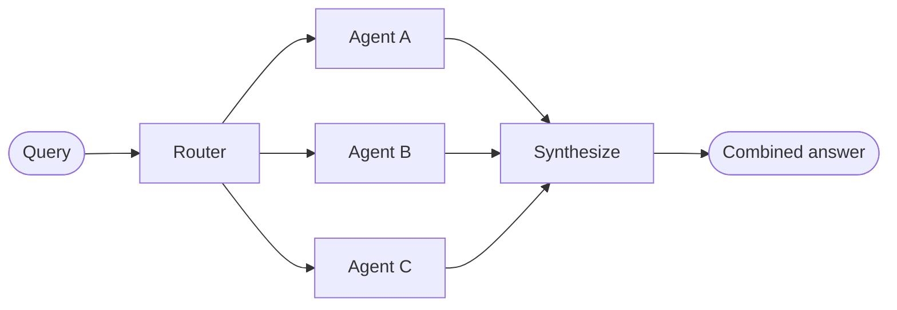
(`02` variant labels B as `Classify` and C/D/E as `GitHub agent` / `Notion agent` / `Slack agent`.)

**Handoffs sequence (`03`):**
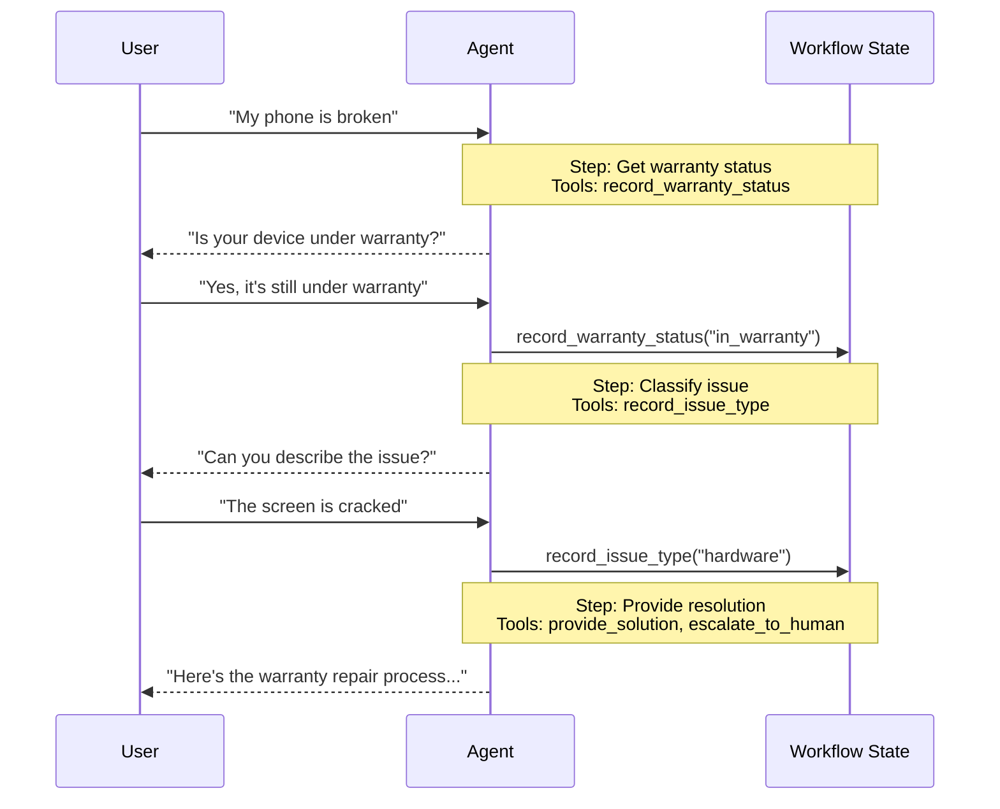

**Customer-support state machine (`04`):**
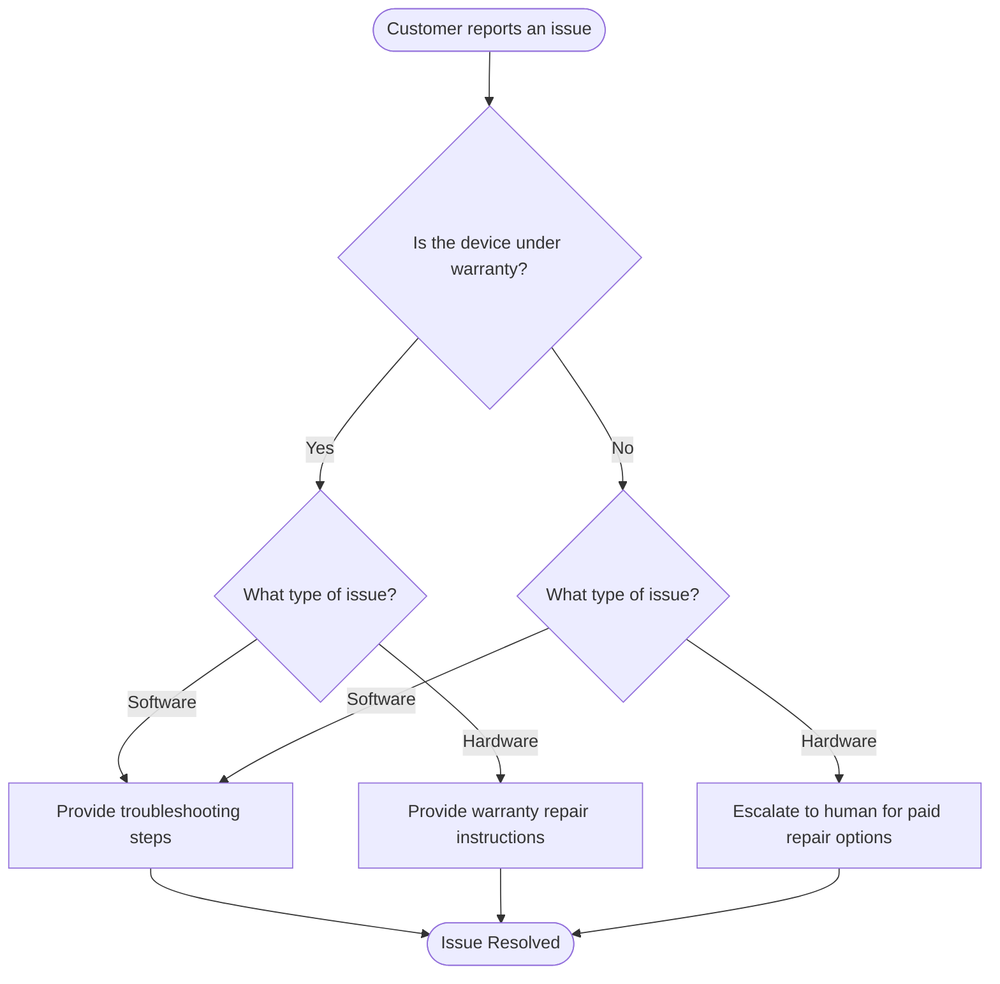

**Subagents — main agent hub (`05`):**
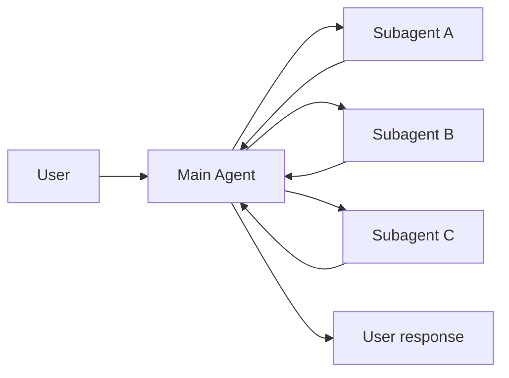

**Subagents — single dispatch tool (`05`):**
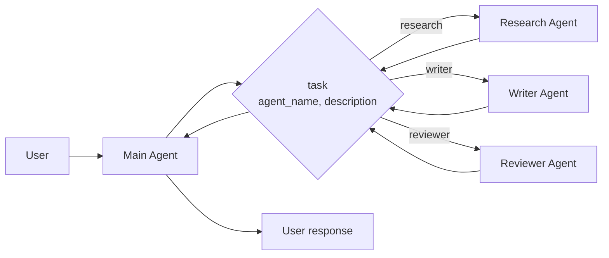

**Subagents sync sequence (`05`):**
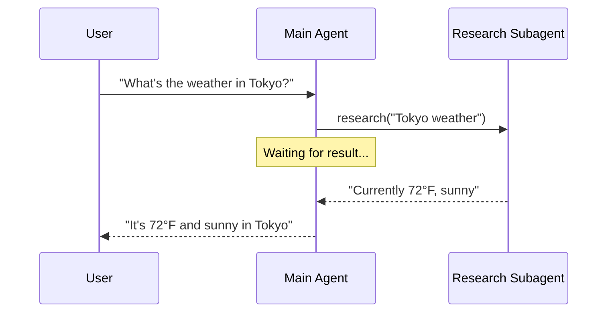

**Subagents async sequence (`05`):**
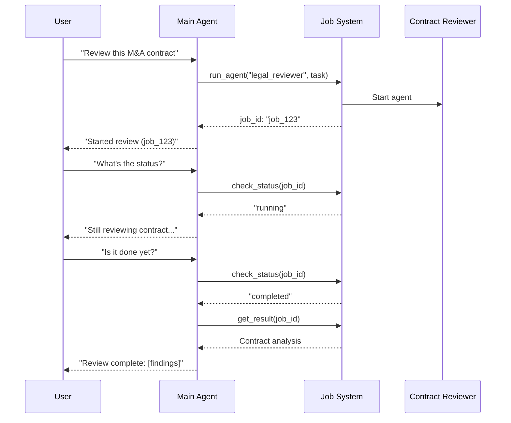

**Skills (`07`):**
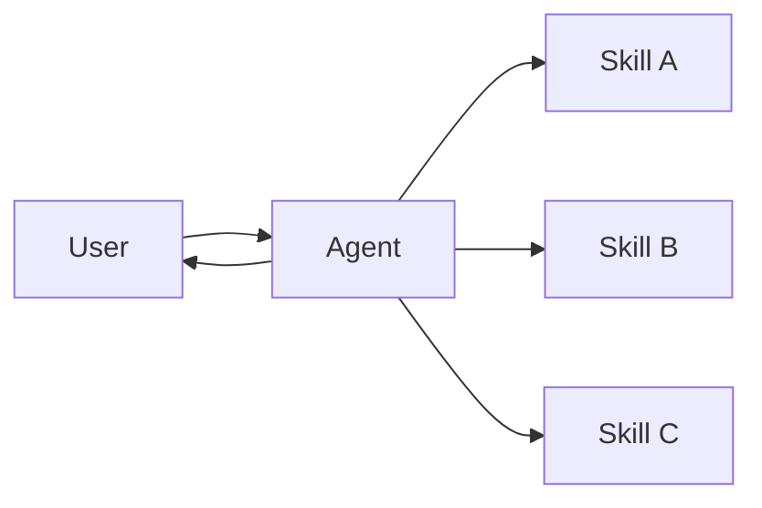

**Skills SQL progressive disclosure (`08`):**
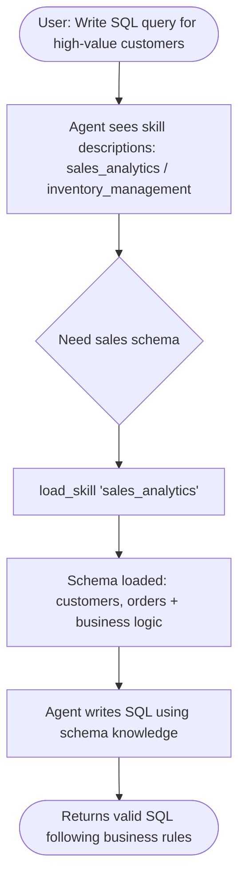

**Custom workflow (`09`):**
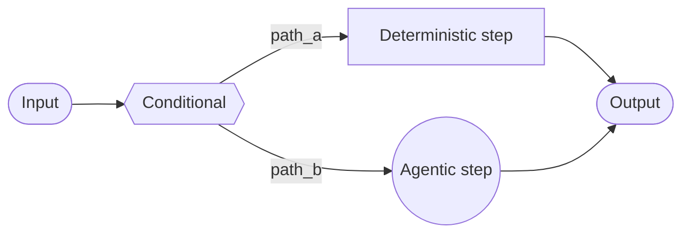

**Custom RAG workflow (`09`):**
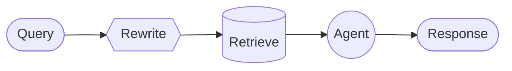

**Voice — Sandwich (`29`):**
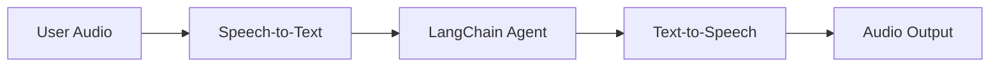

**Voice — S2S (`29`):**
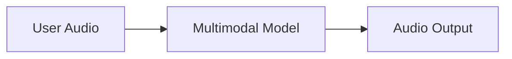

### Proposed clean diagrams

**Router (decompose → parallel → synthesize):**
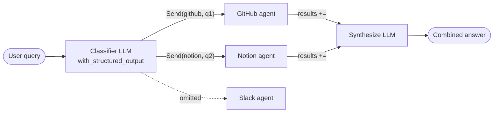

**Supervisor (hub-and-spoke, tool-call delegation):**
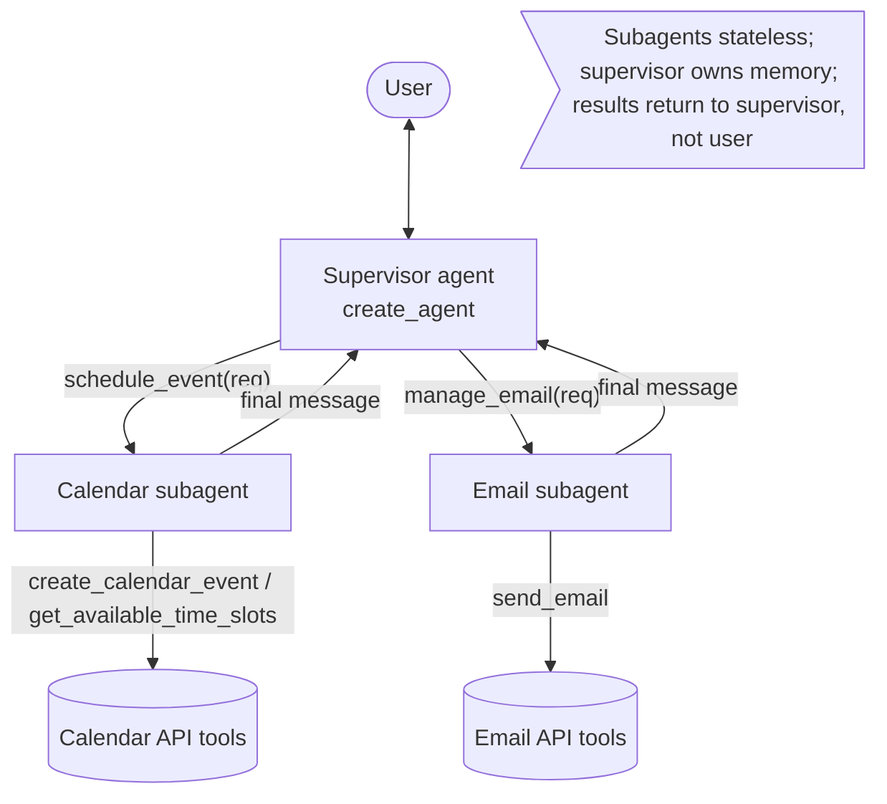

**Handoff / swarm (control transfer, decentralized):**
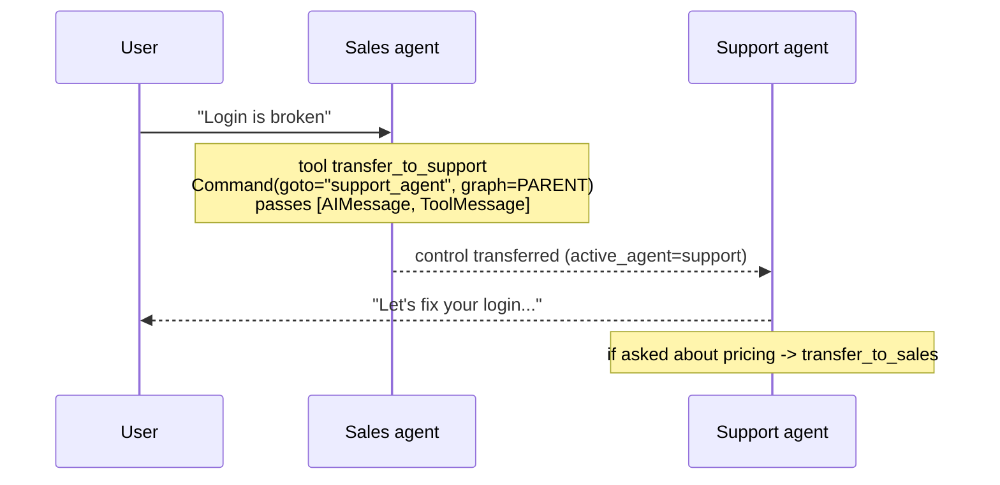

**Subagent-as-tool (the wrapping mechanism):**
```mermaid
flowchart LR
    MA[Main agent] -- "tool call: research(query)" --> W{{@tool wrapper}}
    W -- "subagent.invoke({messages:[user:query]})" --> SA[Research subagent<br/>isolated context window]
    SA -- "result['messages'][-1].content" --> W
    W -- "return string (ToolMessage)" --> MA
```

**Pattern-selection decision tree (proposed):**
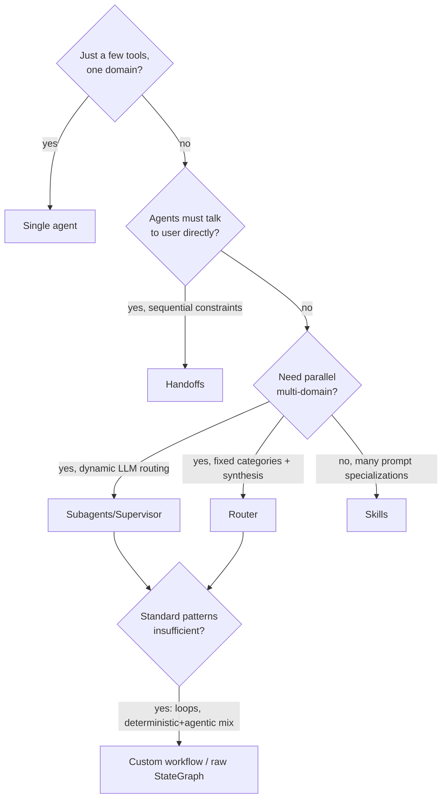
