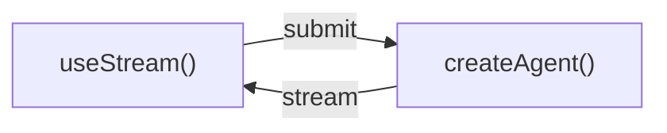
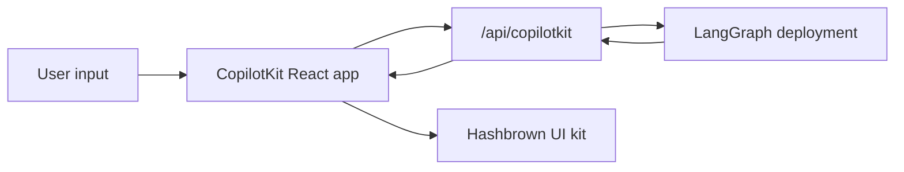
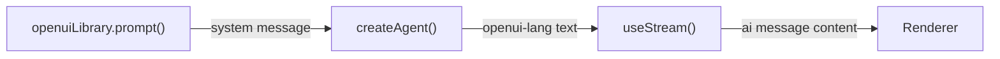

# Buffer 8 — MCP + Frontend SDK + UI Integrations (raw extraction)

Source files (all under `langchain-docs/python/langchain/`): `16-mcp.md`, `frontend/00-overview.md` … `frontend/11-headless-tools.md`, `frontend/integrations/01-04`.

NOTE on the frontend pattern files: each `frontend/NN-*.md` opens with a ~860-line `PatternEmbed` React component (an MDX `export const`) that is pure docs-site plumbing — it renders a cached iframe pointing at `https://ui-patterns.langchain.com/{react,vue,svelte,angular}` (local dev hosts `http://localhost:4100/4200/4300/4400`) and talks to a deployed agent at `PROD_AGENT_API_BASE = https://ui-patterns.langchain.com/api/langgraph` or `http://127.0.0.1:2024` for local. It uses a host↔guest `postMessage` protocol (`SET_THEME`, `SET_PATTERN`, `SET_VIEW`, `SET_LANGUAGE`, `UPDATE_CODE`, `RESET`, `TRACK_EVENT` host→guest; `READY`, `RESIZE`, `ERROR`, `RUN_STARTED`, `TRACE_URL`, `THREAD_CLEARED` guest→host). This is NOT the agent streaming protocol — it's only relevant as a confirmation that the live demos run a real LangGraph agent server on **port 2024** and expose a per-run **trace URL** (LangSmith). The actual content of each file begins after that block. I extracted only the content.

================================================================================
# PART A — MCP (Model Context Protocol)
================================================================================

## A1. Purpose — why a protocol for tools/context

MCP (https://modelcontextprotocol.io) is "an open protocol that standardizes how applications provide tools and context to LLMs." It is the interop/standardization layer: any MCP server's tools/resources/prompts can be consumed by any MCP-aware client (Claude Desktop, IDEs, LangChain agents, etc.) without bespoke glue. LangChain agents consume MCP-defined tools via the **`langchain-mcp-adapters`** library (https://github.com/langchain-ai/langchain-mcp-adapters). The mental model used in this teaching corpus: MCP is the **USB-C of tools** — one standard connector so a tool written once is usable everywhere.

Install:
```bash
pip install langchain-mcp-adapters     # or: uv add langchain-mcp-adapters
```

## A2. Building blocks (exhaustive)

**`MultiServerMCPClient`** (`from langchain_mcp_adapters.client import MultiServerMCPClient`) — the central client. Takes a dict mapping a logical server name → connection config. Key behavioral fact: **stateless by default**. "Each tool invocation creates a fresh MCP `ClientSession`, executes the tool, and then cleans up." For persistent state use `client.session(...)`.

Connection config per server includes:
- `transport`: `"stdio"` | `"http"` (a.k.a. `"streamable-http"`) | `"sse"` (deprecated by MCP spec).
- stdio fields: `command` (e.g. `"python"`), `args` (e.g. `["/abs/path/math_server.py"]`).
- http fields: `url` (e.g. `"http://localhost:8000/mcp"`), optional `headers` (auth/tracing), optional `auth` (an `httpx.Auth` impl).

**Loading tools into an agent:**
- `tools = await client.get_tools()` → returns LangChain tools, pass directly to `create_agent(model, tools)`.
- `from langchain_mcp_adapters.tools import load_mcp_tools` → `tools = await load_mcp_tools(session)` (used with an explicit session).
- MCP tools are converted into normal LangChain tools, "directly usable in any LangChain agent or workflow."

**Tool error handling:** By default, when an MCP tool fails (`CallToolResult(isError=True)`), the error is passed back to the model as a `ToolMessage` with `status="error"` rather than raising — lets the agent read the error and retry. Set `handle_tool_errors=False` on `MultiServerMCPClient` or `load_mcp_tools` to raise instead. Transport/session/content-conversion failures ALWAYS raise. (Returning errors as failed tool messages needs `langchain-mcp-adapters>=0.3.0`; earlier raises `ToolException`.)

**Transports (detail):**
- **HTTP / streamable-http** (`"http"`): HTTP requests for client↔server comms. Supports `headers` and `auth`. Spec: modelcontextprotocol.io/specification/2025-03-26/.../transports#streamable-http.
- **stdio**: client launches the server as a subprocess, communicates over stdin/stdout. Best for local tools/simple setups. Inherently stateful (subprocess persists for the client connection lifetime) — BUT without explicit session management each tool call still makes a new session.
- **sse**: deprecated by the MCP spec; still supports `headers`.

**Authentication:** uses the official MCP SDK (modelcontextprotocol/python-sdk) under the hood → provide a custom auth by implementing the `httpx.Auth` interface, pass as `auth=...` in the server config. Built-in OAuth flow lives at `mcp/client/auth/oauth2.py`.

**Stateful sessions:** `async with client.session("server_name") as session:` yields a persistent `ClientSession`; pass it to `load_mcp_tools(session)`, `load_mcp_resources(session)`, `load_mcp_prompt(session, ...)`. Use when the server maintains context across tool calls (lifecycle spec: .../basic/lifecycle).

**Core MCP feature surfaces (all three convert to LangChain primitives):**
- **Tools** → LangChain tools. `client.get_tools()`.
- **Resources** → `langchain_core.documents.base.Blob` objects (unified text/binary). `blobs = await client.get_resources("server_name")` or `...get_resources("server_name", uris=["file:///path.txt"])`. `blob.metadata['uri']`, `blob.mimetype`, `blob.as_string()`. Also `from langchain_mcp_adapters.resources import load_mcp_resources` with a session.
- **Prompts** → LangChain messages. `messages = await client.get_prompt("server_name", "summarize")` or with `arguments={"language":"python","focus":"security"}`. Also `from langchain_mcp_adapters.prompts import load_mcp_prompt`.

**Structured content:** MCP tools can return `structuredContent` alongside human-readable text. The adapter wraps it in `MCPToolArtifact` and exposes it as the tool's artifact → access via `message.artifact["structured_content"]` on the `ToolMessage`. To make it visible to the model, append it via an interceptor.

**Multimodal tool content:** MCP tools can return images/text. Adapter converts to LangChain standard content blocks → `message.content_blocks` with `block["type"]` of `"text"` / `"image"` (`block.get('url')`, `block.get('base64')`). `message.content` is raw provider-native; `content_blocks` is provider-agnostic.

**Exposing LangChain tools AS an MCP server (custom servers):** use **FastMCP** (`pip install fastmcp`):
```python
from fastmcp import FastMCP
mcp = FastMCP("Math")
@mcp.tool()
def add(a: int, b: int) -> int:
    """Add two numbers"""
    return a + b
if __name__ == "__main__":
    mcp.run(transport="stdio")   # or transport="streamable-http"
```
So FastMCP is the server side; `MultiServerMCPClient` is the client side. (FastMCP server can also be `mcp.server.fastmcp.FastMCP` for elicitation — see below.)

**Advanced features:**
- **Tool interceptors** (`from langchain_mcp_adapters.interceptors import MCPToolCallRequest`): async middleware wrapping each MCP tool call. Passed as `tool_interceptors=[...]` to `MultiServerMCPClient`. Onion order — first in list is outermost. An interceptor signature is `async def f(request: MCPToolCallRequest, handler): ...`. WHY they exist: "MCP servers run as separate processes — they can't access LangGraph runtime information like the store, context, or agent state. Interceptors bridge this gap." Within `create_agent`, interceptors receive `request.runtime` (a `ToolRuntime`) giving `runtime.context` (typed via `context_schema`), `runtime.store`, `runtime.state`, `runtime.tool_call_id`. Capabilities: modify args via `request.override(args=...)`, modify HTTP `headers` via `request.override(headers=...)`, short-circuit by returning a `ToolMessage(content=..., tool_call_id=...)`, retry/fallback via try/except, or return a `Command(update={...}, goto="summary_agent" | "__end__")` to update agent state / steer graph flow. Also used to append `structuredContent` to the tool result.
- **Progress notifications** (`from langchain_mcp_adapters.callbacks import Callbacks, CallbackContext`): `callbacks=Callbacks(on_progress=on_progress)`. Callback gets `(progress, total, message, context)`; `context.server_name`, `context.tool_name`.
- **Logging**: `Callbacks(on_logging_message=on_logging_message)`, callback gets `(params: LoggingMessageNotificationParams, context)`; `params.level`, `params.data`.
- **Elicitation** (spec 2025-11-25): servers request additional user input mid-tool-execution. Server uses `await ctx.elicit(message=..., schema=UserDetails)` (where `ctx: Context` from `mcp.server.fastmcp`); result `.action` ∈ {`accept`,`decline`,`cancel`} with `.data`. Client handles via `Callbacks(on_elicitation=on_elicitation)` returning `ElicitResult(action="accept", content={...})`.

## A3. Annotated code (VERBATIM)

**(1) Multi-server client → agent (the canonical quickstart).** WHY: shows stdio + http servers behind one client and `get_tools()` feeding `create_agent`.
```python
import asyncio
from langchain_mcp_adapters.client import MultiServerMCPClient
from langchain.agents import create_agent

async def main():
    client = MultiServerMCPClient(
        {
            "math": {
                "transport": "stdio",  # Local subprocess communication
                "command": "python",
                # Absolute path to your math_server.py file
                "args": ["/path/to/math_server.py"],
            },
            "weather": {
                "transport": "http",  # HTTP-based remote server
                # Ensure you start your weather server on port 8000
                "url": "http://localhost:8000/mcp",
            }
        }
    )

    tools = await client.get_tools()
    agent = create_agent(
        "claude-sonnet-4-6",
        tools
    )
    math_response = await agent.ainvoke(
        {"messages": [{"role": "user", "content": "what's (3 + 5) x 12?"}]}
    )
    weather_response = await agent.ainvoke(
        {"messages": [{"role": "user", "content": "what is the weather in nyc?"}]}
    )
    print(math_response)
    print(weather_response)

if __name__ == "__main__":
    asyncio.run(main())
```

**(2) FastMCP servers (both transports).** WHY: shows the server side — `@mcp.tool()` decorator turns a plain function into an MCP tool; `mcp.run(transport=...)` selects stdio vs streamable-http.
```python
# Math server (stdio transport)
from fastmcp import FastMCP
mcp = FastMCP("Math")

@mcp.tool()
def add(a: int, b: int) -> int:
    """Add two numbers"""
    return a + b

@mcp.tool()
def multiply(a: int, b: int) -> int:
    """Multiply two numbers"""
    return a * b

if __name__ == "__main__":
    mcp.run(transport="stdio")

# Weather server (streamable HTTP transport)
from fastmcp import FastMCP
mcp = FastMCP("Weather")

@mcp.tool()
async def get_weather(location: str) -> str:
    """Get weather for location."""
    return "It's always sunny in New York"

if __name__ == "__main__":
    mcp.run(transport="streamable-http")
```

**(3) Interceptor injecting runtime context into MCP tool calls.** WHY: the single most important MCP↔LangGraph bridge — an out-of-process MCP tool gaining access to per-invocation `runtime.context` (user_id/api_key) and rewriting args. Note `context_schema=Context` on `create_agent` and `context={...}` on `ainvoke`.
```python
from dataclasses import dataclass
from langchain_mcp_adapters.client import MultiServerMCPClient
from langchain_mcp_adapters.interceptors import MCPToolCallRequest
from langchain.agents import create_agent

@dataclass
class Context:
    user_id: str
    api_key: str

async def inject_user_context(
    request: MCPToolCallRequest,
    handler,
):
    """Inject user credentials into MCP tool calls."""
    runtime = request.runtime
    user_id = runtime.context.user_id
    api_key = runtime.context.api_key

    # Add user context to tool arguments
    modified_request = request.override(
        args={**request.args, "user_id": user_id}
    )
    return await handler(modified_request)

client = MultiServerMCPClient(
    {...},
    tool_interceptors=[inject_user_context],
)
tools = await client.get_tools()
agent = create_agent("gpt-5.4", tools, context_schema=Context)

# Invoke with user context
result = await agent.ainvoke(
    {"messages": [{"role": "user", "content": "Search my orders"}]},
    context={"user_id": "user_123", "api_key": "sk-..."}
)
```

Supporting verbatim snippets worth keeping:
- Persistent session: `async with client.session("server_name") as session: tools = await load_mcp_tools(session); agent = create_agent("google_genai:gemini-3.5-flash", tools)`.
- Headers: `"headers": {"Authorization": "Bearer YOUR_TOKEN", "X-Custom-Header": "custom-value"}` inside the server config.
- Interceptor returning a Command: `return Command(update={"messages":[result], "task_status":"completed"}, goto="summary_agent")` and end-early `goto="__end__"`.
- Elicitation server: `result = await ctx.elicit(message=f"Please provide details for {name}'s profile:", schema=UserDetails)`; client callback returns `ElicitResult(action="accept", content={"email": "user@example.com", "age": 25})`.

## A4. Advanced concepts
- **USB-C of tools**: one standard so a tool authored once (as an MCP server) plugs into any MCP client.
- **Client vs server roles**: server = FastMCP process exposing tools/resources/prompts; client = `MultiServerMCPClient` (or any MCP host) consuming them. The SAME LangChain code can be on either side — expose your LangChain tools via FastMCP, OR consume others' MCP tools via the adapters.
- **Auth**: at transport level via `httpx.Auth` (custom or built-in OAuth2); per-call dynamic headers via interceptors (`request.override(headers=...)`).
- **Stateless vs stateful**: default fresh-session-per-call (safe, simple); opt into `client.session()` for stateful servers.
- **Process isolation gap & interceptors**: because servers are separate processes, interceptors are the ONLY way to feed LangGraph runtime (state/store/context) into a tool call or to translate results back into state updates / graph control.

## A5. Cross-framework interaction points (MCP)
- **MCP ↔ tools/`create_agent`**: `client.get_tools()` returns LangChain tools that are passed straight into `create_agent(model, tools)` — MCP tools become first-class agent tools, indistinguishable from native ones.
- **MCP ↔ LangGraph runtime**: interceptors receive `ToolRuntime` → read `runtime.state` / `runtime.store` / `runtime.context` / `runtime.tool_call_id`, and may return `Command(update=..., goto=...)` to mutate agent state or jump graph nodes (incl. `"__end__"`).
- **MCP ↔ messages/content blocks**: MCP multimodal/structured results surface as `ToolMessage.content_blocks` and `ToolMessage.artifact["structured_content"]`.
- **MCP ↔ FastMCP**: FastMCP is the server-side counterpart that publishes tools; `MultiServerMCPClient` is the consumer.
- **MCP ↔ LangSmith**: MCP tool calls are traceable alongside agent reasoning (tracing quickstart referenced).
- **MCP ↔ HITL/elicitation**: elicitation (`ctx.elicit`) is server-driven mid-execution user input, handled by a client callback — conceptually parallel to LangGraph interrupts but driven from the MCP server side.

================================================================================
# PART B — FRONTEND SDK (React/JS consuming a deployed LangGraph agent)
================================================================================

## B1. Purpose — why a frontend SDK
Turn an agent built with `createAgent` / `create_agent` (compiled to a LangGraph graph, deployed behind the LangGraph Agent Server) into a rich, streaming, agentic UX — not merely a token-streaming chatbot. Quote: "LangChain frontend SDKs are built for **agent applications** … The same hook that renders messages also exposes the agent's durable thread state, tool-call lifecycle, interrupts, checkpoint history, and custom state values, so your UI can become a control plane for long-running agent work."

What the SDKs expose beyond text append: durable threads (reload/switch device/rejoin), typed agent state (render any state key, not just messages), tool-call lifecycle (pending/done/failed cards), interrupts (pause for human approval/edit then resume from the exact point), checkpoints (edit/retry/branch/audit/time-travel), nested execution (deep agents/subagents), framework-native reactivity.

**The SDK / hooks / API:**
- Hook: **`useStream`** in React/Vue/Svelte; **`injectStream`** in Angular.
  - `import { useStream } from "@langchain/react";` (also `@langchain/vue`, `@langchain/svelte`)
  - `import { injectStream } from "@langchain/angular";`
- Underlying client: the **LangGraph SDK (JS)** — `stream.client` exposes `client.threads.getHistory(threadId)`, `client.runs.cancel(...)`. Types: `ThreadState`, `MessageMetadata`, `SubmissionQueueEntry`, `AssembledToolCall`, `HITLRequest`/`HITLResponse`.
- The server is the LangGraph Agent Server (run locally with `langgraph dev`, default `http://localhost:2024`, or deploy to LangSmith). Several patterns (time-travel, branching, join/rejoin, message-queues) explicitly REQUIRE the LangGraph Agent Server.
- `assistantId` = the graph name from `langgraph.json`.
- Reference "Agent Chat UI" / "UI patterns playground" = the live demo app at ui-patterns.langchain.com.

**Architecture (verbatim mermaid from overview):**

"On the backend, `createAgent` produces a compiled LangGraph graph that exposes a streaming API. On the frontend, the stream handle connects to that API and provides reactive state — messages, tool calls, interrupts, values, and thread metadata."

## B2. Building blocks (exhaustive, per-feature hook/API names)

### `useStream` config (options seen across files)
```ts
const stream = useStream<typeof myAgent | AgentState>({
  apiUrl: "http://localhost:2024",
  assistantId: "agent",        // graph name from langgraph.json
  threadId,                    // reactive; bind to a thread
  onThreadId: setThreadId,     // persist new thread ids (sessionStorage etc.)
  tools: [memoryPut, ...],     // client-side (headless) tool implementations
});
```
Type inference: pass a TS interface (matching agent state schema) as the type param for typed `stream.messages`, `stream.toolCalls`, `stream.interrupt`, `stream.values`. Extend the interface with custom state keys (e.g. `todos: Todo[]`). Examples use `useStream<typeof myAgent>`.

### `useStream` returns / reactive state (union across all patterns)
- `stream.messages` — `BaseMessage[]` (reactive). In Vue these are `.value`; Angular `stream.messages()`.
- `stream.toolCalls` — unified `AssembledToolCall[]` (real-time tool-call lifecycle).
- `stream.interrupt` — current interrupt payload (`HITLRequest` or custom), or `null`.
- `stream.values` — typed agent state values.
- `stream.isLoading` — boolean; true while a run streams.
- `stream.client` — LangGraph SDK client (`client.threads.getHistory`, `client.runs.cancel`).
- `stream.submit(input, options?)` — start/queue a run.
- `stream.stop()` — **cancels** the active run (client disconnect + server cancel).
- `stream.disconnect()` — alias for `stop({ cancel: false })` — leave client-side, server keeps running.
- Callbacks on `submit`/config: `onThreadId(id)`, `onCreated(run)` (run.runId), `onTool` (tool lifecycle).

### `submit` shapes (load-bearing)
- New human message: `stream.submit({ messages: [{ type: "human", content: text }] })`.
- Resume an interrupt: `stream.submit(null, { command: { resume: hitlResponse } })`.
- Fork/time-travel: `stream.submit({}, { forkFrom: { checkpointId } })` (also `stream.submit(undefined, { forkFrom: { checkpointId } })` to regenerate).
- Enqueue behind active run: `stream.submit(values, { multitaskStrategy: "enqueue" })`.
- System prompt injection (OpenUI): include `{ type: "system", content: SYSTEM_PROMPT }` first when `stream.messages.length === 0`.

### Per-feature primitives

**Tool calling.** Each AI message emits tool calls (`name`, `args`, `id`). `stream.toolCalls` unifies them. Each entry is `AssembledToolCall`:
```ts
interface AssembledToolCall<TName, TInput, TOutput> {
  name: TName; callId: string; id: string; namespace: string[];
  input: TInput; args: TInput; output: TOutput | null;
  status: "running" | "finished" | "error"; error: string | undefined;
}
```
Filter per message by matching `tc.callId` to `message.tool_calls[].id`. Cards switch on `tc.name`; handle all 3 states. Utility type `ToolCallFromTool<typeof getWeather>` for typed `args`. Tool calls update in place (same `callId` running→finished/error). Parallel tool calls = multiple `running` entries simultaneously.

**Structured output.** Agent calls a "structured output" tool whose args ARE the typed payload (tool runs no logic). Extract from last `AIMessage.tool_calls[0].args`. Guard partial JSON during streaming (`requiredFields` check); render progressively in schema order. Use `stream.isLoading` for loading state.

**Generative UI (json-render).** Library: **json-render** (json-render.dev), packages `@json-render/core`, `@json-render/react` (also vue). Flow: (1) `defineCatalog(schema, { components: {...} })` — each component has a Zod `props` schema + `description` the AI reads; (2) prompt the AI; (3) AI returns a flat JSON spec `{ root, elements: { id: { type, props, children } } }` via a tool call (`aiMessage.tool_calls[0].args`); (4) `defineRegistry(catalog, { components: {...} })` maps catalog → real components; render with `<JSONUIProvider registry={registry}><Renderer spec={spec} registry={registry} loading={stream.isLoading} /></JSONUIProvider>`. The catalog is a guardrail — AI can only use defined components/props. Stream progressively: filter elements lacking `type`/`props`, pass `loading={true}` so Renderer skips not-yet-arrived children.

**Reasoning tokens.** Reasoning-capable models (GPT-5, Claude extended thinking) emit typed content blocks on `AIMessage.contentBlocks`: `{ type: "reasoning", reasoning: "..." }` and `{ type: "text", text: "..." }`. Filter by `type`; join multiple reasoning blocks. Render a collapsible `ThinkingBubble`; set `isStreaming` on the last message while `stream.isLoading`. Edge cases: messages without reasoning, empty reasoning blocks (filter `.reasoning.trim().length > 0`), interleaved reasoning/text (iterate `contentBlocks` in order).

**Markdown messages.** `useStream` accumulates streamed tokens into `msg.text`, reactive. Pipeline: receive → parse (React `react-markdown`+`remark-gfm` → React elements, no `dangerouslySetInnerHTML`; Vue/Svelte/Angular `marked`+`dompurify` → sanitized HTML via `v-html`/`{@html}`/`[innerHTML]`) → render. ALWAYS sanitize raw-HTML paths with DOMPurify (LLM output is untrusted). Enable GFM and `breaks: true`. `marked` ~1MB/s; throttle with rAF for >50KB.

**Human-in-the-loop UI.** Built on LangGraph interrupts + checkpoints (durable pause). Flow: agent hits interrupt → emits payload → `stream.interrupt` set → render approval card → user decides → `stream.submit(null, { command: { resume: response } })` → `interrupt` resets to `null` as the agent resumes. Payload type `HITLRequest`:
```ts
interface HITLRequest { actionRequests: ActionRequest[]; reviewConfigs: ReviewConfig[]; }
interface ActionRequest { name: string; args: Record<string, unknown>; description?: string; }
interface ReviewConfig { allowedDecisions: ("approve" | "reject" | "edit" | "respond")[]; }
```
`HITLResponse = { decisions: Decision[] }` — ONE decision per pending action. Decision types: `{type:"approve"}`; `{type:"reject", message?}` (tool not executed, reason returned to model); `{type:"edit", editedAction:{name,args}}` (tool runs with edited args); `{type:"respond", message}` (message becomes the tool result without executing — for `ask_user`-style placeholder tools; do NOT use respond to deny). Durable across refresh via the thread checkpoint. Can chain multiple HITL checkpoints per run.

**Time travel.** Requires LangGraph Agent Server. Every node execution persists a checkpoint = `ThreadState` { `checkpoint` (id/timestamp), `values` (full state incl. messages), `tasks` (scheduled-next nodes), `next` (upcoming node names) }. Fetch history: `await stream.client.threads.getHistory(threadId)` → `ThreadState[]`. Resume/fork from a checkpoint: `stream.submit({}, { forkFrom: { checkpointId: cp.checkpoint.checkpoint_id } })` — rolls back, re-executes from that point, streams new results; creates a branch; original timeline preserved. Interrupt-bearing checkpoints flagged via `cp.tasks?.some(t => t.interrupts?.length)`.

**Branching chat.** Conversation = checkpointed tree, not flat list. Helper `useMessageMetadata(stream, messageId)` → `MessageMetadata` whose `parentCheckpointId` is the checkpoint just before that message. Edit a user msg: `stream.submit({ messages:[{type:"human", content:newText}] }, { forkFrom:{ checkpointId: metadata.parentCheckpointId } })`. Regenerate an AI msg: `stream.submit(undefined, { forkFrom:{ checkpointId: metadata.parentCheckpointId } })`. Both fork from the parent checkpoint; original path stays in history (`client.threads.getHistory`). Disable while `stream.isLoading`.

**Join / rejoin streams.** Decouples client from server run. Mechanisms: bind `threadId`; persist via `onThreadId` (state + `sessionStorage`); `stream.disconnect()` (= `stop({cancel:false})`) leaves while agent keeps running server-side; remount with the same `threadId` (React: bump a `mountKey`) to reattach to in-flight work and receive messages generated while away. CRITICAL distinction: `stream.stop()` cancels the run; `stream.disconnect()` does not. To cancel from app code use `stream.stop()` or `client.runs.cancel`. After rejoin: if still running `isLoading` true; if finished you get final state immediately. Use Page Visibility API to auto-rejoin.

**Message queues.** `multitaskStrategy: "enqueue"` makes a submission wait behind the active run; queued submissions append to the active thread's queue and dispatch automatically on completion. Helper `useSubmissionQueue(stream)` (React/Vue/Svelte) / `injectSubmissionQueue(stream)` (Angular). Returns: `queue.entries` (`SubmissionQueueEntry[]`), `queue.size`, `queue.cancel(id)`, `queue.clear()`. `SubmissionQueueEntry` = `{ id, values, options, createdAt }`. Cancellation only affects not-yet-started entries (use `stream.stop()` for the running one). `onCreated(run)` callback fires when a run is created (hook for chaining follow-ups). New thread = set reactive `threadId` to `null`.

**Headless tools.** Tool SCHEMA on the agent, IMPLEMENTATION in the browser (IndexedDB, geolocation, clipboard, canvas, file pickers; privacy-sensitive/local data). Mechanism: (1) server tool immediately calls `interrupt({...})` to defer to the frontend; (2) mirror the same tool names+schemas client-side via `tool({ name, description, schema })` from `langchain`; (3) attach browser behavior with `definition.implement(async (args) => {...})`; (4) pass implementations to `useStream({ tools: [...] })` — when the agent emits a matching tool call the hook runs the client impl and resumes the interrupted run with the result. Render via `stream.toolCalls` (types `ToolCallWithResult`, `DefaultToolCall` from `@langchain/react`), match `tc.call.id` to `message.tool_calls[].id`. Pair with HITL for sensitive actions. Return only JSON-serializable values.

## B3. Annotated code (VERBATIM)

**(1) Minimal `useStream` setup (overview).** WHY: the canonical wiring — `apiUrl` + `assistantId`, render `stream.messages`.
```tsx
import { useStream } from "@langchain/react";
import type { GraphState } from "./types";

function Chat() {
  const stream = useStream<GraphState>({
    apiUrl: "http://localhost:2024",
    assistantId: "agent",
  });

  return (
    <div>
      {stream.messages.map((msg) => (
        <Message key={msg.id} message={msg} />
      ))}
    </div>
  );
}
```
Matching backend (overview) — note `checkpointer=MemorySaver()` is what makes durable threads / time-travel / HITL possible:
```python
from langchain import create_agent
from langgraph.checkpoint.memory import MemorySaver

agent = create_agent(
    model="openai:gpt-5.4",
    tools=[get_weather, search_web],
    checkpointer=MemorySaver(),
)
```

**(2) HITL: render interrupt + resume.** WHY: shows `stream.interrupt` surfacing the pause and `submit(null, { command: { resume } })` resuming from the exact checkpoint.
```tsx
import { useStream } from "@langchain/react";

const AGENT_URL = "http://localhost:2024";

export function Chat() {
  const stream = useStream<typeof myAgent>({
    apiUrl: AGENT_URL,
    assistantId: "human_in_the_loop",
  });

  const interrupt = stream.interrupt;

  return (
    <div>
      {stream.messages.map((msg) => (
        <Message key={msg.id} message={msg} />
      ))}
      {interrupt && (
        <ApprovalCard
          interrupt={interrupt}
          onRespond={(response) =>
            stream.submit(null, { command: { resume: response } })
          }
        />
      )}
    </div>
  );
}
```
Decision payloads (verbatim): approve `{ decisions: [{ type: "approve" }] }`; reject `{ decisions: [{ type: "reject", message: "..." }] }`; edit `{ decisions: [{ type: "edit", editedAction: { name, args: {...} } }] }`; respond `{ decisions: [{ type: "respond", message: "Blue." }] }`.

**(3) Time travel: fetch history + fork from checkpoint.** WHY: the explicit client↔server protocol for checkpoints — `client.threads.getHistory` to read, `submit({}, { forkFrom: { checkpointId } })` to resume.
```tsx
import { useStream } from "@langchain/react";
import { useEffect, useState } from "react";

const AGENT_URL = "http://localhost:2024";

export function TimeTravelChat() {
  const [threadId, setThreadId] = useState<string | null>(null);
  const [history, setHistory] = useState<ThreadState[]>([]);
  const stream = useStream<typeof myAgent>({
    apiUrl: AGENT_URL,
    assistantId: "time_travel",
    threadId,
    onThreadId: setThreadId,
  });

  useEffect(() => {
    if (!threadId || stream.isLoading) return;
    stream.client.threads.getHistory(threadId).then(setHistory);
  }, [stream.client, threadId, stream.isLoading]);

  function resumeFrom(cp: ThreadState) {
    stream.submit({}, {
      forkFrom: { checkpointId: cp.checkpoint.checkpoint_id },
    });
  }

  return (
    <div className="flex h-screen">
      <ChatPanel messages={stream.messages} />
      <TimelineSidebar history={history} onSelect={resumeFrom} />
    </div>
  );
}
```

**(4) Generative UI: progressive render of a streamed json-render spec.** WHY: shows the generative-UI mechanism — filter incomplete elements, render inside `JSONUIProvider` with `loading={stream.isLoading}`.
```tsx
const spec = (() => {
  if (!rawSpec?.root || !rawSpec?.elements) return null;
  const rootEl = rawSpec.elements[rawSpec.root];
  if (!rootEl?.type || rootEl?.props == null) return null;

  const safeElements = {};
  for (const [key, el] of Object.entries(rawSpec.elements)) {
    if (el?.type && el?.props != null) {
      safeElements[key] = el;
    }
  }
  return { root: rawSpec.root, elements: safeElements };
})();

return (
  <>
    {spec && (
      <JSONUIProvider registry={registry}>
        <Renderer spec={spec} registry={registry} loading={stream.isLoading} />
      </JSONUIProvider>
    )}
  </>
);
```
(`rawSpec = aiMessage?.tool_calls?.[0]?.args`; the spec format is the flat `{root, elements:{id:{type,props,children}}}` JSON.)

**(5) Headless tools: agent-side interrupt + client-side implement + wire into useStream.** WHY: the schema/impl split and the interrupt→resume handshake that runs a tool in the browser.
```python
# agent.py
from langgraph.types import interrupt
from langchain.tools import ToolRuntime, tool

def _interrupt_for_client(tool_name, args, runtime: ToolRuntime):
    return interrupt({
        "type": "tool",
        "tool_call": {"id": runtime.tool_call_id, "name": tool_name, "args": args},
    })

@tool("memory_put", description="Store a memory in the user's browser.", args_schema=MemoryPutInput)
def memory_put(key: str, value, runtime: ToolRuntime):
    return _interrupt_for_client("memory_put", {"key": key, "value": value}, runtime)
```
```ts
// impl.ts (mirror schema + attach browser behavior)
export const memoryPut = memoryPutDefinition.implement(async ({ key, value }) => {
  await saveMemory(key, value);
  return { success: true, key };
});
// Chat.tsx
const stream = useStream<AgentState>({
  apiUrl: AGENT_URL,
  assistantId: "headless_tools",
  tools: [memoryPut, memoryGet, geolocationGet],
});
```

**(6) Join/rejoin: disconnect vs stop.** WHY: load-bearing distinction for durable runs.
```tsx
const stream = useStream<typeof myAgent>({
  apiUrl: "http://localhost:2024",
  assistantId: "join_rejoin",
  threadId,
  onThreadId(id) {
    setThreadId(id);
    if (id) sessionStorage.setItem("activeThreadId", id);
  },
});
const disconnect = useCallback(() => {
  void stream.disconnect();   // == stream.stop({ cancel: false }); agent keeps running
  setConnected(false);
}, [stream]);
// rejoin = remount with same threadId (bump mountKey)
```

## B4. Advanced concepts
- **Streaming protocol (server↔client)**: backend `createAgent`/`create_agent` → compiled LangGraph graph → LangGraph Agent Server exposes a `/threads` + `/runs` streaming HTTP API on port 2024. `useStream` connects, `submit` POSTs a run (new input, or a `command`/`forkFrom`/`multitaskStrategy` option), and the server streams events that the hook assembles into reactive `messages`, `toolCalls`, `interrupt`, `values`, and thread metadata. `stream.client` (LangGraph SDK JS) is the lower-level surface (`threads.getHistory`, `runs.cancel`). The connection is resumable: state lives in the thread's checkpoints server-side, so disconnect/remount reattaches.
- **Optimistic / in-place UI**: tool-call cards transition `running→finished/error` on the same `callId`; structured output and generative UI render fields/elements as they arrive (progressive rendering keyed on completeness).
- **Resuming interrupted runs**: interrupts are durable checkpoints; the client resumes by POSTing `command: { resume }` — survives page refresh, can be answered from a different component/device.
- **Time-travel from the UI**: `forkFrom: { checkpointId }` rolls the server back to a checkpoint and re-executes, producing a branch while preserving history.
- **Generative UI mechanism**: a constrained component catalog (json-render/openui-lang/Hashbrown) is the contract; the model emits validated structured data (JSON spec or an openui-lang program), and a `Renderer` materializes real components — the model never emits raw JSX.

## B5. Cross-framework interaction points (FRONTEND — server↔client protocol detail)
- **Frontend ↔ LangGraph server**: `useStream({apiUrl, assistantId})` connects to the LangGraph Agent Server's streaming API; `assistantId` = graph name in `langgraph.json`; `submit` starts runs, the server streams events the hook turns into `messages`/`toolCalls`/`interrupt`/`values`. Lower-level `stream.client` = LangGraph SDK (`threads.getHistory`, `runs.cancel`).
- **Frontend HITL ↔ LangGraph interrupt/Command**: server emits an interrupt → `stream.interrupt` (`HITLRequest`); client resumes via `stream.submit(null, { command: { resume: HITLResponse } })`; decisions map to approve/reject/edit/respond on the server's tool execution.
- **Frontend time-travel ↔ LangGraph checkpoints**: `client.threads.getHistory(threadId)` → `ThreadState[]` (one per node execution); `submit({}, { forkFrom: { checkpointId } })` rolls back + re-executes → branch.
- **Frontend branching ↔ checkpoints**: `useMessageMetadata().parentCheckpointId` + `forkFrom` to edit/regenerate from the message's parent checkpoint.
- **Frontend join/rejoin ↔ durable runs**: `disconnect()` (= `stop({cancel:false})`) leaves the run alive server-side; remount with persisted `threadId` reattaches; `stop()`/`client.runs.cancel` actually cancels.
- **Frontend message-queues ↔ run scheduling**: `multitaskStrategy:"enqueue"` queues runs on the active thread server-side; `useSubmissionQueue` reads/cancels the queue.
- **Generative UI ↔ agent/tools**: agent uses structured-output tool → `aiMessage.tool_calls[0].args` carries the UI spec; client catalog constrains/validates it.
- **Headless tools ↔ interrupt/Command**: server tool calls `interrupt({type:"tool", tool_call:{...}})`; `useStream({tools})` runs the browser impl and resumes the run with the result.
- **Reasoning/markdown/tool-calling ↔ messages**: render off `AIMessage.contentBlocks` / `msg.text` / `stream.toolCalls` (`AssembledToolCall`).

### Integrations ↔ LangGraph
- **AI Elements ↔ LangGraph**: shadcn/ui source components (`Conversation`, `Message`, `Tool`, `Reasoning`, `PromptInput`) wired directly to `stream.messages`; install via `npx ai-elements@latest add ...`; map `HumanMessage`/`AIMessage` instances; read reasoning from `msg.contentBlocks`, tool calls from `msg.tool_calls`, submit via `PromptInput` → `stream.submit`. Use `MessageResponse` for streaming; gate on `*.isInstance`.
- **assistant-ui ↔ LangGraph**: headless React runtime; bridge via `useExternalStoreRuntime` — convert `BaseMessage[]` → `ThreadMessageLike[]` (`toThreadMessages`: human→user text, AI→reasoning+tool-call+text parts, ToolMessage results attached to preceding assistant tool-call by `tool_call_id`), `onNew` → `stream.submit`, `onCancel` → `stream.stop()`; wrap in `AssistantRuntimeProvider`, render `<Thread />`. Built-in branching pairs with `useMessageMetadata`+`forkFrom`; persist `threadId` via `onThreadId`.
- **CopilotKit ↔ LangGraph (AG-UI protocol)**: server-side `CopilotKitMiddleware` (added to `create_agent`/`create_deep_agent` `middleware=[...]`) makes the graph speak the **Agent UI (AG-UI)** wire protocol, merging the shared `copilotkit` state slice, frontend tool calls, and context. The LangGraph deployment ALSO serves a custom FastAPI route (mounted via `http.app` in `langgraph.json`, e.g. `./main.py:app`) using `add_langgraph_fastapi_endpoint(app, agent=LangGraphAGUIAgent(name, description, graph), path="/")`. State subclasses `CopilotKitState`. Structured generative UI: client `useAgentContext({description:"output_schema", value: s.toJsonSchema(kit.schema)})` ships the UI schema; server middleware (`@wrap_model_call`) forwards it into `ProviderStrategy(schema=..., strict=True)` (structured output). Frontend: `<CopilotKit runtimeUrl="/api/copilotkit">`, `<CopilotChat>`, component registry via Hashbrown `useUiKit`/`exposeComponent`/`exposeMarkdown`; custom renderer parses assistant content against the schema (`useJsonParser`) → `kit.render(value)`. Mermaid (verbatim): User → CopilotKit React app → `/api/copilotkit` → LangGraph deployment → back → Hashbrown UI kit.
- **OpenUI ↔ LangGraph**: generative-UI library; model emits a declarative **openui-lang** program (assignments, `root` = entry point) instead of prose. `openuiLibrary.prompt({...preamble, additionalRules})` builds the system prompt (call once at module load); inject it as a `system` message only on a fresh thread (`stream.messages.length === 0`). Render last AI `msg.text` via `<Renderer response={text} library={openuiLibrary} isStreaming={isLoading && i === lastAiIdx} />`. Heavy progressive-render utilities needed: `truncateAtOpenString`/`closeOrTruncateOpenString`, `useStableText` (gate on complete `name = Expr(…)` statements), `chartDataRefsResolved` (avoid recharts `.map() on null`), `buildProgressiveRoot` (synthesize `root` if model writes it last), `sanitizeIdentifiers` (parser is camelCase-only), `stripCodeFence`. Follow-up buttons: `Button({type:"continue_conversation"})` → `onAction` → resubmit label as next user message. Mermaid (verbatim): `openuiLibrary.prompt()` → `createAgent()` → `useStream()` → `Renderer`.

## B6. Gotchas / version notes
- These patterns use the **v1 frontend SDK** packages (`@langchain/{react,vue,svelte,angular}`); earlier versions have migration guides (links in overview).
- React/Vue/Svelte use `useStream`; **Angular uses `injectStream`** (and `injectSubmissionQueue`). Vue returns `.value`-wrapped reactive refs; Angular returns signal getters (`stream.messages()`).
- `stream.stop()` CANCELS the run by default; for join/rejoin you MUST use `stream.disconnect()` (= `stop({cancel:false})`).
- time-travel, branching, join/rejoin, message-queues REQUIRE the LangGraph Agent Server (`langgraph dev` or LangSmith deploy) and a checkpointer (`MemorySaver()` etc.). Without a checkpointer there are no durable threads/checkpoints.
- Structured output / generative UI: tool `args` may be partial/undefined during streaming — always guard `requiredFields` / element `type`+`props` before rendering.
- Markdown: ALWAYS `dompurify`-sanitize raw-HTML paths (`v-html`/`{@html}`/`[innerHTML]`); React `react-markdown` doesn't need it. Enable GFM + `breaks:true`.
- Reasoning tokens only from extended-thinking models (GPT-5, Claude); filter empty reasoning blocks.
- Queue `cancel`/`clear` only affect not-yet-started entries; running entry needs `stream.stop()`.
- Headless tools must return JSON-serializable values (no DOM nodes/file handles); keep tools narrow.
- OpenUI: parser is camelCase-only; generate the (multi-KB) system prompt once at module load, inject only on fresh threads; naive `useStream`→`Renderer` wiring causes hundreds of no-op re-parses and chart crashes — use the progressive utilities.
- MCP: returning tool errors as failed messages needs `langchain-mcp-adapters>=0.3.0` (older raises `ToolException`); `sse` transport is deprecated by the MCP spec; `MultiServerMCPClient` is stateless unless you use `client.session()`.

================================================================================
## Reusable diagrams
================================================================================

### Verbatim (overview architecture)


### Verbatim (CopilotKit data path)


### Verbatim (OpenUI data path)


### Proposed — client↔server streaming sequence (useStream ↔ LangGraph Agent Server)
```mermaid
sequenceDiagram
  participant UI as useStream (client)
  participant Srv as LangGraph Agent Server (:2024)
  participant G as Compiled graph (create_agent + checkpointer)

  UI->>Srv: submit({messages:[human]})  (POST /threads/{id}/runs, stream)
  Srv->>G: start run (assistantId = graph name)
  G-->>Srv: AI tokens / tool_call(running)
  Srv-->>UI: stream events -> stream.messages, stream.toolCalls(running)
  G-->>Srv: tool result
  Srv-->>UI: toolCalls(finished) update in place
  Note over G,Srv: node executions persist checkpoints (ThreadState)
  G-->>Srv: interrupt({...})  (HITL / headless tool)
  Srv-->>UI: stream.interrupt = HITLRequest ; isLoading=false
  UI->>Srv: submit(null,{command:{resume: HITLResponse}})
  Srv->>G: resume from checkpoint
  G-->>UI: continues streaming ; interrupt -> null
  Note over UI,Srv: disconnect() leaves run alive; remount(threadId) reattaches
  UI->>Srv: client.threads.getHistory(threadId) -> ThreadState[]
  UI->>Srv: submit({},{forkFrom:{checkpointId}})  (time-travel / branch)
```

### Proposed — MCP client/server topology
```mermaid
graph LR
  subgraph Agent process
    A["create_agent(model, tools)"]
    C["MultiServerMCPClient"]
    I["tool_interceptors (ToolRuntime: state/store/context)"]
    A -- get_tools() --> C
    C --- I
  end
  subgraph MCP servers (separate processes)
    S1["FastMCP 'Math' (stdio: command+args)"]
    S2["FastMCP 'Weather' (http: url+headers+auth)"]
  end
  C -- "stdio (subprocess)" --> S1
  C -- "streamable-http" --> S2
  S1 -- "tools / resources / prompts" --> C
  S2 -- "structuredContent / multimodal / elicitation" --> C
```
