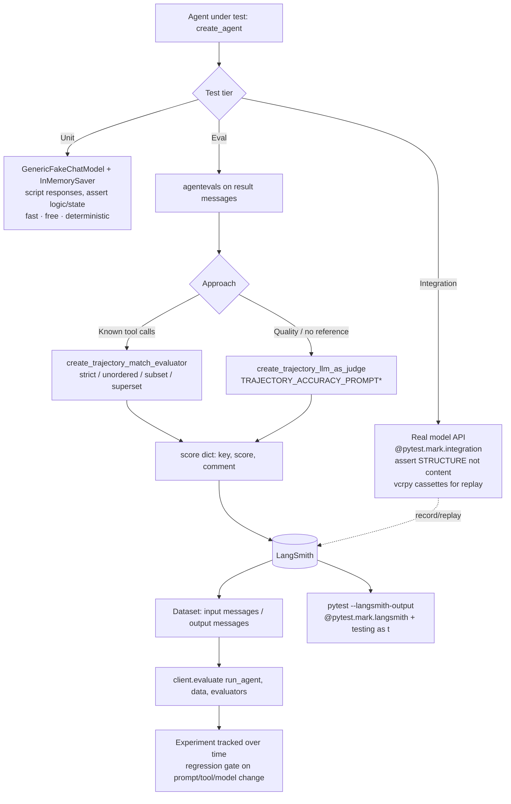
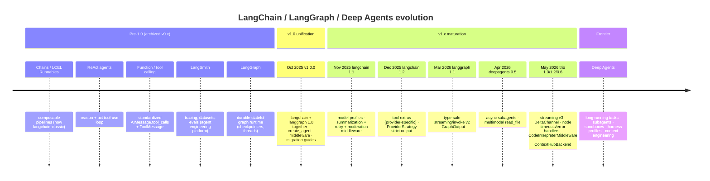

# Buffer 9 — Testing, Evals, Academy, History, Install (RAW extraction)

Sources:
- `31-evals.md` and `test/03-evals.md` (IDENTICAL content — same "Agent Evals" doc, deduped below)
- `test/01-unit-testing.md`
- `test/02-integration-testing.md`
- `32-academy.md` (raw Thinkific HTML dump of academy.langchain.com landing page)
- `34-changelog-py.md`
- `33-get-help.md`
- `02-install.md`

NOTE: `31-evals.md` == `test/03-evals.md` byte-for-byte. Treat as one canonical source.

---

# PART A — TESTING & EVALS

## A1. Purpose — why testing/evaluating agents is HARD

The defining problem: **LLM responses are nondeterministic.** The same input produces different outputs across runs. This breaks every assumption of traditional software testing:
- You CANNOT assert on exact output strings (`assert output == "..."`). Output text varies run-to-run.
- Tests that call real models are **slow, cost money, require API keys/credentials**, and are **flaky** (network, rate limits, latency).
- Correctness is not binary — an agent answer can be "good" in many surface forms, or subtly wrong while structurally plausible.

The doc establishes a **3-tier testing pyramid** for agents:

1. **Unit tests** (`test/01`): exercise small deterministic pieces in isolation. Replace the real LLM with an in-memory fake so you can script exact responses (text, tool calls, errors). Fast, free, repeatable, no API keys. Use for agent *logic* (control flow, state, tool wiring).
2. **Integration tests** (`test/02`): make real network calls to confirm components work together, credentials are valid, latency acceptable. Verify *basic correctness*. Because of nondeterminism, **assert on STRUCTURE, not content** (message types, tool-call names, arg shapes, message counts).
3. **Evals** (`31`/`test/03`): *score* agent behavior against a reference or rubric. Measure how WELL the agent performs by assessing its **trajectory** (the sequence of messages + tool calls). Key value: **catch regressions when you change prompts, tools, or models** — i.e. eval-driven development. Evals go beyond "did it work" to "how good is it."

The progression is explicit in the docs' "Next steps": unit → integration → evals.

What evals SOLVE that tests don't: tests verify a single run passes a hard assertion; evals quantify quality (a score) over a *dataset* of examples, track it *over time* (experiments in LangSmith), and tolerate the fuzziness of LLM output via fuzzy match modes or an LLM judge.

## A2. Building blocks (exhaustive API inventory)

### Unit testing (test/01)
- **`GenericFakeChatModel`** — from `langchain_core.language_models.fake_chat_models`. Mock chat model for text responses. Constructor: `GenericFakeChatModel(messages=iter([...]))`. Accepts an **iterator** of responses (each an `AIMessage` OR a plain string). Returns ONE item per `.invoke()` call (advances the iterator on each invocation). Supports both regular and **streaming** usage. Can script tool calls by passing `AIMessage(content="", tool_calls=[ToolCall(name=..., args=..., id=...)])`. (AKA "fixture".)
- **`ToolCall`** — used inside `AIMessage(tool_calls=[...])` to script a tool call: `ToolCall(name="foo", args={"bar":"baz"}, id="call_1")`. (Round-trips to dict form `{'name':..,'args':..,'id':..,'type':'tool_call'}`.)
- **`InMemorySaver`** — checkpointer from `langgraph.checkpoint.memory`. Enables **persistence during testing** so you can simulate multiple turns / test state-dependent behavior without a real DB. Passed as `create_agent(model, tools=[], checkpointer=InMemorySaver())`. Multi-turn driven by `config={"configurable": {"thread_id": "session-1"}}` — same `thread_id` persists prior messages across `.invoke()` calls.

### Integration testing (test/02)
- **pytest markers**: `@pytest.mark.integration` to tag tests that call real LLM APIs. Configured in `pytest.ini` (`[pytest] markers = integration: ...`) or `pyproject.toml` (`[tool.pytest.ini_options] markers=[...]`). `addopts = -m "not integration"` excludes them by default; `pytest -m integration` runs them explicitly. (Same pattern reused for `vcr` marker.)
- **`conftest.py` fixtures**: `@pytest.fixture(autouse=True)` to validate required keys (e.g. `pytest.skip("OPENAI_API_KEY not set")` if env var missing).
- **API key management**: load from environment variables; store locally in `.env` + `python-dotenv` (`from dotenv import load_dotenv; load_dotenv()`). `.env` must be gitignored; CI injects via secrets manager (GitHub Actions secrets).
- **Assert on structure, not content**: verify message types (`isinstance(messages[-1], AIMessage)`), tool-call names (`tc["name"] == "get_weather"`), arg shapes, message count (`len(result["messages"]) > 1`, `len(messages[-1].content) > 0`). Iterate tool calls via `msg.tool_calls` (guard with `hasattr(msg,"tool_calls")` and `(msg.tool_calls or [])`).
- **Cost/latency controls**: use smaller models (`gemini-3.1-flash-lite` cited for tool-call/structure tests); set `model_kwargs={"max_tokens": 256}` (doc also references `maxTokens` cap conceptually); test one behavior per test; run integration tests only in CI/pre-deploy.
- **Record & replay HTTP** (key technique for deterministic CI without cost):
  - **`vcrpy`** — records HTTP request/response pairs into YAML "cassette" files.
  - **`pytest-recording`** — pytest plugin integrating vcrpy. Provides the `@pytest.mark.vcr()` decorator.
  - **`vcr_config` fixture** (`scope="session"`) in conftest to **filter secrets** out of cassettes: `filter_headers=[("authorization","XXXX"),("x-api-key","XXXX")]`, `filter_query_parameters=[("api_key","XXXX"),("key","XXXX")]`.
  - **`--record-mode=once`** (addopts): records on first run, replays on subsequent runs. Cassettes land in `tests/cassettes/`.
  - WARNING: when you change prompts/tools/expected trajectories, **cassettes go stale and tests FAIL** — delete the cassette files and rerun to re-record. (This is itself a form of regression detection.)

### Evals — AgentEvals package (31 / test/03)
- **`agentevals`** package — `pip install agentevals` (repo: github.com/langchain-ai/agentevals). Prebuilt evaluators for agent **trajectories**.
- **Evaluator contract** — a function `def evaluator(*, outputs: dict, reference_outputs: dict)` (keyword-only) that reads `outputs["messages"]` (+ optionally `reference_outputs["messages"]`), computes a score, and returns a dict `{"key": <name>, "score": <bool/number>, "comment": <optional>}`.
- Two evaluation approaches:
  - **Trajectory match** (deterministic comparison) — fast, deterministic, cost-free; use when you KNOW the expected tool calls.
  - **LLM-as-judge** (qualitative) — assess overall quality/reasoning without strict expectations.

#### Trajectory match evaluator
- **`create_trajectory_match_evaluator(trajectory_match_mode=...)`** — from `agentevals.trajectory.match`. Matches agent trajectory against a `reference_outputs` list of messages. Four **modes**:
  | Mode | Behavior | Use case |
  |---|---|---|
  | `strict` | Exact match of message structure + tool calls in **same order** (message *content* may differ) | enforce a specific sequence, e.g. policy lookup BEFORE authorization |
  | `unordered` | Same structure + tool calls, **any order** | verify info was retrieved when order doesn't matter |
  | `subset` | Agent calls ONLY tools from reference (no extras) | ensure agent doesn't exceed expected scope |
  | `superset` | Agent calls AT LEAST the reference tools (extras allowed) | verify minimum required actions taken |
  - Result example: `{'key':'trajectory_strict_match','score':True,'comment':None}`.
  - **`tool_args_match_mode`** and **`tool_args_match_overrides`** — customize how tool-call equality is judged. DEFAULT: only tool calls with the *same arguments to the same tool* are considered equal.

#### LLM-as-judge evaluator
- **`create_trajectory_llm_as_judge(model=..., prompt=...)`** — from `agentevals.trajectory.llm`. Uses an LLM to evaluate the execution path. **Does NOT require a reference** (but one can be provided).
- Prebuilt prompts (from `agentevals.trajectory.llm`):
  - **`TRAJECTORY_ACCURACY_PROMPT`** — judge without reference.
  - **`TRAJECTORY_ACCURACY_PROMPT_WITH_REFERENCE`** — judge with a reference trajectory.
- Model cited as judge: `model="openai:o3-mini"`.

#### Async support
- ALL agentevals evaluators support asyncio. Naming rule: insert `async` after `create_` →
  - **`create_async_trajectory_match_evaluator(...)`**
  - **`create_async_trajectory_llm_as_judge(...)`** (and `create_async_trajectory_llm_as_judge` import alongside the prompt).
- Used with `await agent.ainvoke(...)` and `await async_judge(outputs=...)`.

#### LangSmith integration for evals
- Env vars required: **`LANGSMITH_API_KEY`** and **`LANGSMITH_TRACING="true"`** (set to log evaluator results / track experiments over time).
- Two ways to run evals in LangSmith:
  1. **pytest integration** — `@pytest.mark.langsmith`. Use `from langsmith import testing as t` and log: `t.log_inputs({})`, `t.log_outputs({"messages": ...})`, `t.log_reference_outputs({"messages": ...})`. Run with `pytest test_trajectory.py --langsmith-output`.
  2. **`evaluate` function** — `from langsmith import Client; client = Client(); client.evaluate(run_agent, data="your_dataset_name", evaluators=[trajectory_evaluator])`. `run_agent(inputs)` wraps `agent.invoke(inputs)["messages"]`.
- **LangSmith dataset schema** for trajectory eval:
  - `input`: `{"messages": [...]}` — input messages to call the agent with.
  - `output`: `{"messages": [...]}` — expected message history; for trajectory eval you may keep only assistant messages.
- Datasets are created/managed in LangSmith (`/langsmith/manage-datasets`); experiments live in LangSmith UI.

## A3. Annotated code (VERBATIM key examples)

### (1) Unit test — mock the model with `GenericFakeChatModel` (script tool call then text)
WHY: no API key, deterministic, free. The iterator returns one scripted response per invocation, so you control exactly what the "LLM" says and which tools it "calls."
```python
from langchain_core.language_models.fake_chat_models import GenericFakeChatModel

model = GenericFakeChatModel(messages=iter([
    AIMessage(content="", tool_calls=[ToolCall(name="foo", args={"bar": "baz"}, id="call_1")]),
    "bar"
]))

model.invoke("hello")
# AIMessage(content='', ..., tool_calls=[{'name': 'foo', 'args': {'bar': 'baz'}, 'id': 'call_1', 'type': 'tool_call'}])

model.invoke("hello, again!")
# AIMessage(content='bar', ...)   # iterator advanced to next item
```

### (2) Unit test — multi-turn state with `InMemorySaver`
WHY: tests state-dependent behavior across turns WITHOUT a real database; same `thread_id` persists the first message so the second turn "remembers" Sydney.
```python
from langgraph.checkpoint.memory import InMemorySaver

agent = create_agent(model, tools=[], checkpointer=InMemorySaver())

agent.invoke(
    {"messages": [HumanMessage(content="I live in Sydney, Australia")]},
    config={"configurable": {"thread_id": "session-1"}}
)
# Second invocation: first message persisted (Sydney), so model returns GMT+10 time
agent.invoke(
    {"messages": [HumanMessage(content="What's my local time?")]},
    config={"configurable": {"thread_id": "session-1"}}
)
```

### (3) Integration test — assert on STRUCTURE not content
WHY: LLM output text varies; you can only reliably assert that the right tool was called and the final message is a non-empty `AIMessage`.
```python
def test_agent_calls_weather_tool():
    agent = create_agent("claude-sonnet-4-6", tools=[get_weather])
    result = agent.invoke({"messages": [HumanMessage(content="What's the weather in SF?")]})

    messages = result["messages"]
    tool_calls = [
        tc for msg in messages
        if hasattr(msg, "tool_calls")
        for tc in (msg.tool_calls or [])
    ]
    assert any(tc["name"] == "get_weather" for tc in tool_calls)
    assert isinstance(messages[-1], AIMessage)
    assert len(messages[-1].content) > 0
```

### (4) Eval — trajectory match (strict mode) with a reference trajectory
WHY: deterministic, cost-free regression check that the agent produced the expected sequence of messages/tool-calls (content allowed to differ).
```python
from agentevals.trajectory.match import create_trajectory_match_evaluator

evaluator = create_trajectory_match_evaluator(trajectory_match_mode="strict")

def test_weather_tool_called_strict():
    result = agent.invoke({"messages": [HumanMessage(content="What's the weather in San Francisco?")]})
    reference_trajectory = [
        HumanMessage(content="What's the weather in San Francisco?"),
        AIMessage(content="", tool_calls=[
            {"id": "call_1", "name": "get_weather", "args": {"city": "San Francisco"}}
        ]),
        ToolMessage(content="It's 75 degrees and sunny in San Francisco.", tool_call_id="call_1"),
        AIMessage(content="The weather in San Francisco is 75 degrees and sunny."),
    ]
    evaluation = evaluator(outputs=result["messages"], reference_outputs=reference_trajectory)
    # {'key': 'trajectory_strict_match', 'score': True, 'comment': None}
    assert evaluation["score"] is True
```

### (5) Eval — LLM-as-judge (no reference needed) + run a dataset experiment in LangSmith
WHY: judges qualitative trajectory accuracy when you have no gold reference; `client.evaluate` runs the judge across a whole dataset and records a tracked experiment.
```python
from agentevals.trajectory.llm import create_trajectory_llm_as_judge, TRAJECTORY_ACCURACY_PROMPT

evaluator = create_trajectory_llm_as_judge(model="openai:o3-mini", prompt=TRAJECTORY_ACCURACY_PROMPT)

def test_trajectory_quality():
    result = agent.invoke({"messages": [HumanMessage(content="What's the weather in Seattle?")]})
    evaluation = evaluator(outputs=result["messages"])
    assert evaluation["score"] is True

# Dataset experiment over many examples:
from langsmith import Client
client = Client()
def run_agent(inputs):
    return agent.invoke(inputs)["messages"]
experiment_results = client.evaluate(run_agent, data="your_dataset_name", evaluators=[evaluator])
```

## A4. Advanced concepts

- **Offline vs online eval**: Docs emphasize OFFLINE eval (run evaluators against a fixed LangSmith dataset, or via pytest, before deploy). Online/production eval is implied by LangSmith Engine (install doc: "monitors your traces, detects issues, proposes fixes") and the academy positioning ("use live production data for continuous testing and improvement") — but the LangChain OSS testing docs themselves focus on offline/CI eval.
- **Trajectory vs final-output eval**: Two distinct targets. *Trajectory eval* scores the WHOLE message+tool-call sequence (agentevals; modes strict/unordered/subset/superset, or LLM judge). *Final-output eval* would score only the last answer. Trajectory eval is the doc's emphasis because it catches *how* the agent got there (e.g. enforcing policy-lookup-before-authorization), not just the end state.
- **LLM-as-judge**: Use an LLM with a rubric prompt (`TRAJECTORY_ACCURACY_PROMPT[_WITH_REFERENCE]`) to grade quality without a deterministic reference. Trade-off: flexible/qualitative but costs tokens and is itself nondeterministic; pair with deterministic trajectory match where expectations are known.
- **Regression testing for prompts/tools/models**: The CORE motivation — evals "catch regressions when you change prompts, tools, or models." Run the same dataset + evaluators before/after a change; compare scores across experiments in LangSmith. Cassette staleness (vcr) is a related signal: changing a prompt/tool invalidates cassettes.
- **Eval-driven development**: Build a dataset of input→reference examples, encode quality as evaluators, and treat the eval score as the regression gate (like a test suite but quantitative). Fuzzy match modes (`unordered`, `superset`) let assertions tolerate acceptable variation while still failing real regressions.
- **Fuzzy matching spectrum**: `strict` (sequence + order) → `unordered` (set of tool calls) → `superset`/`subset` (scope bounds) → LLM-judge (semantic). Choose the loosest mode that still catches the regression you care about.

## A5. Cross-framework interaction points

- evals ↔ LangSmith: datasets, experiments, and tracked scores live in LangSmith; `client.evaluate()` and `@pytest.mark.langsmith` (+ `langsmith.testing as t`) log results there. Gated by `LANGSMITH_API_KEY` + `LANGSMITH_TRACING`.
- evals ↔ agents (`create_agent`): evaluators consume the agent's `result["messages"]` trajectory; `run_agent(inputs)` wraps `agent.invoke(...)`.
- evals ↔ agentevals package: agentevals provides the prebuilt trajectory evaluators (`create_trajectory_match_evaluator`, `create_trajectory_llm_as_judge`) that operate on LangChain message lists.
- testing ↔ langchain-core: `GenericFakeChatModel` and message/`ToolCall` types come from `langchain_core` — the mock plugs into `create_agent` exactly like a real chat model.
- testing ↔ LangGraph: `InMemorySaver` (from `langgraph.checkpoint.memory`) supplies test-time persistence; multi-turn assertions rely on LangGraph thread/checkpoint state via `config={"configurable":{"thread_id":...}}`.
- integration testing ↔ providers: real keys (`OPENAI_API_KEY`, etc.) and model strings (`claude-sonnet-4-6`, `gemini-3.1-flash-lite`); `vcrpy`/`pytest-recording` cassettes record provider HTTP for replay.
- testing ↔ pytest ecosystem: markers (`integration`, `vcr`, `langsmith`), `conftest.py` fixtures, `python-dotenv` for `.env`.
- evals ↔ integration tests: integration tests do coarse structural assertions; the docs explicitly upsell AgentEvals fuzzy modes (`unordered`, `superset`) for "more rigorous trajectory assertions" — evals are the next rung above integration tests.

---

# PART B — ACADEMY (curriculum outline)

`32-academy.md` is a raw HTML scrape of the **LangChain Academy** landing page (academy.langchain.com, hosted on Thinkific). It is a marketing/catalog page, NOT lesson transcripts — so it yields the curriculum STRUCTURE, not new conceptual lessons. Tagline: "Level up with LangChain Academy — self-paced, comprehensive courses … to succeed with LangChain products."

### Course CATEGORIES (3 tiers — a progression)
1. **Quickstart** (`/collections/quickstart`)
2. **Foundation** (`/collections/foundation`)
3. **Project** (`/collections/project`)

### Featured COURSES (one per tier)
- **Quickstart: LangSmith Essentials** (`/courses/quickstart-langsmith-essentials`) — "essentials of LangSmith — the comprehensive platform for agent engineering that helps teams use live production data for continuous testing and improvement."
- **Foundation: Introduction to LangSmith Deployment** (`/courses/langsmith-deployment`) — "deploy, manage, and control your agents with LangSmith Deployment."
- **Project: Deep Agents** (`/courses/deep-agents-with-langgraph`) — "fundamental characteristics of Deep Agents and how to implement your own Deep Agent for complex, long-running tasks."

### Take-aways for synthesis
- The academy's center of gravity is now **LangSmith (agent engineering platform)** and **Deep Agents** — not classic chains/RAG. This mirrors the product evolution (see Part C): observe → evaluate → deploy.
- Page CTAs reinforce the platform story: "Observe, evaluate, and deploy agents with LangSmith, the agent engineering platform" and "Ready to start shipping reliable agents faster?"
- No unique advanced *technical* lessons are extractable from this scrape (it's a catalog). The only "advanced concept" candidate is the framing: **agent engineering lifecycle = build (LangChain/LangGraph) → observe + evaluate (LangSmith) → deploy (LangSmith Deployment) → Deep Agents for long-running tasks.** The Deep Agents course is the most advanced offering.
- Intro video: YouTube `4dh0b-gM1m0`. Community: in-person meetups via luma.com/langchain.

---

# PART C — HISTORY / EVOLUTION (from `34-changelog-py.md`)

The changelog only covers **v1.0.0 onward** (Oct 2025 →). For v0.x it points to archived docs (github.com/langchain-ai/langchain/tree/v0.3/docs and reference.langchain.com/v0.3). The narrative "v0.0.1 chains → ReAct → function calling → LangSmith → LangGraph → v1.0 unification → Deep Agents" is the broader project arc; the changelog gives the concrete v1.x timeline that explains the CURRENT architecture.

### Changelog timeline (reverse-chron in source; oldest→newest here)
- **Oct 20, 2025 — v1.0.0** (`langchain` AND `langgraph` both hit 1.0 together): the "unification" release. Has dedicated release notes + migration guides for each. v0.x docs archived. This is the **why-it's-the-way-it-is** anchor: APIs were consolidated/standardized at 1.0.
- **Nov 25, 2025 — `langchain` v1.1.0**:
  - **Model profiles**: chat models expose capabilities via `.profile` attribute, data from models.dev.
  - **Summarization middleware** updated to use model profiles for context-aware trigger points.
  - **Structured output**: `ProviderStrategy` (native structured output) can be inferred from model profiles.
  - `SystemMessage` can be passed directly to `create_agent(system_prompt=...)` (enables cache control, structured content blocks).
  - **Model retry middleware** (exponential backoff for failed model calls).
  - **Content moderation middleware** (OpenAI) — checks user input, model output, tool results.
- **Dec 8, 2025 — `langchain-google-genai` v4.0.0**: rewritten onto Google's consolidated Generative AI SDK (Gemini API + Vertex AI under one interface); deprecates parts of `langchain-google-vertexai`.
- **Dec 15, 2025 — `langchain` v1.2.0**:
  - `create_agent`: provider-specific tool params/definitions via new **`extras`** attribute on tools (e.g. Anthropic programmatic tool calling, tool search; client-side built-in tools for Anthropic/OpenAI).
  - Strict schema-adherence in agent `response_format` via `ProviderStrategy`.
- **Feb 10, 2026 — `deepagents` v0.4.0**:
  - Pluggable **sandboxes**: `langchain-modal`, `langchain-daytona`, `langchain-runloop`.
  - Conversation-history summarization moved into model node via `wrap_model_call`; retains full message history; better token counting; auto-triggers on **`ContextOverflowError`** (in `langchain-core`; supported by langchain-anthropic + langchain-openai).
  - Defaults to OpenAI **Responses API** for `"openai:"` model strings.
- **Mar 10, 2026 — `langgraph` v1.1.0**:
  - **Type-safe streaming `version="v2"`**: unified `StreamPart` (`type`/`ns`/`data`); per-mode `TypedDict`s from `langgraph.types`.
  - **Type-safe invoke `version="v2"`**: returns `GraphOutput` with `.value` + `.interrupts`.
  - Pydantic/dataclass coercion of outputs; fixed time-travel w/ interrupts+subgraphs; fully backwards-compatible/opt-in.
- **Apr 7, 2026 — `deepagents` v0.5.0**:
  - **Async subagents** (non-blocking background tasks; requires LangSmith Deployment).
  - Multi-modal `read_file` (PDF, audio, video, images).
  - Backend protocol changes (binary files in State/Store backends; direct `StateBackend()`/`StoreBackend()` instantiation; factory form deprecated).
  - Anthropic prompt-caching improvements.
- **May 12, 2026 — triple release** (`langchain` v1.3.0, `langgraph` v1.2.0, `deepagents` v0.6.0):
  - **`langchain` v1.3.0**: `version="v3"` support in `stream_events`/`astream_events` for agents.
  - **`langgraph` v1.2.0**: per-node timeouts (`timeout=`/`run_timeout`/`idle_timeout`/`TimeoutPolicy` → `NodeTimeoutError`); node-level error handlers (`error_handler=` → typed `NodeError`, return `Command`, for Saga/compensation); graceful shutdown (`RunControl.request_drain()` → `GraphDrained`); new **`DeltaChannel`** (beta, stores only incremental deltas to keep checkpoints small in long threads; `snapshot_frequency=K`); event-streaming **v3** (content-block-centric; `run.values`/`run.messages`/`run.lifecycle`/`run.subgraphs`). Timeouts + error handlers are Python-only.
  - **`deepagents` v0.6.0**: experimental **`CodeInterpreterMiddleware`** (QuickJS sandbox for code exec + programmatic tool calling); `version="v3"` event streaming; uses `DeltaChannel` for message history/agent files; **Harness profiles** (`HarnessProfile` per-provider/model config bundles applied by `create_deep_agent`); **`ContextHubBackend`** (filesystem backend backed by LangSmith Hub — versioned skills/memories).

### Evolution arc (synthesis framing — "why the architecture is what it is")
1. **v0.x: chains** (LCEL, Runnables) — composable pipelines; classic legacy now lives in `langchain-classic`.
2. **ReAct / agent loop** — reason+act tool-using agents (the conceptual basis for `create_agent`).
3. **Function/tool calling** — provider tool-calling standardized message + tool-call shapes (`AIMessage.tool_calls`, `ToolMessage`).
4. **LangSmith** — observability/tracing/eval platform emerges to tame nondeterminism (datasets, experiments, judges) → now "agent engineering platform."
5. **LangGraph** — durable, stateful graph runtime (checkpointers, threads, streaming, fault-tolerance) underneath agents.
6. **v1.0 unification (Oct 2025)** — `langchain` + `langgraph` to 1.0 together; standardized `create_agent`, middleware, structured output, model strings.
7. **Deep Agents** — agents for complex, long-running tasks: subagents, sandboxes/code interpreter, filesystem backends, harness profiles, context engineering/summarization.

---

# PART D — INSTALL & PACKAGE LAYOUT (`02-install.md` + corroborating)

### Install commands
```bash
pip install -U langchain         # core meta-package; requires Python 3.10+
uv add langchain                 # uv equivalent
```
Provider integrations live in **independent packages**:
```bash
pip install -U langchain-openai
pip install -U langchain-anthropic
uv add langchain-openai
uv add langchain-anthropic
```
(LangChain has "integrations to hundreds of LLMs and thousands of other integrations" — each in its own provider package; full list at integrations/providers/overview.)

### Package layout (named across these sources)
- **`langchain`** — the main meta/umbrella package (`create_agent`, `init_chat_model`, middleware, tools). Python 3.10+.
- **`langchain[provider]` / `langchain-<provider>`** — provider integration packages: `langchain-openai`, `langchain-anthropic`, `langchain-google-genai` (v4 consolidated Gemini+Vertex), `langchain-google-vertexai` (partially deprecated), plus sandbox integrations `langchain-modal`, `langchain-daytona`, `langchain-runloop`.
- **`langchain-core`** — primitives: messages, `ToolCall`, `GenericFakeChatModel`, `ContextOverflowError`, base abstractions. (Used directly in tests.)
- **`langchain-classic`** — legacy/v0.x components (referenced by the broader docs as where deprecated chains live). [Not in install.md text but part of the package layout per project context.]
- **`langgraph`** — graph runtime: `StateGraph`, checkpointers (`InMemorySaver` via `langgraph.checkpoint.memory`), `langgraph.types`, streaming/invoke v2/v3, fault-tolerance.
- **`langsmith`** — observability/eval SDK: `Client`, `client.evaluate`, `langsmith.testing as t`, `@pytest.mark.langsmith`. Env: `LANGSMITH_API_KEY`, `LANGSMITH_TRACING`.
- **`agentevals`** — trajectory evaluators (`pip install agentevals`).
- **`deepagents`** — Deep Agents framework (`create_deep_agent`, middleware, backends, subagents).
- Testing-adjacent third-party: `python-dotenv`, `vcrpy`, `pytest-recording`, `pytest`.

### Tooling tips from install doc
- Set up **LangSmith tracing** to debug your first app (tracing quickstart at /langsmith/trace-with-langchain).
- **LangSmith Engine** — "monitors your traces, detects issues, and proposes fixes" (the production/online-eval counterpart).

---

# PART E — GET HELP (`33-get-help.md`) — brief

Support/resource channels (useful as an appendix in the teaching doc):
- **Chat LangChain** (chat.langchain.com) — ask the docs anything, real-time.
- **API Reference** (reference.langchain.com/python).
- **Community Forum** (forum.langchain.com), **Community Slack** (langchain.com/join-community).
- **Support portal** (support.langchain.com), **LangSmith status** (status.smith.langchain.com).
- **Contributing Guide** (/oss/python/contributing/overview).
- Social: X (@langchain), LinkedIn.
- Changelog has an **RSS feed** (docs.langchain.com/oss/python/releases/changelog/rss.xml) — integrable with Slack/email/Discord.

---

## Reusable diagrams

### Diagram 1 — Eval / testing workflow (proposed, mermaid flowchart)


### Diagram 2 — LangChain evolution timeline (proposed, mermaid timeline)

