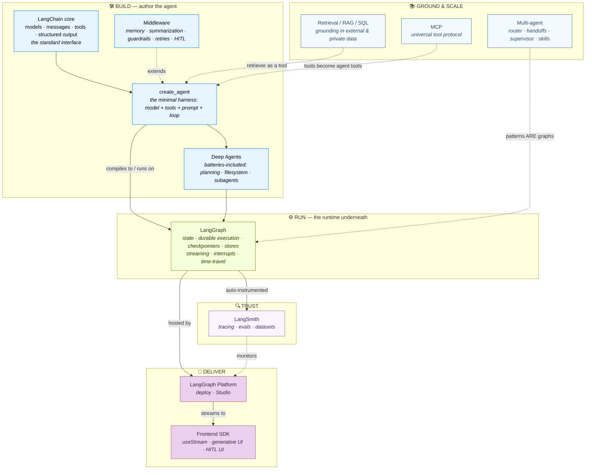

# The Purpose‑Driven Guide to LangChain & Its Ecosystem

> A single, top‑down, *why‑first* walkthrough of LangChain (Python) and every framework it interlocks with — LangGraph, Deep Agents, LangSmith, the LangGraph Platform, the Frontend SDK, and MCP.
>
> For every layer we ask the same three questions: **What is its purpose? What problem would you have without it? Which tools, APIs, methods, and patterns achieve that purpose?** — and then we read the code that makes it real. Wherever two frameworks meet, the interaction is explained **twice — once from each framework's point of view** — because that is where most confusion lives.

---

## How to read this guide

This document is organized as a *descent*: we start at the highest possible altitude (what is LangChain *for*?), then descend one layer at a time, and each layer's existence is justified by the layer above it. By the end you should be able to look at any LangChain program and say not just *what* each line does, but *why that line has to exist at all*.

Each major section follows the same skeleton:

1. **Purpose** — the job this thing exists to do, and the pain you feel without it.
2. **Building blocks** — the concrete classes, functions, parameters, and patterns.
3. **Annotated code** — real code, explained block by block.
4. **Advanced concepts** — the deeper ideas worth internalizing, in call‑out boxes.
5. **Two perspectives** — wherever this layer touches a *different* framework, we explain the seam from both sides.
6. **The overall picture** — a Mermaid diagram of the layer.

> **A note on the code samples.** The LangChain docs use forward‑dated, illustrative model names — `gpt-5.4`, `claude-sonnet-4-6`, `gemini-3.5-flash`, `o3-mini`, etc. Treat them as placeholders for "whatever the current best model is." The *shape* of the code is what matters and is stable; the model string is swappable by design (that swappability is, as we'll see, the whole first reason LangChain exists).

---

## Part 0 — The Big Why

### 0.1 The problem LangChain exists to solve

LangChain's own philosophy page states its mission in one sentence:

> *"LangChain exists to be the easiest place to start building with LLMs, while also being flexible and production‑ready."*

That sentence hides a hard tension. It is **easy** to build an LLM prototype and **hard** to build an LLM application that is *reliable enough for production*. LangChain is the accumulated answer to that gap. Its founding beliefs:

- LLMs are powerful, but they are *even more* powerful when combined with external data and the ability to *act*.
- The applications of the future are **agentic** — they don't just generate text, they orchestrate tools, data, and decisions.
- We are still early, and **the bottleneck is reliability**, not raw model capability.

From those beliefs come **two core focuses** that explain almost every design decision in the library:

1. **Let developers build with the best models — without lock‑in.** Every provider (OpenAI, Anthropic, Google, AWS Bedrock, Azure, Ollama, …) exposes a *different* SDK, request/response shape, auth scheme, streaming protocol, tool‑calling format, and token‑usage layout. LangChain standardizes all of that behind one interface so you can swap providers without rewriting your app.
2. **Make it easy to use models to orchestrate complex flows.** A model should be more than a text generator — it should drive tools, read data, and reason in a loop. LangChain makes defining tools and wiring them into a control loop trivial.

### 0.2 The one thesis that organizes everything: **Agent = Model + Harness**

If you remember only one equation from this guide, make it this one. The LangChain overview puts it plainly:

> **Agent = Model + Harness.** An agent is *a model calling tools in a loop until a task is complete*. The **harness** is everything around that loop: the prompt, the tools, and any middleware that shapes behavior. *The job of a harness is to get the model the right context at the right time for the given task.*

The model is the *reasoning engine*. The harness is everything that turns a raw next‑token predictor into something that can plan, act, remember, recover from errors, and stay safe. LangChain's headline function, `create_agent`, **is** that harness — minimal by default, infinitely extensible through middleware.

This single idea ripples outward into the entire ecosystem:

- The **model** needs a standard interface → that's **LangChain core** (models, messages, tools, structured output).
- The **loop** needs to be durable, persistent, streamable, and pausable → that's **LangGraph**, the runtime `create_agent` compiles down to.
- The harness needs **extension points** for memory, summarization, guardrails, retries → that's **middleware**.
- A *batteries‑included* harness for long, autonomous tasks → that's **Deep Agents**.
- Reliability requires **seeing inside** the loop and **scoring** it → that's **LangSmith** (observability + evals).
- Production needs **hosting** the loop → that's the **LangGraph Platform** (deploy + Studio).
- Users need to **see and steer** the loop → that's the **Frontend SDK** (`useStream`, generative UI).
- Tools need a **universal connector** → that's **MCP**.

Everything below is a consequence of *Agent = Model + Harness*.

### 0.3 The ecosystem at a glance — what each piece is *for*

| Framework | One‑line purpose | The pain it removes |
|---|---|---|
| **LangChain** (`create_agent`, models, messages, tools) | The standard model interface **and** a minimal, highly configurable agent harness. | Vendor lock‑in; hand‑rolling the tool‑calling loop; per‑provider message/tool parsing. |
| **LangGraph** | The low‑level **orchestration runtime** underneath agents: state, durable execution, persistence, streaming, human‑in‑the‑loop, time‑travel. | Losing all progress on a crash; no way to pause for a human; no checkpoints; bespoke streaming. |
| **Deep Agents** | A **batteries‑included** harness on LangGraph for long‑running, autonomous tasks (planning, virtual filesystem, subagents, context management). | Re‑assembling the same heavy middleware stack for every research/coding agent. |
| **Middleware** | The **extension mechanism** of the harness — each concern (memory, guardrails, retries) is one composable piece. | Tangled `if`‑statements smeared through your agent for cross‑cutting concerns. |
| **LangSmith** | **Observability + evaluation** — trace every step; score behavior against datasets. | Flying blind; not knowing *why* an agent failed; silent regressions when you tweak a prompt. |
| **LangGraph Platform** (Deploy + Studio) | Managed **hosting** for stateful, long‑running agents, plus a local visual debugger. | Standing up stateful infra by hand; debugging agents with `print()`. |
| **Frontend SDK** (`useStream`, generative UI) | Turn a deployed agent into a **rich, streaming, steerable UI** — a control plane, not just a chatbox. | Re‑implementing streaming, interrupts, time‑travel, and checkpoint navigation in JS. |
| **MCP** (Model Context Protocol) | The **USB‑C of tools** — a universal protocol so a tool written once works with any MCP‑aware client. | N×M bespoke glue between every tool and every agent framework. |

A crucial relationship to internalize now, because the docs repeat it everywhere:

- **LangChain's `create_agent` is built on LangGraph.** It is not a separate engine — it *compiles to a LangGraph graph* and runs on the LangGraph runtime. That's why agents get durable execution, persistence, and streaming "for free."
- **LangSmith observes anything** built with LangChain, LangGraph, or Deep Agents.
- **Deep Agents are built on LangChain agents**, which are built on LangGraph. It's turtles — but only three turtles deep, and each turtle has a clear job.

### 0.4 The master map

Here is the whole ecosystem in one picture. Everything in the rest of this guide is a zoom‑in on one box or one arrow.

**Read the map as a sentence:** You *build* an agent from the LangChain standard interface using `create_agent`, extend it with middleware (or jump to Deep Agents), and it *runs* on the LangGraph runtime. You *ground* it in data (RAG/SQL), *scale* it into multi‑agent systems, and connect tools via MCP. You *trust* it through LangSmith observability and evals, then *deliver* it via the LangGraph Platform to a rich frontend. The arrows are the seams we'll explain from both sides.

With the altitude set, let's descend to the first layer: the standard interface that makes "use the best model without lock‑in" true.
