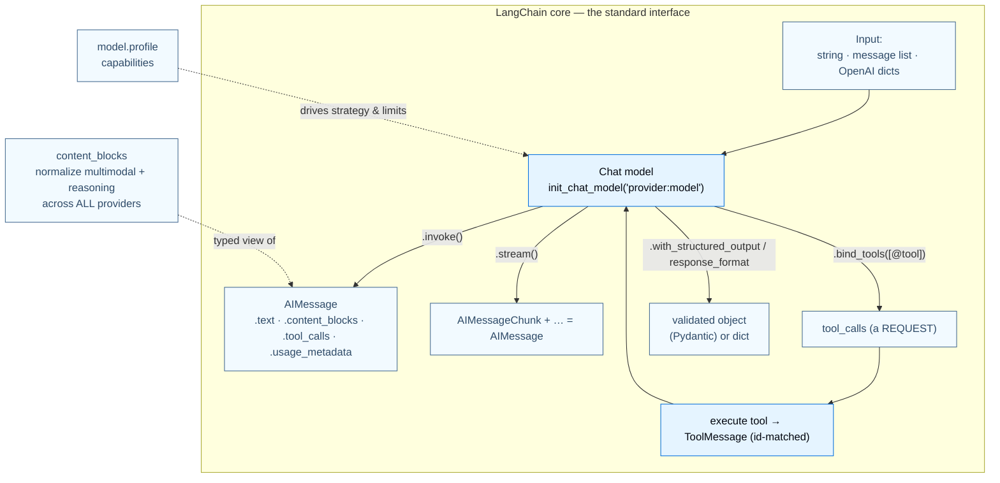

---

## Part 1 — The Foundation: A Standard Interface to Models, Messages, Tools & Structured Output

This is **LangChain core**: the layer that makes "build with the best model, swap freely, never get locked in" literally true. It has four tightly‑related primitives — **Models**, **Messages**, **Tools**, and **Structured Output** — and they are exactly the four things an agent loop needs: a brain, a memory format, hands, and a way to return typed answers.

### 1.1 Models — the reasoning engine, standardized

#### Purpose

A chat model is the **reasoning engine** of every agent: it interprets text, decides which tools to call, interprets the results, and decides when it's done. The *purpose of LangChain's model layer* is to give you **one uniform API across all providers**. Without it you would hand‑write a different client for OpenAI vs Anthropic vs Gemini, re‑implement retries/streaming/tool‑parsing for each, and chain your application logic to one vendor forever. With it:

- You **swap providers by changing one string** (`"openai:gpt-5.4"` → `"anthropic:claude-sonnet-4-6"`).
- **New model names work immediately** — provider packages pass the name straight through, so you don't wait for a LangChain release.
- The **same model object behaves identically standalone or inside an agent.**

#### Building blocks

- **`init_chat_model(model, **kwargs)`** (`langchain.chat_models`) — the easiest entry point; returns a standard `BaseChatModel`. Model id format is `"{provider}:{model}"`, or pass `model_provider=` separately (e.g. `model_provider="bedrock_converse"`).
- **Provider classes** when you need provider‑specific control: `ChatOpenAI`, `ChatAnthropic`, `ChatGoogleGenerativeAI`, `ChatBedrock`, … each in its own package (`langchain-openai`, `langchain-anthropic`, `langchain-google-genai`, …).
- **Invocation methods:** `.invoke(input)` → one `AIMessage`; `.stream(input)` → an iterator of additive `AIMessageChunk`s; `.batch([...])` / `.batch_as_completed([...])` → client‑side parallel calls; async `ainvoke`/`astream`; `.astream_events(...)` → semantic event stream.
- **Declarative binding (returns a *new* model, runs nothing):** `.bind_tools([...], tool_choice=..., parallel_tool_calls=...)`; `.with_structured_output(schema, method=...)`; `.bind(logprobs=True)`.
- **Standard params:** `temperature`, `max_tokens`, `timeout`, `max_retries` (default **6**, exponential backoff + jitter on network/429/5xx — *not* 401/404).
- **Resilience & control:** `InMemoryRateLimiter(requests_per_second=…)`; `RunnableConfig` (`run_name`, `tags`, `metadata`, `max_concurrency`, `recursion_limit`) — the same config object that drives LangSmith traces.
- **Capability introspection:** `model.profile` (a dict of `max_input_tokens`, `image_inputs`, `reasoning_output`, `tool_calling`, `structured_output`, …; `langchain>=1.1`). This profile is what lets middleware and `create_agent` make smart decisions automatically (e.g. pick the right structured‑output strategy, or size a summarization trigger).

#### Annotated code

The canonical "init → invoke" and the streaming‑accumulation pattern:

```python
from langchain.chat_models import init_chat_model

model = init_chat_model("claude-sonnet-4-6")     # provider inferred from name; key read from env
response = model.invoke("Why do parrots talk?")  # -> a single AIMessage
```

```python
full = None  # None | AIMessageChunk
for chunk in model.stream("What color is the sky?"):
    full = chunk if full is None else full + chunk   # chunks are ADDITIVE
    print(full.text)
# After the loop, `full` behaves exactly like an invoke() result:
print(full.content_blocks)  # [{"type": "text", "text": "The sky is typically blue..."}]
```

The deep idea here: **streaming and non‑streaming converge on the same message type.** Chunks add together (`full + chunk`) into a normal `AIMessage` you can append to history. Progressive display is a UX win; the additive design means you don't fork your code paths.

The single most important thing to understand about models is that **a model emits a tool‑call *request* — it does not execute anything.** This is the seam between "model" and "harness":

```python
from langchain.tools import tool

@tool
def get_weather(location: str) -> str:
    """Get the weather at a location."""
    return f"It's sunny in {location}."

model_with_tools = model.bind_tools([get_weather])      # advertises the tool; runs nothing

# The manual loop that create_agent automates for you:
messages = [{"role": "user", "content": "What's the weather in Boston?"}]
ai_msg = model_with_tools.invoke(messages)              # 1) model REQUESTS a tool call
messages.append(ai_msg)

for tool_call in ai_msg.tool_calls:                     # 2) WE execute the tool
    tool_result = get_weather.invoke(tool_call)         #    passing the whole tool_call dict
    messages.append(tool_result)                        #    -> a ToolMessage (id-matched)

final = model_with_tools.invoke(messages)               # 3) model sees results -> final answer
print(final.text)
```

Read those three steps carefully — they are the **ReAct loop in miniature**. `create_agent` exists precisely so you never write this loop by hand again. Understanding it demystifies the entire harness.

> **Advanced — capabilities you get for free by going through the standard interface.**
> - **Auto‑streaming:** when you call `model.invoke()` inside a LangGraph agent node and the app runs in a streaming mode, LangChain transparently switches the model to internal streaming and surfaces tokens — no code change.
> - **Multimodal & reasoning:** non‑text inputs and "thinking" outputs are carried as *content blocks* (next section), normalized across providers.
> - **Prompt caching:** implicit (OpenAI/Gemini) or explicit (`AnthropicPromptCachingMiddleware`, `prompt_cache_key`); savings show up in `usage_metadata`.
> - **Model profiles** drive *dynamic* behavior: summarization middleware reads the context‑window size from the profile; `create_agent` infers the structured‑output strategy from `profile["structured_output"]`.
> - **Configurable / dynamic models:** leave the model unset and choose it at runtime via `config={"configurable": {"model": ...}}`, or pick per‑request inside middleware with `@wrap_model_call` + `request.override(model=...)`.

### 1.2 Messages — the standard unit of context

#### Purpose

Messages are the **fundamental unit of context** — both the *input to* and *output from* a model, and therefore the *state a conversation accumulates*. A multi‑turn agent is, mechanically, "invoke the model with a growing list of messages." The purpose of LangChain's message types is to give you **one provider‑agnostic representation** of roles, content (including multimodal and reasoning), tool calls, and token usage. Without it you'd juggle a different dict shape for every provider and special‑case every content type per vendor.

#### Building blocks

- **Message classes** (`langchain.messages`): `SystemMessage` (instructions), `HumanMessage` (user input, possibly multimodal), `AIMessage` (model output: `.text`, `.content`, `.content_blocks`, `.tool_calls`, `.usage_metadata`, `.response_metadata`), `AIMessageChunk` (additive streaming fragment), `ToolMessage` (`content` + required `tool_call_id` + `name` + optional `artifact`).
- **Three accepted input formats:** a bare string (→ one `HumanMessage`); a list of message objects; or a list of OpenAI‑style dicts (`{"role": "user", "content": "..."}`).
- **`content` vs `content_blocks`:** `content` is the raw payload (string, or provider‑native blocks); `.content_blocks` is a **typed, lazily‑parsed, standardized** view (the v1 content‑block system). Setting `output_version="v1"` stores standard blocks directly in `content` for external consumers.
- **The standard content‑block catalog:** `text`, `reasoning`, `image`/`audio`/`video`/`file` (each via `url` | `base64`+`mime_type` | `file_id`), `tool_call` / `tool_call_chunk` / `invalid_tool_call`, server‑side `server_tool_call` / `server_tool_result`, and the escape hatch `non_standard`.
- **`usage_metadata`:** `input_tokens`, `output_tokens`, `total_tokens`, plus breakdowns (`cache_read`, `cache_creation`, `reasoning`, `audio`).

#### Annotated code

Messages are plain data you fully control — you can even fabricate an assistant turn and splice it into history to steer behavior:

```python
from langchain.messages import SystemMessage, HumanMessage, AIMessage

messages = [
    SystemMessage("You are a helpful assistant"),
    HumanMessage("Can you help me?"),
    AIMessage("I'd be happy to help!"),     # inserted as if the model said it
    HumanMessage("Great! What's 2+2?"),
]
response = model.invoke(messages)            # output is itself an AIMessage you can append back
```

The killer feature is `content_blocks` normalizing provider‑specific reasoning formats into one shape:

```python
from langchain.messages import AIMessage

message = AIMessage(
    content=[
        {"type": "thinking", "thinking": "...", "signature": "WaUjzkyp..."},  # Anthropic-native
        {"type": "text", "text": "..."},
    ],
    response_metadata={"model_provider": "anthropic"},
)
message.content_blocks
# [{'type': 'reasoning', 'reasoning': '...', 'extras': {'signature': 'WaUjzkyp...'}},
#  {'type': 'text', 'text': '...'}]
```

Anthropic's `thinking` and OpenAI's `reasoning` both parse to a standard `reasoning` block; provider‑specific extras (like Anthropic's `signature`) are tucked into `extras`. **This is what makes cross‑provider code possible** — your UI filters for `block["type"] == "reasoning"` and never cares which vendor produced it.

> **Advanced — `ToolMessage.artifact`.** A tool result has two audiences: the *model* (which sees `content`, a string) and your *application* (which may need rich data). `artifact` holds data **not sent to the model** — e.g. a retrieval tool puts the passage text in `content` and `{"document_id": ..., "page": ...}` in `artifact`, keeping the model's context clean while your app renders citations. This is the message‑level foundation of grounded RAG (Part 6).

### 1.3 Tools — giving the model hands

#### Purpose

A bare LLM is sealed off from the world: it can only emit text from training data. **Tools are the mechanism that turns a text model into an agent that acts** — fetch live data, call APIs, run code, mutate state. A tool is "a callable with a well‑defined input/output schema that gets advertised to the model"; the *model* decides *when* to call it and *what arguments* to pass. Without the tool abstraction you'd hand‑write prompt‑parsing glue to detect "the model wants X," validate args yourself, and re‑roll the result‑feedback loop per function.

#### Building blocks

- **`@tool`** (`langchain.tools`): the function's **docstring becomes the description**, and **type hints become the input schema** (type hints are *required*). `@tool("name", description=..., args_schema=PydanticModel, return_direct=True)` overrides defaults.
- **`ToolRuntime`** (`langchain.tools`): add a `runtime: ToolRuntime` parameter and it is **auto‑injected and hidden from the model**. It exposes `runtime.state` (short‑term memory), `runtime.context` (per‑run config), `runtime.store` (long‑term memory), `runtime.stream_writer` (custom progress events), `runtime.tool_call_id`, `runtime.execution_info`, `runtime.server_info`. `config` and `runtime` are *reserved* argument names.
- **Return values:** return a `str`/object (becomes a `ToolMessage`), or return a `Command(update={...})` (`langgraph.types`) to **write graph state** directly.
- **`return_direct=True`:** short‑circuit the loop — return the tool output verbatim as the final answer (only fires if *all* tools called in a turn are `return_direct`).
- **Error handling is middleware, not a per‑tool flag:** `@wrap_tool_call` converts exceptions into `ToolMessage`s the model can recover from.
- **Execution machinery:** `create_agent(tools=[...])` runs tools in agents; `ToolNode` (`langgraph.prebuilt`) runs them in raw LangGraph workflows.

#### Annotated code

The simplest tool and the state‑reading pattern:

```python
from langchain.tools import tool, ToolRuntime
from langchain.messages import HumanMessage

@tool
def search_database(query: str, limit: int = 10) -> str:
    """Search the customer database for records matching the query.

    Args:
        query: Search terms to look for
        limit: Maximum number of results to return
    """
    return f"Found {limit} results for '{query}'"

@tool
def get_last_user_message(runtime: ToolRuntime) -> str:
    """Get the most recent message from the user."""
    for message in reversed(runtime.state["messages"]):   # runtime is INJECTED, hidden from the model
        if isinstance(message, HumanMessage):
            return message.content
    return "No user messages found"
```

Tools can also **mutate agent state** by returning a `Command` — the bridge from "tool" to "the LangGraph state machine":

```python
from langchain.agents import AgentState
from langchain.messages import ToolMessage
from langchain.tools import ToolRuntime, tool
from langgraph.types import Command

class CustomState(AgentState):
    user_name: str

@tool
def set_user_name(new_name: str, runtime: ToolRuntime[None, CustomState]) -> Command:
    """Set the user's name in the conversation state."""
    return Command(update={
        "user_name": new_name,                       # writes a custom state field
        "messages": [ToolMessage(                     # AND appends a ToolMessage so the model sees success
            content=f"User name set to {new_name}.",
            tool_call_id=runtime.tool_call_id,        # must match the originating tool call
        )],
    })
```

And error handling — note it lives at the **harness layer** via middleware, so the model can self‑correct instead of crashing the run:

```python
from collections.abc import Callable
from langchain.agents import create_agent
from langchain.agents.middleware import wrap_tool_call
from langchain.messages import ToolMessage
from langchain.tools.tool_node import ToolCallRequest

@wrap_tool_call
def handle_tool_errors(request: ToolCallRequest,
                       handler: Callable[[ToolCallRequest], ToolMessage]) -> ToolMessage:
    try:
        return handler(request)                       # run the tool
    except Exception as e:
        return ToolMessage(                            # convert the exception into something the model can read
            content=f"Tool error: please check your input and try again. ({e})",
            tool_call_id=request.tool_call["id"],
        )

agent = create_agent(model="anthropic:claude-sonnet-4-6", tools=[], middleware=[handle_tool_errors])
```

> **Advanced — dynamic tool selection.** Too many tools overwhelm the model and increase errors; too few limit capability. Two patterns: **(1) filter** pre‑registered tools per request with `@wrap_model_call` + `request.override(tools=filtered)` (e.g. only expose sensitive tools after authentication); **(2) register tools discovered at runtime** (e.g. from an MCP server) using *both* `wrap_model_call` (to add the tool to the request) and `wrap_tool_call` (to actually execute it). Without the second hook the agent wouldn't know how to run a tool it just learned about.

> **Advanced — headless tools.** A tool can be *schema‑only on the server* and *implemented on the client* (browser). The server tool calls `interrupt(...)`, the frontend runs the real implementation (geolocation, IndexedDB, clipboard), and the run resumes with the result. This is how you reach device‑local capabilities — covered fully in Part 10.

### 1.4 Structured output — typed answers, not prose to parse

#### Purpose

Sometimes you don't want prose — you want a `ContactInfo(name=..., email=..., phone=...)` your app can consume directly. **Structured output** lets an agent return data in a specific, *validated* shape (Pydantic / dataclass / TypedDict / JSON Schema). Without it you'd prompt "return JSON like {…}", then regex the reply, handle the model wrapping JSON in prose, handle missing fields and wrong types, and hand‑roll a retry loop. LangChain makes the schema first‑class: the harness captures the output, **validates** it, **retries** on failure, and returns it in `result["structured_response"]`.

#### Building blocks

- **`create_agent(..., response_format=...)`** — declare the schema. Result lands in `result["structured_response"]`.
- **Two strategies** (`langchain.agents.structured_output`):
  - **`ProviderStrategy(schema, strict=...)`** — uses the provider's *native* structured‑output API. Most reliable; available on OpenAI, Anthropic, Gemini, xAI. `strict=True` (langchain≥1.2) tightens adherence.
  - **`ToolStrategy(schema, handle_errors=..., tool_message_content=...)`** — emulates structured output via *tool calling*; works with **any** tool‑calling model. Supports `Union[...]` schemas (the model picks the matching shape) and a rich `handle_errors` retry policy.
- **Auto‑selection:** pass a *bare* schema type and the harness reads `model.profile["structured_output"]` — `ProviderStrategy` if natively supported, else falls back to `ToolStrategy`.
- **Return‑type rule (depends on the *schema kind*, not the strategy):** Pydantic → a validated instance; dataclass / TypedDict / JSON‑Schema dict → a `dict`.

#### Annotated code

The simplest path — a bare Pydantic schema, auto‑strategy:

```python
from pydantic import BaseModel, Field
from langchain.agents import create_agent

class ContactInfo(BaseModel):
    """Contact information for a person."""
    name: str = Field(description="The name of the person")
    email: str = Field(description="The email address of the person")
    phone: str = Field(description="The phone number of the person")

agent = create_agent(model="gpt-5.4", response_format=ContactInfo)  # auto-selects ProviderStrategy

result = agent.invoke({"messages": [
    {"role": "user", "content": "Extract: John Doe, john@example.com, (555) 123-4567"}
]})
print(result["structured_response"])
# ContactInfo(name='John Doe', email='john@example.com', phone='(555) 123-4567')
```

When the model isn't natively capable, or you want `Union` routing, force `ToolStrategy`:

```python
from typing import Literal, Union
from langchain.agents.structured_output import ToolStrategy

class ProductReview(BaseModel):
    rating: int | None = Field(description="Rating out of 5", ge=1, le=5)
    sentiment: Literal["positive", "negative"]

class CustomerComplaint(BaseModel):
    issue_type: Literal["product", "service", "shipping", "billing"]
    severity: Literal["low", "medium", "high"]

agent = create_agent(
    model="gpt-5.4",
    response_format=ToolStrategy(Union[ProductReview, CustomerComplaint]),  # model picks the shape
)
```

`Union[...]` is **`ToolStrategy`‑only** — the model is offered both schemas and chooses the one that fits the input, which is perfect for classification/routing where the *output shape itself* depends on content. Because tool‑calling can occasionally return wrong types or multiple outputs, `ToolStrategy` ships with `handle_errors` (default `True`): on a validation error it feeds the error back as a `ToolMessage` and the model retries.

### 1.5 The overall picture — LangChain core

These four primitives compose into the single object you'll use everywhere: a model that speaks a standard message format, wields tools, and can return typed data.



**The through‑line:** a model takes messages, may *request* tool calls, you (or the harness) execute them into `ToolMessage`s, and the loop repeats until a final answer — optionally coerced into a typed schema. Everything in Part 2 is the automation of that loop.
