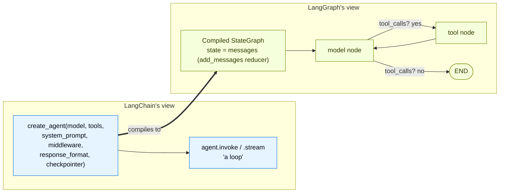
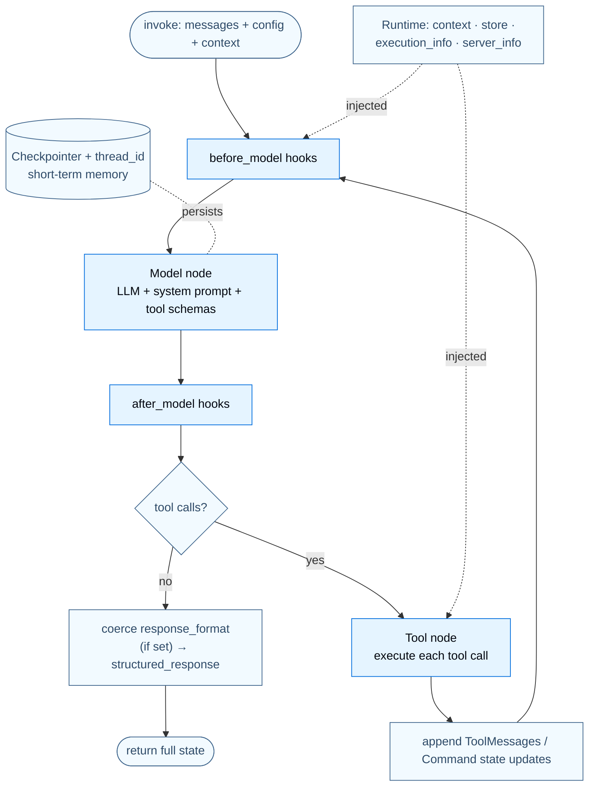

---

## Part 2 — The Harness: `create_agent`

We've assembled a brain (model), a memory format (messages), hands (tools), and typed answers (structured output). Part 2 is where they become an **agent**: a model calling tools in a loop until the task is done. `create_agent` is that loop — *the harness* in "Agent = Model + Harness."

### 2.1 Purpose

The harness's job, stated by the docs, is **"to get the model the right context at the right time for the given task."** Concretely it owns:

- The **loop**: invoke model → if it requested tools, execute them and append the observations → invoke again → … → stop when the model returns a final answer with no tool calls. (This is the ReAct — *Reason + Act* — loop.)
- The **prompt** (static via `system_prompt`, or dynamic via middleware).
- The **tools** and their execution.
- The **state** (the growing message list, plus any custom fields).
- The **extension points** (middleware) for everything else: memory, summarization, guardrails, retries, human‑in‑the‑loop.

Without `create_agent` you'd hand‑write the three‑step loop from Part 1.1 over and over, plus error handling, plus state plumbing, plus persistence. `create_agent` is *minimal by default* (model + tools + prompt) and *extensible without limit* (middleware).

### 2.2 Building blocks

`create_agent(...)` parameters (from `langchain.agents`):

- **`model`** — a `"provider:model"` string or an initialized model instance.
- **`tools`** — a list of callables / `@tool` objects / tool dicts.
- **`system_prompt`** — a string or `SystemMessage` (static). For *dynamic* prompts, use middleware (`@dynamic_prompt`).
- **`response_format`** — a schema for validated structured output (→ `result["structured_response"]`).
- **`middleware`** — the list of middleware objects; the sole extension mechanism (Part 4).
- **`state_schema`** — extend the agent's state with custom fields (subclass `AgentState`).
- **`context_schema`** — the shape of per‑run `context` (read via `runtime.context`).
- **`checkpointer`** — e.g. `InMemorySaver()`; required for `thread_id`‑based conversation persistence (short‑term memory). Auto‑provisioned when deployed.
- **`store`** — a `BaseStore` for long‑term, cross‑conversation memory.
- **`name`** — an identifier; becomes the **node name** when this agent is embedded as a subgraph in a multi‑agent system.

Invocation surface:

- **`agent.invoke({"messages": [...]}, config=..., context=...)`** → final state dict (`result["messages"][-1]` is the answer; `result["structured_response"]` if a schema was set).
- **`agent.stream({"messages": [...]}, stream_mode="values")`** → progress; each chunk is the *full state* at that point.
- **`config={"configurable": {"thread_id": ...}}`** scopes the conversation; **`context=...`** carries per‑run data.

### 2.3 Annotated code — from one line to a full loop

The minimal valid agent — everything else is additive:

```python
from langchain.agents import create_agent

def get_weather(city: str) -> str:
    """Get weather for a given city."""
    return f"It's always sunny in {city}!"

agent = create_agent(
    model="openai:gpt-5.4",
    tools=[get_weather],
    system_prompt="You are a helpful assistant",
)

result = agent.invoke({"messages": [{"role": "user", "content": "What's the weather in San Francisco?"}]})
print(result["messages"][-1].content_blocks)
```

Notice what you *didn't* write: no tool‑call detection, no execution loop, no result feedback, no error handling. The harness ran the entire Part‑1.1 loop for you.

Streaming the loop's progress, distinguishing message kinds and tool calls:

```python
from langchain.messages import AIMessage, HumanMessage

for chunk in agent.stream(
    {"messages": [{"role": "user", "content": "Search for AI news and summarize"}]},
    stream_mode="values",            # each chunk is the FULL state at that step
):
    latest = chunk["messages"][-1]
    if latest.content and isinstance(latest, AIMessage):
        print(f"Agent: {latest.content}")
    elif latest.tool_calls:
        print(f"Calling tools: {[tc['name'] for tc in latest.tool_calls]}")
```

### 2.4 Runtime & context — dependency injection for the loop

#### Purpose

A tool often needs *runtime‑scoped* information: which user is this, what DB connection, which API key, which feature flags. Hardcoding or using globals makes tools untestable and unsafe. **The Runtime is LangChain's dependency‑injection mechanism** — you *inject* dependencies at invocation time. The docs state the load‑bearing fact directly: *"LangChain's `create_agent` runs on LangGraph's runtime under the hood."* The `Runtime` object is LangGraph's.

#### Building blocks & code

`context_schema` defines the shape; `context=` supplies it per run; `ToolRuntime[Context]` injects it into tools (invisibly to the model):

```python
from dataclasses import dataclass
from langchain.agents import create_agent
from langchain.tools import tool, ToolRuntime

@dataclass
class Context:
    user_id: str

@tool
def fetch_user_email_preferences(runtime: ToolRuntime[Context]) -> str:
    """Fetch the user's email preferences from the store."""
    user_id = runtime.context.user_id                 # per-run context (DI)
    preferences = "The user prefers brief, polite emails."
    if runtime.store:                                  # long-term memory store, if wired
        if memory := runtime.store.get(("users",), user_id):
            preferences = memory.value["preferences"]
    return preferences

agent = create_agent(model="gpt-5-nano", tools=[fetch_user_email_preferences], context_schema=Context)
agent.invoke(
    {"messages": [{"role": "user", "content": "Draft an email"}]},
    context=Context(user_id="user-123"),               # injected per invocation
)
```

The `Runtime` carries five things: **context** (static per‑run deps), **store** (long‑term memory), **stream writer** (custom streaming), **execution_info** (`thread_id`/`run_id`/retry attempt), and **server_info** (assistant/graph id + authenticated user, populated only on LangGraph Server — `None` locally). Middleware gets the same `Runtime` (node‑style hooks receive it directly; wrap‑style hooks read `request.runtime`), which is how you build a *dynamic* system prompt — the thing `system_prompt=` cannot do because it's static:

```python
from langchain.agents.middleware import dynamic_prompt, ModelRequest

@dynamic_prompt
def dynamic_system_prompt(request: ModelRequest) -> str:
    user_name = request.runtime.context.user_name      # recompute the prompt per call from runtime context
    return f"You are a helpful assistant. Address the user as {user_name}."
```

### 2.5 Memory — short‑term (thread) vs long‑term (store)

#### Purpose

An agent must remember **within** a conversation (you said your name earlier) and ideally **across** conversations (your preferences from last week). These are two different mechanisms, both inherited from LangGraph:

- **Short‑term memory = the checkpointer + `thread_id`.** The agent's `messages` (and any custom state) are persisted per thread; the same `thread_id` on the next `invoke` resumes the conversation.
- **Long‑term memory = a `store` (a `BaseStore`).** JSON documents organized by `namespace` + `key`, recallable from any thread, optionally with semantic (vector) search.

#### Annotated code

Short‑term memory is *one parameter* away:

```python
from langchain.agents import create_agent
from langgraph.checkpoint.memory import InMemorySaver

agent = create_agent(model="anthropic:claude-sonnet-4-6", tools=[get_user_info],
                     checkpointer=InMemorySaver())     # <- turns on short-term memory

cfg = {"configurable": {"thread_id": "1"}}
agent.invoke({"messages": [{"role": "user", "content": "Hi! My name is Bob."}]}, cfg)
print(agent.invoke({"messages": [{"role": "user", "content": "What's my name?"}]}, cfg
      )["messages"][-1].content)   # -> "You are Bob!"  (same thread_id == same memory)
```

The *only* thing that makes the second turn recall "Bob" is reusing the same `thread_id`. Swap `InMemorySaver` for `PostgresSaver.from_conn_string(DB_URI)` for production — same API, durable storage.

Long‑term memory uses a store with namespaces, keys, and optional semantic search:

```python
from langgraph.store.memory import InMemoryStore
from langgraph.store.base import IndexConfig

store = InMemoryStore(index=IndexConfig(embed=embed_fn, dims=1536))  # index => semantic search
ns = ("user-42", "preferences")
store.put(ns, "a-memory", {"rules": ["likes short answers", "speaks English"], "lang": "en"})
store.get(ns, "a-memory")                                   # exact lookup
store.search(ns, filter={"lang": "en"}, query="language preferences")  # filter + vector ranking
```

Wire the store into the agent (`store=store`) and tools read/write it via `runtime.store`. (Embeddings power the semantic `query=` path — the bridge to retrieval, Part 6.)

> **Advanced — context vs state vs store.** Three data sources with different scopes:
> - **Runtime Context** (static per‑run config: user id, keys, permissions) — read‑only inputs.
> - **State** (short‑term memory: messages, tool results, flags) — conversation‑scoped, mutable, persisted by the checkpointer.
> - **Store** (long‑term memory: preferences, learned facts) — cross‑conversation.
> Picking the right one for each piece of data *is* context engineering (Part 4).

### 2.6 Two perspectives: `create_agent` ↔ LangGraph

This is the single most important seam in the whole ecosystem, so we explain it from both sides. The docs are explicit: **`create_agent` does not implement its own engine — it compiles to a LangGraph `StateGraph` and runs on the LangGraph runtime.**

#### 👁️ From LangChain's perspective ("I'm building an agent")

You think in terms of *model, tools, prompt, middleware, structured output*. You call `create_agent(...)`, get back something with `.invoke`/`.stream`, and you reason about a **loop**. You never write nodes or edges. LangGraph is an *implementation detail you benefit from*: because the agent is secretly a graph, you automatically get **durable execution** (progress survives crashes), **persistence** (`checkpointer` + `thread_id`), **streaming** (multiple modes), **human‑in‑the‑loop** (`interrupt`), and **time‑travel** — none of which you had to build. When you set `name="weather_agent"`, you're naming a future *subgraph node* without thinking about graphs at all.

#### 👁️ From LangGraph's perspective ("I'm the runtime executing a graph")

LangGraph sees a **compiled `StateGraph`** whose state is a `MessagesState`‑style object with a `messages` key (managed by the `add_messages` reducer). The graph has (at minimum) two nodes — a **model node** and a **tool node** — joined by a **conditional edge**: *after the model node, does the last message contain tool calls?* If yes → go to the tool node, then back to the model node; if no → go to `END`. That cycle *is* the agent loop. Middleware hooks are extra logic LangGraph runs at defined points around those nodes. `invoke` is "run the graph to completion"; `stream` is "emit the graph's Pregel‑level updates"; `checkpointer` is "snapshot the graph state after each super‑step so it can resume." From this side, an "agent" is just a particularly common graph shape — which is exactly why every LangGraph capability (Part 3) applies to it unchanged.



### 2.7 The overall picture — the harness



That dashed `checkpointer` line and the `Runtime` injection arrows are the doorways to LangGraph and middleware — the next two parts.
