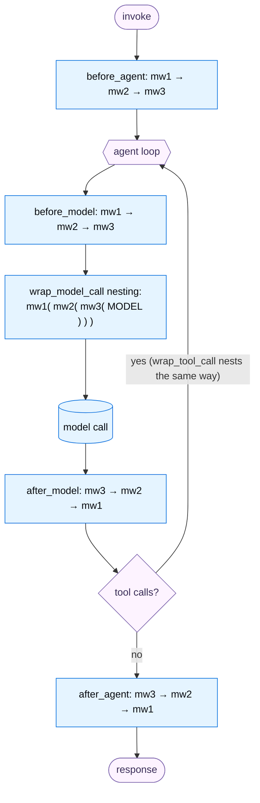
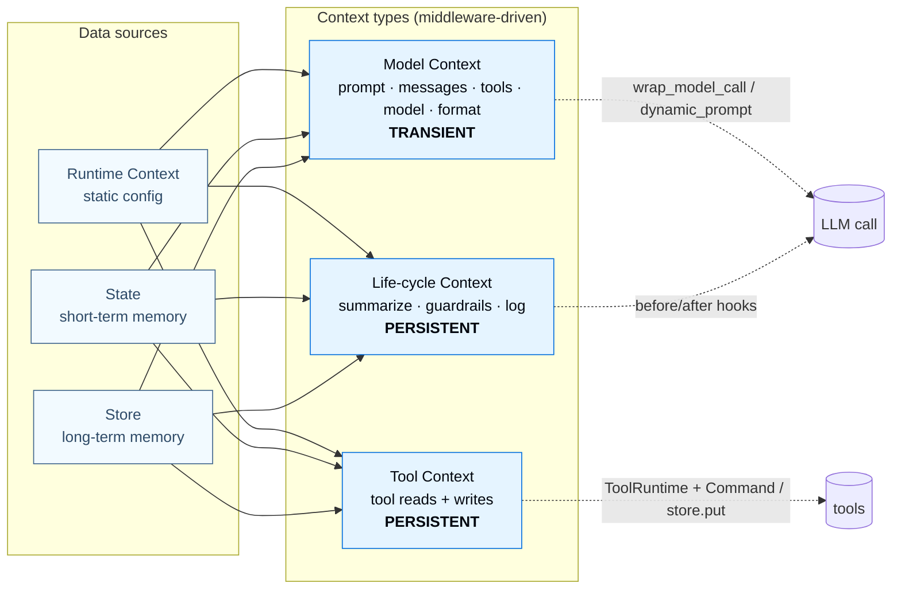

---

## Part 4 — Middleware: The Extensibility Spine (and Context Engineering & Guardrails)

`create_agent` is deliberately minimal. **Middleware is how it grows.** This part is the conceptual heart of "building reliable agents," because the docs make a strong claim: the number‑one reason agents fail is not a weak model — it's that **the right context wasn't given to the model**. Getting the right context in is called **context engineering**, and *middleware is the mechanism that makes context engineering practical.* Memory management and guardrails turn out to be specific *applications* of middleware.

### 4.1 Purpose

> *"Context engineering is providing the right information and tools in the right format so the LLM can accomplish a task. This is the number one job of AI Engineers."*

Middleware exists so that each cross‑cutting concern — summarization, PII redaction, retries, human approval, dynamic prompts, usage tracking — is **one focused, composable piece** that hooks into the agent loop at the right moment, instead of being smeared through your code as tangled `if`‑statements. The design philosophy: *each middleware handles one concern and they compose freely by being added to a list.* "Common patterns are pre‑built as first‑class middleware. Anything custom is one middleware away."

### 4.2 Building blocks — the hooks

Middleware exposes **six hooks**, in two families:

**Node‑style hooks** (run sequentially at a point; return a state‑update dict or `None`):

| Hook | When | Typical use |
|---|---|---|
| `before_agent` | once, at invocation start | auth, rate‑limit, input guardrails |
| `before_model` | before each model call | trim/inject messages, dynamic prompt |
| `after_model` | after each model response | logging, output guardrails, redaction |
| `after_agent` | once, at completion | final compliance scan |

**Wrap‑style hooks** (run *around* a call; you decide whether to call the inner `handler` 0/1/N times — enabling short‑circuit, retry, transform):

| Hook | When | Typical use |
|---|---|---|
| `wrap_model_call` | around each model call | retries, caching, dynamic model/tools/prompt |
| `wrap_tool_call` | around each tool call | tool error handling, monitoring |

Authoring forms:

- **Decorators** (`langchain.agents.middleware`): `@before_agent`, `@before_model`, `@after_model`, `@after_agent`, `@wrap_model_call`, `@wrap_tool_call`, plus the convenience `@dynamic_prompt`. Decorators take config, e.g. `@before_model(can_jump_to=["end"])`.
- **Class** (`AgentMiddleware`): implement hook methods (and async `a*` variants), with three special class attributes picked up at compile time — **`state_schema`** (extend agent state), **`tools`** (register tools that ship with the middleware), **`transformers`** (register stream transformers).

Key request/response objects: **`ModelRequest`** (`.messages`, `.state`, `.runtime`, `.system_message`, `.tools`, `.override(...)`), **`ModelResponse`**, **`ExtendedModelResponse`** (wrap a response + a `Command` to persist state from a wrap hook), and **`ToolCallRequest`** for `wrap_tool_call`. Node‑style hooks can also return `{"jump_to": "end"|"tools"|"model"}` (declared via `can_jump_to`) to redirect control flow.

### 4.3 Annotated code

A node‑style guard that short‑circuits, and a wrap‑style retry that calls the handler up to 3 times:

```python
from langchain.agents.middleware import before_model, wrap_model_call, ModelRequest, ModelResponse, AgentState
from langchain.messages import AIMessage
from langgraph.runtime import Runtime
from typing import Any, Callable

@before_model(can_jump_to=["end"])
def check_message_limit(state: AgentState, runtime: Runtime) -> dict[str, Any] | None:
    if len(state["messages"]) >= 50:
        return {"messages": [AIMessage("Conversation limit reached.")], "jump_to": "end"}
    return None                                  # None = no change, proceed normally

@wrap_model_call
def retry_model(request: ModelRequest, handler: Callable[[ModelRequest], ModelResponse]) -> ModelResponse:
    for attempt in range(3):
        try:
            return handler(request)              # YOU decide how many times the model runs
        except Exception as e:
            if attempt == 2:
                raise
            print(f"Retry {attempt + 1}/3 after {e}")
```

The single most useful pattern is **`wrap_model_call` + `request.override(...)`** to shape *exactly* what the model sees this call — its messages, tools, model, or system prompt — *transiently* (not saved to state):

```python
@wrap_model_call
def inject_file_context(request: ModelRequest, handler) -> ModelResponse:
    files = request.state.get("uploaded_files", [])
    if files:
        note = "Files in this conversation:\n" + "\n".join(f"- {f['name']}: {f['summary']}" for f in files)
        # models attend most to the LAST messages -> append context at the end
        request = request.override(messages=[*request.messages, {"role": "user", "content": note}])
    return handler(request)
```

### 4.4 Built‑in middleware — the catalog

You rarely write these from scratch; LangChain ships production‑ready middleware (all from `langchain.agents.middleware`, Deep Agents ones from `deepagents.middleware.*`):

| Concern | Middleware |
|---|---|
| **Context management** | `SummarizationMiddleware` (replace old turns with a summary), `ContextEditingMiddleware` + `ClearToolUsesEdit` (clear stale tool outputs), `LLMToolSelectorMiddleware` (pre‑select relevant tools when you have 10+) |
| **Resilience** | `ModelRetryMiddleware`, `ToolRetryMiddleware`, `ModelFallbackMiddleware`, `ModelCallLimitMiddleware`, `ToolCallLimitMiddleware` |
| **Safety / steering** | `PIIMiddleware`, `HumanInTheLoopMiddleware` |
| **Planning / delegation (Deep Agents)** | `TodoListMiddleware` (`write_todos`), `SubAgentMiddleware`, `FilesystemMiddleware`, `SkillsMiddleware` |
| **Provider‑specific** | Anthropic prompt caching / bash / text‑editor / memory; AWS Bedrock prompt caching; OpenAI content moderation |

The most important one for long conversations is summarization, whose `trigger` supports a small algebra (tuple = one threshold, dict = AND, list = OR):

```python
from langchain.agents.middleware import SummarizationMiddleware

agent = create_agent(
    model="gpt-5.4",
    tools=[...],
    middleware=[SummarizationMiddleware(
        model="gpt-5.4-mini",            # a cheap model writes the summary
        trigger=("tokens", 4000),        # fire at >= 4000 tokens
        keep=("messages", 20),           # keep the last 20 messages verbatim
    )],
)
```

Unlike trimming (which *loses* information), summarization condenses older messages into a summary that *permanently* replaces them in state — recent turns stay intact, and the window stops overflowing.

### 4.5 Custom middleware — sharing data across hooks

Custom middleware can extend state (`state_schema`), register tools (`tools`), and coordinate across hooks. A canonical example — count model calls and stop past a limit:

```python
from langchain.agents import create_agent
from langchain.agents.middleware import AgentState, AgentMiddleware
from typing_extensions import NotRequired
from typing import Any

class CustomState(AgentState):
    model_call_count: NotRequired[int]

class CallCounterMiddleware(AgentMiddleware[CustomState]):
    state_schema = CustomState                      # register the custom field at compile time

    def before_model(self, state, runtime) -> dict[str, Any] | None:
        if state.get("model_call_count", 0) > 10:
            return {"jump_to": "end"}                # short-circuit
        return None

    def after_model(self, state, runtime) -> dict[str, Any] | None:
        return {"model_call_count": state.get("model_call_count", 0) + 1}  # state write via reducer

agent = create_agent(model="gpt-5.4", middleware=[CallCounterMiddleware()], tools=[])
```

> **Advanced — node‑style vs wrap‑style state writes.** Node‑style hooks update state by *returning a dict* (applied through the graph's reducers). Wrap‑style hooks **cannot** return a dict to update state — they return an `ExtendedModelResponse(model_response=..., command=Command(update={...}))`. Why the difference? Wrap hooks may call the handler multiple times (retries); LangGraph needs the explicit `Command` so it can apply state changes once, through the reducers, and discard commands from retried attempts.

### 4.6 Context engineering — the unifying frame

Middleware gives you the *levers*; context engineering is the *discipline* of pulling them. The docs frame it as **three context types** drawing from **three data sources**:

- **Context types:** *Model context* (prompt, messages, tools, model, response‑format — **transient**, shaped via `wrap_model_call`/`dynamic_prompt`); *Tool context* (what tools read/write — **persistent**, via `ToolRuntime` + `Command`/`store.put`); *Life‑cycle context* (what happens *between* steps — summarization, guardrails, logging — **persistent**, via `before/after` hooks).
- **Data sources:** *Runtime Context* (static per‑run config), *State* (short‑term memory), *Store* (long‑term memory).

The five **model‑context levers** — system prompt, messages, tools, model, response format — can each be driven from any data source. Dynamic model selection by conversation length is a vivid example:

```python
from langchain.chat_models import init_chat_model
large, standard, efficient = (init_chat_model("claude-sonnet-4-6"),
                              init_chat_model("gpt-5.4"),
                              init_chat_model("gpt-5.4-mini"))

@wrap_model_call
def state_based_model(request, handler):
    n = len(request.messages)
    model = large if n > 20 else standard if n > 10 else efficient  # match model to task size/cost
    return handler(request.override(model=model))
```

> **Advanced — transient vs persistent is the mental model that prevents the #1 surprise.** Changes made via `wrap_model_call` + `override` affect *only this call* and are **not** saved. Changes from life‑cycle hooks (returning a dict) and tool writes (`Command`/`store.put`) **are** saved to state/store. If you "edit the messages" in `wrap_model_call` and wonder why they didn't persist — that's by design.

### 4.7 Guardrails — safety as middleware

Guardrails are not a separate subsystem; **they are middleware**. Two flavors: **deterministic** (regex/keyword/explicit checks — fast, cheap, blunt) and **model‑based** (an LLM/classifier judges semantics — nuanced, slower, costlier). You layer both. Built‑ins do the common cases:

```python
from langchain.agents.middleware import PIIMiddleware, HumanInTheLoopMiddleware

agent = create_agent(
    model="gpt-5.4",
    tools=[search_tool, send_email_tool],
    middleware=[
        ContentFilterMiddleware(banned_keywords=["hack", "exploit"]),  # custom before_agent guard
        PIIMiddleware("email", strategy="redact", apply_to_input=True),
        PIIMiddleware("email", strategy="redact", apply_to_output=True),
        HumanInTheLoopMiddleware(interrupt_on={"send_email": True}),    # human approves risky tool
        SafetyGuardrailMiddleware(),                                    # custom after_agent LLM check
    ],
)
```

`PIIMiddleware` supports strategies `redact` / `mask` / `hash` / `block` for built‑in types (`email`, `credit_card` with Luhn validation, `ip`, `mac_address`, `url`) or custom detectors. A custom guard short‑circuits with `jump_to: "end"`:

```python
from langchain.agents.middleware import AgentMiddleware, AgentState, hook_config
from langgraph.runtime import Runtime
from typing import Any

class ContentFilterMiddleware(AgentMiddleware):
    def __init__(self, banned_keywords): super().__init__(); self.banned = [k.lower() for k in banned_keywords]

    @hook_config(can_jump_to=["end"])
    def before_agent(self, state: AgentState, runtime: Runtime) -> dict[str, Any] | None:
        first = state["messages"][0]
        if first.type == "human" and any(k in first.content.lower() for k in self.banned):
            return {"messages": [{"role": "assistant",
                                  "content": "I can't process that request."}],
                    "jump_to": "end"}        # never even calls the model
        return None
```

### 4.8 Two perspectives: Middleware ↔ the agent loop

#### 👁️ From middleware's perspective ("I'm a focused concern")

You don't know or care about the whole loop. You implement *one* hook — say `after_model` — and you receive the current `state` (and `runtime`), do your one job (log it, redact it, count it), and either return `None` (proceed) or a state update / `jump_to`. You compose with other middleware just by *being in the list*; you never coordinate with them directly. Your superpower is that you fire at a *precise, named moment* in someone else's loop.

#### 👁️ From the loop's perspective ("I'm `create_agent`, executing")

The agent loop treats middleware as **ordered layers wrapped around its nodes**. Before calling the model node it runs every `before_model` hook *first‑to‑last*; it nests the `wrap_model_call` hooks like an onion (first‑listed is **outermost**); after the model it runs `after_model` hooks *last‑to‑first*. The same nesting applies around tool calls. A hook returning `jump_to` lets a middleware *redirect the loop itself* (e.g. skip straight to `END`). Because middleware compiles **into** the LangGraph graph (it's not a separate runtime), every hook keeps working even when the agent is embedded as a node in a bigger graph.

The execution order is load‑bearing — *place critical middleware first*, because first‑listed runs first for `before_*`, last for `after_*`, and is outermost for `wrap_*` (so it sees the final result and wins conflicts):



### 4.9 The overall picture — context engineering via middleware



Memory management, guardrails, retries, summarization, dynamic prompts — **all the same machine**: a focused middleware reading a data source and pulling a context lever at a precise point in the loop.
