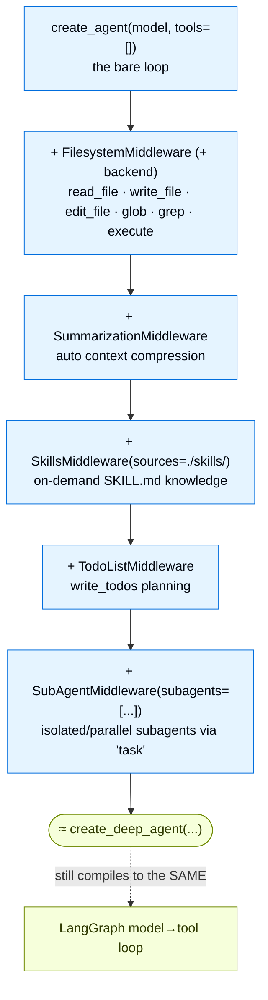

---

## Part 5 — Deep Agents: The Batteries‑Included Harness

We now know `create_agent` + middleware can express almost any behavior. **Deep Agents** is the recognition that a *particular* stack of middleware comes up again and again for **long‑running, autonomous tasks** (research, coding, data analysis) — so it's packaged for you.

### 5.1 Purpose

A bare agent loop can't reliably plan a 30‑step task, can't count lines in a huge document it can't fit in context, and overflows its window on long jobs. Deep Agents adds the capabilities that make an agent *autonomous over long horizons*:

- **Planning** — an explicit todo list the agent maintains (`write_todos`).
- **A virtual filesystem** — `read_file`/`write_file`/`edit_file`/`glob`/`grep` (and `execute` when backed by a sandbox), so large intermediate results live *outside* the context window. (Large tool results auto‑offload to the filesystem.)
- **Subagents** — delegate a subtask to an isolated agent with its own clean context, optionally in parallel.
- **Context management** — automatic summarization, prompt caching, on‑demand skills.

The decision rule from the docs: **use Deep Agents for maximum capability with minimal setup; use plain `create_agent` for fine‑grained control.** The Quickstart dramatizes this — given "count the lines containing `Gatsby` in this 60k‑line book," a plain agent returns `null` ("I have no code execution or `grep`"), while a Deep Agent *plans*, *loads the file*, *offloads* it to its filesystem, then `grep`s and `read_file`s the saved copy to get the exact answer.

### 5.2 Building blocks

- **`create_deep_agent(model, tools, system_prompt, checkpointer)`** (`deepagents`) — same signature as `create_agent`; a drop‑in upgrade that pre‑bundles the stack.
- The stack, as individual middleware you can also assemble yourself:
  - `FilesystemMiddleware(backend=...)` (`deepagents.middleware`) — adds the FS tools; with a sandbox backend, also `execute`.
  - `SummarizationMiddleware(model=..., backend=...)` — automatic context compression.
  - `SkillsMiddleware(backend=..., sources=["./skills/"])` — on‑demand domain knowledge (progressive disclosure from `SKILL.md` files).
  - `TodoListMiddleware()` (`langchain.agents.middleware`) — the `write_todos` planning tool.
  - `SubAgentMiddleware(backend=..., subagents=[...])` — spawn isolated/parallel subagents via the `task` tool.
- **Backends** (`deepagents.backends`): `StateBackend` (filesystem lives in graph state), `LangSmithSandbox` / sandbox backends (isolated env with real code execution), `StoreBackend`, and `CompositeBackend` to route paths (e.g. send `/memories/` to a persistent `StoreBackend`).

### 5.3 Annotated code — assembling a Deep Agent by hand

This is the key teaching example: a Deep Agent is *literally* `create_agent` plus a curated middleware list. Building it step‑by‑step shows exactly what each capability adds:

```python
from langchain.agents import create_agent
from langchain.agents.middleware import TodoListMiddleware
from deepagents import SubAgent
from deepagents.middleware import (
    FilesystemMiddleware, SkillsMiddleware, SubAgentMiddleware, SummarizationMiddleware,
)

# A subagent is a typed spec: name + description + prompt + (its own) tools/model
visualizer: SubAgent = {
    "name": "visualizer",
    "description": "Generates charts from data files in the sandbox.",
    "system_prompt": "You are a data-viz specialist. Write matplotlib/seaborn scripts; save PNGs.",
    "tools": [],
}

agent = create_agent(
    model=model,
    tools=[],
    middleware=[
        FilesystemMiddleware(backend=backend),                 # read/write/edit/glob/grep (+execute via sandbox)
        SummarizationMiddleware(model=model, backend=backend), # keep working past token limits
        SkillsMiddleware(backend=backend, sources=["./skills/"]),  # on-demand domain knowledge
        TodoListMiddleware(),                                   # write_todos planning
        SubAgentMiddleware(backend=backend, subagents=[visualizer]),  # delegate via the `task` tool
    ],
)
# This is the manual equivalent of create_deep_agent(...).
```

The four capability pillars map one‑to‑one onto middleware:

| Pillar | Middleware | What it adds |
|---|---|---|
| Virtual filesystem + code execution | `FilesystemMiddleware` (+ sandbox backend) | `read_file`/`write_file`/`edit_file`/`glob`/`grep`/`execute`; large‑result offload |
| Context management | `SummarizationMiddleware` | automatic history compression |
| On‑demand knowledge | `SkillsMiddleware` | progressive disclosure of `SKILL.md` content |
| Planning + delegation | `TodoListMiddleware` + `SubAgentMiddleware` | `write_todos`; isolated/parallel subagents via `task` |

A **skill** is just a Markdown file with YAML front‑matter, loaded only when relevant — context engineering by progressive disclosure:

```markdown
---
name: pandas-patterns
description: Common pandas/matplotlib patterns for data analysis and visualization
---
## Data loading
Use `pd.read_csv()`. Always check `df.info()` and `df.describe()` first.
## Visualization
Save figures with `plt.savefig("output.png", dpi=150, bbox_inches="tight")`.
```

### 5.4 Two perspectives: Deep Agents ↔ `create_agent` / LangGraph

#### 👁️ From Deep Agents' perspective ("I'm a high‑level autonomous agent")

You call `create_deep_agent(...)` and get an agent that already knows how to plan, use a filesystem, spawn subagents, and manage its own context. You think about *capabilities and tasks*, not hooks. The filesystem, summarization, and subagents feel like built‑in features of "a smarter agent."

#### 👁️ From `create_agent`/LangGraph's perspective ("I'm the harness underneath")

There is no new engine. A Deep Agent **is** a `create_agent` whose `middleware=[...]` list happens to include the Deep Agents stack — which compiles to the **same** LangGraph model‑node/tool‑node loop, just with extra hooks and extra tools registered. `TodoListMiddleware` registers a `write_todos` tool; `FilesystemMiddleware` registers FS tools and a backend; `SubAgentMiddleware` registers a `task` tool that invokes other `create_agent` graphs in isolated contexts. Every LangGraph property (durability, checkpointing, streaming, HITL) applies unchanged, because it's the same graph. `create_deep_agent` is *pre‑assembly*, nothing more.

### 5.5 The overall picture — Deep Agent = harness + stack



The lesson that ties Parts 2–5 together: **there is one harness (`create_agent`), one runtime (LangGraph), and one extension mechanism (middleware).** Deep Agents is a name for a well‑chosen pile of that extension mechanism.
