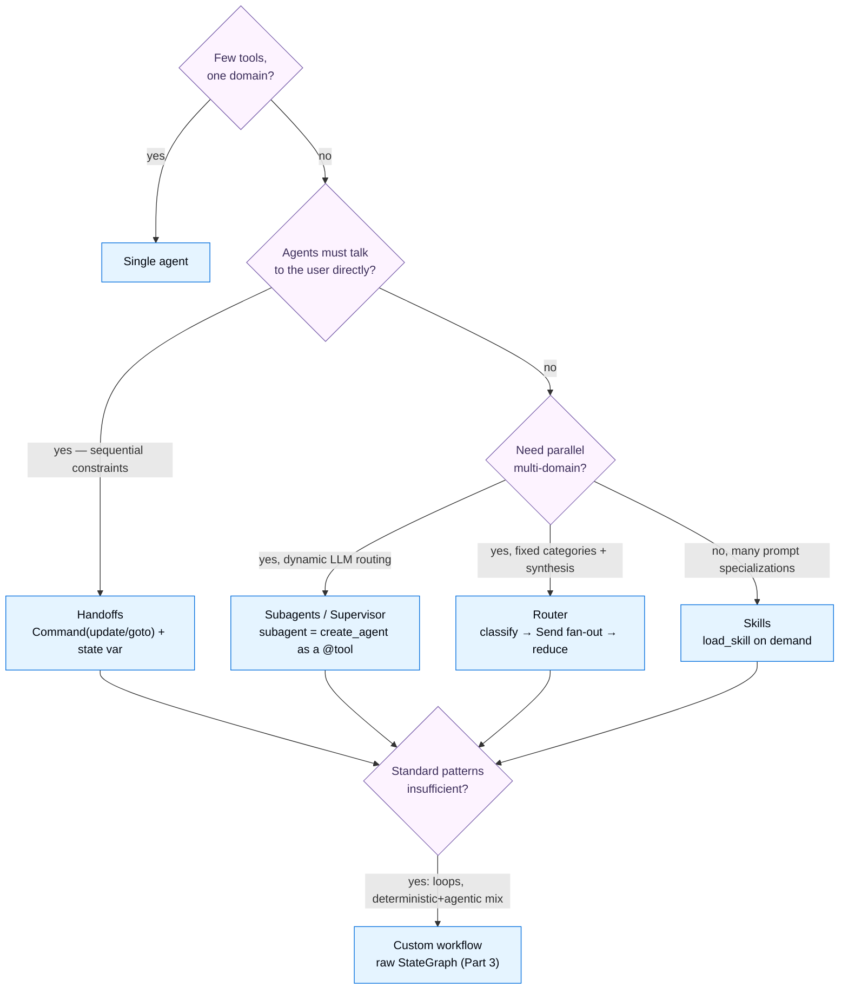

---

## Part 7 — Scaling Out: Multi‑Agent Systems

A single agent with the right tools handles a surprising amount. But sometimes one agent has too many tools and chooses poorly, needs specialized large‑context knowledge, must enforce sequential constraints, or should parallelize. That's when you reach for **multiple agents.**

### 7.1 Purpose

The docs are refreshingly honest: **"Not every complex task needs multi‑agent."** You go multi‑agent for three real reasons:

- **Context management** — give each agent only the specialized knowledge it needs (if context were infinite and free, you'd use one giant prompt).
- **Distributed development** — different teams own different capabilities behind clean boundaries.
- **Parallelization** — spawn specialized workers and run them concurrently.

And the unifying frame is, again, **context engineering**: deciding *what each agent sees.*

### 7.2 The five patterns (plus voice)

| Pattern | How it works | Choose when |
|---|---|---|
| **Router** | a classification step dispatches to specialists (often in parallel), results synthesized | clear input categories; parallel multi‑source; explicit routing control |
| **Handoffs** | tools update a *state variable* that changes behavior or transfers control between peer agents | sequential constraints; agents converse directly with the user |
| **Subagents / Supervisor** | a main agent calls subagents *as tools*, deciding which to invoke | centralized control; parallel; large‑context isolation; multi‑hop |
| **Skills** | specialized prompts/knowledge loaded on demand (progressive disclosure) | one agent, many specializations; no hard ordering constraints |
| **Custom workflow** | raw LangGraph `StateGraph` mixing deterministic + agentic nodes | standard patterns don't fit; loops/branches; embed other patterns as nodes |
| **Voice** | STT → text agent → TTS ("sandwich"), or a native speech‑to‑speech model | spoken, real‑time conversation |

A vital quantitative finding from the docs' benchmarks: **stateful patterns (handoffs, skills) save 40–50% on repeat requests** (the context is already loaded), while **subagents/router win on parallel multi‑domain** (context isolation → ~67% fewer tokens than skills, which reprocess all loaded skill content every call). There's no universal best — match the pattern to the workload.

### 7.3 Annotated code — one example per key pattern

**Router** — classify with structured output, fan out with `Send`, merge with a reducer:

```python
from typing import Annotated, Literal, TypedDict
import operator
from langgraph.graph import StateGraph, START, END
from langgraph.types import Send

class RouterState(TypedDict):
    query: str
    classifications: list[dict]
    results: Annotated[list[dict], operator.add]   # reducer => parallel branches concatenate
    final_answer: str

def route_to_agents(state: RouterState) -> list[Send]:
    return [Send(c["source"], {"query": c["query"]}) for c in state["classifications"]]  # parallel fan-out

workflow = (
    StateGraph(RouterState)
    .add_node("classify", classify_query)          # an LLM with_structured_output picks sources + sub-questions
    .add_node("github", query_github).add_node("notion", query_notion)
    .add_node("synthesize", synthesize_results)
    .add_edge(START, "classify")
    .add_conditional_edges("classify", route_to_agents, ["github", "notion"])  # parallel
    .add_edge("github", "synthesize").add_edge("notion", "synthesize")
    .add_edge("synthesize", END)
    .compile()
)
```

**Subagents / Supervisor** — a subagent is just a `create_agent` wrapped as a `@tool`:

```python
from langchain.tools import tool
from langchain.agents import create_agent

calendar_agent = create_agent(model, tools=[create_calendar_event, get_available_time_slots],
                              system_prompt="Parse NL scheduling requests into ISO datetimes; confirm what you scheduled.")
email_agent = create_agent(model, tools=[send_email], system_prompt="Compose professional emails; confirm what you sent.")

@tool
def schedule_event(request: str) -> str:
    """Schedule calendar events using natural language."""
    result = calendar_agent.invoke({"messages": [{"role": "user", "content": request}]})
    return result["messages"][-1].text          # return ONLY the final message — supervisor doesn't need internals

@tool
def manage_email(request: str) -> str:
    """Send emails using natural language."""
    return email_agent.invoke({"messages": [{"role": "user", "content": request}]})["messages"][-1].text

supervisor = create_agent(model, tools=[schedule_event, manage_email],
    system_prompt="You coordinate a calendar and an email assistant. Use multiple tools when needed.")
```

This is a three‑layer abstraction: rigid API tools at the bottom, NL‑translating subagents in the middle, a routing/synthesizing supervisor on top. Subagents are **stateless** (clean context per call → strong isolation), and the supervisor owns the conversation memory. A common failure mode to guard against: *a subagent does its tool calls but its final message omits the results* → the supervisor is blind. Always prompt subagents to put everything in their final message.

**Handoffs** — a tool returns a `Command` that updates a state variable; middleware reconfigures the agent on the next turn:

```python
from langchain.tools import tool, ToolRuntime
from langchain.messages import ToolMessage
from langgraph.types import Command
from langchain.agents.middleware import wrap_model_call, ModelRequest, ModelResponse

@tool
def record_warranty_status(status: str, runtime: ToolRuntime) -> Command:
    """Record warranty status and advance to issue classification."""
    return Command(update={
        "warranty_status": status,
        "current_step": "issue_classifier",                 # state change drives behavior
        "messages": [ToolMessage(f"Recorded: {status}", tool_call_id=runtime.tool_call_id)],
    })

@wrap_model_call
def apply_step_config(request: ModelRequest, handler) -> ModelResponse:
    step = request.state.get("current_step", "warranty_collector")
    cfg = STEP_CONFIG[step]                                   # per-step prompt + tools
    return handler(request.override(system_prompt=cfg["prompt"], tools=cfg["tools"]))
```

Whenever a handoff tool updates `messages` via `Command`, it **must** include a `ToolMessage` with the matching `tool_call_id` — otherwise the conversation history is malformed (an assistant tool‑call with no response) and the model errors.

**Custom workflow** — drop to raw LangGraph and call a `create_agent` agent *inside a node*:

```python
def agent_node(state: State) -> dict:
    result = agent.invoke({"messages": [{"role": "user", "content": state["query"]}]})
    return {"answer": result["messages"][-1].content}

workflow = (StateGraph(State).add_node("agent", agent_node)
            .add_edge(START, "agent").add_edge("agent", END).compile())
```

**Voice** — the "sandwich" (STT → text agent → TTS), streaming tokens so synthesis starts before generation finishes; the only agent‑specific trick is a TTS‑friendly prompt:

```python
agent = create_agent(model="google_genai:gemini-3.5-flash", tools=[add_to_order, confirm_order],
    system_prompt="Be concise and friendly. Do NOT use emojis, markdown, or special characters — "
                  "your responses will be read aloud by a text-to-speech engine.",
    checkpointer=InMemorySaver())

# stream_mode="messages" so downstream TTS overlaps generation -> sub-700ms latency
stream = agent.astream({"messages": [HumanMessage(content=transcript)]},
                       {"configurable": {"thread_id": tid}}, stream_mode="messages")
```

### 7.4 Two perspectives: Multi‑agent ↔ LangGraph

#### 👁️ From the multi‑agent perspective ("I'm composing specialists")

You think in *patterns*: a router that classifies and fans out, a supervisor that delegates to subagents‑as‑tools, peers that hand off control. You reason about *who sees what context*, *who talks to the user*, and *what runs in parallel*. The vocabulary is product‑shaped: routing, delegation, escalation, specialization.

#### 👁️ From LangGraph's perspective ("I'm executing graphs")

Every one of these patterns is **a graph**. The router *is* a `StateGraph` whose conditional edge returns multiple `Send`s for parallel fan‑out, with a reducer merging results. A supervisor's "subagent as a tool" is one compiled graph invoking another compiled graph inside a tool function. Handoffs are tools returning `Command(goto=..., graph=Command.PARENT)` to move control to a sibling node, or `Command(update={...})` to flip a state field a middleware reads. Skills are tools plus state (`skills_loaded`). There is no separate "multi‑agent engine" — it's `StateGraph`, `add_conditional_edges`, `Send`, `Command`, and reducers, all of which you already met in Part 3. *Custom workflow* is simply the case where you stop using a named pattern and write the graph yourself.

### 7.5 The overall picture — choosing a pattern



Notice every leaf eventually points back at LangGraph — multi‑agent design is *graph* design with good naming.
