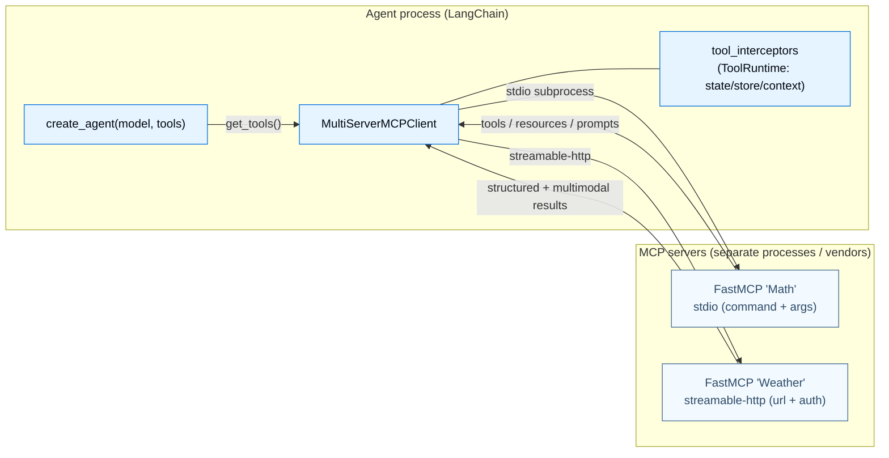

---

## Part 8 — Interop: MCP (Model Context Protocol)

We've treated tools as Python functions you write. But what if a tool already exists, written by someone else, running in another process or another company? **MCP** is the standard that lets any tool plug into any agent.

### 8.1 Purpose

MCP is *"an open protocol that standardizes how applications provide tools and context to LLMs."* The teaching metaphor throughout the docs: **MCP is the USB‑C of tools** — write a tool once as an MCP *server*, and any MCP‑aware *client* (Claude Desktop, an IDE, a LangChain agent) can use it without bespoke glue. Without MCP you have an N×M integration problem: every tool re‑integrated with every framework. With it, one connector.

LangChain consumes MCP tools through the **`langchain-mcp-adapters`** package, which converts MCP tools/resources/prompts into ordinary LangChain primitives.

### 8.2 Building blocks

- **`MultiServerMCPClient`** (`langchain_mcp_adapters.client`) — the client. Maps logical server names → connection configs. **Stateless by default** (a fresh session per tool call); use `client.session(...)` for stateful servers.
- **Transports:** `stdio` (client launches the server as a subprocess), `http`/`streamable-http` (remote, supports `headers` + `auth`), `sse` (deprecated).
- **Loading tools:** `tools = await client.get_tools()` → pass straight to `create_agent(model, tools)`. MCP tools become **indistinguishable from native tools.**
- **Resources** → `Blob` objects; **Prompts** → LangChain messages — all three MCP surfaces map to LangChain primitives.
- **Serving** your own tools as an MCP server: **FastMCP** (`@mcp.tool()` + `mcp.run(transport=...)`).
- **Tool interceptors** (`langchain_mcp_adapters.interceptors`) — async middleware around each MCP tool call, passed as `tool_interceptors=[...]`. They are the *bridge* between out‑of‑process MCP tools and the in‑process LangGraph runtime.
- **Error handling:** by default a failed MCP tool returns a `ToolMessage` with `status="error"` (the agent can retry); `handle_tool_errors=False` raises instead.

### 8.3 Annotated code

The canonical quickstart — two servers (one stdio, one http) behind one client, fed into an agent:

```python
import asyncio
from langchain_mcp_adapters.client import MultiServerMCPClient
from langchain.agents import create_agent

async def main():
    client = MultiServerMCPClient({
        "math":    {"transport": "stdio", "command": "python", "args": ["/path/to/math_server.py"]},
        "weather": {"transport": "http",  "url": "http://localhost:8000/mcp"},
    })
    tools = await client.get_tools()                      # MCP tools -> LangChain tools
    agent = create_agent("claude-sonnet-4-6", tools)      # used exactly like native tools
    print(await agent.ainvoke({"messages": [{"role": "user", "content": "what's (3 + 5) x 12?"}]}))

asyncio.run(main())
```

The server side with FastMCP is symmetric — the same `@`‑decorator idea you know from `@tool`:

```python
from fastmcp import FastMCP
mcp = FastMCP("Math")

@mcp.tool()
def add(a: int, b: int) -> int:
    """Add two numbers"""
    return a + b

if __name__ == "__main__":
    mcp.run(transport="stdio")     # or "streamable-http"
```

The most important bridge is the **interceptor**, because MCP servers run as *separate processes* and can't see your LangGraph runtime (state, store, context). An interceptor receives a `ToolRuntime` and can inject per‑run context into the outgoing call:

```python
from dataclasses import dataclass
from langchain_mcp_adapters.client import MultiServerMCPClient
from langchain_mcp_adapters.interceptors import MCPToolCallRequest
from langchain.agents import create_agent

@dataclass
class Context:
    user_id: str
    api_key: str

async def inject_user_context(request: MCPToolCallRequest, handler):
    runtime = request.runtime                              # the LangGraph ToolRuntime — the bridge
    request = request.override(args={**request.args, "user_id": runtime.context.user_id})
    return await handler(request)

client = MultiServerMCPClient({...}, tool_interceptors=[inject_user_context])
agent = create_agent("gpt-5.4", await client.get_tools(), context_schema=Context)
await agent.ainvoke({"messages": [{"role": "user", "content": "Search my orders"}]},
                    context={"user_id": "user_123", "api_key": "sk-..."})
```

An interceptor can also `request.override(headers=...)` for auth, short‑circuit by returning a `ToolMessage`, or return a `Command(update=..., goto=...)` to update agent state / steer the graph — making out‑of‑process tools first‑class participants in your loop.

### 8.4 Two perspectives: MCP ↔ LangChain

#### 👁️ From MCP's perspective ("I'm a protocol")

You are vendor‑ and framework‑neutral. A server publishes tools, resources, and prompts over a transport (stdio/http); any client that speaks the protocol can discover and call them. You don't know what "LangChain" or "an agent loop" is — you just answer `list_tools` and `call_tool`. Your value is that the *same* server works for Claude Desktop, an IDE, and a LangChain agent alike.

#### 👁️ From LangChain's perspective ("I'm an agent consuming MCP")

`langchain-mcp-adapters` makes MCP disappear into the abstractions you already use. `client.get_tools()` returns objects that are **just LangChain tools** — they go into `create_agent(tools=...)` next to your `@tool` functions, the model can't tell the difference, and they participate in the normal tool loop, error‑handling middleware, and tracing. Where the process boundary leaks (an out‑of‑process tool can't read your `runtime`), an **interceptor** re‑establishes the connection by handing the tool your `ToolRuntime`. From this side, MCP is "a way to acquire tools you didn't write," nothing more exotic.

### 8.5 The overall picture — MCP topology



MCP closes the loop on tools: Part 1 gave the model hands you write; Part 8 gives it hands the whole world writes.
