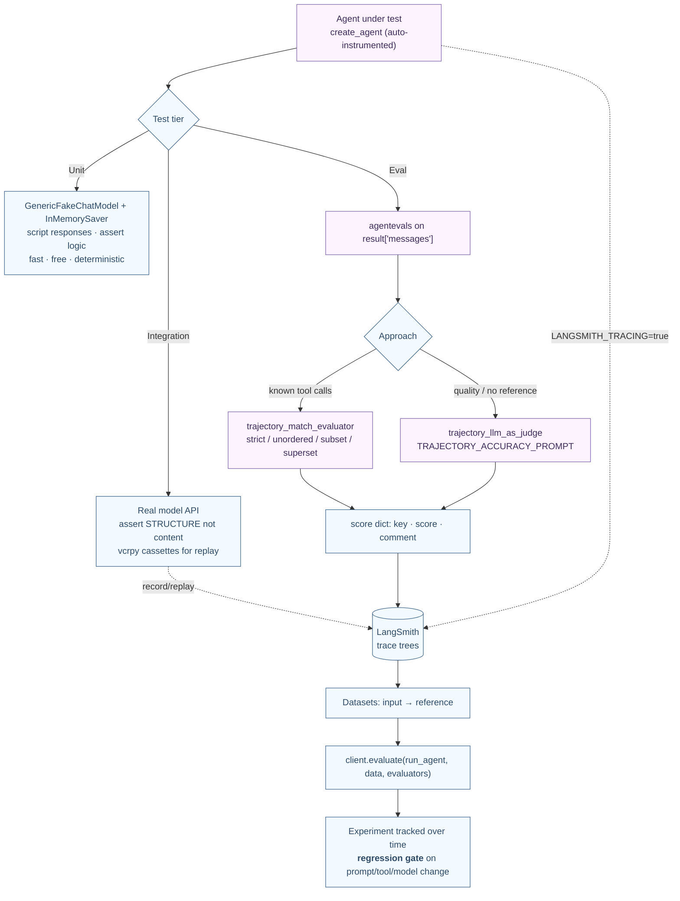

---

## Part 9 — Trust: Observability & Evaluation (LangSmith + Testing)

Recall the founding belief from Part 0: *the bottleneck isn't model capability, it's reliability.* Parts 1–8 built capability. Part 9 builds **trust** — the ability to *see* what an agent did and *measure* how well it did it. This is LangSmith's reason to exist, and it's why the history page says LangSmith was created specifically because "the main issue with building agents is getting them to be reliable."

### 9.1 Purpose — why this is uniquely hard for agents

LLMs are **nondeterministic**: the same input yields different outputs. That single fact breaks traditional software testing:

- You **cannot** assert exact output strings.
- Tests that call real models are slow, costly, require keys, and are flaky.
- Correctness isn't binary — an answer can be "good" in many forms, or subtly wrong while looking plausible.

So you need two things traditional code didn't: **observability** (a recording of every step, since you can't predict the path) and **evaluation** (a *score* over a dataset, since a single pass/fail assertion can't capture quality). LangSmith provides both.

### 9.2 Observability — tracing, essentially for free

#### Purpose & building blocks

A **trace** records *every* step of a run — each model call, tool call, and decision point — as a tree from input to final answer, with inputs/outputs/latency/tokens at each node. Because `create_agent` agents are **auto‑instrumented**, you enable tracing with two environment variables and *zero code changes*:

```bash
export LANGSMITH_TRACING=true
export LANGSMITH_API_KEY=<your-api-key>
```

```python
from langchain.agents import create_agent
agent = create_agent(model="gpt-5.4", tools=[send_email, search_web],
                     system_prompt="You can send emails and search the web.")
# Every step of this run is now a node in one trace tree — no extra code:
agent.invoke({"messages": [{"role": "user",
              "content": "Search for the latest AI news and email a summary to john@example.com"}]})
```

For finer control: `langsmith.tracing_context(enabled=True, project_name=..., tags=[...], metadata={...})` traces a specific block; per‑invoke `config={"tags": [...], "metadata": {...}}` attaches filterable labels (by user, session, environment, version) — the *same* `RunnableConfig` from Part 1.

### 9.3 Testing — the three‑tier pyramid

Evals sit at the top of a pyramid; you need the lower tiers too:

1. **Unit tests** — replace the real model with an in‑memory fake so you can script exact responses (text, tool calls, errors). Fast, free, deterministic, no keys. Test agent *logic*.
2. **Integration tests** — real network calls to confirm components work together and credentials are valid. Because of nondeterminism, **assert on STRUCTURE, not content** (message types, tool‑call names, arg shapes, counts). Use `vcrpy`/`pytest-recording` cassettes to record HTTP once and replay it cheaply in CI.
3. **Evals** — *score* behavior against a reference or rubric, over a *dataset*, tracked *over time*.

```python
# Unit test: a scripted fake model — no API key, fully deterministic
from langchain_core.language_models.fake_chat_models import GenericFakeChatModel
from langchain_core.messages import AIMessage
from langchain_core.messages.tool import ToolCall

model = GenericFakeChatModel(messages=iter([
    AIMessage(content="", tool_calls=[ToolCall(name="foo", args={"bar": "baz"}, id="call_1")]),
    "bar",                                   # the iterator yields one scripted response per .invoke()
]))

# Integration test: assert STRUCTURE, never exact text
def test_agent_calls_weather_tool():
    agent = create_agent("claude-sonnet-4-6", tools=[get_weather])
    msgs = agent.invoke({"messages": [HumanMessage(content="What's the weather in SF?")]})["messages"]
    tool_calls = [tc for m in msgs if hasattr(m, "tool_calls") for tc in (m.tool_calls or [])]
    assert any(tc["name"] == "get_weather" for tc in tool_calls)
    assert isinstance(msgs[-1], AIMessage) and len(msgs[-1].content) > 0
```

### 9.4 Evals — scoring the trajectory

#### Purpose & building blocks

An **eval** quantifies *how well* the agent performed, usually by examining its **trajectory** (the whole sequence of messages + tool calls), and its core payoff is **catching regressions when you change a prompt, tool, or model**. The `agentevals` package provides two evaluator families:

- **Trajectory match** (`create_trajectory_match_evaluator(trajectory_match_mode=...)`) — deterministic, free, when you know the expected tool calls. Four modes: `strict` (same tools, same order), `unordered` (same set, any order), `subset` (no extra tools), `superset` (at least the required tools).
- **LLM‑as‑judge** (`create_trajectory_llm_as_judge(model=..., prompt=...)`) — qualitative; no reference required. Ships with `TRAJECTORY_ACCURACY_PROMPT[_WITH_REFERENCE]`.

```python
from agentevals.trajectory.match import create_trajectory_match_evaluator

evaluator = create_trajectory_match_evaluator(trajectory_match_mode="strict")
result = agent.invoke({"messages": [HumanMessage(content="What's the weather in San Francisco?")]})
reference = [
    HumanMessage(content="What's the weather in San Francisco?"),
    AIMessage(content="", tool_calls=[{"id": "call_1", "name": "get_weather", "args": {"city": "San Francisco"}}]),
    ToolMessage(content="It's 75 and sunny.", tool_call_id="call_1"),
    AIMessage(content="It's 75 and sunny in San Francisco."),
]
evaluation = evaluator(outputs=result["messages"], reference_outputs=reference)
# {'key': 'trajectory_strict_match', 'score': True, 'comment': None}
```

To run an eval over a whole **dataset** and track it as an **experiment** over time, use the LangSmith client:

```python
from langsmith import Client
from agentevals.trajectory.llm import create_trajectory_llm_as_judge, TRAJECTORY_ACCURACY_PROMPT

judge = create_trajectory_llm_as_judge(model="openai:o3-mini", prompt=TRAJECTORY_ACCURACY_PROMPT)
client = Client()
def run_agent(inputs): return agent.invoke(inputs)["messages"]
client.evaluate(run_agent, data="your_dataset_name", evaluators=[judge])  # tracked experiment in LangSmith
```

> **Advanced — choose the loosest match mode that still catches the regression you care about.** The spectrum runs `strict` → `unordered` → `superset`/`subset` → LLM‑judge (semantic). Strict enforces an exact sequence (e.g. *policy lookup must precede authorization*); fuzzy modes tolerate acceptable variation while still failing real regressions. Pair deterministic trajectory matching (where you know expectations) with an LLM judge (for open‑ended quality). This is **eval‑driven development**: a dataset + evaluators is your quantitative regression gate, run before/after every prompt/tool/model change.

### 9.5 Two perspectives: Agent ↔ LangSmith

#### 👁️ From the agent's perspective ("I'm `create_agent` running")

You don't *do* anything special for observability. You run your normal loop — model node, tool node, middleware hooks — and because you're auto‑instrumented, each step *emits* a span. The `RunnableConfig` you already pass for `run_name`/`tags`/`metadata` flows into those spans. For evals you're simply *invoked* over a dataset; your `result["messages"]` trajectory is the thing being scored. From your side, trust is a side effect of running normally with the env vars set.

#### 👁️ From LangSmith's perspective ("I'm the agent‑engineering platform")

You receive a stream of spans and assemble them into a **trace tree** — one root run (the invocation) with child runs per model/tool/decision, each carrying inputs, outputs, latency, and token counts. You store **datasets** (input → reference examples) and run **experiments** (`client.evaluate` applies evaluators to the agent's outputs and records scores you can compare across runs). You don't care whether the thing you're observing is a plain `create_agent`, a Deep Agent, a multi‑agent graph, or raw LangGraph — they all emit the same span shape, so you observe and score them uniformly. You are also where Studio reads its execution traces (Part 10) and where production monitoring (LangSmith Engine: "monitors traces, detects issues, proposes fixes") lives.

### 9.6 The overall picture — the trust workflow



Capability without trust isn't production‑ready — which is exactly the gap LangChain set out to close.
