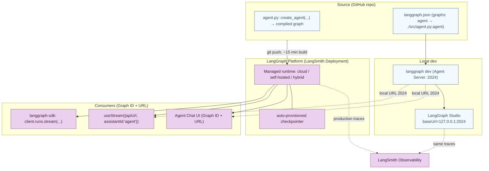

---

## Part 10 — Delivery: Deployment, Studio, Frontend & Generative UI

The agent is built, grounded, scaled, and trusted. Part 10 is **getting it to users** — running it locally in a visual debugger, hosting it in production, and surfacing it in a rich UI that can *see and steer* the agent.

### 10.1 The contract that ties everything together: `langgraph.json`

Before the pieces, the keystone. A tiny config file names your graph, and that one name is reused by *five* consumers:

```json
{
  "dependencies": ["."],
  "graphs": { "agent": "./src/agent.py:agent" },
  "env": ".env"
}
```

The graph id `"agent"` becomes: Studio's graph, the deployment's `assistant_id`, the frontend's `useStream` `assistantId`, and Agent Chat UI's Graph ID. **One name, five consumers** — and it works because `create_agent` returns a compiled LangGraph graph, exactly what `graphs` expects.

### 10.2 Studio — the local visual debugger

#### Purpose & code

While building, you want to *see inside* the agent — the prompt sent, the tool calls and results, the final output — and iterate without redeploying. **LangGraph Studio** is a free visual UI over your locally running **Agent Server**:

```bash
pip install --upgrade "langgraph-cli[inmem]"   # Python >= 3.11
langgraph dev                                   # serves the agent at http://127.0.0.1:2024
```

Any `create_agent` works directly; `langgraph dev` serves it with **hot‑reload** (edit prompts/tools → reflected immediately) and re‑run‑from‑any‑step. Setting `LANGSMITH_TRACING=false` keeps everything local (no data leaves your machine).

### 10.3 Deploy — the LangGraph Platform

#### Purpose & code

Traditional hosts assume stateless, short‑lived web requests. Agents are the opposite: **stateful and long‑running**, needing persistent state and background execution. The **LangGraph Platform** (LangSmith Deployment) is purpose‑built for this — push a repo, it builds (~15 min) and gives you an API URL, with a **checkpointer auto‑provisioned** (so HITL/memory "just work" in prod). Consume it via the SDK or REST — same streaming vocabulary as local:

```python
from langgraph_sdk import get_sync_client
client = get_sync_client(url="your-deployment-url", api_key="your-langsmith-api-key")

for chunk in client.runs.stream(
    None,        # threadless run (or a thread_id for a persistent conversation)
    "agent",     # the graph name from langgraph.json
    input={"messages": [{"role": "human", "content": "What is LangGraph?"}]},
    stream_mode="updates",
):
    print(chunk.event, chunk.data)
```

You consume a deployed agent through the SDK, **not** by importing the agent object — the platform speaks the same `stream_mode` protocol over HTTP. Hosting options: cloud (managed), self‑hosted, hybrid.

### 10.4 The Frontend SDK — the UI as a control plane

#### Purpose

The frontend SDK turns a deployed agent into a **rich, agentic UX** — *not just a token‑streaming chatbox.* The docs are emphatic: *"The same hook that renders messages also exposes the agent's durable thread state, tool‑call lifecycle, interrupts, checkpoint history, and custom state values, so your UI can become a control plane for long‑running agent work."* You can inspect, steer, pause, resume, and fork a running agent.

#### Building blocks

- **`useStream`** (React/Vue/Svelte from `@langchain/react|vue|svelte`) / **`injectStream`** (Angular) — the one hook.
- Config: `useStream<AgentState>({ apiUrl: "http://localhost:2024", assistantId: "agent", threadId, onThreadId, tools })`.
- Reactive state it returns: `stream.messages`, `stream.toolCalls` (lifecycle: running → finished/error), `stream.interrupt`, `stream.values`, `stream.isLoading`, `stream.client` (the lower‑level LangGraph SDK).
- Actions: `stream.submit(input, options?)`, `stream.stop()` (cancel), `stream.disconnect()` (leave but keep the run alive server‑side).

#### Annotated code — the canonical wiring and the four control‑plane powers

```tsx
import { useStream } from "@langchain/react";

function Chat() {
  const stream = useStream<GraphState>({ apiUrl: "http://localhost:2024", assistantId: "agent" });
  return <div>{stream.messages.map((m) => <Message key={m.id} message={m} />)}</div>;
}
```

```python
# The backend that makes durable threads / time-travel / HITL possible — note the checkpointer:
from langchain import create_agent
from langgraph.checkpoint.memory import MemorySaver
agent = create_agent(model="openai:gpt-5.4", tools=[get_weather, search_web], checkpointer=MemorySaver())
```

**Human‑in‑the‑loop UI** — render the interrupt, resume from the exact checkpoint:

```tsx
const interrupt = stream.interrupt;            // set when the agent pauses (HITLRequest)
{interrupt && (
  <ApprovalCard interrupt={interrupt}
    onRespond={(response) => stream.submit(null, { command: { resume: response } })} />
)}
// decisions: {type:"approve"} | {type:"reject", message} | {type:"edit", editedAction} | {type:"respond", message}
```

**Time‑travel UI** — read the checkpoint history, fork from any point:

```tsx
const history = await stream.client.threads.getHistory(threadId);   // ThreadState[] (one per node execution)
stream.submit({}, { forkFrom: { checkpointId: cp.checkpoint.checkpoint_id } });  // roll back + branch
```

**Generative UI** — the agent emits *validated structured data*, the client renders real components (the model never emits raw JSX). Using the `json-render` library: define a component **catalog** (each component has a Zod props schema + a description the AI reads), the AI returns a flat JSON spec via a tool call, and a `Renderer` materializes it — rendering progressively as the spec streams in:

```tsx
const rawSpec = aiMessage?.tool_calls?.[0]?.args;   // {root, elements:{id:{type,props,children}}}
<JSONUIProvider registry={registry}>
  <Renderer spec={spec} registry={registry} loading={stream.isLoading} />
</JSONUIProvider>
```

**Headless tools** (the Part 1.3 promise, realized): schema on the server, implementation in the browser. The server tool calls `interrupt({type:"tool", ...})`; the client mirrors the schema, attaches behavior with `.implement(...)`, and passes it via `useStream({ tools: [...] })`; the hook runs the browser impl and resumes the run with the result.

> **Advanced — `stop()` vs `disconnect()`.** `stream.stop()` *cancels* the run. `stream.disconnect()` (= `stop({cancel:false})`) leaves the run **alive server‑side** so you can remount with the same `threadId` and reattach to in‑flight work. This is why long‑running agents survive a page refresh or a device switch — the state lives in the thread's checkpoints, not the browser.

#### Ready‑made UIs & integrations

You don't have to build from scratch: **Agent Chat UI** (a Next.js app) connects to any agent via Graph ID + Deployment URL and gives real‑time chat, tool visualization, time‑travel, and auto‑fetched interrupts out of the box. Integrations bridge the SDK to popular UI stacks: **AI Elements** (shadcn/ui components wired to `stream.messages`), **assistant‑ui** (headless React via `useExternalStoreRuntime`), **CopilotKit** (the AG‑UI protocol via a `CopilotKitMiddleware`), and **OpenUI** (generative UI via an `openui-lang` DSL).

### 10.5 Two perspectives: LangGraph server ↔ Frontend SDK

This seam is a *protocol*, so seeing both sides is essential.

#### 👁️ From the server's perspective ("I'm the LangGraph Agent Server")

You expose a `/threads` + `/runs` streaming HTTP API on port 2024 (locally) or a deployment URL. A client `submit` is a `POST` that starts a run on the named graph (`assistantId`). You execute the compiled graph, and as nodes run you **stream events** (AI tokens, tool‑call lifecycle, state values) and **persist a checkpoint after each node execution**. When the graph hits an `interrupt`, you emit it and *pause durably*. You don't know or care that the client is React vs Vue vs Angular — you speak the protocol; resumption (`command: { resume }`), history (`threads.getHistory`), and forking (`forkFrom`) are all just more requests against the persisted thread state. Your statefulness is exactly why the client can disconnect and reattach.

#### 👁️ From the client's perspective ("I'm `useStream` in the browser")

You hold a `threadId` and call `submit`. You receive the server's streamed events and **assemble them into reactive state**: tokens accumulate into `stream.messages`, tool events into `stream.toolCalls` (updating in place from running → finished), an interrupt into `stream.interrupt`. You don't run the agent — you *render and steer* it. To approve a pause you `submit(null, {command:{resume}})`; to time‑travel you read history via `stream.client` and `submit({}, {forkFrom})`; to leave a long run you `disconnect()` and later remount with the same `threadId` to reattach. Every "control plane" power you have is just a typed request against the server's durable thread — the checkpointer on the backend is what makes your UI feel stateful.

```mermaid
sequenceDiagram
  participant UI as useStream (client)
  participant Srv as LangGraph Agent Server (:2024)
  participant G as Compiled graph (create_agent + checkpointer)

  UI->>Srv: submit({messages:[human]})  (POST /threads/{id}/runs, stream)
  Srv->>G: start run (assistantId = graph name)
  G-->>Srv: AI tokens / tool_call(running)
  Srv-->>UI: events → stream.messages, stream.toolCalls(running)
  G-->>Srv: tool result
  Srv-->>UI: toolCalls(finished) update in place
  Note over G,Srv: each node execution persists a checkpoint (ThreadState)
  G-->>Srv: interrupt({...})  (HITL / headless tool)
  Srv-->>UI: stream.interrupt = HITLRequest ; isLoading=false
  UI->>Srv: submit(null,{command:{resume: HITLResponse}})
  Srv->>G: resume from checkpoint
  G-->>UI: continues streaming ; interrupt → null
  Note over UI,Srv: disconnect() leaves the run alive; remount(threadId) reattaches
  UI->>Srv: client.threads.getHistory(threadId) → ThreadState[]
  UI->>Srv: submit({},{forkFrom:{checkpointId}})  (time-travel / branch)
```

### 10.6 The overall picture — delivery topology



The same compiled graph, named once in `langgraph.json`, flows from your editor to Studio to production to a reactive UI — without changing the agent code.
