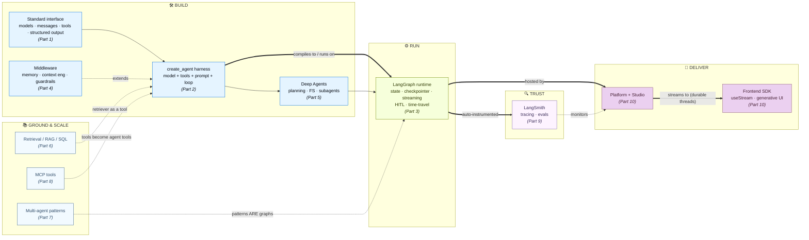
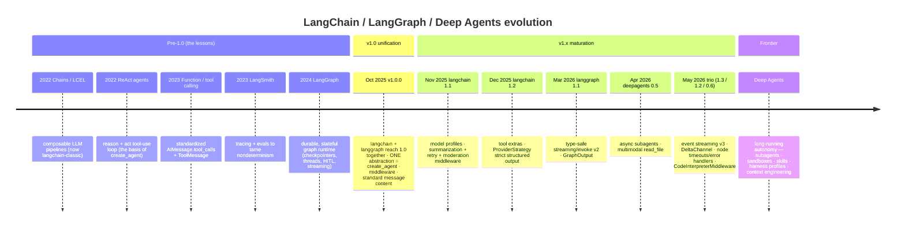

---

## Part 11 — The Whole Picture

We descended from "what is LangChain *for*?" all the way down to the streaming protocol between a server and a browser. Now we zoom back out and connect everything into one lifecycle, explain *why* the architecture evolved into this shape, and leave you with decision guides.

### 11.1 The full lifecycle — build → run → ground → trust → deliver



### 11.2 Purpose recap — every layer in one table

| Layer | Purpose (the *why*) | Achieved by (tools / APIs / patterns) | Pain removed |
|---|---|---|---|
| **Models** | One interface to every provider | `init_chat_model`, `.invoke/.stream/.bind_tools`, `model.profile` | Vendor lock‑in, per‑provider clients |
| **Messages** | One content format across providers | `System/Human/AI/ToolMessage`, `content_blocks`, `usage_metadata` | Provider‑specific dict juggling |
| **Tools** | Give the model hands | `@tool`, `ToolRuntime`, `Command`, `wrap_tool_call` | Hand‑rolled parse/validate/loop glue |
| **Structured output** | Typed, validated answers | `response_format`, `ToolStrategy`/`ProviderStrategy` | Brittle text parsing + retry loops |
| **`create_agent`** | The minimal agent harness (the loop) | `create_agent(model, tools, system_prompt, middleware, …)` | Writing the ReAct loop by hand |
| **Runtime/context** | Dependency injection into the loop | `context_schema` + `context=`, `ToolRuntime`, `Runtime` | Globals, untestable tools |
| **Memory** | Remember within & across conversations | `checkpointer`+`thread_id` (short), `store`/`BaseStore` (long) | Stateless, amnesiac agents |
| **LangGraph** | Durable, controllable orchestration | `StateGraph`, reducers, `Command`/`Send`, checkpointers | Lost progress, no pause, bespoke streaming |
| **Middleware** | Composable extension of the harness | 6 hooks, `AgentMiddleware`, built‑ins | Tangled cross‑cutting `if`s |
| **Context engineering** | Get the model the *right* context | 3 context types × 3 data sources, the 5 levers | The #1 cause of agent failure |
| **Guardrails** | Safe, compliant behavior | `PIIMiddleware`, `HumanInTheLoopMiddleware`, custom hooks | Unsafe actions, data leaks |
| **Deep Agents** | Batteries‑included autonomy | `create_deep_agent` = `create_agent` + middleware stack | Re‑assembling the same heavy stack |
| **Retrieval / RAG / SQL** | Ground answers in external data | loaders→splitters→embeddings→vector store→retriever; retrieval‑as‑a‑tool | Hallucination, stale knowledge |
| **Multi‑agent** | Coordinate specialists | router · handoffs · supervisor · skills · custom workflow | One overloaded agent choosing poorly |
| **MCP** | Universal tool connector | `MultiServerMCPClient`, FastMCP, interceptors | N×M tool integration glue |
| **LangSmith** | See and score behavior | auto‑tracing, `agentevals`, datasets/experiments | Flying blind, silent regressions |
| **Platform / Studio** | Host & debug stateful agents | `langgraph dev`, LangGraph Platform, `langgraph.json` | Standing up stateful infra by hand |
| **Frontend SDK** | UI as a control plane | `useStream`, generative UI, HITL/time‑travel UI | Re‑implementing streaming/interrupts in JS |

### 11.3 Why it's built this way — the evolution

The architecture isn't arbitrary; it's the residue of four years of learning. Reading the timeline explains *every* major design choice:



The narrative behind the dates:

1. **Chains** (2022) proved composition was powerful but too rigid for real agency.
2. **ReAct agents** introduced the reason‑act loop — the conceptual seed of `create_agent`.
3. **Function/tool calling** (2023) standardized *how* models request actions → `AIMessage.tool_calls` + `ToolMessage` (Part 1).
4. **LangSmith** (2023) appeared because the real problem was *reliability*, which needs observability + evals (Part 9).
5. **LangGraph** (2024) added the missing *low‑level control* layer — and with it durable execution, persistence, streaming, and HITL (Part 3). It became the substrate everything runs on.
6. **v1.0 unification** (Oct 2025) collapsed a sprawl of chains/agents into **one** high‑level abstraction — `create_agent`, built on LangGraph, configured by middleware (Parts 2 & 4). Legacy moved to `langchain-classic`.
7. **Deep Agents** (2026) packaged the recurring middleware stack for long‑running autonomy (Part 5).

So when you ask "why is an agent a graph?" or "why is everything middleware?" — the answer is: the field learned, the hard way, that reliability demands *control* (graphs), *composability* (middleware), and *measurement* (LangSmith).

### 11.4 Decision guide — what to reach for, when

| If you need… | Reach for | Part |
|---|---|---|
| A simple tool‑using assistant | `create_agent(model, tools, system_prompt)` | 2 |
| Conversation memory | `checkpointer=InMemorySaver()` + a stable `thread_id` | 2, 3 |
| Cross‑session memory / personalization | a `store` + `runtime.store` | 2, 3 |
| A cross‑cutting behavior (retry, redact, summarize) | built‑in or custom **middleware** | 4 |
| A dynamic prompt / model / toolset | `@dynamic_prompt` / `@wrap_model_call` + `request.override(...)` | 4 |
| Human approval before risky actions | `HumanInTheLoopMiddleware` + checkpointer | 3, 4 |
| Long, autonomous research/coding | `create_deep_agent` (or assemble the stack) | 5 |
| Answers grounded in your data | retrieval‑as‑a‑tool (agentic RAG) or 2‑step RAG | 6 |
| Natural‑language DB queries | the SQL agent pattern (4 tools + HITL) | 6 |
| Multiple specialists | router / supervisor / handoffs / skills | 7 |
| Loops + deterministic steps + agents mixed | raw LangGraph `StateGraph` (custom workflow) | 3, 7 |
| Third‑party / external tools | MCP via `langchain-mcp-adapters` | 8 |
| To know *why* it did that | LangSmith tracing (`LANGSMITH_TRACING=true`) | 9 |
| To prevent regressions | `agentevals` + datasets + `client.evaluate` | 9 |
| Local visual debugging | `langgraph dev` + Studio | 10 |
| Production hosting | LangGraph Platform (deploy from repo) | 10 |
| A rich, steerable UI | `useStream` + generative UI | 10 |

### 11.5 Reference — packages & getting help

**Package layout** (each does one job, mirroring this guide's structure):

- **`langchain`** — the meta‑package: `create_agent`, `init_chat_model`, `langchain.tools`, `langchain.messages`, `langchain.agents.middleware`. (Python 3.10+.)
- **`langchain-<provider>`** — provider integrations (`langchain-openai`, `langchain-anthropic`, `langchain-google-genai`, …). New model names work without upgrading.
- **`langchain-core`** — primitives: messages, `ToolCall`, `Document`, base abstractions, test fakes (`GenericFakeChatModel`).
- **`langchain-classic`** — legacy v0.x chains, for those not yet migrated.
- **`langgraph`** — the runtime: `StateGraph`, checkpointers (`langgraph.checkpoint.*`), stores (`langgraph.store.*`), `langgraph.types` (`Command`, `Send`, `interrupt`).
- **`langsmith`** — observability + eval SDK (`Client`, `client.evaluate`, `langsmith.testing`).
- **`agentevals`** — trajectory evaluators.
- **`deepagents`** — the batteries‑included harness (`create_deep_agent`, backends, subagent/filesystem/skills middleware).
- **`langchain-mcp-adapters`** — MCP client/adapters; **`langgraph-cli[inmem]`** — Studio/dev server; **`langgraph-sdk`** + **`@langchain/{react,vue,svelte,angular}`** — deployment + frontend.

```bash
pip install -U langchain                 # core
pip install -U langchain-openai          # a provider
pip install -U langgraph langsmith       # runtime + observability
pip install -U deepagents agentevals     # deep agents + evals
pip install langchain-mcp-adapters       # MCP
```

**Getting help:** Chat LangChain (`chat.langchain.com`) for ask‑the‑docs; the API Reference (`reference.langchain.com/python`); the Community Forum and Slack; LangChain Academy (`academy.langchain.com`) for guided courses — whose own curriculum now centers on the very lifecycle this guide traces: **build (LangChain/LangGraph) → observe + evaluate (LangSmith) → deploy → Deep Agents for long‑running tasks.**

---

### Closing thought

Every layer in this guide is a consequence of one sentence: **Agent = Model + Harness.** The model is the borrowed intelligence; the harness is everything you build around it to make that intelligence *reliable* — the loop, the memory, the tools, the guardrails, the runtime, the observability, the UI. LangChain's bet is that the harness, not the model, is where production reliability is won or lost — and the entire ecosystem is the toolkit for building that harness well.

*— End of guide.*
